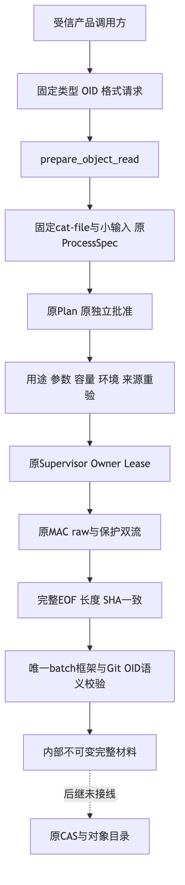
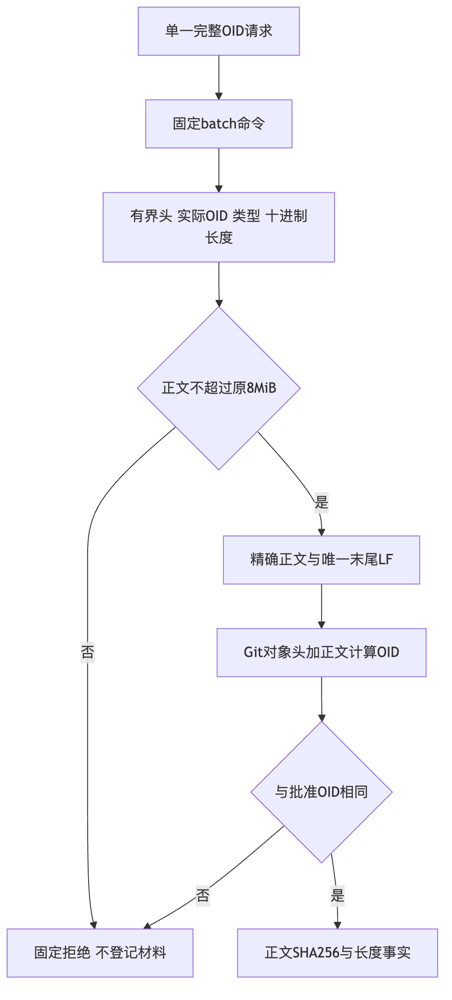
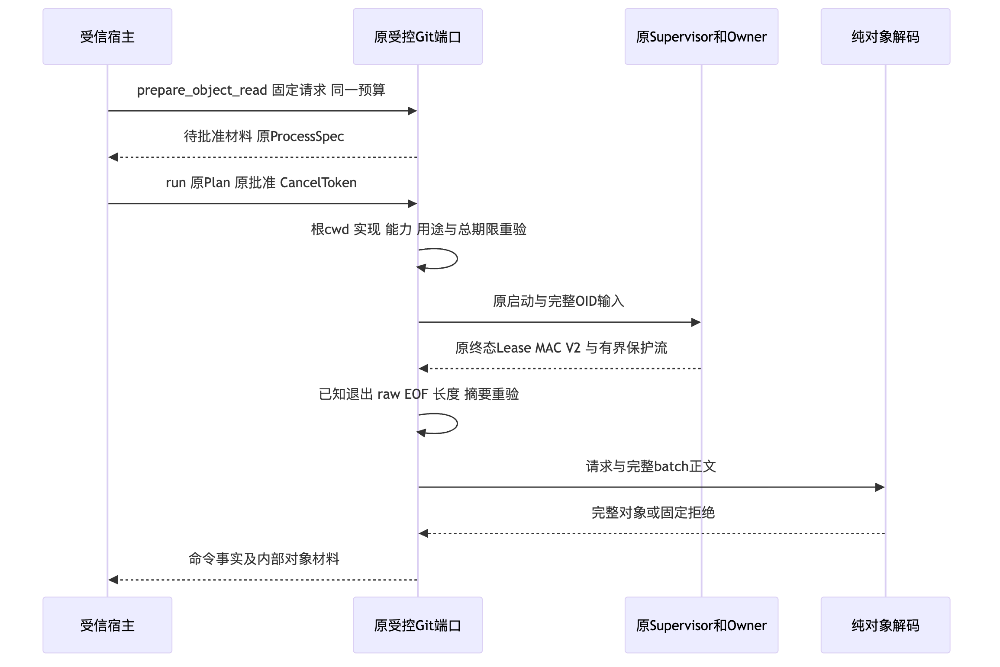
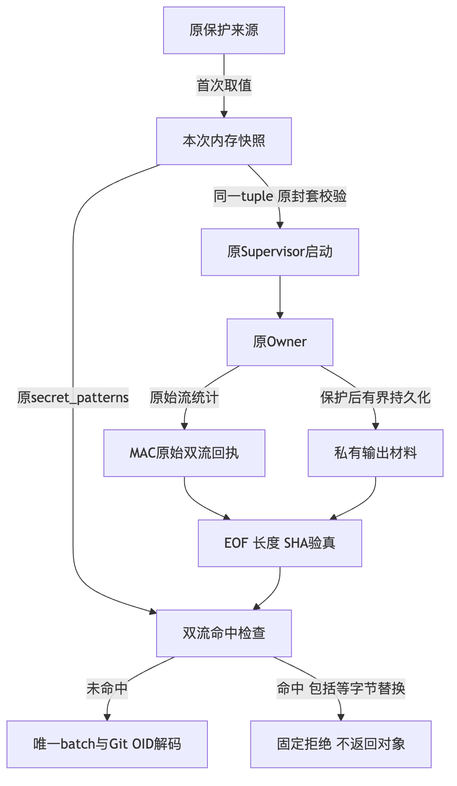
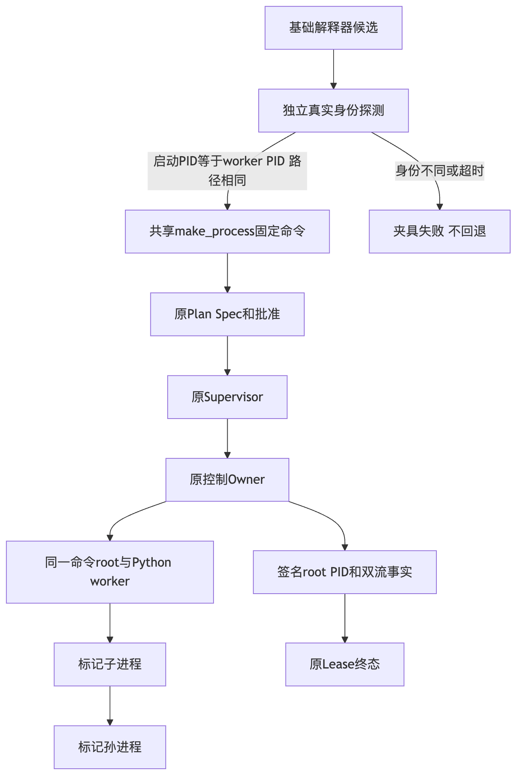
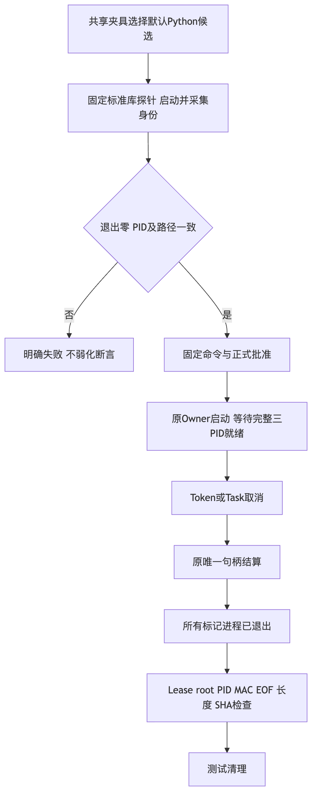
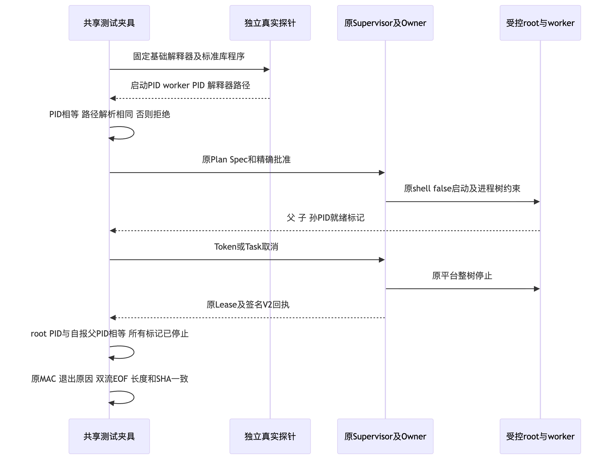

# R4 固定Git对象完整读取验证交付

## 1. 需求、固定输入与有限结论

原受控Git端口的1MiB控制输入与普通命令结果额度不等于业务单文件容量。
本增量以明确blob/tree/commit、完整SHA1/SHA256 OID和固定`cat-file --batch`读取原8MiB对象正文。
不提升通用Process输入上限，不以捕获前缀、保护后正文或命令零退出码冒充完整对象。

设计研究基线为`4e66135`。候选实施身份以[事实](facts.json)中的源码、测试、脚本和配置输入SHA256固定，
不能把研究基线当作已包含新代码的发布提交。总体与详细设计、类/接口/字段、伪代码、
架构/流程/时序/数据流、失败与恢复、安全与部署见[正式详设](../../changes/m09-r4-git-object-material-read.md)。

当前只证明正式内部读取合同。8MiB受信输入、对象CAS、完整认证账本、Commit/Checkpoint产品桥、
全业务备份/恢复、消费者Windows11、R3真实质量和1.0仍需独立完成，不因本增量自动通过。

## 2. 需求到实现与验证的映射

| 要求 | 实际实现及验证责任 |
|---|---|
| 唯一完整对象 | [纯材料合同](../../../src/harnessix/delivery/git_object_material.py)：canonical batch头、类型、完整长度、尾LF和Git对象哈希；错误/额外/截断正文拒绝。 |
| 原8MiB容量 | 真实Git的SHA1/SHA256 blob空、二进制、8MiB和超限；tree/commit实际对象与纯字段边界分别验证。 |
| 原执行批准 | [原内部端口](../../../src/harnessix/product_config/git_delivery_process.py)固定用途、命令、小stdin、结果容量、实现、根cwd与同一总期限；缺批准、用途和输入漂移不启动。 |
| 原Owner验真 | 原V2 MAC/Lease、双流EOF、响应长度与SHA256完整一致，随后独立重算Git OID；认证回执不替代Git framing。 |
| 持久前保护 | 与Owner共用一次性保护快照；正文改写或保护模式命中均拒绝，包括等字节`[REDACTED]`命中，不增加持久协议字段。 |
| 原普通预算 | 普通命令1MiB、stdin1MiB、stderr1MiB保持；不得通过材料用途批准其他argv、Ref或多OID。 |
| 取消与超时 | 原唯一Owner和真实进程树结算；保留Task/Token取消、期限、unknown强失败和禁止自动重放语义。 |
| 来源与环境 | [固定命令](../../../src/harnessix/delivery/git_command.py)与原物理绑定共用，增加`GIT_NO_LAZY_FETCH=1`；缺失对象不自动补取。 |

## 3. 独立审查、原失败与修复谱系

独立审查发现保护值等于占位符时原长度/SHA比较不能识别命中。
两个原Owner真实运行负对照先验证完整MAC、Lease、双流EOF和原始/持久字节完全一致，
再证明原实现错误返回材料；保留原失败及后继修复回归，不放宽保护标准。

修复在当前执行中冻结原保护来源一次取值，原Supervisor在创建Lease前继续校验同一封套，
完整返回前复用原`secret_patterns`检查两路模式命中。历史Receipt不增加命中字段，
重启后没有原快照不能据此推导历史材料安全返回能力。

Windows原生`4e66135`作业的两个取消用例出现命令root与Python worker PID等值失败。
标记进程退出检查已经通过，不将PID断言失败描述为已确认生产进程泄漏。
[共享夹具详设](../../changes/m09-r4-git-cancel-pid-contract.md)选择经真实PID/解释器路径探测的基础解释器，
保留强root PID、MAC、EOF与取消断言，并增加真实forwarder负对照。
新候选的Windows原生结果必须另行取得；本机和源码外安装不能替代该平台验收。

原测试开发阶段的lint/格式失败、元数据引用暂缺和候选变化分别保留在私有验证目录。
这些结果不作为生产业务缺陷计数，也不能被最终通过覆盖删除。

## 4. 验证结果与制品身份

最终分层选择器、通过/失败/跳过数量、实际时长及原日志/JUnit摘要见[Verification](verification.json)。
焦点、关联、全Product Config、治理和两个安装环境集合存在重叠，不相加作为测试总数。
真实Git对象读取与固定测试程序的异常批次注入分别注明；后者不能宣称为真实Git业务成功。

| 最终验证范围 | 通过 | 跳过 | 边界 |
|---|---:|---:|---|
| Delivery、Process及四个产品Git选择器 | 929 | 41 | macOS关联回归，包含全部209项材料专项；平台跳过不是原生通过。 |
| 全Product Config | 822 | 29 | 与关联回归重叠，包含正式产品装配和状态恢复关联。 |
| 源码外Python3.12.7最终Wheel | 279 | 0 | 209项材料、62项受控IO、8项POSIX raw。 |
| 源码外Python3.13.8最终Wheel | 279 | 0 | 相同选择器，独立环境与实际安装字节。 |
| 完整治理回归 | 302 | 0 | 最终源码及完整交付包；不代替实际消费者验证。 |
| 等字节保护原负对照 | 0 | 0 | 两个真实Owner场景均失败；修复后四项快照及保护回归通过。 |

实际Wheel的455个`harnessix/`包成员、414个Python模块与源码及两个源码外安装环境逐字节核对。
Wheel全部ZIP成员为460项，包括发行元数据；不把两个计数混用。
固定最终Wheel SHA256：`f3eb5c197a52fbb0eec00b3c2c1dbfd0e0f961d6258294981925618310d755d4`。
Python3.12.7及3.13.8安装从真实site-packages导入，使用明确安装制品而非源码可编辑环境。
独立审查之前的首个Wheel单独保留，不作为最终修复制品。

完整治理302项通过，Mypy覆盖414个源码文件；Ruff、规范合同和原可读性策略通过，未放宽治理阈值。
文档静态检查433份文档、10,706个链接及920个Mermaid块无问题；新增7幅图实际渲染。
仓库及最终Wheel实际Secret扫描3,861个输入零命中，另外6条规则自检不作为仓库扫描结果。

额外原生macOS观察读取两个实际8MiB blob：SHA1响应8,388,663字节，SHA256响应8,388,687字节，
控制输入分别41/65字节；原MAC、EOF和完整正文匹配。该人工观察是独立补充证据，不计入pytest数量，
对象创建仅为测试准备，不证明新生产8MiB写入通道已经实现。

## 5. 可阅读图示与数据边界

四幅读取/保护图及三幅PID夹具图从正式详设的实际Mermaid块提取、渲染并逐图检查，无标签遮挡或裁切。
原Delivery/Product Config文档中40幅Mermaid块与研究基线逐块相同，不重复渲染为新验证证据。

图中原批准与Owner链是已实现读取路径；虚线CAS节点是尚未接线的业务持久责任。

完整响应逐项核对batch、正文长度、尾LF和对象哈希；任何拒绝都不登记对象材料。

正常退出的原认证流先完成完整性检查，再进入纯对象语义解码；材料不是业务Commit凭证。

同一个保护快照同时进入原Owner和返回前模式检查；等字节替换不因SHA相同而绕过拒绝。

控制Owner、命令root与Python worker分别定位，夹具选择真实探测通过的直接解释器。

退出、MAC、EOF与身份检查先于应急清理，不能由测试清理替代生产回收。

探针只负责测试解释器的来源验证；正式批准、进程约束与认证终态仍由原生产链完成。

公开包不复制模型正文、工作区、进程输出、Git数据库、状态数据库或保护值。
原件按本机私有目录和文件保护保存；公开摘要与[Manifest](manifest.json)绑定正式资料。

## 6. 发布边界与下一步

[Review Packet](review-packet.json)逐项区分当前通过、平台待验证及总体未完成要求。
原Windows失败作业为[原生作业110054323389](https://github.com/carrie1988/Harnessix/actions/runs/36764263388/job/110054323389)：
Git读取166通过/5跳过/16未选，raw/Git基准375通过/6跳过/2失败，后继步骤跳过。
这是Windows Server范围的终态失败证据，不是消费者Windows11或当前候选的通过证据。

原生CI将新对象专项纳入既有raw/Git步骤，不扩大5分钟时限，不跳过失败断言或改写旧结果。
全业务8MiB写入、耐久对象目录及认证前缀、正式产品Git写链、完整备份恢复闭包仍是发布必需项。
本切片没有新增真实模型请求或费用，没有修改R3 Task Pack、评分器或实际预算账本。
