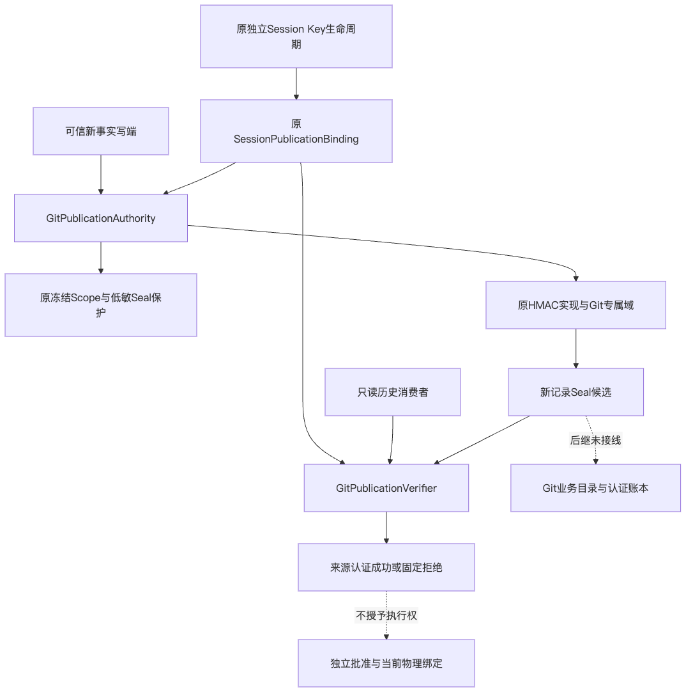
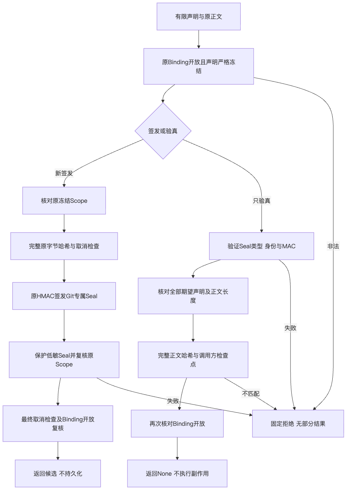
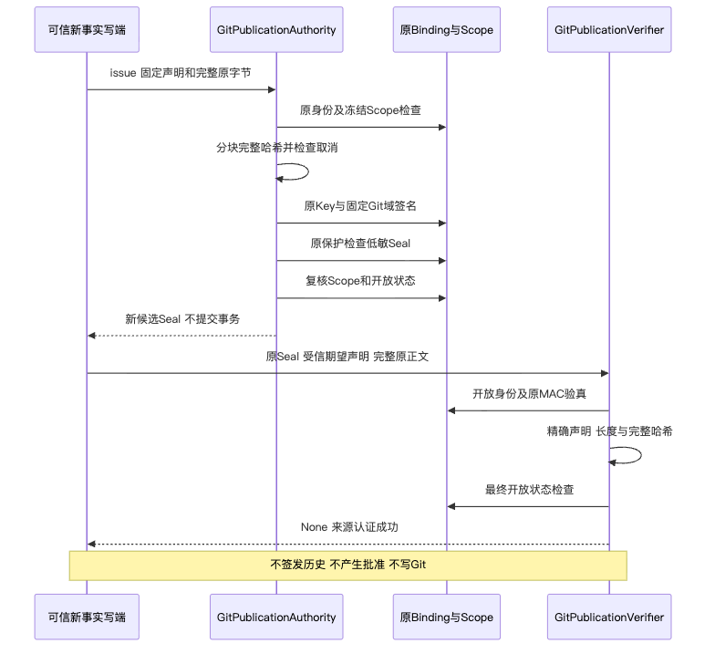
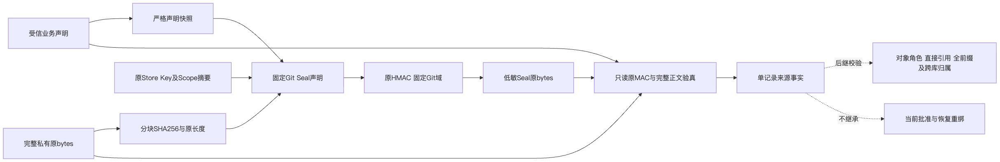

# Git业务记录有限来源认证统一验证包

## 1. 交付范围与结论

[总体与详细设计](../../changes/m09-r4-git-record-publication.md)覆盖需求、目标、实际架构、源码映射、
类／接口／字段、核心伪代码、业务流程、时序、数据流、失败与恢复、安全、兼容、部署及测试矩阵。
本增量在原Session模块增加有限Git记录Authority与Verifier，复用原Session独立Key、原Scope及HMAC。
实际声明字段先严格验证再冻结，完整原bytes和长度参与来源证明；仅返回候选，不提交Git或数据库事务。
签发最后Scope回查和取消回调完成后必须再检查Binding开放，防止返回已经关闭Key的此前候选。

它不是对象业务角色目录、GitDB完整认证前缀或独立尾锚，更不是新批准、默认Checkpoint／Commit或Backup v2。
R1～R6商用门禁继续开放；内部1.0.0rc1只是包版本，不代表正式发布。
基线554618c用于源码研究，不作为本增量提交身份；实际候选以完整输入目录及SHA绑定。
[Facts](facts.json)、[Verification](verification.json)、[Review Packet](review-packet.json)、[Manifest](manifest.json)
分别记录事实、执行范围、独立审查及公开材料摘要。私有原日志、JUnit和Wheel不公开正文，仅登记字节／SHA。

## 2. 最终代码与同一制品验证

最终1252项代码输入的规范目录SHA为
`29f23cbec98a6bcc8e5149e0c6820277337913929b432bbf10c9ff006acd387a`。
新生产合同与原认证模块分别绑定，所有旧Event／Projection／Artifact域、数据库迁移、模型依赖保持。
唯一最终Wheel的SHA为
`d31060d3133f830ab3ac110b41992e2d632f122f7d626f9038d9ad45525e414d`。
473个ZIP成员、468个包成员和完整RECORD均核对；两安装环境71个发行版本与当前uv.lock完全匹配。

| 执行 | 实际结果 | 证据边界 |
| --- | --- | --- |
| 最终认证焦点 | 193通过，零失败／跳过 | 有限声明、域、Scope、完整正文、取消、关闭及原兼容；包含审查缺陷真红绿回归 |
| 冻结源码关联组 | 2002通过／33跳过，301.149秒 | 原105测试文件，2035收集，不是全仓 |
| 同一Wheel源码外Python3.12 | 2002通过／33跳过，305.441秒 | 同105文件；实际357产品模块均从site-packages导入 |
| 同一Wheel源码外Python3.13 | 2002通过／33跳过，286.174秒 | 同105文件及同一制品，不借用当前源码 |

每组完整468包成员在前后保持相同字节；安装依赖由当前锁定输入离线、哈希校验建立。
历史迁移生产者是现有测试明确引用的旧版本夹具，不能把其存在解释为当前包源码兜底。
源码、安装组及焦点重叠，不相加为独立覆盖率；跳过节点完整保留，不能称全仓或原生Windows验收。
静态检查沿用原Ruff／Mypy／可读性标准、600文件行／100符号行／20复杂度上限，公共Schema和Task Pack未更改。
治理302项全部通过；原策略文档检查448份文档、10960条链接、945幅Mermaid、26个实际变化路径零问题。
文档元数据仅借助原本地只读Git对象求证，不由此给产品引入任何当前源码兜底。
最终仓库／实际Wheel Secret扫描的执行摘要见Verification，不以空索引扫描作为仓库覆盖。

## 3. 原失败与真实修复闭环

### 3.1 严格字段与最后开放状态

实际Pydantic严格模式仍可把int／str子类规范化为基础类型。原对照及当时源码SHA独立保留；
Python入口增加实际UUID／int／str检查，JSON持久UUID字符串继续按原严格JSON合同解码。
独立测试首轮141项中139通过／2失败：未经校验copy附带的未知字段被序列化丢弃，从而通过issue／verify。
修复只检查原模型字段集合并重建原字段，不先序列化；原断言不改，后继191项通过，覆盖50种标量／UUID绕过。

独立审查发现一项P1：最后Scope／取消回调可关闭Binding，但旧实现仍返回此前签好的Seal。
先加入关闭后不得返回候选的真实红例，原实现一项失败；再在最后回调之后增加原Binding开放检查。
最终分别覆盖实际Scope回查关闭与最终取消检查关闭，两种业务路径都拒绝返回候选；193项全部通过。
原审查和红例不被最终通过覆盖，追加静态审查绑定最终两生产文件及测试，现有P1闭环且无新增P0／P1／P2。
静态审查与运行回归是独立证据，不互相替代。

### 3.2 冻结验证载体的历史与静态材料缺失

初版冻结源码因缺少原历史归档产生两个ERROR；初版源码外安装因缺少原spec／docs/examples产生12个FAIL，
同时有上述两个历史ERROR。审查后最终源码的第一次验证同样保留两个历史ERROR。
这些原日志和JUnit分别登记，不能用后继成功改写成首轮通过，也不能通过删选择器或跳过历史测试消除。

后继只修正验证载体：在私有载体建立深度一精确旧提交
`3c5f6e36d9c9ce98709c5c37ae2316709c443001`，
由本地已有对象取得原测试明确需要的旧生产者与七个辅助文件；核对FETCH_HEAD、shallow边界及归档摘要。
安装输入补齐260件来自同一冻结候选的Schema／正式示例静态材料，逐件字节核对。
首次文档载体另有448项历史Revision无法解析、一项接口标题和一项Manifest缺失，原报告保留；
使用本地原对象进行只读元数据核对并补齐实际标题／Manifest后，原文档策略零问题。
没有当前产品源路径兜底、自动联网fetch、任意用户仓库历史复制、测试源码改写或评分降级。
这个旧迁移测试夹具不是产品Git备份历史范围决策，后者仍须单独冻结。

审查前Wheel原SHA及原运行保留，但已被后继P1生产修复淘汰；它不代表最终制品。
最终三个成功关联组只绑定重新构建的一份最终Wheel及其对应生产字节，不混用两份制品。

## 4. 实际架构、流程、时序与数据流

四幅图与实际SDD Mermaid块逐字节对应，实际渲染并逐幅视觉检查；虚线明确未接线的后继职责。
流程图包括最后Scope／取消回调之后的开放检查，而非仅检查此前签名状态。

## 5. 基线原生CI与剩余缺口

[固定554618c CI 36824593278](https://github.com/carrie1988/Harnessix/actions/runs/36824593278)已终结。
Windows材料组2失败／1289通过／6跳过，303.12秒达到原五分钟期限。
1306项收集、1297项取得终态，剩余九项没有完成证明；不能把未取得终态称为通过或全部未启动。
两个最低SHA256 Commit用例仍以git_material_effect_unknown失败，材料可能交付的保守状态
不是Git已启动或已写入的证明。精确失败选择器与日志摘要在Facts保留。
macOS、Container与Documentation任务成功；Python3.12／3.13仍在12件Archive许可复核处失败。
这不是本新认证候选的原生结果，也不关闭Windows11消费者环境或R1／R4整体。

完整Git产品后继包括对象角色与直接引用、全账本前缀及独立尾锚、Review Artifact和新独立批准、
锚定与交付双受管工作树及派生事务、默认Checkpoint／Commit、Backup v2及新根重授权。
内部64MiB认证观察上限不替代完整产品树／存量总量决策，不能以缩小容量或历史范围换取易通过版本。
真实3仓10 Case／20 Trial、至少12严格成功、每仓成功、零越界、消费者Windows11、独立Beta及同候选R1～R6继续验收。
本专项新增真实模型请求、凭据读取、账本修改及Docker操作均为零；原70元、旧未决预留和原授权已用费用保持。
