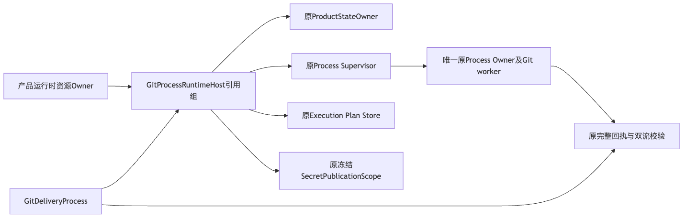
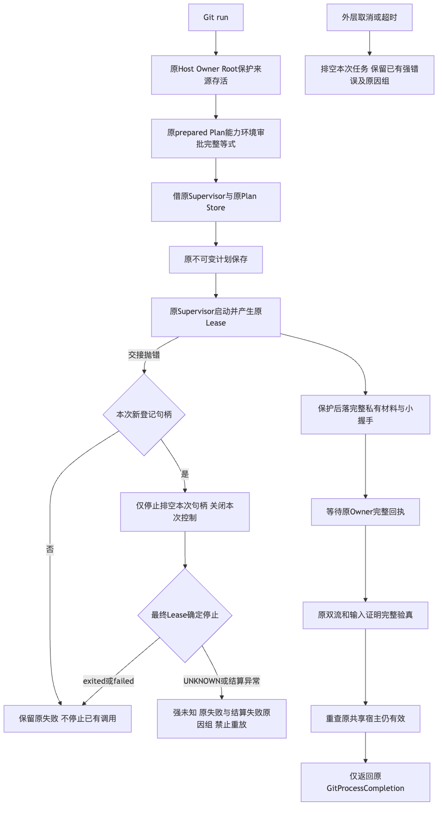
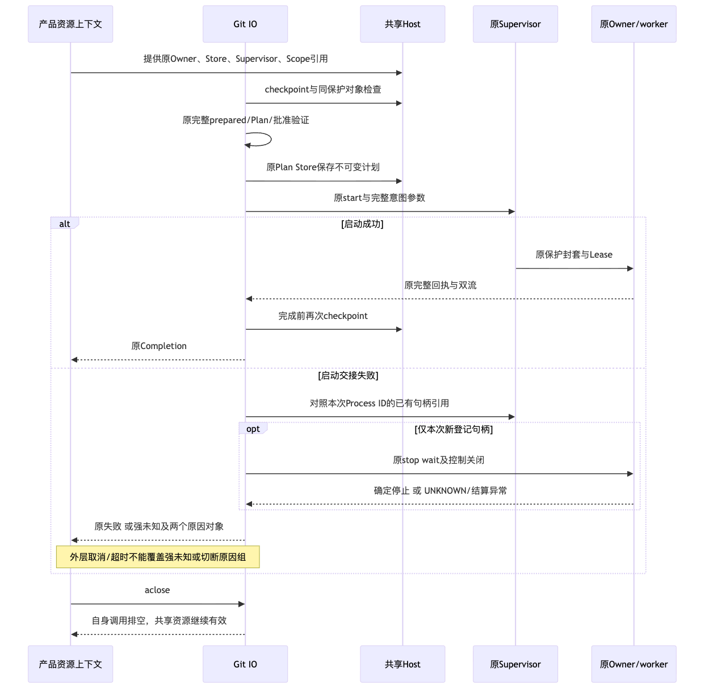
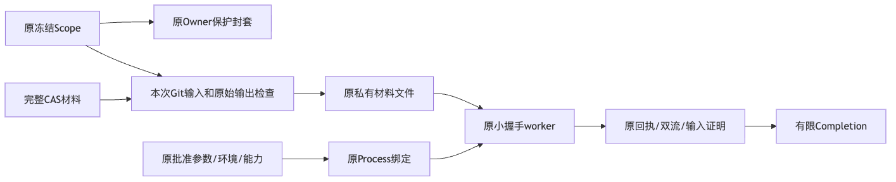

# Git IO共享原产品宿主限定验证

## 背景与范围

正式接口、原资源字段、调用链、流程、失败、安全、持久化和部署见
[总体与详细设计](../../changes/m09-r4-git-shared-process-host.md)。
内部端口显式借原Owner、Supervisor、计划库和同一冻结保护Scope；不改原批准、环境、能力、期限或回执。
默认完整Git父意图/效果配方、A/T/D、Checkpoint/Commit、业务Backup v2和新根恢复不在本验证完成范围。

## 验证方法与实际结果

原生POSIX环境、Python 3.12和Git 2.53.0运行真实Owner及原完整材料worker，不以mock替代进程。
先保留缺失资源接口的RED，再验证同Supervisor原句柄、同Plan库、端口关闭后资源存活、
十一项Owner/Root/Store/Scope/审批拒绝、真实运行取消排空和回执后Scope撤销的未知效果。
SHA1/SHA256与blob/tree/commit六种完整8MiB写入和独立新批准回读保持原容量。
启动交接四项测试以真实原Owner和同时运行的另一共享进程验证回执失败、取消、同ID重放及
停止结算失败，不用双桩代替进程回收，也不将中性Python进程判为Git业务验收。
实际XML数量、主仓复验、字节身份及质量门以[验证事实](verification.json)为准。
最终同候选完整限定回归169项通过，438件生产源码和450件执行输入前后零漂移；
初版155项与直接回收版159项是不同字节阶段，独立保留但不继承或累计为最终实现验收。
独立工作区与主仓重复运行不得相加；离线通过不替代Windows消费者或R3编码质量。

## 失败与安全边界

初始缺接口RED及新测试质量检查失败保留；正式代码不放宽原结构阈值或配置。
独立审查发现的启动交接回收缺陷及修复前测试结果保留。修复前取消场景有一项异常对象身份
断言错误，不能把该夹具失败直接判为进程泄漏；后继保持真实存活和停止断言，仅对非取消异常
检查原对象身份。回执失败与停止结算分类反例仍为真实缺陷，不由夹具修正替代源码修复。
后继新增十项真实Owner组合，覆盖停止等待正常返回UNKNOWN和外层取消/超时原因组保留。
初次夹具提前调用`_reap_owner`清空Popen引用，导致缺失回执后无法观察Owner退出；
该自有测试挂起被定位后终止，保留143及无JUnit事实，不作为产品RED。修正为等待实际Popen
退出但保留原引用，再删除自有回执；真实修复前结果为2通过/8失败，原四项与新十项修复后14通过。
这些阶段证据与最终整批候选分别保存，不覆盖旧失败或把重叠案例相加。
未批准或失效共享资源在启动前拒绝，原两库物理行不变。材料已经可能送达却无法取得最终有效宿主
时保持未知效果，不伪造业务成功、不自动重放。端口关闭不能关闭原产品级资源。
没有模型请求、凭据读取、预算或Docker变更；Primary其他未跟踪资料不参与验证或提交。

## 架构与流程图

## 资料与限制

[源码摘要](source-sha256.json)、[评审边界](review-packet.json)和[清单](manifest.json)保存限定结果。
原始日志、实际XML和完整输入前后摘要位于受限交付目录；公开包不包含原始stderr、Key或业务正文。
R1～R6及真实20 Trial、消费者Windows、独立Beta仍须按原商业条件验收。
