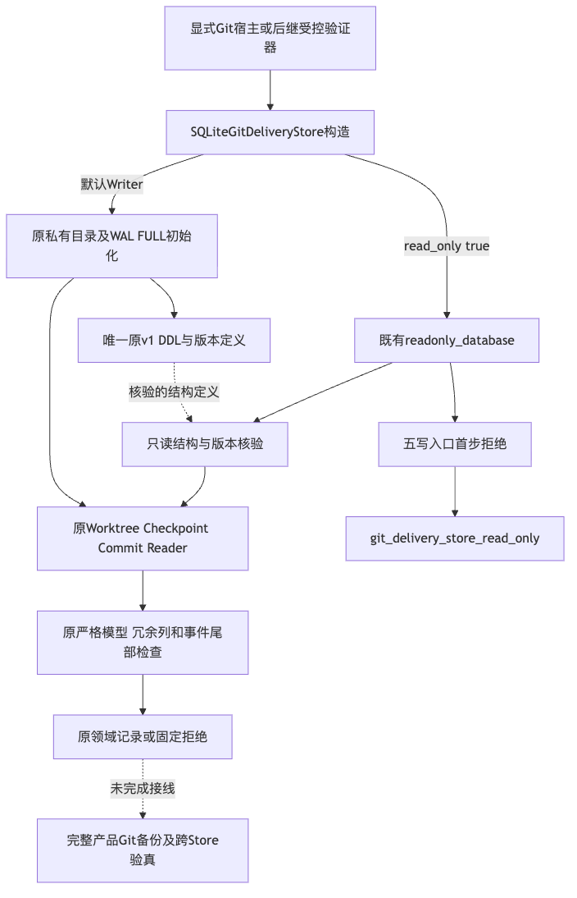
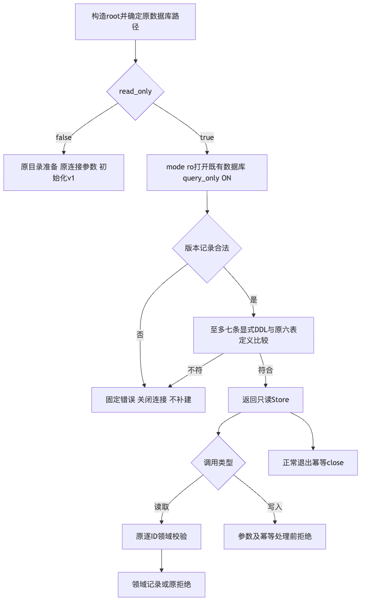
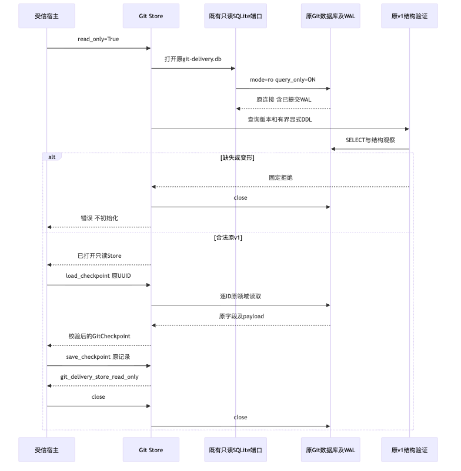
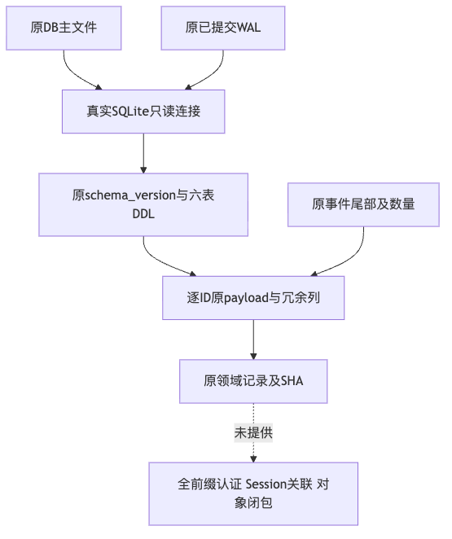

# Git账本只读访问与原格式隔离验证

## 1. 结论与范围

领域Store增加显式只读访问，复用原SQLite端口、原v1模型和读取检查。
默认Writer原表/版本/序列化/CAS不改，原DDL唯一提取，五个写入口在参数及幂等处理前拒绝。
[完整总体与详细设计](../../changes/m09-r4-git-store-readonly.md)
覆盖需求背景、架构、流程、时序、数据流、接口、字段、伪代码、安全、失败、部署及验收。

**本机合同通过；新候选Windows仍需实际运行。该增量不接通产品Commit/Checkpoint，商用门禁不关闭。**
此Reader不等于全事件前缀认证、来源MAC、Git对象归档或完整Git备份；当前产品六库白名单保持。
原始多Patch连续来源、Commit/Checkpoint及完整恢复目标不削减。

## 2. 实现与正式合同

[`Git Store`](../../../src/harnessix/delivery/git_store.py)接受加性关键字`read_only=True`，
不开启Writer目录准备、chmod、初始化、迁移或journal切换。
[`唯一Schema模块`](../../../src/harnessix/delivery/git_store_schema.py)检查原版本1和六条显式表定义，
最多读取七条DDL；未知表、View、Trigger或显式Index拒绝，不自动补表。
原默认Writer使用相同定义和原版本规则，未增加Schema或迁移。

只读连接保留真实已提交WAL；不使用immutable，不把仅复制主DB称为完整新提交。
底层模式与五个入口guard独立；关闭query_only后SQL写仍拒绝。
当前Reader仅复用原严格模型、冗余列、事件尾部与计数；历史事件正文破坏但尾部/计数不变的边界
有明确测试，不据此声称新增全事件认证。

## 3. 真实测试与失败边界

新85项覆盖实际Git Worktree/Checkpoint/Commit重开、独立旧DDL正控、五写入口、
WAL提交与主文件副本负控、DELETE快照物理不变、URI、40结构损坏与连接关闭、原模型/尾部检查。
相关Git/Push、Checkpoint数据保护、正式来源、现有完整备份/恢复及raw合同在
Python3.12.7和3.13.8各537通过，无跳过；包含上述85项，双运行与子集不相加。
较早235项关联运行属于安全DDL查询上限收口前，单独保留，不代替最终源码。

最终426个生产/测试/流程输入在前后逐字节一致，其中410个生产模块；
实际细项、JUnit摘要、解释器、输入Hash见[测试记录](test-results.json)和[源码绑定](source-bindings.json)。
初始只读Smoke只验证新Writer合法结构，独立原DDL测试才证明旧v1格式兼容，二者不混同。
新字段未进入公开模型、Tool或Agent Protocol；当前真实请求及原预算不变。

## 4. 发行与平台验证

Strict Mypy覆盖410个源码文件，机器Schema一致性通过。原可读性策略保持，长Store初始化职责
提取而非提高长度阈值；静态检查、实际图形和源码外Wheel结果见结构化测试记录。
实际新Wheel的451个包成员、410个生产模块与源码及安装字节一致；全新源码外环境离线安装后
242项通过，无失败或跳过，实际导入来自安装目录而非Editable源码。Wheel SHA为
`3f1bb592133f0a458bd625ae0f283094801456adf6825a364e14fa89e8f88408`。
该242项集合与前述537项及新85项重叠，不相加为独立总量。

初始治理302项中301通过、1项因新详设缺少规范接口标题失败；原FAIL与文档检查记录保留。
修正标题后同策略302项全部通过，静态文档检查无问题。四幅设计图实际渲染并逐幅视觉检查，
架构图明确区分初始化调用与结构定义依赖，数据流图采用纵向布局保持可读性。
原Secret规则对含新Wheel的3782个输入完整扫描，零命中；这些结果不证明真实编码质量。
原生WindowsSelector接入既有五分钟专项，新增选择器，不删除既有负载、不抬高CI期限。
Windows11消费者环境、三平台完整Git编码、Beta和商用1.0不从本机通过推出。

## 5. 设计图与实际渲染

图源与实际PNG均由Manifest绑定；完整接口、字段与逐图说明位于前述详细设计。

## 6. 证据与恢复边界

私有逻辑位置`Harnessix/verification/git-store-readonly-20260930-v1`，目录0700、原件0600，
公开仅存必要统计与摘要，不提交原目录、日志正文或凭据。
[事实](facts.json)、[验证边界](verification.json)、[Review Packet](review-packet.json)和
[Manifest](manifest.json)共同区分已验证、待原生及未接线范围。

本接口不创建默认Git库，不修改完整备份布局，不修复或续跑UNKNOWN、不改用户Ref或Worktree。
完整产品交付仍须来源至批准/Action关联、Git业务记录/对象材料、闭合备份及保守恢复对账。
当前商用R1～R6继续开放；内部rc版本和组件通过不等于正式发布。
