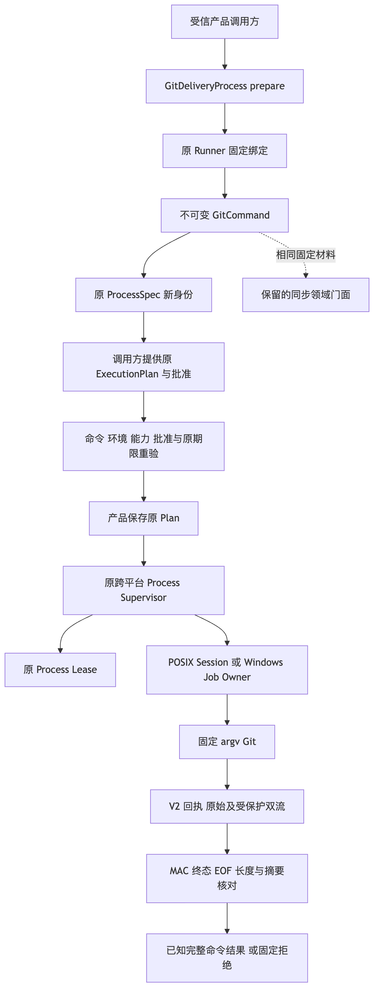
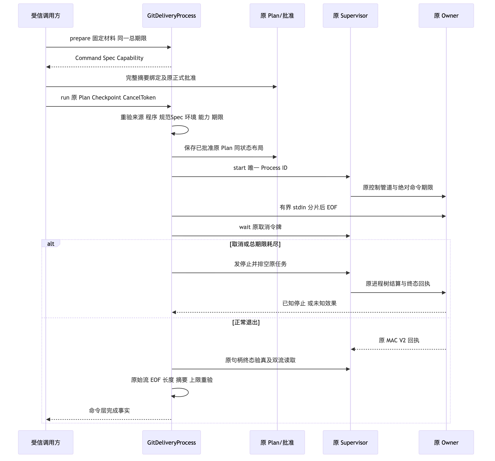
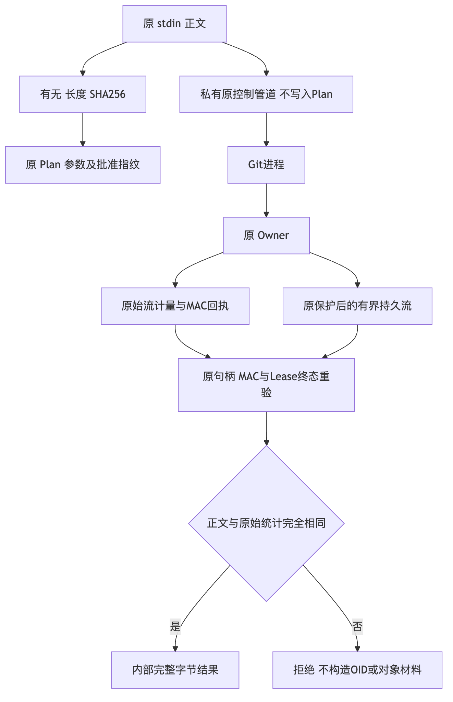

# Git受控命令IO与POSIX原始回执验证

## 1. 交付目标与当前范围

[总体与详细设计](../../changes/m09-r4-git-supervised-command-io.md)包含实际源码映射、类与接口、字段、
批准、预算、持久化、业务伪代码、架构/时序/数据流、失败恢复、安全、部署及测试。
[完整Git业务闭包设计](../../changes/m09-r4-git-delivery-business-backup-closure.md)仍为草案。

已实现的是受信产品内部`GitDeliveryProcess`，复用原Execution Plan、批准、Process Owner、Lease、
V2回执和输出保护。同步领域与异步端共享固定命令、白名单环境、程序/目录身份及完整stdin摘要。
运行取消、Task取消、固定命令超时、跨命令总期限、关闭和未知结算均有明确失败语义。

**不是默认产品Git写能力、完整Checkpoint/Commit、业务对象备份或商用验收。**
默认Tool目录不增加任意Git执行工具，不自动生成ALLOW，不改变六库备份白名单。
旧同步门面仍同步；不能从新内部端口的通过推断其已有取消能力。

## 2. 根因、整改与原失败保留

新增端口真实执行发现POSIX原Owner仍发布V1。即使命令退出零，V1也不能证明未脱敏原始字节。
最初源码焦点存在13个该类失败，旧Wheel在独立Python3.13安装环境再次复现13失败、43通过。
整改保持新端口必须V2：原POSIX pipe的running、exited、launch_failed、unknown均由原捕获器原始计量
发布双流数量、摘要和EOF，同一MAC覆盖；PTY保持原V1，旧回执只按原版本读取，不补零或重签。

双平台共享进度位置及启动失败回执构造，原输出限额不增加。POSIX同时核对raw和保护后字节，
尾窗在EOF结束时再次核对。Windows旧观察模块保留兼容导出，不另造进程树或输出机制。

补充POSIX测试的初始3失败来自用仅支持exited的成功投影读取failed/unknown：改用原MAC回执读取，
不放宽生产成功端口。EOF测试另遇到已退出目标的macOS killpg权限竞态，原Owner保守报告unknown。
诊断只记录异常类型、errno及源码行；验收夹具保持目标关闭双流后仍存活，独立验证尾窗超限与回收，
不接受unknown冒充已知退出。所有原失败、私有诊断和最终结果分别保存。

并行代码评审发现启动前期限耗尽可遗留无人管理任务，以及合法非根cwd批准可改变实际目录。
三项新增负对照先复现3失败；最后期限核验移到任务创建前，并在启动前拒绝非根cwd，修复后3项通过。
此前绿测与旧Wheel作为中间候选保留，不能继承为修复后的最终验证。

## 3. 正式契约与实际测试

新端口59项覆盖真实Git、空/二进制/分片输入、完整输入批准绑定、拒绝/缺失/错误批准、伪造Spec、
环境与物理身份漂移、到期/错误预算、忙/关闭、原Process ID禁止重放、输出边界及脱敏负对照。
其中15项为未知结算优先级的明确失败注入，不作为真实进程回收证明。其余相关取消测试使用原Owner，
包括忽略SIGTERM的父子孙进程、调用取消、Task取消、命令/总期限和关闭后实际无活动Lease。

新增POSIX8项覆盖running/终态raw与保护后流分离、双流MAC字段篡改、原PTY V1、启动失败、真实取消、
无效真实控制帧的unknown、EOF尾窗膨胀限额、脱敏缩小不能绕过raw限额和启动线程取消后的唯一Owner结算。
仅启动屏障由测试延迟，释放后仍调用原spawn；不替换Owner执行或清理实现。

| 实际运行集合 | 结果 | 范围 |
|---|---|---|
| Delivery、Process及关联产品Git测试 | 717通过、41跳过 | 实际收尾758项；包含全部67项新增测试 |
| 全部Product Config测试 | 610通过、29跳过 | 639项；含默认产品、备份/恢复和新59项 |
| 新POSIX源码焦点 | 8通过 | macOS真实Owner，仅POSIX |
| 源码外新Wheel，Python3.12 | 67通过 | 8项POSIX与59项内部端口 |
| 源码外新Wheel，Python3.13 | 67通过 | 原生macOS，非Windows消费者验收 |

集合有重叠，不相加成独立用例总数。跳过不是通过；Mac上的Windows跳过不关闭原生门禁。
完整治理、静态检查、文档门禁和本包字节绑定见[Verification](verification.json)。
测试不访问模型、不读取凭据、不新增费用、不改评分器或Task Pack。

## 4. 制品、安装与证据绑定

新内部`1.0.0rc1` Wheel的454个包成员、413个Python模块与当前源码逐字节相同。
两个全新源码外环境分别安装实际Wheel，`python -I`确认实际导入来自site-packages，
完整包成员再次与Wheel和源码比对；未使用Editable包。Wheel摘要、候选文件与原JUnit由[Facts](facts.json)绑定。

Python3.12使用冻结的产品/测试依赖输入；Python3.13采用明确的核心产品与测试配置。
3.13全依赖尝试因离线缓存缺少可选SDK依赖失败，保留原日志，不宣称全Dev或全可选SDK配置通过。
未修改生产依赖、Lock或全局Git配置；测试采用固定Git工具链。

头部Revision是研究父基线，不代表该提交已包含新增实现；验证候选以实际文件SHA绑定。
原JUnit、日志、包成员完整清单和含本机路径的导入证据保留私有目录。
公开包只包含低敏统计、摘要、设计图与源位置，不复制环境、stdin、stdout/stderr、Token或个人路径。

## 5. 当前架构、时序与数据流

图中调用方仍须显式提供原批准；图不表示默认产品已经接线。三份Mermaid与设计正文、PNG逐字节绑定。

## 6. Review Packet、风险与后续门禁

[Review Packet](review-packet.json)、[Verification](verification.json)、[Facts](facts.json)和
[Manifest](manifest.json)与本完整报告、设计图位于同一目录。

**仅本内部受控IO专项有界验收；R3质量、完整Git产品交付与商用1.0仍开放。**

- 当前控制stdin及每流正常结果上限为原1MiB；8MiB文件和完整Git对象目标不缩减，必须新增受信材料通道。
- 多Patch、干净锚/投影、产品与领域关联、完整Diff审批、业务阶段恢复、对象闭包、完整事件前缀认证、
  Backup v2和新根重新批准未由本端口实现。
- 原`host_guarded`不是内核文件/网络隔离。固定协议白名单不等于强Sandbox。
- 原回执Reader已支持V1/V2；旧Reader回滚不得消费新V2状态，不改写历史状态规避兼容风险。
- Windows新增选择器沿现有原生步骤运行，但本机安装包焦点不是Windows Runner或Windows11证明。
- R3完整20 Trial、至少12严格成功、每仓成功与零越界要求不改变；未知费用保留，不启动未经登记的请求。

没有默认写接线与全业务恢复闭包，不能将专项绿测标记为完整Git商用完成。
