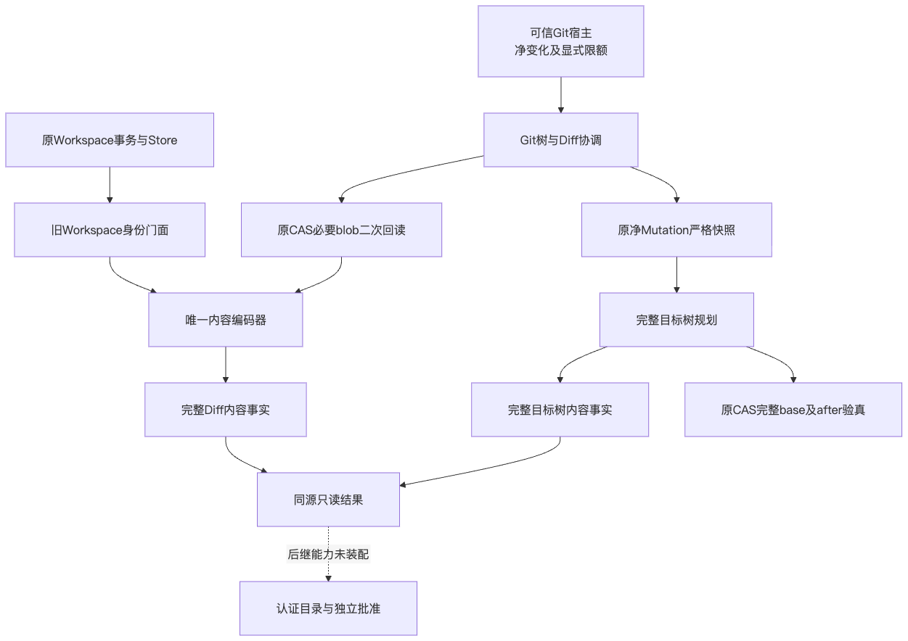
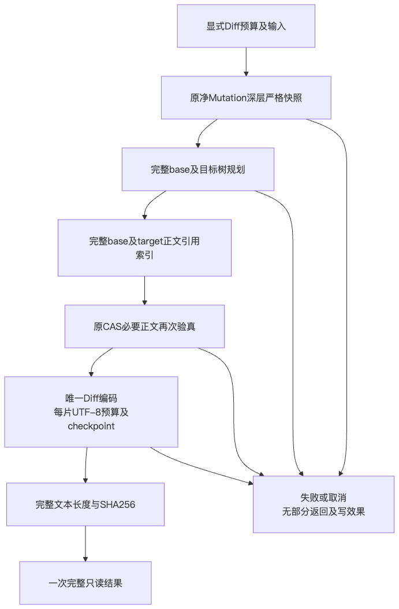
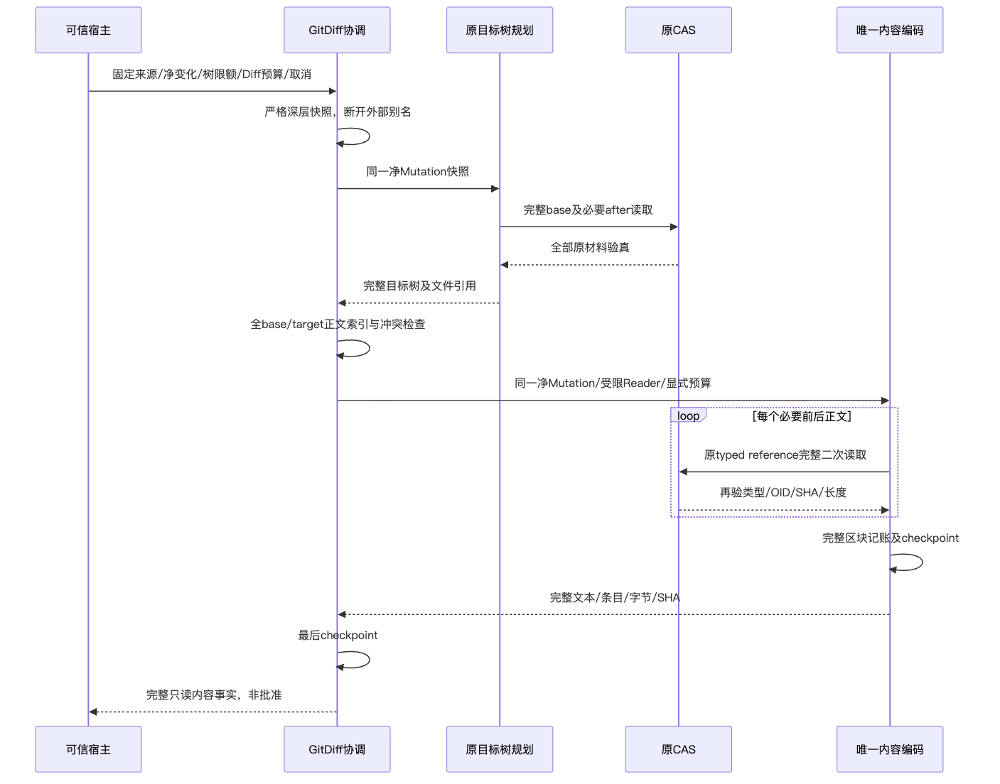
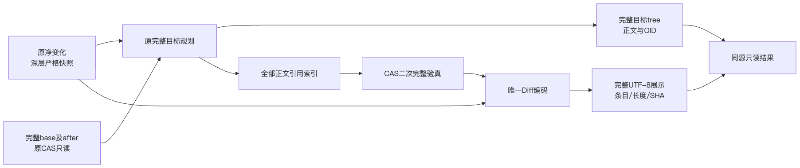

# 完整Git树与Diff同源规划统一验证包

## 1. 交付范围与结论边界

[总体与详细设计](../../changes/m09-r4-git-tree-diff.md)给出需求、类／接口／重点字段、实际源码映射、
核心伪代码、架构／流程／时序／数据流、失败与恢复、安全、容量、兼容及完整测试矩阵。
完整目标树与Diff使用原验证器深层重建的同一净Mutation，正文由原CAS完整二次验真。
旧Workspace接口、事务身份和原表示保留，生产内容编码只有一份。

这是只读内容规划，不是默认Checkpoint／Commit装配、业务来源认证、新批准或Backup v2。
完整R3、消费者Windows11、独立Beta及最终同候选R1～R6仍开放。
结果及绑定分别见[Facts](facts.json)、[Verification](verification.json)、
[Review Packet](review-packet.json)、[Manifest](manifest.json)。
基线d3175f7不是本新候选提交身份；最终源码以完整输入目录及SHA绑定。

## 2. 原失败与修复后对照

新两文件焦点209项，修复前201通过／8失败：六项外层／内层别名导致树与Diff分歧，
两项rename正文读取后取消／超时被容量错误覆盖。原日志和JUnit摘要保留，不降低期望或跳过失败。
复用原净Mutation深层验证器为共享快照端口，并在正文读取后及时checkpoint；修复后209项全部通过。
原Workspace独立golden来自固定d3175f7原diff.py，不由新编码器生成期望。
初版14项golden与后继CRLF补充分别冻结，最终16净Mutation、15展示条目、1835UTF-8字节。
两次原版生成记录分别保留，不把两次称为一次。CRLF、缺尾LF、中文、emoji、binary、空文件、mode、rename及歧义均覆盖。

## 3. 最终候选验证

最终代码1250项，完整目录SHA为`418ecd5205f4211803e930b4c5edc62772df19f9e0defa33e9ea44eb3ae358e6`。
源码1422通过／27跳过，治理302通过；
同一最终Wheel源码外Python3.12和3.13各828通过／4跳过。
两份安装各245个实际产品模块导入、全部467个包成员及71件发行版本与当前锁定输入一致。
独立审查发现两个P2：新Git分隔符误报EOF及快照时点过度表述；实际红例、修正及追加静态审查分别保留。
审查前实际Wheel不再代表最终候选，原件保留；最终候选只使用重新构建的一份Wheel，未混用两制品。

最终源码、实际Wheel、锁定安装输入及源码外双Python运行由结构化记录绑定。
每组实际执行范围、结果、跳过及原件字节摘要见Verification；重叠实验不相加为独立覆盖数量。
原209项及六项别名定向复验属于开发对照；独立审查新增六种CR／Unicode分隔符红例，修正后最终215项全部通过。
最终源码、治理与源码外安装组分别执行，不把焦点重叠相加为全仓或原生Windows覆盖。
静态检查采用原600文件行／100符号行／20复杂度标准，未放宽阈值；Schema容量值保持原64MiB。
初轮复杂度及隐式类型导出检查失败属于开发原件，修正后与最终候选重新核对。

## 4. 基线CI的新原生结果

[固定d3175f7 CI 36817377392](https://github.com/carrie1988/Harnessix/actions/runs/36817377392)已经终结。
macOS、Documentation及Container三个任务成功；Python3.12／3.13仅在许可证扫描的12件Archive处失败。
Windows首NTFS组和Git读取组成功；材料组2失败／1292通过／6跳过，301.85秒达到原五分钟期限。
1306收集、1300实际完成，六项未取得终态不能计为通过；原25个失败节点中23个本次通过，两个仍失败。
两个新增真实Windows目录权限测试均通过。

剩余两个最低SHA256 Commit场景和超时独立定位，不把READ_CONTROL一项修复认定为全部失败根因。
该结果属于旧固定d3175f7，不是本新Diff候选的原生通过，也不追溯改写前包。

## 5. 实际设计图

以下四图与SDD图块逐字节对应，使用实际Mermaid渲染并逐幅视觉检查；虚线明确后继未装配能力。

## 6. 未完成项及商业发布边界

- 对象目录／业务角色与GitDB全认证前缀、完整Artifact发布、新独立批准尚需产品接线。
- 双受管工作树及新派生事务桥接、默认Checkpoint／Commit、Backup v2及新根重新授权仍未完成。
- 产品完整树／存量总容量及历史恢复范围尚未冻结；显式内部限额不能替代产品决策。
- 无真实模型请求、凭据读取、预算账本变更或Docker操作；旧R3成绩与费用预留保持。
- 源码／Wheel验证不是三平台原生编码、消费者OS、真实20 Trial、独立Beta或商用完成证据。
