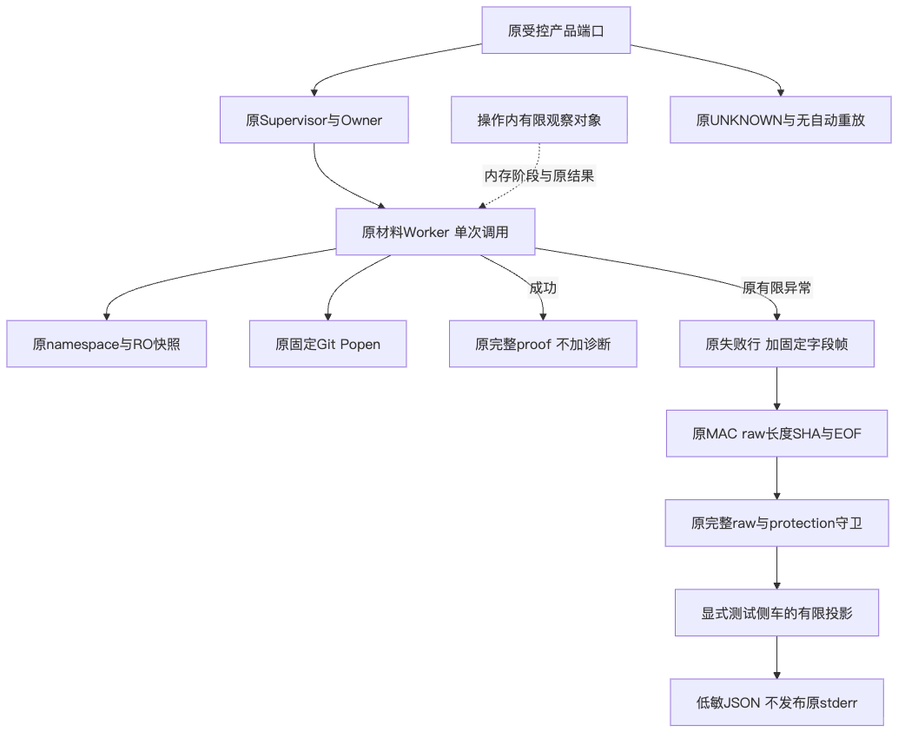
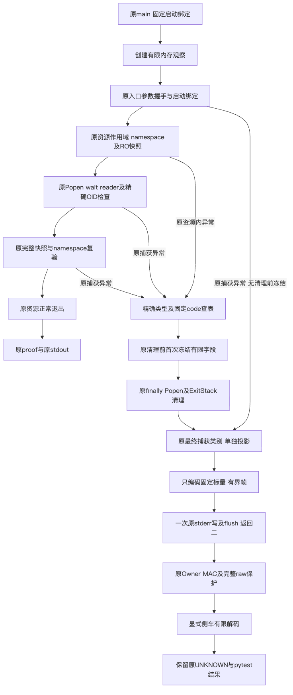
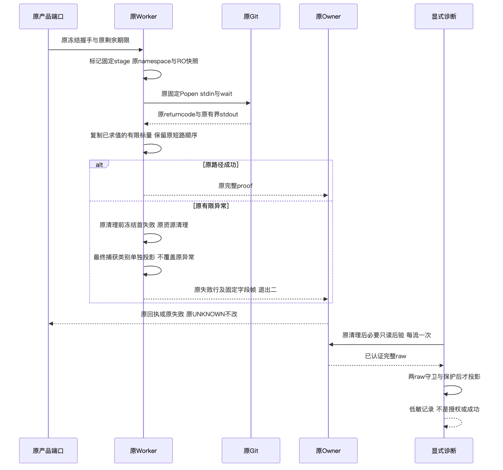
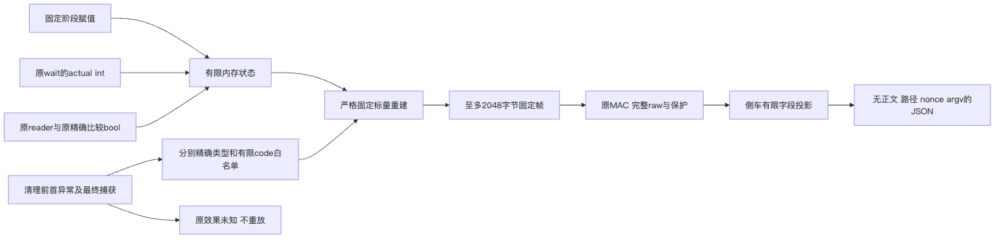

# Git材料Worker有限首失败、清理及最终捕获观察验证

## 1. 范围与结论边界

本专项在原Worker内增加有限内存观察，在显式测试侧车内消费已有认证stderr字节。
完整需求、源码映射、接口字段、伪代码、失败／取消、安全、持久化和部署见
[总体与详细设计](../../changes/m09-r4-git-worker-failure-observation.md)。
原成功proof、失败marker／退出二、Owner／PID／MAC／EOF、材料容量、期限和父端UNKNOWN不变。
没有数据库、Key、模型工具、批准或自动重放变更；模型请求及Docker操作为零。
新模块完整纳入实现身份，源码摘要读取由六份增至七份，不新增业务材料／输出／回执读取。

该专项不是Windows根因修复。原[两轮原生失败](../windows-minimum-commit-probe-2026-10-01-v1/README.md)
保持；新的原生结果必须独立取得。完整Git交付、R3真实编码、Windows消费者验收、Beta和商用R1～R6均开放。

## 2. 观察合同与失败语义

有限帧最多2048字节，只有九个固定字段，原Popen／wait／reader／资源清理次数不增加。
首失败在原finally、Popen和ExitStack清理前冻结为有限bytes，不保留异常对象或正文；
最终main捕获的类别写入独立`handler_error_code`，不改原异常优先级。
两类别相同不能证明无清理覆盖，handler来源也不能证明此前没有错误。

原Git检查严格保留is_alive→failed.is_set→退出码→输出长度的短路顺序；非零退出时不补算完整性。
原wait返回码直接保留POSIX／Windows联合范围，不做符号转换。False／None不能证明无外部效果。
编码故障退回原marker；sink故障不重试、不重执行业务。未捕获业务类型及控制退出不被吞掉。

解码前原MAC回执、两个完整raw守卫和同一保护均须通过；解码只处理已取得的内存bytes。
缺帧、损坏、多帧、未知字段／版本、重复JSON键、实际类型／范围错误及非规范编码不返回有效观察。
Git继承stderr，因此帧内容也不能单独充当消息作者、业务成功或执行权限证明。

## 3. 测试集合与失败保留

完整结果以[Facts](facts.json)、[Verification](verification.json)及[Review Packet](review-packet.json)为准。
新增清理与短路合同在初始实现取得九项中六项FAIL；随后首个实现候选因私有字段未按实例初始化，
有限重建退回未观察，取得292项FAIL。修正为每操作独立初始化后，原433项焦点断言全部通过。
原日志与XML按摘要保存，不修改旧失败为通过。

| 实际集合 | 结果 | 证明范围 |
| --- | --- | --- |
| 纯帧／清理／原侧车焦点 | 433通过 | 有限字段与原异常语义；不是平台验收 |
| Python3.12源码149文件 | 3880通过／74跳过 | 冻结输入在实际受管工作树前后逐件相同 |
| 同Wheel源码外Python3.12／3.13，各149文件 | 各3880通过／74跳过 | 实际安装包导入及包／测试字节验真，无源码兜底 |
| 完整治理 | 397通过，零失败／错误／跳过 | 包含新增三项帧后验正反例，原规则不变 |

集合重叠不相加。源码运行的私有tag名称误标为precheck，但实际完成全部149选择器、3954项收尾和前后输入验真；
结论按实际范围登记，不据命名推导缩小范围，也不额外重跑已完成集合。

关联集合覆盖原Session／Agent／Artifact／产品装配、完整Delivery和Process生命周期；
Python3.12源码与同一实际Wheel源码外Python3.12／3.13分别登记，不相加为独立或全仓覆盖。
原两个实际本机Commit／独立新批准readback通过，v3两条观察各13接点、10模块源码身份，完整且未截断。
自然成功没有额外post读取，也不产生失败帧；本机成功不是Windows证据。

治理载体首次缺少用于历史资料验真的原Git对象，保留失败；只补只读元数据对象后仍发现详设接口章节标题缺失。
正式章节补齐后按原策略复验，不改变测试或治理规则。观察记录核对程序曾按错误前缀／字段取值；
修正后只重读原两份记录，未再次执行业务。

## 4. 发行物与源码身份

唯一新内部Wheel的全部469包成员、428个Python模块与冻结源码逐件相同；RECORD完整验真。
源码外两个Python环境使用同一Wheel、原锁定依赖与哈希安装输入；实际导入必须属于安装环境，
禁止Editable或源码兜底。旧版本测试仅使用固定原归档；静态Schema／示例按原文件复制并逐件核对。
原私有源码和完整测试输入在运行前后逐件核验；公开字段不含个人目录、凭据或原stderr正文。
源码与制品的完整Secret检查、文档检查及独立审查分别登记，不继承其他版本结论。

## 5. 实际渲染图示

四图与详设实际图块相同，经真实渲染和视觉检查；不把诊断画成Windows修复。

独立实现静态审查主查七份候选源码／测试及十三份支持边界，1258项字节身份前后完全一致；
未发现具体可达P0／P1／P2。该审查没有执行测试／CI，也未审查后续文档同步字节，不代替运行或原生验收。
[Manifest](manifest.json)绑定本目录全部公开原件，自身不纳入清单。

## 6. 原生验证与后继验收

新的Windows诊断使用固定named ref、attempt一、新fixture、原两个精确节点及原五分钟上限；
不重跑旧Run，不增加权限、放宽断言或扩大期限。实际结果取得后单独登记；缺结果不记PASS。
若仍FAIL，保留原UNKNOWN，依据已经观察的有限阶段继续源码求证；不能据False／None猜测原因。
完整产品Commit／Checkpoint、GitDB全前缀和独立尾锚、业务对象目录、Backup v2、新根新批准及恢复仍需完成。

## 7. 新一次原生Windows实际结果

[固定4c855c4 Run36853423485](https://github.com/carrie1988/Harnessix/actions/runs/36853423485)
已终结FAIL；Job110340170528、attempt一，固定named ref只dispatch一次，新fixture，原两项均失败，零通过／跳过。
两份v3观察各13接点、10实际源码模块，完整且未截断；setup／teardown通过，call失败。

两份清理前首失败均为git_validate／git_material_git_failed；原Git Popen已返回，原wait返回128，
最终handler类别相同，worker退出二。原reader前两项未拒绝；输出长度／预期OID检查被原非零退出短路，
因此complete／expected为None，不推断stdin或输出损坏。观察确认错误已经进入实际Git非零退出路径，
不是将worker退出二误作Git退出码，也不是已定位具体Git内部错误。

原MAC回执、两流完整raw和保护后验通过；worker stdout空，stderr各607字节，成功proof缺失、readback未执行，
原UNKNOWN及pytest失败保持。正文同为184字节、原摘要／预期OID相同，而stderr摘要不同；不能从长度或SHA猜测正文。
本包没有原stderr正文。原两轮v1／v2实际FAIL均保留。

实际Git为2.55.0.windows.5。十个实际模块含测试侧车，按原Git blob明确LF→CRLF变换逐件核对；
不是完整1258目录原生验真。首次核对程序把tests模块误归src路径，修正后只重读原记录和Git blob，
没有重新读取stderr、再次执行业务或重跑Run。实际模块身份、固定阶段和完整raw层级见Facts。

下一步对照固定Git实现的stdin读取、格式校验及对象写入分支，继续以原只读快照及Owner合同定位。
[Git hash-object固定版本源码](https://raw.githubusercontent.com/git-for-windows/git/v2.55.0.windows.5/builtin/hash-object.c)
和[对象输入实现](https://raw.githubusercontent.com/git-for-windows/git/v2.55.0.windows.5/object-file.c)
表明Git返回128仍覆盖不同失败入口，不能据本诊断选择权限、mmap或格式修复。
Windows根因、消费者Windows11、完整Git产品链、R3和Beta及商用门禁继续开放。
