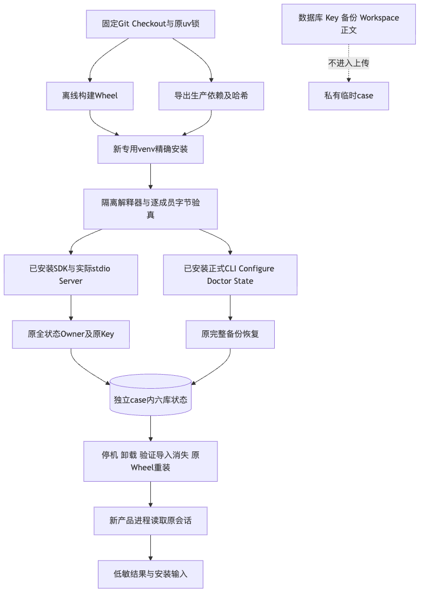
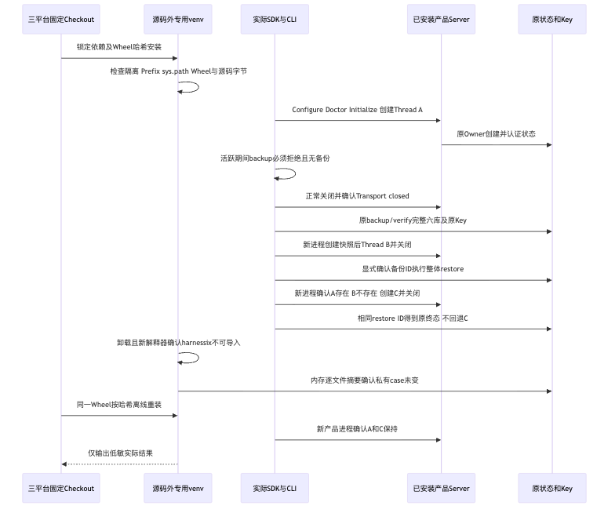

# 三平台源码外安装、完整恢复及卸载重装验证报告

## 1. 摘要、需求背景与结论

固定源码`e08d2480dfe42eeca0cf32f913890505d1dc34a0`的
[实际三平台运行](https://github.com/carrie1988/Harnessix/actions/runs/36458377113)全部成功：
实际Wheel、源码外新venv、正式CLI及SDK/stdio Server完成完整状态恢复、指定venv卸载和同一Wheel重装，
原Key、数据库、备份和Workspace字节在卸载/重装期间保持，新产品进程读取原会话。
三份结果不是Fake Provider、Store直调或源码安装推导。

**专项GO，商用NO-GO**。三个Job各自构建Wheel并核对本机Checkout包字节；Windows Wheel摘要与另两平台不同。
本次不证明同一份规范发行Wheel在三个平台通过，也不宣称可复现构建。
版本升级、真实编码、消费者目标OS、独立Beta与R1～R6整体仍需验收。

[verification.json](verification.json)区分不同源码与验证范围，
[Review Packet](review-packet.json)记录Go/No-Go和剩余风险，
[manifest.json](manifest.json)覆盖除自身外的所有原字节。

## 2. 总体架构、核心流程与源码映射

各平台从固定Checkout导出原锁生产依赖及所有Extra，不装开发依赖到运行venv。
构建Wheel后以`--require-hashes --no-deps`安装；实际执行工作目录在源码之外，
使用专用解释器`-I -m harnessix`，不得借用开发venv或源码`sys.path`。
脚本逐成员比较实际安装与本机源码中的432件包文件，对源码Git HEAD、指定venv和隔离标志同时核验。

正式[执行器](../../../scripts/installed_product_acceptance.py)、
[三平台入口](../../../.github/workflows/installed-product-acceptance.yml)和
[总体与详细设计](../../changes/m09-r4-installed-product-acceptance.md)定义类、接口、字段、
伪代码、持久化及失败边界。产品仍使用
[原组合根](../../../src/harnessix/product_config/server.py)、
[原SDK](../../../src/harnessix/sdk/agent_client.py)、
[原完整备份](../../../src/harnessix/product_config/state_backup.py)与
[原整体恢复](../../../src/harnessix/product_config/state_restore.py)，没有另建安装恢复平台。

## 3. 实际环境、正式结果与制品身份

| 环境 | 实际Python/架构 | 原生Job | 结果 |
|---|---|---|---|
| Ubuntu24.04 | 3.12.3 / x86_64 | 109050448163 | SUCCESS |
| macOS26 CI | 3.12.10 / ARM64 | 109050448564 | SUCCESS |
| Windows Server2025 CI | 3.12.10 / AMD64 | 109050448551 | SUCCESS |

原始环境记录与完整日志分别见[Linux](logs/linux-job.log)、[macOS](logs/macos-job.log)、
[Windows](logs/windows-job.log)；[权威Job摘要](facts/acceptance-ci.json)绑定同一源码与实际终态。
Windows原生NTFS/DPAPI实测不等同于消费者Windows11支持已经验收。
各Job安装边界正反例10项通过；不把重复的同一测试集相加为30项独立测试。

| 原始结果 | 实际Wheel SHA256 | 安装/源码包成员 | 完整备份文件数 |
|---|---|---:|---:|
| [Linux](raw/linux/result.json) | `5a6e144487dd79679f609b709743db176ee28bdca077084ac8901efdc9f2fe30` | 432 / 432 | 7 |
| [macOS](raw/macos/result.json) | `5a6e144487dd79679f609b709743db176ee28bdca077084ac8901efdc9f2fe30` | 432 / 432 | 7 |
| [Windows](raw/windows/result.json) | `c5ef68291c683c11a037d0667369e5df57defd188d6d509c511b1d21cc29c057` | 432 / 432 | 7 |

哈希差异未完成逐成员跨平台诊断，不将其全部归因于换行符或ZIP属性。
正式统一通道需要选定规范发行Wheel，再对其完成跨平台安装，不能把三次独立构建自动折算该条件通过。
产品版本均为`0.1.0`，没有1.0 Tag或正式PyPI发布。

## 4. 每个平台实际完成的业务断言

1. Configure生成仅含合成环境引用的私有配置，`.invalid`端点，Doctor ready；State不由脚本预建。
2. 原SDK握手创建Thread A；Server活跃时原`state backup`返回`product_state_busy`，备份目标仍不存在。
3. 关闭并确认Transport closed后，原CLI备份/验真六库及独立Key共7件文件。
4. 新进程创建快照后Thread B；停机后以明确备份ID和restore ID整体恢复，保留Previous Root。
5. 新产品进程证明A保留、B消失，再创建C；相同restore ID返回原稳定终态，不回退新产生的C。
6. 所有产品进程关闭；专用venv卸载`harnessix`，全新隔离解释器确认不可导入。
7. 只在内存比较新建私有case全部文件，Key、六库、原备份及Workspace在卸载期间原字节保持。
8. 原Wheel按精确哈希离线重装，文件仍未变；新产品进程读取A和C，Workspace Sentinel未变。

原CLI及SDK实际承担行为，不直接构造Store或制造新的Row Seal。
本场景没有编码Tool、Process或Artifact正文，不外推有活动效果或复杂工作区的恢复结果。
没有发送模型Turn、未读取真实Provider凭据，百炼本轮验证请求为0。

## 5. 本地双Python对照与冻结原件格式失败

提交前在两个独立macOS新venv中执行同一活动脚本，均完成源码外恢复及卸载重装。
[Python3.12.7原件](raw/local-312/result.json)与[Python3.13.8原件](raw/local-313/result.json)
的产品来源为`d6b32c4`，脚本字节与正式`e08d248`相同，见[来源事实](facts/local-controls.json)。
这些是不同环境和来源的补充，不与三平台正式Job混为一轮通过数。

`e08d248`常规Linux Job在`ruff format --check .`拒绝已冻结诊断原件，
[3.12失败](logs/source-python312-format-failure.log)及[3.13失败](logs/source-python313-format-failure.log)原件保留，
后继完整功能和许可步骤没有执行，不能说该候选Linux功能全量通过。
后继`101f71e`界定冻结`diagnostics/*.py`及`installation/*.py`为证据数据：
不改写原Manifest或脚本，活动`scripts/installed_product_acceptance.py`、源码及测试仍完整格式/Lint。
仓库Secret扫描继续覆盖同一原件，详见[正式设计第8.1节](../../changes/m09-r4-installed-product-acceptance.md#81-冻结诊断原件与活动源码格式边界)。

| 对照 | 实际结果 | 范围限制 |
|---|---|---|
| 原策略控制 | 合成冻结脚本被格式检查拒绝 | 私有控制日志含合成规则命中正文，不复制到公开制品 |
| 后继边界测试，Python3.12.7 | 11通过 | 新边界回归，不替代原生完整安装 |
| 同一边界，Python3.13.8 | 11通过 | 不能与重叠范围求和 |
| 文档/仓库/制品/安装治理 | 38通过 | 非完整功能回归 |
| 干净受管Checkout全库格式/Lint | 1294文件已格式化，Lint通过 | 未包含主工作树非受管目录 |

[格式原件](logs/full-format-check.log)、[Lint](logs/full-lint-check.log)、
[双Python边界](logs/helper-312-green.log) / [另一环境](logs/helper-313-green.log)及
[受影响治理](logs/installed-governance-green.log)保持原字节。
SBOM与许可报告只更新输入指纹，原12件Archive拒绝、锁文件及权利判定不变。
后继源码CI单独记录观察，不能从本地格式通过推导其全矩阵终态。

## 6. 失败、安全、持久化与复验

每次只能新建专用case，存在即拒绝，不删后重试。操作有原30/60秒期限及15分钟Job期限；
所有Transport在finally关闭，任何非预期CLI退出或字节漂移均不生成新的成功结果。
Key及数据库始终在私有case，输出只保留固定布尔事实、安装版本及制品摘要。
每平台Artifact上传仅7件固定文件；本目录不含任何DB、Key、备份或业务正文。

复验使用同一工作流固定Ref，核对实际运行的40位SHA而非仅工作流名称；
下载Artifact后核对Job成功、源码、包版本、哈希和全部必须断言，随后验证本目录Manifest。
不同SHA、平台、构建摘要或未终结Job均须保留差异，不拼接为完整发行通过。
本次只是同机同用户恢复；不提供跨机Key迁移、旧无证明历史补签或在线升级结论。

## 7. 剩余发布工作与风险

- R4：规范单一发行Wheel的跨平台复验、消费者目标OS、真实编码闭环、认证候选版本升级/回退继续开放。
- R3：历史0/20仍没有新合格真实任务结果替代；原固定镜像与费用账本准备仍待完成。
- R1/性能：正式可达安全收口及当前认证状态的500 Thread数据库增长FAIL仍需处置，旧Profile不改。
- R5：3～5名独立开发者及至少15个真实任务，没有以自动化Job充作独立用户。
- R2/R6：12件许可及商业权利低优先并行；正式封板前仍须关闭，同候选全门禁不得缺失。

本交付没有降低原真实任务阈值、取消Windows承诺、修改权限或认证，也未将非功能治理设为功能研发串行前置。
