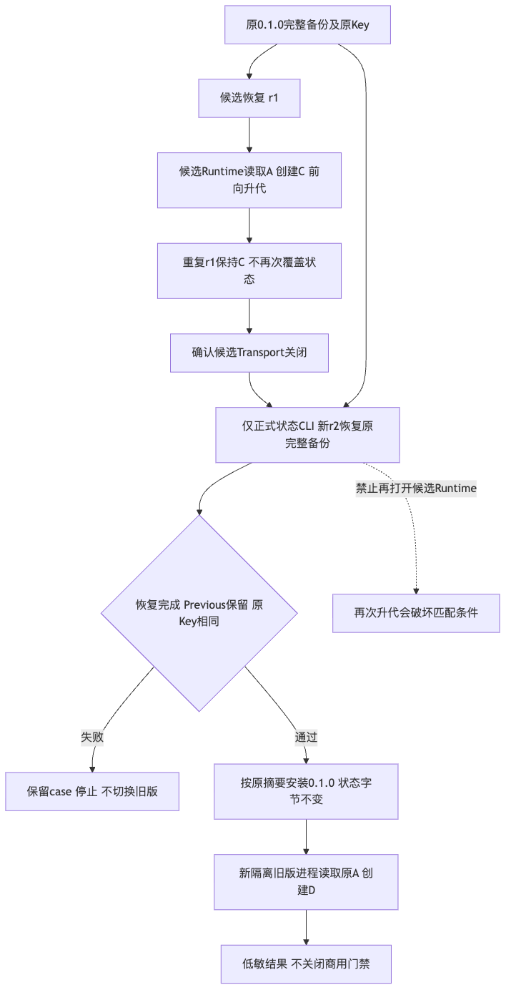
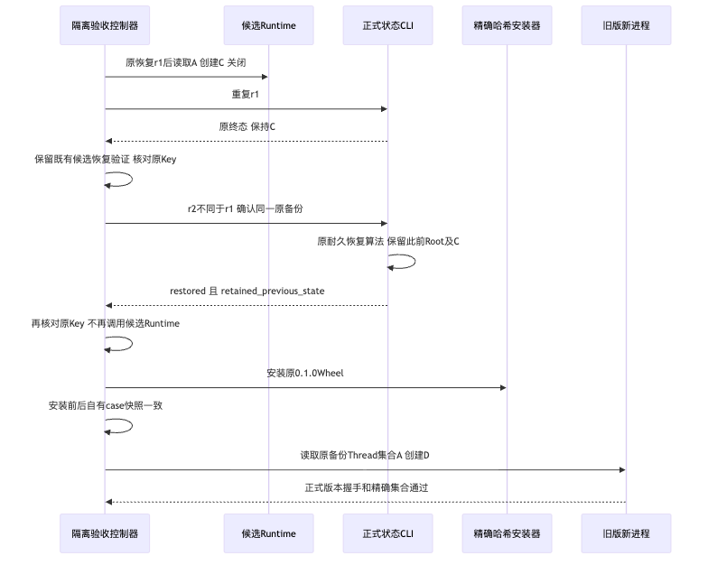

# 当前规范Wheel安装与匹配备份回退整改验证报告

## 1. 结论与证据范围

已提交的验收顺序修正为`b1f8ec4`。控制回归47项、独立短负控10项通过；
本地新根安装/匹配回退通过，三平台同一规范Wheel原生生命周期全部通过。仅该有限子项GO。
固定前版`702a89c`的三个原生安装生命周期通过，但不同版本回退三平台FAIL；原失败记录不改。
本报告不关闭R4整体、R1～R6、R3真实编码质量、Git Writer或独立Beta，不发布1.0稳定版本。
结构化终态以[当前结果](facts/current-results.json)为准，不能用历史候选PASS代替。

## 2. 需求背景、设计目标与验收条件

升级回退必须先建立与旧发行物匹配的完整状态，再启动旧包。原验收器恢复后又打开候选Runtime，
使Workspace Schema重新升代，随后只切换旧包，违反已有匹配备份前提。
目标是纠正调度顺序，保留正式恢复及原ID幂等测试；不改产品Schema、认证、Owner、期限或旧Reader。
退出本子项必须有全新根实际旧/新Wheel演练及同一规范Wheel三个原生消费者成功结果。

## 3. 总体架构与模块边界

控制器→已安装状态CLI→原完整恢复算法→指定venv的哈希安装→新隔离旧版SDK/stdio产品。
不直接写SQLite，不建立第二恢复状态机，不增加服务或中间件。
详细接口、字段、源码和失败规则见[14节详细设计](../../changes/m09-r4-matching-backup-rollback-order.md)。

## 4. 核心流程、时序与数据流

旧包创建A及完整备份；候选读取A并创建B；候选原r1恢复A、创建C，重复r1不回退C。
候选关闭后，以新r2恢复原备份并保留含C的Root；不再打开候选Runtime；切换旧包读取A、创建D。
这明确改变回退阶段的预期集合来源，不将候选生成的C误当作旧备份内容，也不销毁保留根。

## 5. 输入、平台与发行物身份

原0.1.0来源`a4f7f33449bb897d84fe3a8e8262307943233fb4`，原Wheel SHA256
`5a6e144487dd79679f609b709743db176ee28bdca077084ac8901efdc9f2fe30`，不改标或重建。
前版规范rc1 Wheel SHA256为`be30cacc274ee26053a8f3cbbf7ef3234b43298a51b4e51062babe857cfec79f`，552个生产包成员。
修正没有改生产包代码；后继本地实际单次构建及CI唯一规范构建均核对为同一原摘要，
不能只因源码包未改而假定摘要相同。
初始三平台为Linux x86_64/Python3.12.3、Darwin arm64/3.12.10、Windows AMD64/3.12.10；
本地独立环境为Darwin arm64/Python3.12.8。CI宿主不代表消费者全部OS支持。

## 6. 初始实际失败与一次独立定位

[Run 37692147486](https://github.com/carrie1988/Harnessix/actions/runs/37692147486)唯一Wheel构建/扫描成功，
三个消费者均通过原安装生命周期，在不同版本rollback阶段FAIL；三个升级成功result均不存在。
原公开码为`upgrade_phase_failed`，一次本地新根外围定位只确认rollback子进程固定码`upgrade_acceptance_failed`。
没有捕获实际内层Store错误，不能宣布唯一隐藏异常根因或把源码推导当作捕获结果。
初始本地升级exit1、12.782244秒；独立定位exit1、11.971653秒；无超时、自动业务重试或模型请求。
原件及全部43个低敏CI下载文件在私有根保留并核对摘要，公开[初始事实](facts/initial-three-platform-failure.json)。

## 7. Schema证据与必要流程缺陷

仅查询三个数字Schema元数据：原备份Workspace/Audit/Execution为1/2/1，失败前活动根为2/2/1；
固定原0.1.0Reader预期仍为1/2/1。当前Workspace初始化v1→v2足以破坏旧版匹配前提。
Audit v3、Workspace v3、Execution v2仅在实际新记录/Plan准入后出现，不是每次初始化都产生。
[Schema证据](facts/schema-mismatch-evidence.json)不包含业务行、Key或Key摘要。
旧Reader拒绝新代际保持正确；本修正不降低其检查。

## 8. 实现、领域契约与源码映射

[`accept_upgrade`](../../../scripts/installed_product_upgrade_acceptance.py)新增不同r2及原CLI完整恢复，
检查restored、Previous与原Key，随后原安装快照断言和旧包精确集合检查继续执行。
成功结果增加三个低敏事实：匹配备份在切版前恢复、读取原备份Thread、匹配恢复后未打开候选Runtime。
[`新顺序回归`](../../../tests/governance/test_installed_rollback_order.py)覆盖六条正常/失败路径，
[原工作流](../../../.github/workflows/installed-product-acceptance.yml)将新用例纳入已有平台边界步骤。
其他产品、数据库、原审批、Git MAC、Owner及默认工具装配未修改。

## 9. 持久化、恢复、安全与并发边界

恢复仍由原耐久Journal和目录切换执行；后续B/C分别保留在Previous，不以删状态达到精确集合。
原Key仅在内存比较，不进入公开产物；失败保留case，恢复中断先沿原Journal对账。
只操作独立根及指定venv，实际项目原目录、参考副本和他人的工作文件不运行、不修改。
未知外部效果必须先对账；整组状态回退不能自动撤销外部效果。

## 10. 失败语义、取消、期限与可观测性

恢复ID重用、恢复拒绝、Previous缺失、Key漂移或原CLI异常均在安装旧包前停止。
原异常内部身份保持，顶层仍固定码；CLI60秒、阶段180秒、安装120秒，不延长期限或自动重试。
Ctrl-C不输出PASS，也不表示耐久恢复已撤销。公开白名单不加入私有阶段身份或原异常正文。
保留初始FAIL和RED测试；后继结果不重写旧候选历史。

## 11. 回归测试与独立审阅

| 执行 | 实际结果 | 解释 |
|---|---|---|
| 原脚本上的六个新增调度测试 | 6 FAIL / 0 ERROR | 预期RED，保留原JUnit |
| 首次默认Apple Git2.24执行 | 46 PASS / 1 FAIL | 原CRLF控制夹具失败，不改变断言 |
| 指定Git2.53后同一47节点 | 47 PASS / 0 FAIL | 校准已验证测试工具环境，不叠加重复节点 |
| 独立原六项短测 | 6 PASS | 与主仓重复，不加入唯一测试总数 |
| 独立另十项负控 | 10 PASS | 取消/超时/拒绝的异常身份、恢复确认和切版阻止 |

六项格式替身不是实际SQLite或安装证据。独立审阅只给有限合入GO，25项低敏Manifest已另行核验，
源码两个文件摘要一致；实际安装及平台门禁仍分项记录。[测试及审阅事实](facts/tests-and-review.json)保留各次身份与限制。
文档静态初检620份、13,742链接、1,141 Mermaid块、26包、0 findings；交付终检621份、0 findings。
[文档及扫描记录](facts/documentation-and-scan.json)按对应快照保存；实际渲染本改动相关5份图，
新增流程/时序图已视觉检查，不宣称全仓1,141图已重新渲染。

## 12. 纠正后实际演练与跨平台验证

本地新根固定`b1f8ec4`：11个实际构建/安装/验收步骤全PASS，原安装11.326993秒、不同版本12.732862秒；
58锁依赖离线安装，552包成员及563绑定输入前后不变，无Watchdog、自动重试或残留自有进程组。
低敏私有Manifest58项已另行核验，不读取或摘要case/DB/Key/Previous正文；Previous事实沿原CLI/SDK断言，未另枚举目录。
[Run 37696128297](https://github.com/carrie1988/Harnessix/actions/runs/37696128297)固定同Revision、Attempt1：
唯一规范构建及Linux/macOS/Windows三个原生Job全部成功，六个实际成功结果存在；下载46个低敏原件并核对摘要。
三个不同版本结果均确认新ID匹配恢复、原A读取、不重开候选Runtime、原Key和Previous保留、新D创建。
所有环境沿源码外专用venv、原锁及实际Wheel，保持原断言后获取原成功结果。
不能复用初始失败case，不能用单位测试、脚本存在或构建成功代替完整回退。
完整终态及Wheel身份见[当前结果](facts/current-results.json)；三个原件分别为
[Linux升级](facts/linux-upgrade-result.json)、[macOS升级](facts/macos-upgrade-result.json)、[Windows升级](facts/windows-upgrade-result.json)，
本地原件为[升级](facts/native-upgrade-result.json)和[安装](facts/native-installed-result.json)。

## 13. 百炼费用、部署及发布限制

本次付费请求0。新周期额度60元，26次已完成请求的累计估算0.706096元、预留0、剩余估算59.293904元；
实际账单未确认。旧两笔未决保留历史，不纳入新周期，也不报告为零结算。
[预算事实](facts/budget.json)只公开汇总及账本摘要，没有Key、请求正文或私有任务标识。
没有新Tag、稳定Release、PyPI发布、许可证切换、Docker设置或业务服务变更。

## 14. 风险、剩余工作与审核入口

本子项即使全部PASS也只证明有限安装与手动匹配回退，不证明真实编码质量、消费者原生全部工具或Beta。
Git Writer/B4/B7/P1及协作一致性合同、默认Docker Workspace/Profile、真实R3和Beta接受仍分别开放。
本次Docker官方status观察10秒超时后清理自有观察进程，总15.067秒，socket仍不存在；
[元数据](facts/docker-current.json)只证明该观察未就绪，无设置/容器修改，不确认原8容器或挂载恢复。
R3历史严格0/20、必需测试1/20，真实Beta接受0，没有将内部修复记为用户自主任务成功。
[原字节Manifest](manifest.json)、[结构化结果](facts/current-results.json)、[Review Packet](ReviewPacket.json)构成审核入口；
必须按实际终态决定有限子项，不因预算可用或局部绿色测试宣布商用1.0。
