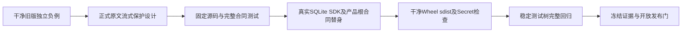

# 模型流式文本与事件持久前保护验收报告

## 1. 固定范围与总体结论

[完整总体及详细设计](../../changes/m09-4a-model-text-publication.md)包含四幅图、正式接口、字段、伪代码、失败恢复与源码导航。
模型流式文本按原模式保留尾窗，安全前缀在模型未完成时经SDK输出；事件批次在CAS前检查，
主模型和摘要模型完整请求在Provider消费前检查。不改原正文、Hash、公开Schema或尝试账本顺序。
本报告只验证该来源；完整0.9.4a、0.9及商用发布仍未完成，许可证12件仍阻断。

## 2. 独立旧版与当前消费链观察

干净96a0b79 Git归档和当前源码运行同一探针，均为实际Agent Runtime、SQLite、SDK、非空OTel与两次请求；
Provider为按请求次序索引的确定性替身，实际模型请求0。探针不通过关闭新实现保护来冒充旧版。
旧版第一Turn completed，回答、事件、SDK重放、回调增量、下一次模型历史和数据库含已登记合成值；
即时队列页未命中、遥测未命中不用于否定其他出口泄漏。
当前第一Turn以public_output_secret_leak失败，第二Turn正常完成，上述九个检查面均未命中。
详细布尔事实、来源提交、探针Hash见[合同事实](contract-facts.json)。

## 3. 合同与运行验证

- 原值和有限编码跨块；中文、UTF8码点、空增量、仅终值及独立块。
- 全步骤字节/工作共享、固定诊断、工厂取消、Token/父取消、期限与幂等关闭。
- 实际SDK安全前缀在Gated Provider完成前输出；不是收集整个回答后假称流式。
- 工具参数、调用身份与名称命中时零执行，模型元数据持久前拒绝。
- 意图提交先于模拟传输；文本失败保留已提交部分用量，未知账本不补造完整计数。
- 实际摘要Compaction：正常激活与拒绝不激活；旧历史出站拒绝、旧正文Hash不改写。
- 产品根启动、快照轮换与逆序清零真实；Provider工厂和传输驱动为替身，不代表实际stdio字节或网络验证。

## 4. 专项、相关与完整回归

专项110 passed（66新增功能＋44既有），包含纯端口、实际消费链、产品根及原二进制回归；另新增两项证据治理测试。
相关回归1837 passed、82.09秒；其执行早于最后一项描述符回归，不冒充最终完整回归。
完整回归和固定测试树信息见[验证记录](verification.json)；专项、相关、完整测试相互重叠，不加总。
历史固定报告和Manifest不修改，新报告单独冻结。

## 5. 构建、设计可视化与环境边界

干净固定源码生成Wheel/sdist，不夹带未跟踪草稿；构建与扫描Hash见验证记录和合同事实。
本详设四幅图及本报告一幅图实际渲染，逐幅视觉检查；未重新渲染所有既有图。
本机测试不替代Windows/Linux真实安装、实际容器、真实Provider或平台矩阵验收。

## 6. 下一缺口与发布阻断

独立探针确认：用户prompt包含当前已登记值时，模型请求被拒且Provider调用0，
但_accept直接store.append已将输入保存，实际SDK Replay与SQLite仍含该值。
这验证了新增_commit保护不覆盖全部持久入口；不能把“出站拒绝”描述为“入站未持久”。
旧历史Replay授权和跨重启证明同样开放，旧数据不在本报告清洗或重签。

许可证12件、Owner同步资源/Store归属、编号化攻击、远端MCP、三平台安装升级和真实Provider发布仍阻断；
[Review Packet](review-packet.json)明确release_blocked及overall_0_9_complete=false。

## 7. 证据文件与复核方式

目录仅包含本报告、[Manifest](bundle-manifest.json)、合同事实、验证记录、Review Packet及[CI观察](ci-observation.json)。
Manifest排除自身，记录另外五文件原字节Hash和固定源码输入；源码与完整测试树分别绑定。
CI不按每个本地提交等待，不重启相同工作流；后台状态不冒充已通过，后续状态另建证据而不修改此冻结目录。
