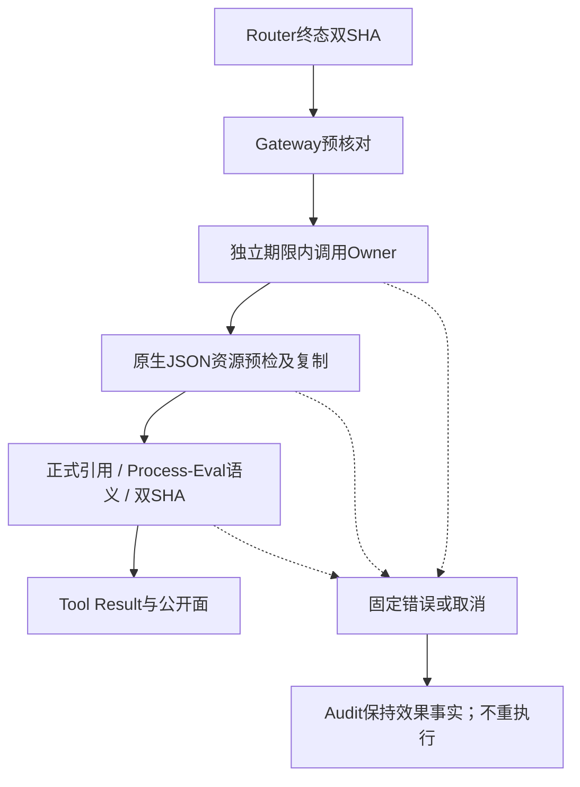

# 成功Owner投影与有界回调验收报告

## 1. 范围与结论

实现Revision：`7be9fa218ff6eef275f1b82d65ed36c066df34ba`。
[详细设计](../../changes/m09-4a-success-output-projection-boundary.md)包含源码研究、架构、流程、时序、
数据流、类/接口/字段、伪代码、异常、取消、恢复、部署与验证边界；取舍见[ADR 0094](../../adr/0094-audit-bound-bounded-owner-projection.md)。

专项 **126 passed，1.81秒**，包含新增125项与扩展后的既有Schema测试1项。本地完整回归 **4349 passed / 32 skipped，365.04秒**。测试树为`9097743a4ab33e87e86619ba27b75d2145109de2`，生产源码与实现Revision相同；测试树另外包含本轮文档及2项证据治理测试。测试树提交在运行期间记录，但文件字节在本轮开始后未改动；不把该状态称为实现Revision的干净归档全量测试。
专项与完整回归重叠，不相加为独立测试总数。未跟踪攻击草稿明确排除，不修改、不提交、不计TM验收。
本轮真实模型API请求为0，未创建定时任务。

本专项实现有界成功/失败Provider投影，但**整体0.9与正式发布仍阻断**：许可证12件、执行器原始
Outcome预算、无Provider成功JSON、Owner内部资源/不协作阻塞、其他公开面、编号攻击验收、远端MCP、
三平台实际安装/Beta及真实Provider发布验收仍开放。`make check`不称通过。

## 2. 独立负例与根因

前序`e748a7d6dcae9fd35291d6c0f3a4045959e3d9bc`独立`git archive`中复制本次14项负例，
验证导入的`agent_gateway_output.py`确实来自归档，然后运行pytest。结果 **14 failed，0.37秒，exit=1**，
均为成功投影没有按预期拒绝，不是导入或基础设施失败。整改后同组全通过。

成功投影原先跳过失败合同校验；Owner身份不授权追加外部诊断。回调没有独立期限，正常返回值在
通用JSON编码之前没有资源预算。修复将成功/失败投影统一为审计双摘要+正式引用，Process/Eval
增加计划和业务语义检查；预算先于编码、DTO和Hash。

## 3. 实现与源码责任域



| 源码 | 行为与验证 |
|---|---|
| [agent_gateway_output](../../../src/harnessix/trusted_actions/agent_gateway_output.py) | 执行/恢复共用投影；Owner回调、预检、复制和合同共用独立期限；不改Audit。 |
| [output_budget](../../../src/harnessix/trusted_actions/output_budget.py) | 1MiB/64层/10256节点/10秒；128-bit整数，原生类型、循环、UTF-8转义及容器扩展前检查。 |
| [public_outcomes](../../../src/harnessix/trusted_actions/public_outcomes.py) | 全部Provider投影绑定摘要和正式ArtifactRef；严格Process/Eval语义，保留失败策略。 |
| [public_errors](../../../src/harnessix/trusted_actions/public_errors.py) | mismatch/limit/timeout固定消息；Owner自行TimeoutError与真正本层期限届满分开。 |
| [正式预算Schema](../../../spec/action-output-budget-v1.schema.json) | 严格不可变局部合同，模型不能修改默认值。 |
| [既有Owner](../../../src/harnessix/product_config/process_action.py)、[Eval Owner](../../../src/harnessix/product_config/eval_action.py) | 字节重建、脱敏、Artifact所属域仍归Owner，不由Hash相等追认。 |

## 4. 测试事实与边界

- 14项成功执行/恢复拒绝：追加诊断、摘要变化、Artifact错误/缺失/不完整、标量、引用额外字段。
- 序列化前预算：精确UTF-8与转义边界、节点/深度、宽树、共享子树、循环、128-bit整数、NaN/
  Infinity/代理项、非法键、扩展类型不调用、取消/同步期限、严格预算不能关闭硬上限。
- Provider异步生命周期：进入/退出Event握手验证超时、领域取消和父Task取消回收，不用sleep推断；
  修复后重新查询Owner，Executor仍1次、Reconcile仍0次、Audit事件不变化。
- Process/Eval：正式Lease文档生成摘要，零退出成功和非零Eval业务结果；即使错误元数据与Audit
  Hash相等也拒绝错profile/process_id/状态/原因/returncode/passed及额外字段。
- 实际Runtime读写场景：真实SQLite Session、Scripted模型请求、Agent Protocol SDK回放、非空
  OTel Span/Metric均验证固定错误和不泄漏；未向第二次模型调用发送故障输出。
- Runtime首次投影失败会查询优先补偿一次，Provider计数2；保存Tool Result后resume保持2；
  Gateway低层单次失败Provider计数1。实际执行1次、对账0次，两种层次统计不混为一谈。
- 本地完整回归覆盖既有真实Product Process/Eval集成；专项合成Lease不单独声明为生产Owner字节证明。

首次完整回归出现1个可读性快照未同步失败（4346 passed/32 skipped），失败原因是报告仍对应330个
源文件，当前树为331个。只重生成事实报告，未放宽策略、复杂度阈值、依赖边或环豁免；第二轮完整回归出现1个文档引用目标尚未生成失败（4346 passed/32 skipped），来自并行生成证据目录期间的文档状态。稳定当前树后再次完整重跑，不以专项或局部重跑替代。

## 5. 静态检查、文档和发行物

Ruff格式/检查排除未跟踪草稿；Mypy 331源文件、合同、Task Pack、SBOM Schema/漂移及Secret自检
均通过。可读性策略原样保持，仅重生成当前树事实。5幅新设计/报告Mermaid已实际渲染并逐图目视检查，文字、方向和分支可读。

发行物来自实现Revision的干净`git archive`，在归档目录用`uv build --offline`构建，未从含草稿的
工作树构建。Wheel/sdist均不含`tests/security`，文件Hash、大小和成员数见[projection-facts](projection-facts.json)。
发行物及Git已跟踪来源扫描完整覆盖2268个输入，固定6规则零命中。该数字是输入数，不是攻击验收
数；零命中不证明未知Secret规则或所有敏感语义均已安全。没有声明构建位级可复现或许可证通过。

## 6. CI、发布门禁和风险

前序e748a7d的[CI 36295859840](https://github.com/carrie1988/Harnessix/actions/runs/36295859840)
已终态失败：Windows、macOS、文档、容器成功，Python3.12许可证12个Archive失败，Python3.13取消。
日志已核对。该CI不是本次7be9fa2投影实现的验收。

本次本地批次在冻结时尚未推送，新合同CI状态为`not_started_at_freeze`；后续在后台跟踪，不逐提交等待、
不重复触发。终态新版本证据必须单独新增，不改写已冻结报告。正式发布仍要求实际版本矩阵通过。

| 风险 | 状态/处理 |
|---|---|
| pywin32 12件受限许可证正文 | 发布阻断，等待替换或完整权利/义务决策，不扩大允许集、不删证据。 |
| 执行器原始Outcome预算与无Provider成功JSON | 独立剩余公开边界，不因本Provider预算而标记关闭。 |
| Owner内部读取/发布分配与不协作同步代码 | 本层不提供进程级硬中断，仍需Owner预算与宿主隔离。 |
| TM编号攻击、远端MCP、三平台实际安装/Beta | 未完成，不将普通单测计为攻击/Beta验收。 |
| 实际Provider发布验证 | 未进行收费调用，不沿用旧低成功率Eval基线为本版本通过。 |

## 7. 清单、评审包与复核命令

同目录集中保存[verification](verification.json)、[projection-facts](projection-facts.json)、
[CI观察](ci-observation.json)、[Review Packet](review-packet.json)、[Manifest](bundle-manifest.json)。
Manifest排除自身，保存5份原字节Hash及固定Git Revision源码输入；不含凭据和原始诊断正文。

```bash
uv run pytest --ignore=tests/security -q --tb=short -o addopts=''
uv run pytest tests/trusted_actions/test_output_budget.py tests/trusted_actions/test_success_projection_boundaries.py tests/trusted_actions/test_projection_lifecycle.py tests/trusted_actions/test_process_success_projection.py tests/trusted_actions/test_success_projection_runtime.py tests/trusted_actions/test_schemas.py -q --tb=short -o addopts=''
uv run ruff format --check . --exclude tests/security
uv run ruff check . --exclude tests/security
uv run mypy src
uv run python scripts/readability_report.py --check --check-final-report --quiet
uv run python scripts/generate_specs.py --check
uv run python scripts/documentation_check.py
uv run python scripts/license_scan.py --check
```

许可证命令预期exit=1且12件阻断，不把该退出吞为通过。本轮2项新增证据治理测试已在最终完整回归开始前加入，计入4349；冻结报告内容更新后再次运行157项专项与文档/证据完整性回归，结果重叠，不与完整回归相加。
