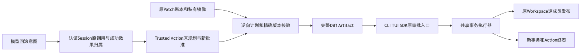
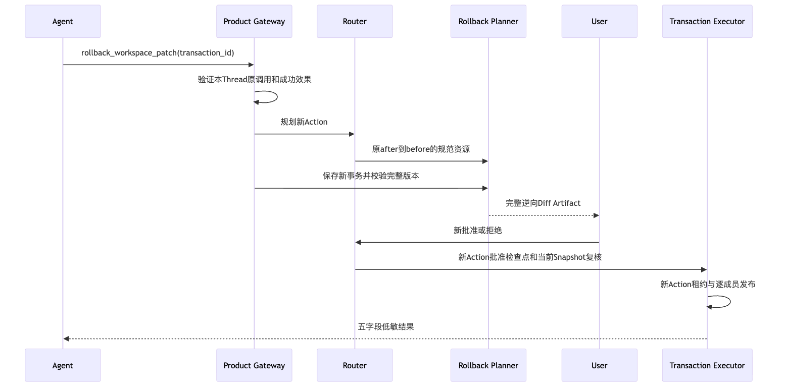
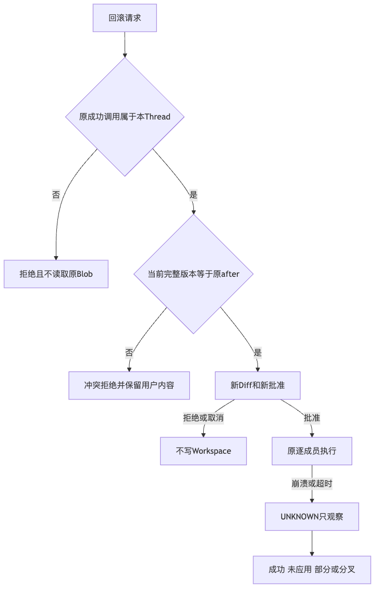

# 正式产品Patch回滚验证报告

## 1. 摘要、需求背景与结论

默认产品此前无法由模型Tool撤销自己的成功Patch，宿主Rollback组件又允许第三内容进入新计划。
本候选接入独立高风险`rollback_workspace_patch`，以本认证Thread成功Patch作为来源，
生成新的完整逆向Diff、新批准、新事务和新审计事实。当前目标必须精确等于原after，后续改动不覆盖。

**本地产品接线专项GO；新候选原生验收待取得；1.0商用发布NO-GO。**
当前内部包版本仍为`1.0.0rc1`。元数据Revision为开发父基线；
[facts.json](facts.json)记录实际受测源文件字节、新Tool Schema及候选Wheel身份，不将父基线当作新实现提交。
[verification.json](verification.json)、[Review Packet](review-packet.json)和[manifest.json](manifest.json)
分别说明断言、范围与材料原字节；原失败及未决状态保持，不覆盖历史0/20或旧CI失败。

## 2. 总体架构、流程和源码映射

模型只提交原事务UUID。产品先核对本认证Thread原ToolCall、成功ToolResult、稳定Action ID、
Router成功状态及原Patch Transaction；共享Workspace不构成其他Thread、Fork或未知UUID的读取授权。
归属成立后由纯版本Resolver冻结逆向资源，Review读取原私有Blob并校验完整当前版本，再发布新Diff。

[`总体与详细设计`](../../changes/m09-r4-product-patch-rollback.md)包含需求、接口、字段、伪代码、失败矩阵和部署边界。
[`rollback_action.py`](../../../src/harnessix/delivery/rollback_action.py)定义输入、资源与逆向Planner；
[`workspace_rollback.py`](../../../src/harnessix/product_config/workspace_rollback.py)定义归属及Review；
[`共享执行器`](../../../src/harnessix/delivery/transaction_action_executor.py)保持单租约、逐成员发布和只观察恢复。
[`产品组合`](../../../src/harnessix/product_config/action_composition.py)及
[`Doctor`](../../../src/harnessix/product_config/action_diagnostics.py)复用同一个Patch能力门和独立Rollback Binding。

## 3. 正式执行时序、状态和数据流

1. 原Patch通过正式审批完成三文件创建、替换和删除，原账本记录published。
2. 同Thread的新回滚调用只指定原UUID；生成独立Plan ID及完整逆向Diff，尚不改文件。
3. 用户通过原CLI/TUI/SDK审批入口批准新计划；原Patch批准不能继承。
4. Router执行前验证Snapshot、消费新批准，共享执行器逐成员提交并记账。
5. 五字段结果绑定新事务ID和冻结写资源数；原事务、原事件、原批准保持不变。
6. 等待时关闭产品后重开恢复同一批准，不追加模型请求；批准后完成逆向，再做原六库/Key完整备份恢复。

无新DB、Session事件或迁移；私有原before/after Blob仍由原备份布局覆盖。
文本、存在性、模式及二进制原件都按精确版本处理，不让模型重新提交原正文。
同步成员IO不是跨文件原子事务，也不能被协作取消瞬间打断。

## 4. 失败、取消、超时与硬退出恢复

跨Thread、Fork、未知来源在Blob读取前拒绝。目标第三内容、创建/删除状态及POSIX模式漂移保持原状；
Review冲突持久拒绝pending_approval Route为denied，不保存逆向计划，不形成可继续批准的孤儿。
原修改已经撤销后再次新调用，原Planner无变化拒绝在本逆向规划内转为明确版本冲突，而非UNKNOWN。

等待取消只在Turn=CANCELLING且Route仍pending_approval时证明未执行，返回无虚构效果的普通cancelled结果。
已批准或已进入Executor不适用该捷径，沿原保守UNKNOWN恢复。
两个默认产品子进程均以实际`os._exit(73)`退出，重开使用原Key、Store及文件端口：

| 故障点 | 退出时事实 | 重开结论 |
|---|---|---|
| `member_recorded:0` | 第一成员效果已持久记账 | interrupted/cursor=1；只观察；Agent继续以`uncertain_effect`拒绝 |
| `effect_applied:2` | 全部效果已应用，最后Cursor未确认 | 对账证明全部after，published/cursor=3；不重写任何文件 |

重开前后文件字节和存在性相同，两种恢复均不请求模型、不执行剩余成员。
这是进程硬退出专项，不代表断电、任意同UID恶意宿主或全文件系统原子性。

## 5. 测试验证、证据身份与历史失败

[`产品专项`](../../../tests/product_config/test_product_patch_rollback.py)使用真实Gateway、Agent、SQLite、Artifact和文件执行器；
[`默认SDK专项`](../../../tests/product_config/test_product_rollback_sdk.py)使用正式Root、Session Key、Sealed Session、
Protocol及六库备份恢复。[子进程](../../../tests/product_config/rollback_exit_worker.py)只注入原故障点，
不在生产实现增加硬退出开关。ScriptedProvider仅代替网络模型，本轮真实模型网络请求为0。

本地源码专项25项通过，包含Doctor固定同一探测时刻的完整报告比较。
最终全核心回归5645通过、111跳过；完整治理回归302通过。
较早关联回归1714通过、52跳过，前后批次不累加为覆盖数量。
原广告基线1项失败、原关联5项失败、补充2项失败及Doctor探测时间夹具失败均保持原件。
补充2项中一项是实际重复回滚UNKNOWN缺陷，另一项是测试将正式denied状态误写为rejected；
Doctor报告包含合法独立时间戳，后继固定同一探测时刻比较所有字段，没有放宽产品能力或时效校验。

三幅新图由实际Chrome/Mermaid渲染并目视复核；变化设计文档内62幅Mermaid完成正式渲染门禁。Lint、类型、可读性及Schema原件记录在facts；
可读性阈值和原Patch输入/结果合同不放宽，新增Rollback输入Schema单独版本化。
未隔离Wheel构建缺少本机hatchling，后继使用uv离线隔离构建缓存完成，无生产依赖或锁变更。
候选Wheel全部440件包文件与实际源码及源码外安装逐字一致，安装包产品专项25项通过。
测试夹具由受管工作树加载，实际harnessix包从隔离安装环境加载；不宣称完整消费者安装升级验收。
安装输入来自原锁，裁去测试无关的mypy/ruff/类型桩，保留产品依赖和pytest工具；全部输入按哈希离线安装。
原全开发输入因缓存缺少librt/mypy失败亦保留，不更改uv.lock或生产依赖。

## 6. 安全、部署、兼容与风险边界

Tool由唯一产品Wheel分发；禁用`workspace_patch_enabled`同时省略Patch与Rollback。
公开错误经原固定码表重建，不保留内部消息、路径、源码或Secret；完整Diff只走原Artifact保护。
旧Patch签名、严格输入、公共结果与配置版本保持，原宿主`build_rollback`行为不改变也不被模型广告。
回退时未知新Tool Binding必须拒绝未决恢复，不能删账本、补批准或自动续写。

Windows焦点增加两份产品测试，原NTFS/根身份测试、三分钟保护和原SDK选择器保持；
治理测试精确约束该完整集合。macOS本地通过不是原生Windows结果，更不是消费者Windows11支持证明。

Git Commit/Checkpoint正式接线、真实20 Trial质量、百炼未决费用、消费者环境、独立Beta、
必要发布输入及最终同候选R1～R6仍开放。公网Push仍按既定范围延期；本回滚切片不缩减商用目标。
