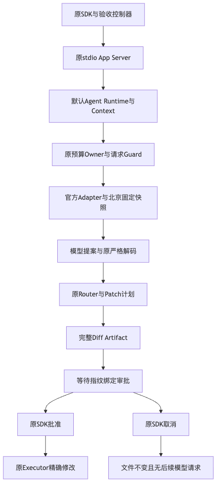

# 操作Schema整改后的默认产品真实模型合同验收

## 1. 结论与适用范围

**默认产品有限合同验收GO；完整工程质量与商用发布NO_GO。**

固定源码`c8033e08a260cfde793bf9809f6979a833fc92d5`，原产品实现为`6a686fd`。
原验收驱动逐字复用，离线审批/取消两个场景通过，越界提案负对照按计划拒绝。
[原驱动与负对照来源](facts/driver-reuse.json)引用既有冻结源码，通过Manifest输入核对；不另建重复实现。
随后一次真实模型运行的两个场景通过，合计5次请求，无自动重试、参数补写或备用模型。
原认证Store证明两次模型Patch均显式提供十进制`mode=420`、正确写前SHA和预期完整正文。

新增22,626输入Token、634输出Token，独立估算CNY 0.100648。
70元原周期已知估算累计CNY 0.250024、预留0、未决0；没有新建或重置周期。
上述结果是两个固定单文件场景，不计入20 Trial、不构成模型商用支持白名单或独立用户Beta。

## 2. 需求背景与设计依据

[原真实产品失败](../public-budget-product-provider-2026-09-29-v1/README.md)中，模型三次Patch遗漏必需mode，
未进入审批；原Schema不能完整公开操作相关条件。[正式整改设计](../../changes/m09-r3-workspace-patch-operation-schema.md)
增加create/replace/delete互斥条件及工具说明，保持原严格Validator、版本、Router、审批和文件事务不变。
[离线合同专项](../workspace-patch-operation-schema-2026-09-29-v1/README.md)证明336组合和旧批准拒绝，
不能代替模型实际上遵循合同；本验收补齐该有限线上证据。

## 3. 固定身份、边界与证据索引

| 项目 | 固定值或事实源 |
|---|---|
| 验收源码 | `c8033e08a260cfde793bf9809f6979a833fc92d5` |
| 产品代码 | `6a686fdd00162babd0dbaa8b0785186dd15c3cbc`；至验收源码仅资料变更 |
| Tool指纹 | `18481fab01037cf0ca27286dedc71c1d35c36a85993d33128d03ee45287c2ae9` |
| 原驱动SHA | `0d30f2a73783e5b2b44315e2ab96f66efe232124ca7636ee07aee3cbb41e1c1f` |
| 预注册计划 | [plan.json](facts/plan.json)，revision 3、原窗口及原停止规则 |
| 原始结果 | [离线](facts/offline-result.json)、[真实](facts/real-result.json)、[越界原FAIL](facts/scope-negative-original-fail.json) |
| 独立复核 | [verification.json](verification.json)、[六项JUnit](logs/independent-verification.xml) |
| 费用与执行环境 | [原Owner预算预检](facts/original-budget-preflight.json)、[环境观察](facts/eval-environment-observation.json) |
| 评审与完整性 | [Review Packet](review-packet.json)、[Manifest](manifest.json) |

不导出模型Key、Session Key、数据库、备份、完整会话或业务正文。保留请求计数、实际模型、Usage、状态及低敏布尔事实。

## 4. 模型、请求预算与计价边界

使用`qwen3-coder-plus-2025-09-23`、北京兼容端点及官方OpenAI Chat Adapter。
[官方模型说明](https://help.aliyun.com/zh/model-studio/qwen3-coder-plus)的精确9月23日北京快照支持Function Calling；
核验使用快照部分，不从浮动别名或其他地域推导能力。[独立核验](facts/official-price-recheck.json)与冻结计划一致。

每请求最多1024输出Token、一次尝试；每场景最多8请求；SDK预算固定为8步骤、32,000累计Token、120秒、
32,000输出字符及每步一个Tool。首个场景失败即停止，不挑选成功重跑。
价格窗口固定至`2026-09-29T01:04:10.462232+00:00`，核验不延长原窗口。

| 单次输入Token范围 | 输入/输出CNY每百万Token |
|---|---|
| ≤32,000 | 4 / 16 |
| ≤128,000 | 6 / 24 |
| ≤256,000 | 10 / 40 |
| ≤1,000,000 | 20 / 200 |

本次每次输入均低于32,000，不使用缓存计价。估算依据完整Usage和原价，不能冒充供应商实付账单。
原Guard发送前保守预留，完整Usage后结算；未知费用保留预留并阻断后续调用，不按零元处理。

## 5. 实际调用链与数据流

```mermaid
flowchart TB
    SDK[原SDK与验收控制器] --> STDIO[原stdio App Server]
    STDIO --> Runtime[默认Agent Runtime与Context]
    Runtime --> Guard[原预算Owner与请求Guard]
    Guard --> Provider[官方Adapter与北京固定快照]
    Provider --> Decode[模型提案与原严格解码]
    Decode --> Plan[原Router与Patch计划]
    Plan --> Diff[完整Diff Artifact]
    Diff --> Pending[等待指纹绑定审批]
    Pending --> Approve[原SDK批准]
    Approve --> Execute[原Executor精确修改]
    Pending --> Cancel[原SDK取消]
    Cancel --> Unchanged[文件不变且无后续模型请求]
```

控制器通过原SDK发起Turn和Replay，先验证原`read_file`返回完整SHA，再读取全部Diff。
审批前检查工作树未改变；批准使用原审批指纹，执行器不接收宿主补写mode或重构后的模型提案。
取消在等待审批时发生，原Transport关闭后再次核对文件和请求计数。
唯一线上测试装饰是Provider工厂上的原请求Guard/计数；实际Tool、Context、Policy、Store和Executor均为产品实现。

### 5.1 对应源码

| 职责 | 实现位置 |
|---|---|
| SDK与正式预算转换 | [agent_client.py](../../../src/harnessix/sdk/agent_client.py)、[service.py](../../../src/harnessix/app_server/service.py) |
| 默认装配与Context | [server.py](../../../src/harnessix/product_config/server.py)、[agent_context.py](../../../src/harnessix/product_config/agent_context.py) |
| 原Patch合同及执行边界 | [trusted_action_contracts.py](../../../src/harnessix/delivery/trusted_action_contracts.py)、[trusted_action.py](../../../src/harnessix/delivery/trusted_action.py) |
| 持久审批投影 | [trusted_action_contracts.py](../../../src/harnessix/agent/trusted_action_contracts.py) |
| 原Store与Key绑定 | [sqlite.py](../../../src/harnessix/session/sqlite.py)、[session_key.py](../../../src/harnessix/product_config/session_key.py) |
| 请求Guard与原周期 | [provider_verification_guard.py](../../../scripts/provider_verification_guard.py)、[provider_verification_budget.py](../../../scripts/provider_verification_budget.py) |

## 6. 真实场景结果与原状态复核

| 场景 | 实际请求 | 退出结果与核对 |
|---|---:|---|
| 读取→审批→精确修改 | 3 | 读取、Patch、最终回复；批准前文件不变，批准后字节SHA精确匹配，Turn完成 |
| 读取→等待审批→取消 | 2 | 读取、Patch；完整Diff可读，Turn interrupted，文件原SHA不变，关闭后无新请求 |

两次Patch均只有`calculator.py`，operation为replace、写前SHA来自原读取、正文为完整预期内容，mode显式420。
[认证元数据](verification.json)通过原状态Owner、原Key绑定与SQLiteSessionStore取得；不直接信任裸SQLite查询。
原模型调用严格解码通过，不执行反事实修正、补参数或第二次真实运行。

## 7. 负对照与失败保留

离线负对照提案同时包含正确修改和创建`unapproved.py`。
原控制器返回`unexpected_patch_file_set`，首场景FAIL并停止；原文件不变、额外文件不存在。
[负对照复核PASS](facts/scope-negative-verification.json)表示预期拒绝成功，**不把原FAIL改写成PASS**。

此负对照验证验收范围控制，不宣称产品禁止所有多文件正规审批，也不新增产品拒绝规则。
负对照控制器不能进入真实模式：其SHA不符合原计划线上驱动SHA约束。
原公开预算失败、三次遗漏mode和20 Trial历史0/20全部保留。

## 8. Usage与原预算结算

| 事实 | 原结果与独立重算 |
|---|---|
| 请求 | 3+2=5，每次一次尝试、完整响应、实际模型与计划相同 |
| 输入/输出 | 22,626 / 634 Token |
| 估算增量 | `(22626×4 + 634×16)/1000000 = 0.100648` CNY |
| 原周期已知估算 | `0.149376 → 0.250024` CNY |
| 原周期请求数量 | `8 → 13` |
| 预留/未决 | 0 / 0 |

独立复核重新取得原Owner并验证同一周期、70元Allocation及已知金额；没有重置、增加预算或清除未决请求。
两个小场景的费用增量不是完整20 Trial或历史所有验证的总费用。

## 9. 独立复核器原失败及合同修正

第一次原记录复核错误地把`list_thread_page`第二返回值视为可空游标；
[原失败](facts/verifier-pagination-original-fail.json)为`original_thread_scope_changed`。
实际[Store契约](../../../src/harnessix/session/sqlite.py)返回`bool has_more`，固定一条Thread应为False。

修正分页理解后，原复核器只计入`approval_request`，未计入实际Session的
`TrustedActionApprovalRequestContent`；[第二原失败](facts/verifier-approval-kind-original-fail.json)为`original_history_shape_mismatch`。
Protocol公开审批kind与内部持久类型不是同一字段；后继复核使用实际类型，仍要求一次原读取、一次原Patch及一次原审批。

两份失败日志、对应脚本原字节及后继六项PASS分别保留。只修正复核器对既有接口的理解，
没有修改生产代码、模型输入、原验收驱动、原结果或质量门槛；所有复核器调用新增模型请求为0。
六项复核覆盖有交叠，不求和为独立工程任务数量。
资料验证初次未显式设置Chrome路径且Manifest尚未生成，出现图渲染和清单链接失败；
[原结果](logs/documentation-original-fail.json)保留。后继补齐环境路径与清单，再执行同一完整资料检查，不降低规则。

## 10. CI与完整工程评测环境

[源码CI观察](facts/source-ci-observation.json)对应`6a686fd`：macOS、Container和文档Job成功，
Python3.12/3.13均在许可扫描失败，Windows观察时仍运行。观察不是完整CI通过，原Run不重启或丢弃。

[当前Docker观察](facts/eval-environment-observation.json)确认Engine可读，内存、CPU CFS及PIDs能力存在，
原Task Pack的固定Python和Node Digest均未缓存。已有9个运行容器；未重启Docker、改变配置、替换镜像或启停容器。
[既有固定镜像拉取EOF](../canonical-wheel-three-platform-2026-09-29-v1/README.md#7-真实评测环境只读诊断与未证明边界)
保持原诊断；当前完整20 Trial未发送模型请求，不能用这两个Host场景代替Container工程验收。

## 11. 独立复验方法与资料完整性

1. 从固定Revision重算Manifest内源码输入与本目录文件SHA，核对原驱动SHA及三个原报告身份。
2. 重算五份完整Usage的估算、前后请求数及原周期增量，保留未知金额语义。
3. 具备原私有运行状态的授权维护者，可使用[复核器](diagnostics/verify_outcomes.py)提供原运行目录、原账本和原周期，
   经原Owner/Key/Store再次读取元数据；公开包不包含数据库或Key，不能据公开元数据伪造原状态读取。
4. 对照JUnit和两份原失败，只认可实际检查范围；不把文件摘要或框架回归当作工程成功率。
5. 后续真实运行须建立新预注册计划和独立运行目录。既有计划、报告、窗口和费用均不得覆盖。

资料检查的链接与结构发现为0，实际图已渲染并视觉复核；治理276项通过，
原JUnit与检查JSON见[资料验证事实](facts/delivery-checks.json)。这些检查不计模型质量成绩。

本目录不改变实际发行物；先前Wheel身份及三平台专项保持各自固定源码，不由本次结果追认新制品。

## 12. 尚未满足的发布要求

- R3：原3仓10Case×2Trial完整真实评测，严格成功与必需检查均至少12/20，每个仓库至少一次成功。
- R1：正式高风险入口与测试映射、认证存储500 Thread增长FAIL收口。
- R4：Windows11真实使用、三平台完整编码、不同版本升级/回退和最终同候选。
- R5：3～5名独立开发者、至少15任务及P0/P1处置。
- R2/R6：必要许可处置及1.0版本、制品和门禁封板；许可保持低优先并行，不阻挡功能研发。

本次关闭有限默认产品线上合同证据缺口，不关闭R3整体或商用发布目标。
