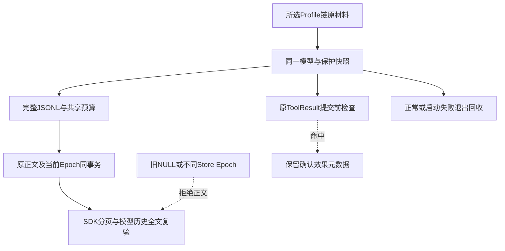

# 产品模型凭据与Artifact公开边界验收报告

## 1. 范围与结论

实现Revision：`5a9e81f87ae6117d72099455e774ffd400423886`；基线`3c5f6e36d9c9ce98709c5c37ae2316709c443001`。
[完整详细设计](../../changes/m09-4a-product-publication-boundary.md)给出源码研究、取舍、模块边界、四种图、
完整字段/接口、伪代码、取消/期限/失败/恢复、28版迁移、安全和部署；
[ADR-0096](../../adr/0096-product-credential-and-artifact-publication-boundary.md)记录决策。

新增专项 **46 passed，2.61秒**，相关 **408 passed，31.51秒**，原升级 **24 passed，2.7秒**；均与完整回归重叠，不能相加。
验证种子阶段完整回归尚未运行，不把前序4701 passed/32 skipped当作本实现验收；完整结果需版本绑定后冻结。
整体0.9.4a与整体0.9未完成，生产发布仍阻断。真实模型请求0，不新增定时任务；未跟踪安全草稿不修改、不提交、不计作TM编号证据。

## 2. 公开边界与数据流

原模型材料捕获在任何工厂前；环境旋转不改变运行快照，模型引用无Process注入target。
JSONL原字节、解码键/值与规范JSON检查共享字节、节点及工作量预算；Unicode转义与重复键不能绕过。
当前Store O(1)持有Epoch；全部正文读取路径要求同Epoch与policy并全文复验，原Hash与归属约束仍保留。
这是当前运行保护，不是密码学Seal或跨重启恢复。新Store会拒绝旧安全Artifact，对长会话和Fork有明确可用性影响。

## 3. 源码与场景证据

| 场景 | 真实链路与证据 | 限定 |
|---|---|---|
| 普通只读结果与全文Artifact | [Runtime专项](../../../tests/agent/test_publication_runtime.py)：read_file/grep实际SQLite、工具、SDK、模型历史、非空OTel；300记录安全页及预览外泄漏拒绝 | Scripted而非真实模型网络 |
| 当前Store证明 | 同专项验证旧NULL、其他Store及改动Epoch；SDK拒绝，模型历史验证在新模型请求前拒绝 | 不证明所有历史Session已治理 |
| 已确认写入 | 实际文件由执行器修改一次；Audit仍succeeded，结果拒绝后原Runtime只补效果元数据，Execute=1、额外Execute/Reconcile=0 | 执行器为合同替身，不是完整生产Patch验收 |
| 产品组合根 | [产品专项](../../../tests/product_config/test_publication_scope.py)：实际run_product_stdio装配，工厂收到原模型/后备key；正常/启动失败回收 | 工厂及驱动替换，不是字节级stdio传输或外部模型验收 |
| 集中持久化 | [INSERT专项](../../../tests/artifacts/test_publication_persistence.py)：四类purpose的保护/证明同事务，部分证明约束拒绝 | 不冒充四类业务生产者完整集成验收 |
| 旧27版升级 | [独立程序专项](../../../tests/artifacts/test_publication_upgrade.py)：实际旧归档模块路径与27版数据库、28版提交前后退出、原Snapshot/事件/Artifact 12列原字节保持 | 不重签旧正文；无保护兼容读取仅用于旧宿主合同 |

[纯端口](../../../src/harnessix/agent/publication.py)、[材料与扫描](../../../src/harnessix/secrets/publication.py)、
[产品装配](../../../src/harnessix/product_config/server.py)、[同事务写入](../../../src/harnessix/artifacts/persistence.py)、
[证明核验](../../../src/harnessix/artifacts/publication.py)及[批量历史检查](../../../src/harnessix/artifacts/batch_verify.py)构成实际调用链。
原Tool指纹、公开ArtifactRef与协议合同无变更；没有新增包依赖边/环，不提高可读性政策阈值。

## 4. 前序负例与失败记录

前序观察的实现e730f4858c76dbbb614a81b1b3e12184c433266c由[冻结报告](../secret-publication-2026-09-27-v1/README.md)保留。
原模型工厂收到primary-api-key/v1；grep300记录的两条预览无值，SDK offset=149、limit=1非空页含值，
第二Turn Session、下一Scripted历史和回放含值。OTel非空且无值；四次Scripted请求、真实模型0、非完整产品启动。
本次拒绝范围有实际运行专项，不以仅增加新参数导致旧版TypeError作为安全负例。

实现过程中曾出现错误的read_file分页参数、ToolCall选择、迁移版本/Checksum期望及扫描预算常量引用；
这些测试夹具/改造错误不作为安全负例或生产缺陷证据。当前专项与相关回归全部通过，原失败不追认通过。

## 5. 完整回归、静态门禁与发行物

完整回归：验证种子阶段尚未运行，待稳定测试树冻结。
Ruff、格式、Mypy339源文件、合同、可读性、SBOM、Secret自检与Task Pack通过；文档与图需冻结前复核。
干净实现Git Archive构建Wheel/sdist，发行物名称、大小、SHA256与安全草稿缺失事实写入contract-facts；
发行物Secret扫描通过。构建来自同一源码不等于位级可复现，未声明reproducible build。
许可证门禁仍为**12件Archive违规**；不得声称make check或完整CI矩阵通过。

## 6. Manifest、Review Packet与CI

- [bundle-manifest.json](bundle-manifest.json)：固定实现Revision的41项源码输入Hash，五份证据文件Hash/大小；Manifest自身不递归Hash。
- [contract-facts.json](contract-facts.json)：46项分布、原负例、预算、迁移、发行物及开放边界。
- [verification.json](verification.json)：实际输出摘要/Hash与耗时，静态/全回归/图、许可证及模型请求事实。
- [review-packet.json](review-packet.json)：`release_blocked`与审阅重点，整体0.9未完成。
- [ci-observation.json](ci-observation.json)：仅一次前序3c5f6e3后台观察为in_progress；不是本实现验收。

本实现冻结时未推送，CI尚未触发。所有局部提交统一推送后后台验证，不逐提交等待或重复触发；前序CI成功也不能追认新代码通过。

## 7. 发布风险、限制与后续验证

1. 当前运行Epoch明确拒绝旧或不同Store正文，安全恢复设计未完成；不能以默认拒绝冒充“可恢复”总体目标已经达成。
2. 历史Session、用户输入、模型直接输出、Context/Compaction与全部扩展出口尚未形成统一保护合同。
3. Owner/Store内部资源与归属、TM编号攻击与平台证据、远端MCP身份/OAuth/出口仍开放。
4. 12件许可Archive、三平台真实安装/升级/卸载/Beta和真实Provider发布/成本验证仍阻断。
5. Epoch不是签名、租户ACL或数据库管理员防篡改证明；无不可变内存清零、硬抢占、历史数据库擦除或任意编码/分片推断保证。

下一步应先研究历史公开与旧材料证明，明确可恢复持久合同后实现跨重启恢复与失败测试；不得简单取消Epoch校验或改写旧正文/Hash。
