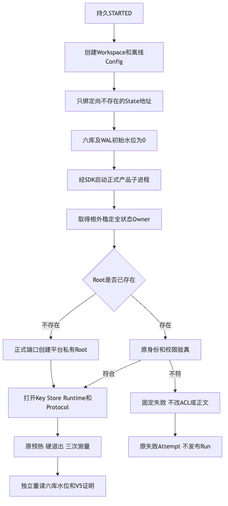
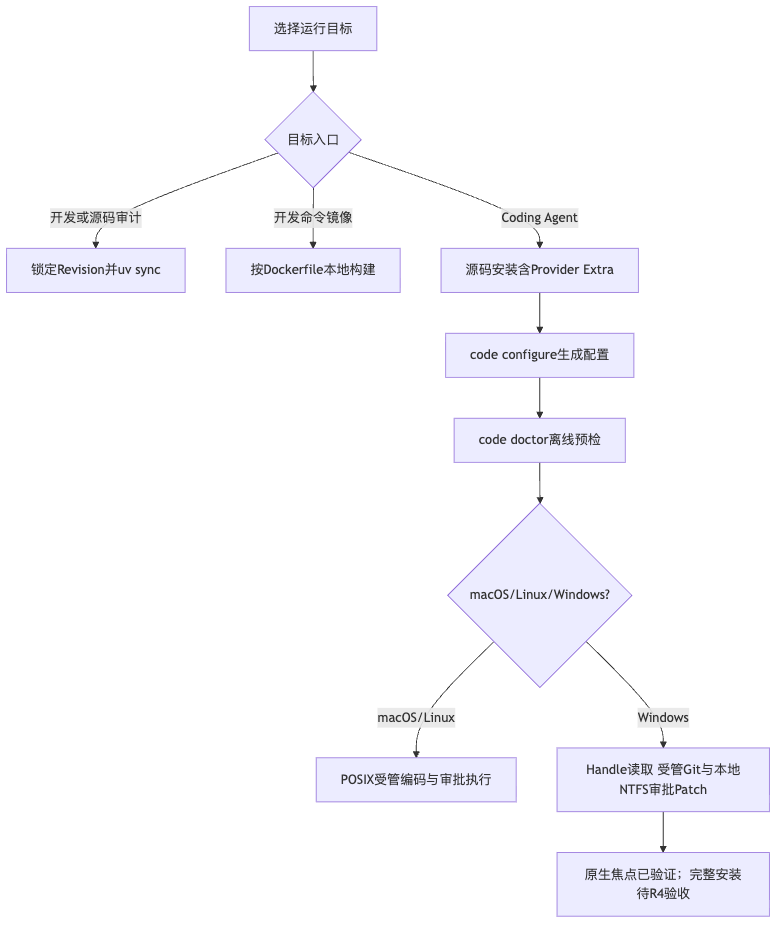

# 产品重启、发行制品边界与源码外完整恢复验证报告

## 1. 摘要、需求背景与交付边界

固定候选为`1bc3794bfbdb9ce5fa58103d372c68de4401f90a`，产品包版本仍为`0.1.0`。
验证覆盖R1/R4的Windows完整产品重启创建边界、源码制品嵌套构建输出的拒绝、实际Hatch构建与完整Secret扫描，
以及macOS ARM64/Python3.12.7全新安装环境的正式Server、根外Owner、全状态备份恢复和稳定终态。

核心实现修复不是降低拒绝条件：Runner不预建State Root，正式产品仍拒绝普通mkdir的既有Windows ACL；
源码制品不递归携带已构建的验证制品，Git原件及其Secret扫描覆盖保持。
完整源码设计、接口、数据、失败语义、伪代码及测试映射见
[重启详设第13节](../../changes/m09-3d-product-restart-soak.md#13-现行私有root创建边界与原生重启回归)和
[安装制品边界](../../operations/installation.md#52-源码制品与验证制品边界)。

较小场景通过不关闭R1～R6或1.0。真实编码质量、目标三平台安装/升级/卸载和独立开发者Beta必须分别验收。
[verification.json](verification.json)记录固定范围，[Review Packet](review-packet.json)给出逐项Go/No-Go，
[manifest.json](manifest.json)覆盖本目录除自身外的原字节。

## 2. Windows重启根因、架构与真实正反例

原`9186cb2`的Windows完整Benchmark在两项Runner用例的启动阶段失败；
[先前统一交付](../windows-private-state-2026-09-28-v1/README.md)保持冻结。
Runner启动前普通`mkdir(0700)`预建Root，而当前正式Root要求用户/SYSTEM私有可继承ACL，
且既有不符目录不能自动改权。旧Runner与[真实子进程测试](../../../tests/benchmarks/test_soak_restart_child.py)
对首次创建的处理不同。



Runner仅绑定尚不存在的State地址；正式组合根取得原根外Owner后创建或验真Root，之后才打开Key、Store与Protocol。
初始六库DB/WAL水位逐项为0，全部周期结束仍严格要求六库完整。原五周期、新Transport、Thread集合、
Owner代际、ACK→EOF硬退出和三次测量均保留；不新增重试、不提高30秒回归期限、不改变V5 Proof或冻结Profile。

`d470ca6`原生两文件焦点**10通过，23.25秒**，见[原件](logs/d470ca6-native-job.log)：

- 实际Windows普通mkdir负对照得到`server_closed`及私有`KernelError:product_state_invalid`；
  ACL逐字不变、Sentinel字节不变、未生成Key/Store或正常RSS结果。
- 原Runner五周期正例完成首次创建、创建Thread、硬退出及三次新进程恢复；首个Client前Root不存在，随后均为同一地址。
- 原握手后Thread失败注入到达预期阶段，错误配置、非法负载及公开CLI脱敏仍通过。

本地原实现新增创建边界观察先得到[1项FAIL](logs/root-precreation-red.log)，修复后焦点为
[17通过、1原生跳过](logs/restart-focused-python313.log)。
原生负对照与修复后原场景共同证明创建边界归因；POSIX跳过不计为Windows通过。

## 3. 后继制品扫描失败、选型与失败语义

`d470ca6`焦点通过后，四个常规Job在完整Secret扫描被`scan_archive_depth_limit`阻断，
见[macOS完整原件](logs/d470ca6-macos-job.log)。验证Wheel被源码制品再次包含，形成
`gzip → tar → 验证Wheel → 包内Task Pack tar`，超出现行深度合同；扫描器未完成覆盖时正确失败关闭。

修复[`pyproject.toml`](../../../pyproject.toml)的sdist边界，排除`docs/validation/**/artifacts`内的既有构建输出。
源码、正式文档、验证README/Manifest等可读资料及原Task Pack解答排除保持；实际验证Wheel仍在Git原件中。
不提高[`ScanLimits`](../../../scripts/secret_scan_contracts.py)、不忽略嵌套成员、不改规则或许可白名单。

[实际Hatch回归](../../../tests/governance/test_distribution_artifact_boundary.py)在独立临时项目中构建源码制品：
源码、安装文档与验证README存在，而构建制品目录不存在；同一Git原件仍被仓库扫描发现，
且原Wheel内合成Bearer规则命中被完整捕获。
[旧配置FAIL](logs/sdist-boundary-red.log)、[存储ZIP原字节及成员重复命中观察](logs/sdist-duplicate-observation-fail.log)
和[95项修复后回归](logs/sdist-boundary-green.log)分别保留，不混作一轮通过数。

## 4. 固定候选、实际产物与输入一致性

| 产物 | 字节数 | SHA256 | 边界 |
|---|---:|---|---|
| Wheel | 1,073,485 | `5a6e144487dd79679f609b709743db176ee28bdca077084ac8901efdc9f2fe30` | 437成员；所有包内源码与固定候选逐字一致；不含测试 |
| 开发sdist | 9,075,391 | `3f41c5148c2111f7f6c4430ee897438baea03100874d9c65cffccd16560d705f` | 2758成员；保留验证README；不含验证构建输出或用户未跟踪目录 |

详细事实见[产物观察](facts/build-input-observations.json)及[源码制品成员清单](facts/sdist-members.json)。
这三个提交只修改Runner、测试、构建边界、资料和输入指纹，`src`与`9186cb2`没有差异。
新Wheel与[已保留原件](../windows-private-state-2026-09-28-v1/artifacts/harnessix-0.1.0-py3-none-any.whl)
逐字相同，复用该原件而不重复归档；sdist实际原件在执行环境保留，其成员清单/摘要与扫描日志在本目录。
源码制品不作为新增首发渠道，尚无1.0 Tag、正式PyPI包或发行发布。

实际源码/Wheel加固定Git输入的[Secret扫描](logs/1bc3794-source-and-wheel-secret-scan.log)
**2798个输入完整覆盖，固定规则零命中**。这是固定范围扫描事实，不是全部风险或商业权利证明。
`uv.lock`摘要保持`9a64451b9b7d3140fd5baddc84e42f171feed3b66e93c8f92609596634d45083`。
SBOM与许可报告只更新项目输入指纹；原Archive集合、判定与12件拒绝完全不变，R2仍开放。

## 5. 本地受影响回归与源码映射

| 固定范围 | 环境 | 实际结果 |
|---|---|---:|
| `d470ca6` Benchmark及Product Config | 独立Python3.12.7，加载固定主源码 | 590通过、30跳过，80.96秒 |
| 相同范围 | Python3.13.8 | 590通过、30跳过，78.00秒 |
| 制品边界、Secret及仓库政策 | Python3.13.8 | 95通过，0.80秒 |
| SBOM、Archive证据与制品边界 | Python3.13.8 | 65通过，9.76秒 |

不同源码、环境及重叠范围不求和。Mypy391文件、冻结规格、文档及可读性政策检查通过；
原可读性策略、安全边界、公共Schema、模型权限和Provider装配均未放宽。
实际原生完整CI与500 Thread候选结果由后续固定状态及Run/Attempt/Report独立记录，不从焦点外推。

重点源码：[Runner](../../../scripts/soak_restart.py)、[真实子进程包装器](../../../scripts/soak_restart_child.py)、
[全状态Owner](../../../src/harnessix/product_config/state_owner.py)、[产品组合根](../../../src/harnessix/product_config/server.py)、
[Windows私有创建](../../../src/harnessix/workspace/windows_private_directory.py)、
[构建边界](../../../pyproject.toml)和[有界扫描器](../../../scripts/secret_scan.py)。

## 6. 脱离源码安装与完整状态恢复



macOS ARM64/Python3.12.7在全新虚拟环境中，以锁导出的生产依赖/所有Extras及精确Wheel哈希，
使用`--require-hashes --no-deps --offline`安装，不安装开发依赖。工作目录位于源码之外，
父进程及正式`python -I -m harnessix agent-server`子进程均不借用源码路径。
[导入位置](installation/import-observation.json)、[锁定依赖](installation/requirements.txt)、
[Wheel输入](installation/wheel-requirement.txt)、安装日志与[现场结果](installation/installed-state-observation.json)保存原件。

[可复验执行脚本](installation/installed_state_acceptance.py)通过实际安装SDK及CLI完成：

1. Configure与离线Doctor，确认正式产品预检ready。
2. 实际stdio握手、创建首个Thread；宿主活跃期间备份得到`product_state_busy`，未生成备份目录。
3. 正常关闭后，备份/验真完整七件文件（六库及独立Key），不复制用户Workspace。
4. 新产品进程创建第二个Thread后停止；显式确认原备份ID执行整体状态恢复，并保留Previous Root。
5. 新进程证明原Thread恢复、快照后Thread消失、原Key保持；再创建新的后继Thread。
6. 使用相同restore ID重复请求，得到原终态且不回退新状态；最后新进程证明后继Thread仍在。
7. 所有Transport关闭收敛，Workspace Sentinel保持原字节。

新验收目录首次使用0755导致`product_config_permissions`，随后只对新建自有验收目录显式设0700，
正式产品验权未改变；此夹具设定见[配置事实](facts/installation-setup.json)。执行只用合成环境引用与`.invalid`端点，
没有发送Turn或读取真实Provider凭据。Session Key及DB仅在私有验收目录，未进入交付件。

这不是完整编码任务、版本升级/卸载、Linux/Windows源码外安装或独立用户Beta的证明。

## 7. 三平台500 Thread正式复验及认证存储诊断

固定候选的[三平台正式复验](https://github.com/carrie1988/Harnessix/actions/runs/36453376381)
均完成原五周期、500 Thread集合恢复和ACK→EOF硬退出，Run及Attempt都已提交。
三份独立阈值报告却均为**FAIL / limit_exceeded**，唯一越限项是`db_growth`；启动时延、RSS、
WAL、Artifact及故障计数没有越过原Profile限制。实际原件见[Run/Attempt](soak/raw)和[Report](soak/reports)，
逐库对比见[结构化事实](facts/restart-three-platform-deltas.json)。这不是三平台性能PASS。

| 平台 | 旧基线六库总字节 | 候选六库总字节 | `sessions.db`增量 | 正式判定 |
|---|---:|---:|---:|---|
| Linux | 1,277,952 | 2,015,232 | 737,280 | FAIL：数据库增长 |
| macOS | 1,380,352 | 2,121,728 | 741,376 | FAIL：数据库增长 |
| Windows | 1,376,256 | 2,113,536 | 737,280 | FAIL：数据库增长 |

其余五库与各自旧基线逐库相同。旧基线冻结于启用持久认证之前，当前候选新增
[`0029_authenticated_session_history.sql`](../../../src/harnessix/session/migrations/0029_authenticated_session_history.sql)
定义的事件证明、投影证明及Store身份表。不能用历史未认证状态的PASS代替当前认证状态验收。

独立[只读诊断](diagnostics/session-storage-observations.json)在干净固定Checkout中执行原500 Thread场景，
只在原终态水位观察点附加内存观察器，使用SQLite只读连接统计表行数、页与对象占用。
[诊断脚本](diagnostics/session_storage_probe.py)和[实际日志](logs/session-storage-diagnostic.log)保存，
但该带观察器Run仅为诊断，不作为无观察器发布成绩：

- 500 Thread、500 Event、500 Protocol Request，各500份事件与投影证明，1份Store身份；未出现证明行重复增长。
- 页大小4096字节、457页、空闲页0；两类认证证明、其索引及Store身份合计708,608字节。
- 认证对象是增长的主要来源，不能把剩余页/Schema差异全部归因于认证，也不能据此证明长期没有泄漏。
- 只统计对象/页与计数，不导出业务正文、MAC正文或Key，不写库、不执行VACUUM、不改变运行源码。

处置仍需在“认证状态版本化基线”与“保持旧空间上限的正式存储优化”之间作明确架构选择。
本次不改旧Profile、不豁免FAIL、不删除认证、不提高启动时延或RSS阈值。采用新基线也必须保留旧原件、
标明认证负载身份、先冻结Profile，再以第二独立Run验收；不能从已失败候选反向制造PASS。

## 8. 固定候选常规CI与未终结原生Job

[常规CI 36451709342](https://github.com/carrie1988/Harnessix/actions/runs/36451709342)
绑定同一`1bc3794`。截至2026-09-29 01:09:34（UTC+8）的权威观察如下，
并不宣称随后状态不再变化：

| 环境/Job | 已取得的结果 | 候选发布判定 |
|---|---|---|
| Linux Python3.12 | 完整功能5659通过、112跳过及离线示例完成；最后许可扫描拒绝12件Archive | Job FAIL，许可保持阻断 |
| Linux Python3.13 | 完整功能5659通过、112跳过及离线示例完成；最后同一许可扫描拒绝 | Job FAIL，许可保持阻断 |
| macOS | Secret/制品扫描、Benchmark和功能3759通过、87跳过及示例完成 | Job SUCCESS，不外推其他平台 |
| Documentation / Container | 对应Job完成 | SUCCESS，不代表真实编码质量 |
| Windows | 早期原生焦点、完整Secret扫描、认证Session及完整Benchmark步骤成功；后继完整回归仍在执行 | `in_progress`，终态未证明 |

原始日志见[Linux3.12](logs/1bc3794-python312-job.log)、[Linux3.13](logs/1bc3794-python313-job.log)
和[macOS](logs/1bc3794-macos-job.log)。[Windows Job快照](facts/1bc3794-windows-job-observation.json)
保留具体句柄`109027821031`、已完成步骤与活跃步骤；这是观察事实而非成功或终止证明。
观察超时和步骤运行较久都不能当作终态，不取消、重启或缩减原回归来替代该结果。
当前整体候选没有全门禁PASS；许可治理低优先并行，不阻挡功能研发及内部安装验证。

## 9. 复验方法、持久化与原件校验

先在独立干净Checkout记录固定Revision和锁摘要，再执行受影响回归、原生CI及离线构建。
源码外安装需创建私有环境根，按本机实际位置重新生成精确Wheel的`file:///... --hash=sha256:...`输入，
不能直接复用观察时的临时路径。安装运行环境须包含对应Provider及TUI Extra，不含开发依赖。

```bash
chmod 700 /absolute/private/acceptance-root
uv pip install --python /absolute/private/acceptance-root/venv/bin/python \
  --require-hashes --no-deps --offline -r /absolute/requirements.txt
/absolute/private/acceptance-root/venv/bin/python -I installed_state_acceptance.py \
  --environment-root /absolute/private/acceptance-root
```

该执行脚本当前明确为已验证的macOS/POSIX环境，不冒充Windows安装脚本。需先生成配置、创建源码外工作目录，
并保持Workspace/State/Backup相互分离；正式操作不能使用用户真实状态作为可丢弃夹具。
Run/Attempt/阈值Report沿用原独立Reader；交付Manifest检查完整集合、SHA及大小，不修改已冻结历史原件。

## 10. 剩余发布条件与Go/No-Go

商用判定仍为**NO-GO**：R1全正式装配安全收口、R3完整真实编码评测、R4三平台消费者安装/升级/卸载、
R5独立开发者Beta、R2必要权利及R6固定发布都须满足各自退出条件。
历史真实任务0/20不代表本候选已经再次取得0/20，但没有新合格结果可以替代该历史基线。

当前固定评测镜像仍未缓存；宿主Registry访问得到预期401，客户端固定Manifest观察失败，
见[环境预检](facts/docker-preflight.json)和[有界观察](facts/fixed-manifest-probe.json)。
这不能证明EOF的排他根因；未改变镜像Digest、Docker全局代理、预算周期或费用账本。
所有本报告验证均未发送真实模型请求，未产生百炼API验证费用。
