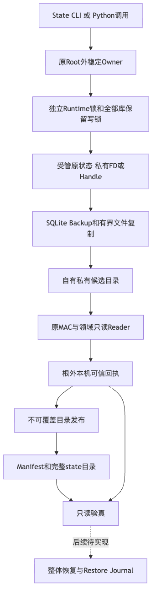
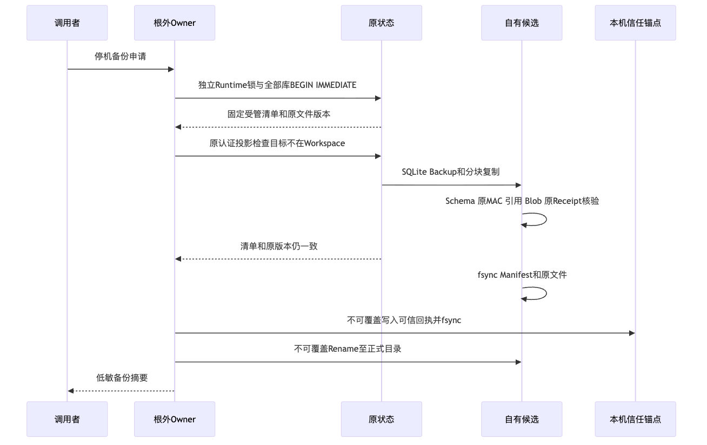
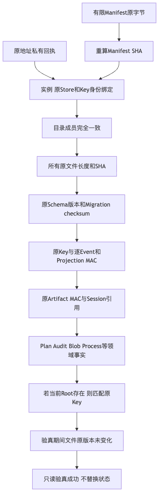

# 完整产品停机备份与原来源验真验证报告

## 1. 摘要、固定实现与验收范围

固定源码为`7519a8e69887ad32532bd45845597fd861445193`。备份包含六个固定SQLite数据库、
可选Process Lease及原回执/输出、原独立Key和事务CAS Blob，不以单库副本代替完整产品状态。
正式入口为`harnessix state backup`与`harnessix state verify`；既有Agent产品边界不变。

完整背景、目标、系统架构、流程/时序/数据流、类与接口、字段、核心伪代码、错误、持久化、
安全及部署说明见[总体与详细设计](../../changes/m09-r1-product-state-backup.md)。

**本报告验证POSIX完整产品备份与只读验真，不验证整体状态恢复、Windows完整产品或1.0商用发布。
R1/R4仍开放，R2/R3/R5/R6没有因本报告改变判定。**

## 2. 真实产品事实及授权边界

专项Fixture通过默认stdio产品、Agent Client、Runtime和真实SQLite产生六库及原认证Event/Projection/Artifact，
真实Workspace Transaction生成before/after CAS Blob。可选场景启动实际POSIX受监督子进程，
验证原Process Lease、Owner回执HMAC及stdout/stderr摘要，不采用单库或伪造文件布局替身。

使用Scripted Provider只验证执行与持久化合同，不是线上Provider认证或真实编码质量成绩。
备份不含Workspace源码，不能代替用户项目的Git或代码备份。

捕获在原Root外稳定Owner、独立Runtime锁及全部库保留写锁下执行。SQLite Backup读取实际已提交WAL，
制品不携带OS锁、WAL或SHM。候选以原Key核验Schema、逐Event MAC、连续Prefix、Projection、
Artifact原正文及跨Store引用，不迁移、不补签、不清理UNKNOWN、不装配Executor。

Manifest SHA只证明复制一致性。原Root外私有本机回执固定原Manifest、Store/Key身份和实例ID，
验真必须读取该独立回执；备份自带Key不能自行授予来源授权。

## 3. 已复现缺陷、根因与闭环

### 3.1 原业务文件复制后漂移

初期候选仅比较前后文件路径集合，Blob内容在复制后发生变化仍能通过。
[`blob-drift-red.txt`](logs/blob-drift-red.txt)保留实际`DID NOT RAISE`失败。
实现增加原文件对象身份、模式、大小、链接数、mtime/ctime前后复核，变更不得发布。
该RED来自未提交的前置候选，不冒充旧固定Revision的验证结果。

### 3.2 合法SQLite生命周期文件消失

最后一个只读连接关闭时，SQLite可以合法删除SHM。
[`sqlite-sidecar-red.txt`](logs/sqlite-sidecar-red.txt)保留实际`sessions.db-shm`的FileNotFoundError。
实现仅在明确受管生命周期路径枚举时容忍ENOENT，其他身份、链接、权限和业务文件变更仍拒绝。
只读连接不使用`immutable=1`，不得为了文件清单稳定而隐藏WAL中的真实提交。

### 3.3 目录发布成功但确认丢失

平台目录Rename已经提交后，fsync或返回确认仍可能失败。初期清理先删除回执，再访问已不存在的候选地址，
会让完整正式备份失去原信任来源。
[`publication-confirmation-red.txt`](logs/publication-confirmation-red.txt)通过真实原生Rename后注入返回异常复现验真失败。

当前清理必须确认原候选目录仍在原地址且身份一致。候选地址消失或被替换时保留回执，
不覆盖已有目标、不推断未提交，使用完整只读验真判定实际结果。
故障注入不是掉电测试；进程内验真成功不承诺硬件存储耐久性。

## 4. 固定版本验证结果

精确数量、耗时和原命令结果见[`verification.json`](verification.json)及其日志索引。
本机Python 3.13与独立检出Python 3.12均运行相同固定源码；两组专项和受影响回归分别记录。

| 实际环境 | 专项结果 | 受影响回归结果 |
|---|---|---|
| macOS ARM64 Python 3.13.8 | 35通过、4跳过；9.12秒 | 1645通过、22跳过；112.47秒 |
| 独立检出、macOS ARM64 Python 3.12.7 | 35通过、4跳过；9.04秒 | 1645通过、22跳过；113.40秒 |

| 验证集合 | 范围及判定 |
|---|---|
| 完整备份专项 | 六库/Key/Blob、原MAC、错Schema/Key、根外回执、WAL、漂移、取消、超时、CLI和发布故障 |
| 受影响回归 | product_config、session、trusted_actions、processes、delivery、execution、artifacts、app_server八个受管目录 |
| Windows四项端口 | 原生私有Handle大文件、不可覆盖目录发布、Hardlink、Junction；非Windows明确skip |
| 类型、结构及合同 | Mypy、精确Ruff选集、现行可读性阈值、Schema和Task Pack冻结检查 |
| 文档治理 | 静态文档/链接检查、变化范围门禁及文档/仓库治理测试 |
| 图示 | 架构、备份时序、验真数据流三幅真实渲染并视觉检查 |
| 制品 | 仅Wheel；14个变更生产文件与固定源码逐字节匹配，未包含测试 |
| Secret扫描 | 原六规则自检及受管输入/实际Wheel联合扫描；失败、最终输入数和结果分别保留 |

测试组有重叠，不相加为全仓数量。独立检出仍是macOS ARM64环境，不外推Linux实际宿主或Windows验收。
没有运行不受管测试发现、全目录归档或sdist。源码候选与0.1.0验证Wheel不是商业1.0制品。

### 4.1 结构治理的明确变更

复用原领域Reader需要五条新增向下依赖：delivery、execution、processes、product_config、trusted_actions
分别依赖`sqlite_readonly`。该基础端口仅依赖标准库，不产生指向领域层的反向依赖。
现行长度、复杂度、热点、依赖环和公共API阈值没有放宽；批准依赖边与实际统计更新分开记录。

### 4.2 扫描路径失败及修正

首次实际扫描通过系统`/tmp`符号链接寻址，固定策略返回`scan_input_unsupported`，不视为零命中。
改用相同目录的规范真实地址后完整扫描；未修改规则、白名单或不跟随链接策略。
规则自检只证明六条规则自检通过，不冒充仓库或Wheel已完成扫描。

完整本机原日志不公开。发布日志移除个人临时路径、检出地址和行尾空白，保留源码相对位置、
错误类别、失败断言及计数；不包含认证Key或用户业务正文。

## 5. 架构、时序和数据流



所有正式备份先在自有私有候选中核验原来源，再耐久写入根外回执并执行不可覆盖目录发布。
Root Owner是合作宿主互斥，不替代MAC、SQLite写锁或恢复授权。



原业务静默窗口跨全部数据库，读写连接分离。发布的短提交段不消费中途取消，
父任务仍等待唯一原线程结算，因此取消响应不保证正式备份不存在；必须读取实际制品与回执。



验真从原Manifest字节及独立回执出发，核对文件集合、摘要、Schema、原认证历史和领域引用。
当前Root存在时还须匹配原Key；Root缺失时不创建新Root或新Key，仍依赖原地址根外回执。

## 6. 资料Manifest、评审与复验

| 资料 | 内容 |
|---|---|
| [`contract-facts.json`](contract-facts.json) | 六库/原Key/闭合路径、授权、取消、平台和未关闭边界 |
| [`verification.json`](verification.json) | 固定Revision、精确命令结果、环境、集合重叠及保留失败 |
| [`wheel-observation.json`](wheel-observation.json) | 实际验证Wheel摘要及14个生产文件字节证明 |
| [`review-packet.md`](review-packet.md) | 阅读顺序、关键不变量、评审问题及发布风险 |
| [`bundle-manifest.json`](bundle-manifest.json) | 除Manifest自身外的完整文件集合、大小及SHA-256 |

本资料Manifest不授权产品恢复，不与产品备份Manifest混用。三幅图的原MMD与实际PNG一并保留。

```bash
uv run pytest tests/product_config/test_product_state_backup.py \
  tests/product_config/test_product_backup_files_windows.py -o addopts='' -q
uv run pytest tests/product_config tests/session tests/trusted_actions tests/processes \
  tests/delivery tests/execution tests/artifacts tests/app_server -o addopts='' -q
uv run mypy src/harnessix
uv run python scripts/readability_report.py --check --check-final-report --quiet
uv run python scripts/generate_specs.py --check
uv run python scripts/generate_engineering_task_pack.py --check
uv run python scripts/documentation_check.py
```

## 7. 未完成发布要求与风险

- 整体Root替换、耐久Restore Journal、恢复中断处理及默认启动防误初始化尚未实现。
- Windows默认完整产品的私有Root/数据装配、原生编码、安装、升级和完整恢复仍需R4验收。
- 强制终止可能留下候选或孤立回执；它们不是恢复完成证据，不自动修复或重新授权。
- 原信任锚点丢失时，即便制品完整也拒绝来源授权；不支持跨机/换用户Key迁移。
- 许可处置、真实工程质量、三平台发行、小批Beta及1.0封板各自保持原门禁。
- 新增真实模型请求与费用均为0，未读取或重置验证预算周期。
