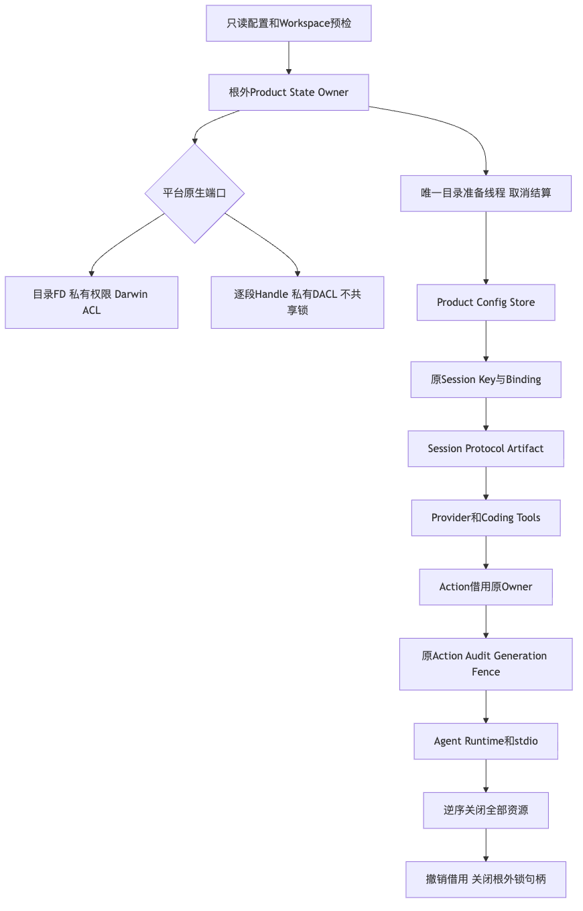

# R1 产品全状态Owner与静默窗口验证报告

## 1. 摘要、固定版本与完整边界

默认产品已将互斥提前至状态Root创建和全部Store/Provider构造之前，Action子生命周期借用同一Owner。
根外稳定锁不随Root改名而更换；父取消及重复取消先结算唯一原目录写入者，再释放OS锁。
POSIX/Darwin私有FS及Windows原生Handle/DACL端口复用现有Key机制，不建立第二套根内锁。

完整需求、目标、总体架构、流程/时序/数据流、字段/接口、伪代码、持久化、安全、失败恢复及源码阅读路径
见[总体与详细设计](../../changes/m09-r1-product-state-ownership.md)。源码固定为`1df5ace`，
独立Python3.12.7工作树也实际检出该完整Revision，不把旧版本结果写成新版本验收。

**本报告只验收全状态Owner前置控制，不验收完整产品备份恢复或1.0商用发布。R1～R6均未关闭。**

## 2. 根因与实际正反例

原`09d2256`入口中，Action锁在配置Store写入、Session Key加载和Session初始化之后才取得。
[`source-order-red.txt`](logs/source-order-red.txt)保留真实默认入口的失败：原锁已被持有，
第二宿主仍尝试构造`SQLiteProductRuntimeConfigStore`。测试不是缺少新API的导入失败。

新实现中的第二默认宿主在任何状态Store构造之前返回`product_state_busy`，且没有创建State Root、
Session数据库或认证Key目录。独立Action入口继续使用原`action_runtime_busy`竞争错误。
借用Owner不重入OS锁、不关闭外层Owner；原Action业务抛出的错误也不被误分类为锁取得失败。

## 3. 验证执行结果与环境

| 验证 | 实际环境 | 结果 |
|---|---|---|
| 原默认启动顺序红测试 | 原`09d2256`、macOS ARM64 | 1失败；证明配置Store先于锁拒绝 |
| 最终Owner/产品专项 | macOS ARM64 Python3.13.8 | 53通过、7跳过，3.33秒 |
| 受影响模块及实际Profile入口 | macOS ARM64 Python3.13.8 | 1578通过、33跳过，161.77秒 |
| 独立最终专项 | 干净检出`1df5ace`、Python3.12.7 | 53通过、7跳过，4.12秒 |
| 独立受影响回归 | 同一干净工作树Python3.12.7 | 1578通过、33跳过，168.12秒 |
| 文档及仓库治理 | 本机受管选集 | 26通过，1.40秒；最终文档再静态复核 |
| 静态类型与合同 | 固定实现 | 367源码文件Mypy、Ruff、Schema/Task Pack及原可读性策略通过 |
| 图示 | 架构、启动时序和数据流 | 三幅真实渲染并逐幅视觉检查 |

测试组互有重叠，不能相加为全仓数量。没有运行裸pytest或未受管输入发现；该报告不是全仓、
Linux实际宿主或Windows原生运行验收。Windows七项专项在非Windows明确skip，不当作PASS。

### 3.1 文件系统、进程及取消事实

- 实际OS锁排除同进程、独立子进程及大小写/Unicode地址别名；不同正常Root地址可独立运行。
- Root在锁内改名后，独立子进程仍被拒绝且不能重建Root；锁原inode在正常退出、重开时保持不变。
- 实际子进程被终止后OS释放锁，另一Owner可以正常取得原锁，不删除锚点或锁文件。
- POSIX宽权限、父目录可写、符号链接、硬链接及原对象漂移均拒绝且不静默修复。
- Darwin扩展ACL由实际`chmod +a`构造后拒绝，不能只凭Mode700/600宣称私有。
- 原目录线程使用明确进入/释放事件同步。重复取消期间第二Owner仍被拒绝；原线程终结后才释放。
- 原产品EOF、托管Session重启及Action恢复回归通过，排除新增非重入锁使正常产品永久busy的风险。

Windows DACL、Junction、硬链接和缺失父链创建用例见
[原生测试](../../../tests/product_config/test_product_state_owner_windows.py)。其源码存在不是原生执行证据。

## 4. 原失败、输入与制品扫描

原启动顺序RED保留。初次受影响命令含不存在的测试目录，pytest退出4且未执行测试，
保存在[`affected-python313.txt`](logs/affected-python313.txt)；最终命令使用已核实目录和实际集成文件，
不能把第一次无测试当作成功。最早`first-green.txt`来自中间工作树，不并入固定版本最终成绩。

初次可读性检查发现Action组合函数超过原长度阈值及统计报告漂移。
精简原初始化注释后函数回到原阈值内，只更新实际统计；未放宽可读性策略、依赖环或公开API快照。
源日志摘录保留于[`readability-first.txt`](logs/readability-first.txt)。

构建0.1.0验证Wheel，六个相关生产文件均与固定源码逐字节一致，测试文件未进入Wheel，
见[`wheel-observation.json`](wheel-observation.json)。只构建Wheel，不打包未受管输入或源目录整体归档。
固定六规则自检及源码/Wheel联合Secret扫描通过；第一次固定输入为2543件，最终资料加入后另记当次输入数。
扫描规则与白名单没有修改。本报告不关闭许可门禁、商业授权或三平台实际安装。

发布日志去除个人临时目录、检出地址及行尾空白；源失败正文、错误类型、源码相对位置和通过数保持。
完整原日志仅保存在本机私有验证目录，不属于公开产品状态或自动上传诊断。
默认Puppeteer缓存缺少Chrome时使用已安装系统Chrome渲染，未下载浏览器或复用用户Profile。

## 5. 架构与状态完整性限制



Owner使用Root之外的私有锚点，而Session/Artifact认证继续使用原独立Key，Action事实继续由原Generation Fence保护。
互斥地址Hash不是Store ID、来源Seal或恢复授权。普通嵌入式SQLite客户端不会自动取得Root Owner。

完整产品状态仍包括六个固定库、可选Process Lease库、Delivery Blob、Process原回执/输出以及独立Key。
未来备份还须确认独立Owner和业务静默、核对原来源及跨Store引用、验证私有候选并完成整体发布/崩溃结算。
本报告的Root改名互斥用例不能替代这些要求，不将未知效果重放或旧历史重新签名。

## 6. 资料Manifest、复核与源码导航

| 资料 | 内容 |
|---|---|
| [`contract-facts.json`](contract-facts.json) | Root/借用/取消/平台合同、Schema保持及未关闭发布边界 |
| [`verification.json`](verification.json) | 固定Revision、环境、精确结果、重叠集合和保留失败 |
| [`wheel-observation.json`](wheel-observation.json) | 验证Wheel摘要及六个生产文件字节匹配 |
| [`review-packet.md`](review-packet.md) | 评审重点、源码阅读顺序、未完成要求与风险 |
| [`bundle-manifest.json`](bundle-manifest.json) | 除Manifest本身外全部文件大小与SHA-256 |

Manifest只校验本验证资料的复制一致性，不授权产品恢复。三份图的MMD与实际PNG一并保留。

主要源码为[`state_owner.py`](../../../src/harnessix/product_config/state_owner.py)、
[POSIX端口](../../../src/harnessix/product_config/state_owner_posix.py)、
[Windows端口](../../../src/harnessix/product_config/state_owner_windows.py)、
[`server.py`](../../../src/harnessix/product_config/server.py)与
[`action_owner.py`](../../../src/harnessix/product_config/action_owner.py)。

可按以下受管选集复验：

```bash
uv run pytest tests/product_config/test_product_state_owner.py \
  tests/product_config/test_product_state_owner_windows.py \
  tests/product_config/test_action_recovery.py \
  tests/product_config/test_server_and_cli.py \
  tests/product_config/test_managed_session_root.py -o addopts='' -q
uv run mypy src
uv run python scripts/readability_report.py --check --check-final-report --quiet
uv run python scripts/generate_specs.py --check
uv run python scripts/generate_engineering_task_pack.py --check
uv run python scripts/documentation_check.py
```

## 7. 发布风险与后续必要工作

- Windows原生端口尚待实际候选执行；不广告完整Windows产品支持。
- 完整同机同用户产品备份恢复仍开放；根外互斥不能替代制品/原Key/跨Store/崩溃恢复证据。
- 新旧产品不支持并发运行，升级前必须停止旧宿主和嵌入式写入者。
- 最新代码的常规CI、12件许可处置、真实编码评测、三平台发行及小批Beta仍单独验收。
- 新增真实模型请求和费用均为0，未读取或改变验证预算周期/余额。
