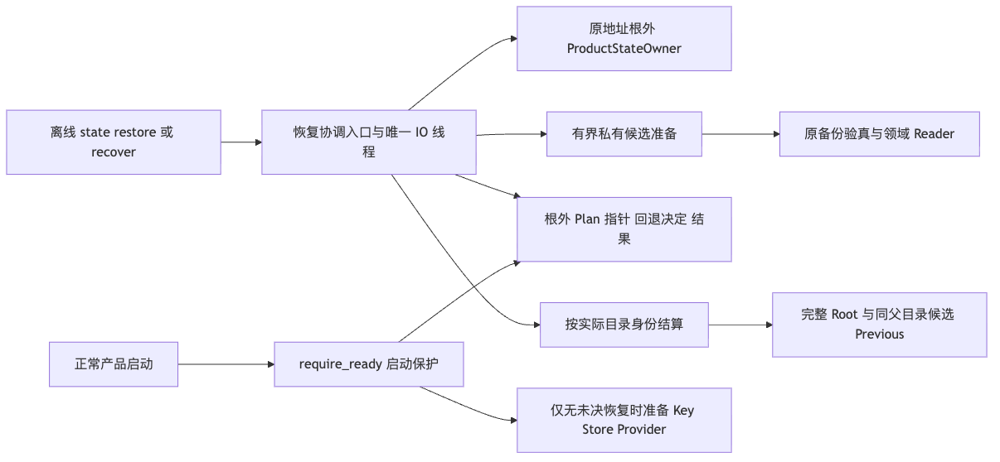
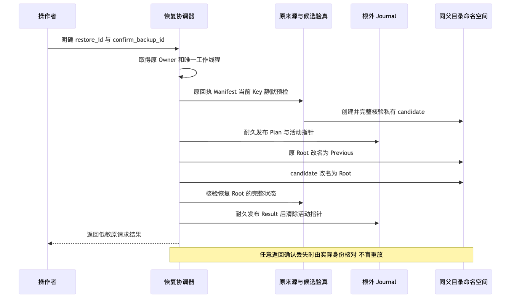
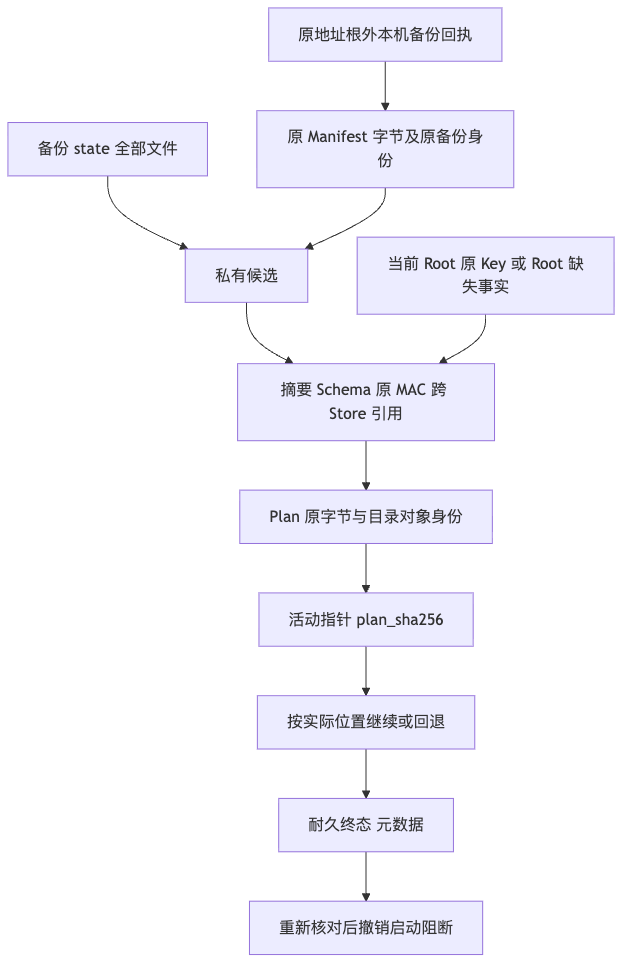

# 完整产品停机恢复与明确结算验证报告

## 1. 固定实现、背景与验收范围

固定源码为`7564a1384eeeabb667b74efdae9a40513713be10`，本切片提供`state restore/recover`，沿原回执、完整Manifest及原Key
恢复六库、事务CAS、认证Session/Artifact和可选Process事实。原Root整体保留，根外Journal先于任何切换发布，
未决恢复先阻断产品初始化，再由原UUID明确继续或回退。

完整背景、目标、总体架构、时序/数据流、类、字段、接口、伪代码、错误、持久化、安全、部署、
源码和测试映射见[总体与详细设计](../../changes/m09-r1-product-state-restore.md)。

**本报告验证同机POSIX完整产品恢复，不证明Windows完整产品、Linux原生宿主、真实编码质量、独立Beta或1.0商用发布。
R1整体及R2～R6不因本报告自动关闭。** 两个Python版本均在macOS ARM64，不能记为两个操作系统。

## 2. 真实状态、来源及失败边界

Fixture复用默认stdio产品、Agent Client、实际SQLite、原认证Event/Projection/Artifact及事务CAS；
不是单库或手工拼装假目录。恢复后重新启动正式产品，经SDK读取原Thread和Artifact，
旧Key字节不变。Scripted Provider只验证持久化和恢复合同，不作为线上认证或编码质量成绩。

授权来自原地址根外本机回执，Plan保留原Manifest字节并以Pointer固定原Hash；
不以备份自带Key、普通SHA、日志缺失或进程不存在追认来源或效果。陌生目录、错Key、
坏记录/备份、来源缺失及终态Root丢失/损坏拒绝时不删除原状态或解除未决保护。

原Root整目录切换并保留，空库或损坏数据库的原字节不重新初始化；
回退决定耐久且粘性，`rolled_back`只表示回到原位置，不表示原损坏库已经健康。
原Root原本缺失时回退后仍缺失。重复完成请求仅返回历史元数据，不覆盖新业务。

## 3. 开发态失败及根因闭环

### 3.1 正式API尚未存在

[`restore-api-red.txt`](logs/restore-api-red.txt)记录12项API不存在失败。
这是新功能的开发态RED，不是旧版本恢复实现漏洞，不外推为固定候选验收结果。

### 3.2 活动指针未提交时遗留候选

[`restore-expanded-red.txt`](logs/restore-expanded-red.txt)包含42通过、2失败，其中一项通过真实
备份及候选准备后，在活动指针Native发布之前注入失败，发现自有候选仍存在。
协调器现将准备后的检查与激活纳入同一失败收尾：仅在活动指针确实不存在且候选对象身份仍匹配时清理。
活动指针已经Native发布但返回确认丢失时，保留候选与指针供原ID显式结算，不能因错误响应反向删除。

### 3.3 非法恢复模式抛出原始TypeError

同一RED中，传入非可Hash列表模式会在集合成员检查中抛原始TypeError。
现在先严格核对字符串类型，再检查`complete/rollback`，固定拒绝先于Root或锚点创建。
两个失败均来自未提交前置候选，修复绑定本报告固定源码，不冒充旧提交失败。

### 3.4 文档语义章节检查

[`documentation-draft.json`](logs/documentation-draft.json)保留初版详设的三个缺失语义标题发现。
最终文档显式登记接口设计、领域契约/数据结构及持久化布局；未修改门禁规则或放宽章节要求。

[`governance-initial-red.txt`](logs/governance-initial-red.txt)另保留路线图退役边界正向文字缺失的1项失败、36项通过。
补充历史后继Trusted Action演进说明，明确旧HTTP/Worker已经删除；未修改治理断言或恢复旧服务。

## 4. 固定版本验证结果与测试范围

| 实际环境 | 恢复/备份专项 | 八目录受影响回归 |
|---|---|---|
| macOS ARM64 Python3.13.8，本机固定源码 | 84通过、4跳过；26.55秒 | 1694通过、22跳过；125.86秒 |
| macOS ARM64 Python3.12.7，干净独立检出 | 84通过、4跳过；26.36秒 | 1694通过、22跳过；126.03秒 |

专项包含49项完整恢复用例和35项既有完整备份用例；另4项Windows原生端口在本机明确跳过。
八目录为product_config、session、trusted_actions、processes、delivery、execution、artifacts、app_server。
测试组存在重叠，不相加为全仓测试数；本报告未运行不受管测试发现。
精确命令、环境、耗时和日志索引见[`verification.json`](verification.json)。

专项覆盖整体切换、原Root/Key保留、缺失Root、坏备份/回执、错确认与错/缺Key、
四阶段中断、实际子进程硬退出、粘性回退及回退自身中断、陌生目录与记录错配、
终态再次验真、历史结果不覆盖新状态、原备份移动后的结算、重复取消、合作期限、
Native Rename和活动指针确认丢失、恢复后正式产品查询及CLI稳定ID。

重复取消以真实工作线程屏障证明原线程未结算前第二Owner仍忙；强退出使用实际子进程`os._exit`。
期限回归使用单维护线程受控时钟，不靠任意sleep制造机器速度相关失败；故障注入不等于硬件掉电测试。

类型检查覆盖379个源码文件；可读性报告与实际源码一致，长度/复杂度/热点/依赖边阈值未放宽，
没有新增包依赖边。治理37项通过、旧CLI兼容9项通过；既有公共Schema与Task Pack保持。
实际Wheel逐字节匹配10个变更生产文件，不包含测试，未构建sdist，包版本仍为0.1.0验证件，不是1.0商业发行物。
固定六规则自检与实际源码/Wheel扫描分开执行；实际扫描2645个输入完整覆盖、零命中，
见[扫描日志](logs/secret-scan-final.txt)。

## 5. 总体架构、时序与数据流

恢复复用现有CLI、根外Owner、唯一IO线程、原备份验真及Native私有端口；
没有第二个Action服务或恢复Daemon。正常启动的保护先于任何Root/Key/Store/Provider准备。

原Root改名前先耐久Plan与活动指针；原Root保留于Previous；
候选发布后再次验真，结果耐久后才清除指针。任何确认丢失沿实际目录对象身份核对，不盲重放。

原Manifest字节、原根外回执和当前Key共同约束候选；回退选择先耐久且粘性。
结果无指针时只是原历史元数据，不代表当前Root仍等于旧快照。
三幅图从详设实际抽取，由现有Chrome渲染并视觉检查；未下载浏览器或使用用户Profile。

## 6. 资料Manifest、复验与评审

- [`contract-facts.json`](contract-facts.json)：来源、目录状态机、取消、回退、幂等及平台边界。
- [`verification.json`](verification.json)：固定源码、各组精确计数/命令、失败及有限验收范围。
- [`wheel-observation.json`](wheel-observation.json)：实际Wheel SHA与10个生产文件字节一致性。
- [`review-packet.md`](review-packet.md)：源码阅读顺序、关键审查问题、复验与发布边界。
- [`bundle-manifest.json`](bundle-manifest.json)：排除Manifest自身后的精确成员、字节数与SHA-256。

公开日志只移除个人检出/临时地址和行尾空白，保留断言、错误类别、失败与计数，不包含原Key或用户正文。
完整私有运行状态、原Root、备份和日志不归档到仓库。

复验须在干净固定Revision运行本报告列出的受管测试，并保持原策略；不能以修改阈值、跳过失败门禁、
扩大支持声明或把Scripted Provider当真实质量来获得PASS。

## 7. 开放风险与后继发布条件

- Root Owner约束合作宿主，不自动隔离不合作SQL Writer、同UID恶意写或共享文件系统。
- 恢复不是在线快照、任意旧版迁移、项目代码回退或外部效果重放；没有自动GC、自动升级/回退或跨机Key迁移。
- R1还需整体正式装配安全与延期危险入口处置；完整恢复子切片不等于R1全部安全已通过。
- R2权利/许可与发行输入、R3新真实任务质量、R4Windows及三平台安装/升级/恢复、
  R5独立Beta、R6最终同候选封板保持原退出条件。
- 开发批次不逐提交等待全矩阵CI；正式发布不能忽略任何必要门禁失败或缺失。
