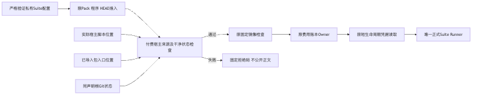
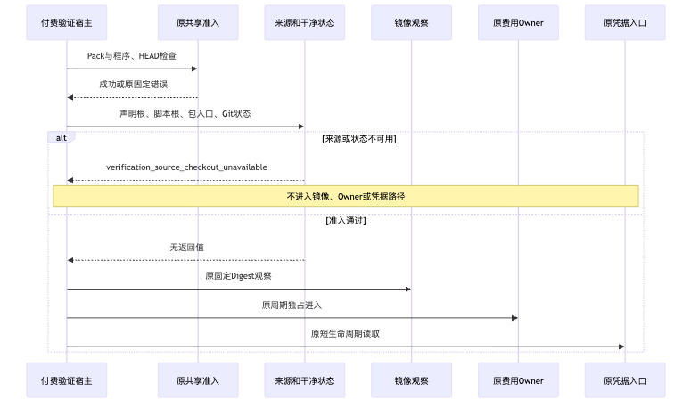

# 付费验证宿主源码准入交付报告

## 1. 结论与验收范围

固定实现为`e1aad041da7817eb5da20896cf092c296544ae25`。已完成五种漂移负控、干净准入、
付费宿主/共享Runner回归，以及实际已提交副本7项准入观察；仅本子项通过。
具体结果以[结构化事实](facts/current-results.json)为准。
新增检查只覆盖付费入口的源码准入，不关闭R3真实质量、Docker或商用发布门禁。

## 2. 需求背景与设计目标

生成配置时的干净状态不保证执行时仍干净；声明HEAD也不能证明实际加载脚本与包入口来自该根。
目标是在镜像、费用Owner、凭据和Provider之前拒绝这些差异，不改产品行为、费用规则或评分标准。
需求背景、取舍、类/函数、接口、字段和伪代码见[14节总体及详细设计](../../changes/m09-r3-provider-source-origin-preflight.md)。

## 3. 总体架构与模块边界

原固定价格→原Pack/程序/HEAD→新增宿主来源和Git状态→原镜像→原账本Owner→原凭据→唯一Suite Runner。
仅修改受控验证脚本；生产包、共享Runner、Task Pack和Config Schema均无改动。

## 4. 流程、时序与数据流

新增检查读取canonical脚本根、包入口和真实Git状态，只返回成功或固定拒绝码。
拒绝不创建账本或Suite，不读取Key，不记录原始Git输出。
正式流程及成功/失败时序图见详细设计第4～6节；交付目录保留实际渲染图。

## 5. 源码、运行环境与输入身份

基线为`bbdd9e073c2f26391f5473a74b3da095dd23ef79`；测试环境为macOS arm64、Python3.13.8、Git2.53。
回归使用自有临时Git Fixture；宿主/包路径是明确的替身，不冒充实际运行来源。
Git全未跟踪状态只在自有Fixture或隔离源码副本运行，不检查、清理或提交主目录的并行未跟踪工作。
旧已冻结候选输入保留原样，后继真实验证必须重新生成新候选Suite。

## 6. 初始Fixture失败与有效RED

首次6项失败发生在严格配置Case/Campaign身份校验，是测试Fixture错误，不是有效RED或产品缺陷证据。
修正为正式Builder重建全部身份后，补丁前有效RED为5项失败、1项通过：
五种漂移漏检触及被禁止的镜像门禁，干净来源继续原下一门禁。
两个原始结果及摘要保留，不将首次失败计入源码检查缺陷证明。

## 7. 实现与重点接口

宿主`_require_scope`先调用原共享准入，再调用新增`_require_source_checkout`。
新增检查使用净化Git环境、关闭可选锁/Hooks/fsmonitor、30秒有界观察；原Pack和HEAD错误保持优先。
来源、状态或观察失败统一`verification_source_checkout_unavailable`，CLI退出1且仅发布错误码。

## 8. 回归测试与负控

付费宿主相关299项通过；共享Suite/Case/配置兼容相关61项通过，两组重叠6项，不累计宣称360个独立测试。
第一条绿色命令包含不存在的测试路径，退出4且0项收集；修正路径后另存新的成功结果，原命令失败保留。
独立Git失败、原顺序及CLI短负控5项通过；最终包含新增负控的付费宿主回归304项通过。
独立与最终回归有重叠，不将299、304、61、5相加。独立测试的三个原输入字节与提交实现一致，
18件私有成员已按原摘要复核。超时为异常注入并核对30秒参数，不是真实等待30秒的计时证明。

## 9. 实际隔离源码副本验证

仅含已跟踪源码的独立Git副本HEAD为固定`e1aad04`；正式生成器实际生成外置0600配置，
新进程实际导入该副本的宿主和`src/harnessix`，未替换它们的`__file__`。
初始干净及恢复干净通过；已跟踪修改、已暂存修改、未跟踪文件、声明同HEAD另一根分别拒绝。
第二个新进程实际从另一个源码根加载包，同时使用该副本宿主，包来源检查拒绝。
共7项观察符合预期，具体见[实际准入结果](facts/actual-source-admission.json)。

初始观察脚本因非ASCII字节字面量编译失败，未进入任何准入；原错误保留，不计产品失败或有效RED。
修正脚本编码并在运行前编译检查后，另存全部成功原件；不修改产品或严格配置来取得成功。
全部观察仅调用源码准入，不进入费用Owner、凭据、Docker或模型，不以此替代编码质量。

## 10. 安全、失败、恢复与持久化

Git超时/非零/路径错误拒绝，无新增状态写入或Schema迁移；原费用/Suite恢复保持。
准入是入口瞬时检查，不证明全部子模块来源、依赖或执行期间源码冻结，忽略文件也不在范围内。
30秒同步Git上限不是异步取消即时抢占合同；不扩大原Turn、模型或IO上限。

## 11. 百炼预算与凭据观察

当前周期上限60元，已知估算0.706096元、预留0、估算剩余59.293904元；本切片新增请求0。
历史两笔未决保留且不阻断本期，不据此认定免费或已结清。具体见[预算事实](facts/budget.json)。
钥匙串预检可取得指定凭据，但不公开值、摘要或命令输出，不据此证明供应商鉴权或模型请求成功。
这是单次历史预检事实，不宣称后续会话自动持有凭据。有限状态见[环境预检](facts/environment-preflight.json)。

## 12. Docker与真实质量边界

官方Desktop启动请求曾返回接受，但进程和Engine观察未就绪；标准应用启动未成功。
这些事实不构成Mac锁定或已解锁证明，也不构成Docker运行成功。
未更改业务容器、配置或数据。真实运行须先恢复原环境，验证默认Workspace原子替换一致性及全部固定Profile。
原R3严格0/20、必需测试1/20和真实Beta接受0保持，不发布新的质量成绩。

## 13. 文档、Manifest与评审入口

详细设计、模块设计、请求预算设计、文档索引及路线图同步。
三幅新增Mermaid图均已实际渲染，总体图和时序图已视觉检查。
[Review Packet](ReviewPacket.json)列出范围与评审问题；`manifest.json`列出公开交付成员摘要。
私有原日志、失败XML和运行输入不发布；公开事实只保留计数、摘要和有限状态，不包含凭据或业务内容。

## 14. 风险、发布与下一步

源码准入实现不代表产品新增功能或商业可用。普通Wheel产品不要求Git源码树；受控付费宿主必须从声明源码加载。
本子项仅关闭R3真实运行的源码准入整改；Docker/Profile、完整20 Trial、真实Beta、Git交付和其他R1～R6仍开放。
真实调用继续使用本期60元预算和原请求预留，出现新的未决费用仍按原保护停止；不删旧证据、不放宽评分。
