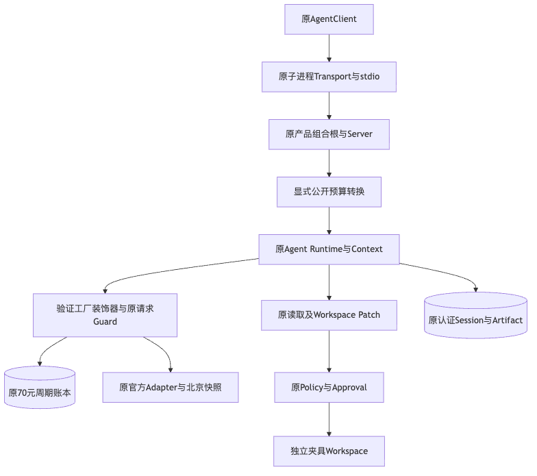
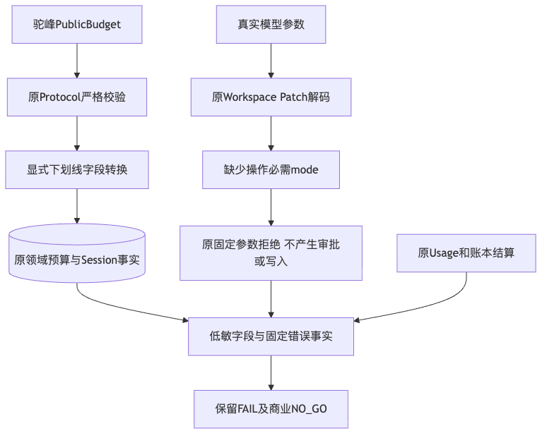
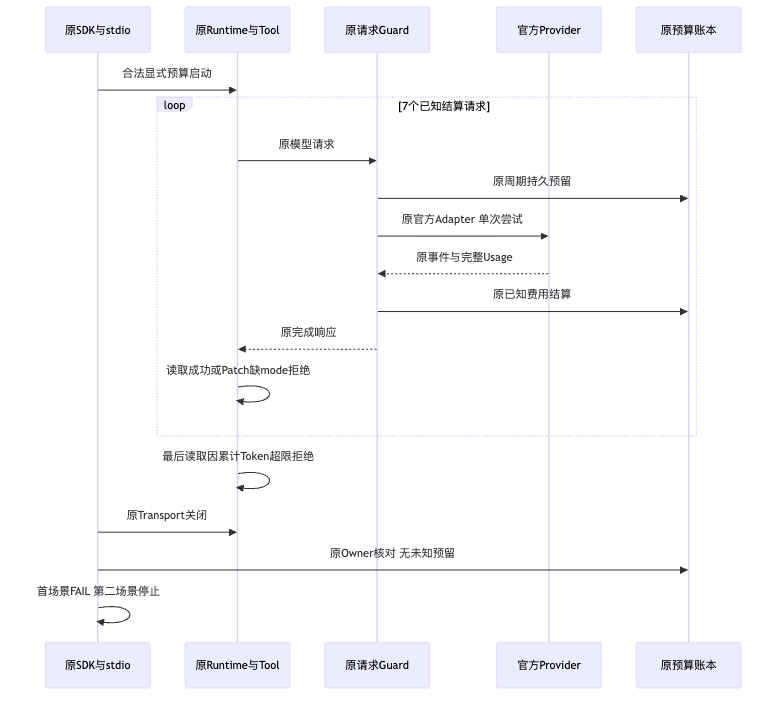

# 公开预算修复与默认产品真实Provider失败归因

## 1. 摘要、需求背景与结论

固定产品源码为`184fb125f6159de4202a64a525f6b5cc99f0ab97`。
默认产品实际stdio链发现显式预算启动失败；修复后独立固定源码的离线审批修改、等待取消均通过。
随后使用原70元周期、原请求Guard、Keychain材料及官方Adapter进行真实模型验证。

**公开预算修复专项GO；有限Provider认证、真实编码质量及商用发布NO_GO。**
真实首场景失败，第二场景停止。7次请求全部结算，新增已知估算CNY **0.149308**；无未知或未决预留。
模型3次Patch均未提供替换操作必需的`mode`，原解码器拒绝，审批数量为0，文件未改变。
小型契约夹具不计入原3仓10 Case/20 Trial，更不计为独立用户Beta。

[完整增量设计](../../changes/m09-r3-public-budget-domain-mapping.md)、
[App Server](../../modules/app-server.md)、[Protocol](../../modules/protocol.md)说明实际修复。
[verification.json](verification.json)、[Review Packet](review-packet.json)和[manifest.json](manifest.json)
分别登记可重算结果、评审边界和实际文件字节。

## 2. 原失败、源码根因与影响边界

| 事实 | 根因及处置 |
|---|---|
| 固定旧源码stdio启动返回`internal_error`，Provider调用0 | 公共预算默认导出驼峰，领域`Budget`拒绝；只改为显式内部字段名导出 |
| 5项预算红例、6项既有拒绝正例 | 同时证明启动和Retry缺陷；不能用无预算测试代替 |
| 固定修复源码离线两个stdio场景通过 | 原组合根、SDK、协议、读工具、审批、Artifact及文件事务完整运行；不是在线模型结果 |
| 真实Patch连续3次`tool_invalid_arguments` | 3次均缺少`mode`；输入Schema可空，但操作组合校验要求create/replace非空 |
| 最后读取`budget_exceeded`，控制器报告`trusted_read_mismatch` | 原始失败标识保留；并非已成功读取的摘要错误，前三次真实读取摘要均匹配夹具 |

真实[低敏归因](facts/real-cause-diagnostic.json)通过原Key绑定及认证Session读取。
前两次提案的摘要和完整内容符合夹具预期，第三次内容已不同于预注册目标。
只在内存补`mode=420`进行**纯解码反事实**，3次解码均通过；没有执行Patch、提交审批或改写历史提案。
该对照定位了字段缺口，不证明修改后的任务会成功，也不能把原FAIL改成PASS。

## 3. 设计目标、范围与原预注册计划

[计划](facts/plan.json)在发送前冻结产品Revision、驱动摘要、模型、地域、价格窗口、两场景和原预算周期。
模型是`qwen3-coder-plus-2025-09-23`，`cn-beijing`，OpenAI-compatible Chat；无Fallback和自动重试。
每次最多1024输出Token，每场景最多8个请求，首失败停止，不跑第二场景或选择性补跑。

SDK公开预算为8步、32000累计Token、120秒、32000输出字符和每步1个工具调用。
该任务预算与70元验证周期是不同约束，不能把Token越限误记为人民币额度耗尽。

计划中的审批场景要求可信读取、完整Diff、批准前不变及唯一精确修改；
取消场景要求等待审批后进入`interrupted`、文件不变，且取消后直到进程关闭没有新Provider调用。
额外文件提案负例在固定源码中被拒绝，原文件不变，额外文件不存在。

## 4. 总体架构、数据流与源码映射



**架构说明：** 实际`SubprocessAgentTransport`启动原`run_product_stdio`，不是进程内假协议。
验证宿主只装饰原Provider工厂：离线模式使用确定性脚本，在线模式使用原官方Adapter及原Guard。
原Root Owner、Key、Store、Context、Tool、Router、Policy、Approval及SDK都不替换。
Guard借用原周期，先持久预留、请求完成后结算；不改变模型响应事件或授予工具执行权限。



**数据说明：** 驼峰预算通过严格Protocol进入Service，转换后五个原值进入Session领域事实。
模型参数在原Workspace Patch解码器严格校验；省略mode不由宿主补全。
外部证据只保存字段是否存在、类型、等值标志、固定错误码及Usage/金额，不复制模型正文、用户状态或Key。

| 位置 | 关键类、接口或字段 |
|---|---|
| [`service.py`](../../../src/harnessix/app_server/service.py) | `_budget`唯一产品修复；启动/Retry共用 |
| [`contracts.py`](../../../src/harnessix/protocol/contracts.py) | `ProtocolModel.serialize_by_alias`、`PublicBudget`原线上字段 |
| [`server.py`](../../../src/harnessix/product_config/server.py) | 原预检、Owner、Store、Provider、Context、Tool及stdio装配 |
| [`AgentClient`](../../../src/harnessix/sdk/agent_client.py) | 初始化、启动、Replay、Artifact、批准和取消 |
| [`WorkspacePatchFile`](../../../src/harnessix/delivery/trusted_action_contracts.py) | `mode`允许420/493，但create/replace要求非空；原严格组合校验 |
| [`workspace_patch_descriptor`](../../../src/harnessix/delivery/trusted_action.py) | 实际模型可见工具Schema和描述；本验证未修改它 |
| [`Guard`](../../../scripts/provider_verification_guard.py) | 原官方事件、已知Usage、模型匹配、最高档预留及结算 |
| [`Ledger`](../../../scripts/provider_verification_budget.py) | 原Owner、原周期、持久预留与未知停止，不加额或清零 |
| [验证主机原件](diagnostics/validation_host.py) | 固定工厂装饰器、审批范围检查、请求计数、关闭及报告；不是新增产品服务 |

## 5. 核心流程、失败与恢复时序



1. 固定源码离线通过后，原账本Owner先预检，再由子进程从Keychain获取材料；凭据不进入argv。
2. 原模型请求经过原Guard；真实读工具成功，返回可信完整SHA。
3. 模型Patch缺少mode，原解码器拒绝，没有Action计划、审批或文件效果。
4. 模型重复读取/提案，最终累计Token预算阻止末次读取；控制器原失败标识与Store事实分开保留。
5. 关闭原SDK/Transport，账本核对7个完成结算；第二场景不执行，没有自动重试。

```text
预算转换修复：
    public_budget -> model_dump(by_alias=False) -> original_Budget

审批准入：
    原可信读取完整摘要匹配
    原提案只含calculator.py，SHA及完整内容符合计划
    原Diff完整并由SDK读完
    批准前文件保持原值
    满足全部条件才发送原approval/respond，否则停止

实际失败归因：
    原认证Store读取既有调用
    只发布mode存在/空值、摘要/内容等值及固定解码错误
    反事实仅内存解码，不执行或改写原事实
```

## 6. 实际测试与验证结果

| 范围 | 原件及结果 | 结论边界 |
|---|---|---|
| 原预算红例 | [5失败、6通过](logs/budget-red.log)及[JUnit](logs/budget-red.xml) | 3组字段映射与SDK启动/Retry失败 |
| Python3.12相关范围 | [770通过、1跳过](logs/budget-broad-green-312.log) | 771项，0失败/错误；不是全功能或Windows运行 |
| Python3.13同范围 | [770通过、1跳过](logs/budget-broad-green-313.log) | 不与上一组叠加为1540项独立能力 |
| 固定源码stdio离线 | [2/2通过](facts/offline-fixed-source.json) | 真协议和原工具/审批；付费模型调用0 |
| 额外文件提案 | [固定源码负例](facts/proposal-scope-negative.json) | 拒绝且文件不变；不是在线模型拒绝率 |
| 实际线上首场景 | [FAIL，7请求](facts/real-product.json) | 正文不公开；第二场景未运行 |
| 原解码器归因 | [低敏原认证读取](facts/real-cause-diagnostic.json) | 3次缺mode拒绝；反事实不是执行成绩 |
| 类型检查 | [392个源码文件无问题](logs/budget-mypy.log) | 不证明业务质量 |
| 治理原环境 | [1失败、275通过](logs/budget-governance-green.log) | Apple Git2.24.3不满足既有配置覆盖合同；原FAIL保留 |
| 原治理正确Git环境 | [276通过](logs/budget-governance-bundled-git-green.log) | 使用现有Git2.53，仅进程PATH覆盖，不修改全局设置 |
| 原默认全制品扫描 | [scan_archive_limit](logs/budget-source-secret.log) | 未完成不能报告零命中；未批准Sdist不发行 |
| 正式Wheel扫描 | [3094输入完整、固定规则零命中](logs/budget-wheel-only-secret.log) | 原源码扫描与原扫描上限保持 |

SDK新回归为11项；相关大范围包含这些用例，不重复累加。
离线旧控制器v1～v3原失败也保留；中间未提交候选不作为固定源码通过证据。

归档完成后的原治理套件为276项通过；Schema、可读性、全仓格式及Lint检查通过。
变更文档的实际Mermaid渲染通过，相对链接检查无发现。
首次渲染未显式指定本机Chrome而失败，原结果保留于
[浏览器环境失败记录](logs/documentation-render-browser-missing.json)；
后继检查使用本机Chrome，见[实际渲染结果](logs/final-documentation-render.json)，不修改图或门禁标准。

## 7. Usage、预算与价格边界

7个请求均为1次尝试、指定实际模型、完整Usage和已持久完成费用估算。
原周期额度70元，已知估算从0.000068元到0.149376元；新增0.149308元，预留为0，未决为0。
完整Token及逐请求重算见[verification.json](verification.json)。这些是原价估算，不是供应商账单或余额。

价格适用性核对[百炼官方精确快照说明](https://help.aliyun.com/zh/model-studio/qwen3-coder-plus)，
只使用北京时间区域及固定价格窗口；窗口外不得复用本计划继续发送。原Guard按最大输入和最高档费率预留，
不用缩小实际输入、优惠、缓存或免费额度制造预算可用。

## 8. 部署、兼容与正式发行输入

产品包仍为`0.1.0`；[当前Wheel](facts/wheel.json)的433个包成员逐字等于固定源码。
SHA256为`0d4971afe331025a33dcde313e9be8df40137a664523d3b0e6de21d8c041b922`。
没有新三平台安装、版本升级、Windows 11或Beta声明，不继承旧Wheel的结果。

原默认构建生成的Sdist有3054个文件成员及1064个PAX记录，共4118条实际TAR记录，超过原4096上限。
这是未正式承诺的制品通道与CI构建入口不一致，不是扫描器应忽略PAX或扩大上限。
三个CI入口和Makefile改为构建单一Wheel，随后仍完整扫描源码及实际制品；原扫描器不修改。
目录中若残留其他制品仍严格扫描，不自动删除旧件；[安装手册](../../operations/installation.md)同步通道。
通道修复源码为`bf03290e22748d0356b49839d5e264142282c492`，原失败[CI 36490452432](https://github.com/carrie1988/Harnessix/actions/runs/36490452432)
与[后继CI 36491421931](https://github.com/carrie1988/Harnessix/actions/runs/36491421931)分开登记。
[原始状态](facts/original-ci.json)、[后继状态](facts/pipeline-ci.json)及[原失败日志](logs/source-184-python312.log)保留，未终结Job不视为成功。
归档前的[后继Run状态](facts/pipeline-ci-final-run.json)和[实际Job步骤](facts/pipeline-ci-final-jobs.json)
另行保存，不覆盖旧观察，也不把部分成功视为完整候选验收。

## 9. 安全、隐私及复核

不导出Provider Key、独立Session Key、数据库、工作区、模型正文或实际Diff正文。
验证工厂只装饰原Adapter，不改工具参数，不在审批前修改文件；停止后没有新增付费请求。
用原认证Store读取原事实，不用无MAC SQLite正文充当可信证据；只读反事实没有执行权限。
JUnit、原计划/驱动SHA、逐请求费用、源码及Wheel字节、Manifest分别独立核对，不能互相替代。

复核驱动需要明确的当前源码路径、私有Case目录、合规Git、原预算账本与原周期；
不得新建预算或使用过期价格窗口。原驱动摘要已固定，任何调整须生成新的计划并保留原失败。

## 10. 未完成发布条件与下一整改

1. 向模型明确公开Patch操作相关必填字段，补create/replace/delete正反例；不静默补mode或放宽严格校验。
2. 修复后新计划的真实审批/取消认证；原FAIL、第三次内容偏离及所有费用继续保留。
3. 原固定20 Trial完整质量运行、可执行Container环境和至少12/20门槛；当前历史0/20不变。
4. R1正式安全及500 Thread认证存储增长处置；R4 Windows 11、完整编码及真正跨版本升级。
5. 独立Beta、许可处置和同一最终候选发布门禁；R1～R6均未整体关闭。

## 11. 变更记录

| 版本 | 产品源码 | 日期 | 结论 |
|---|---|---|---|
| 1 | `184fb125f6159de4202a64a525f6b5cc99f0ab97` | 2026-09-29 | 显式预算修复与固定stdio离线通过；真实首场景缺mode失败、第二场景停止；原费用完整，商用仍NO_GO |
