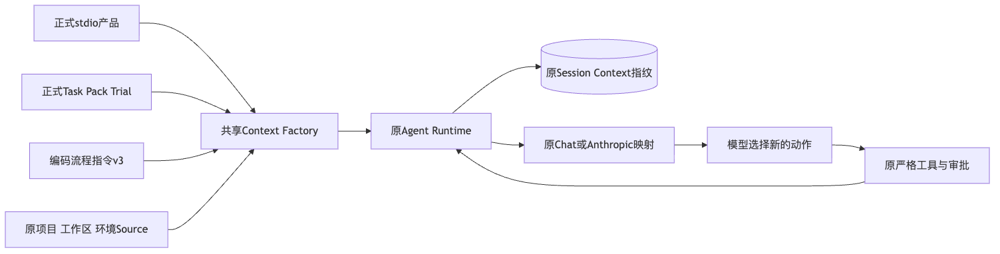
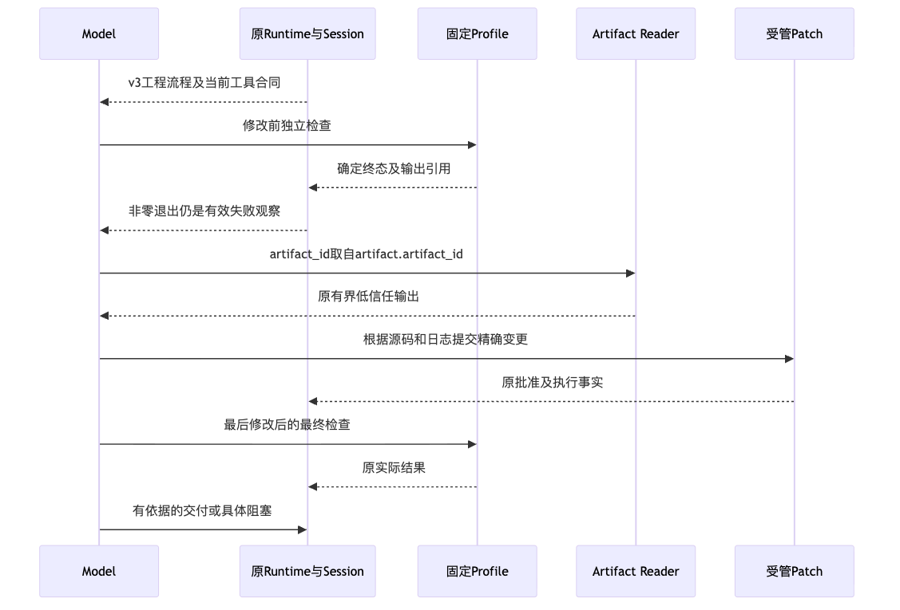

# R3共享编码流程、原真实阶段诊断与离线候选验证

## 1. 范围与有限结论

本专项只更新默认产品和正式Task Pack共用的编码指令为v3：明确首次受管修改前的独立基线、
最后修改后的最终检查、正常非零退出与Artifact引用读取、参数/路径错误后的有效纠正。
完整总体架构、接口字段、流程、时序、持久化、失败安全、源码和测试设计见
[详细设计](../../changes/m09-r3-coding-workflow-instructions.md)。

指令正文UTF-8为2743字节，原v2为2751字节；没有扩大Context、Compaction、模型配置或Trial预算。
这只是正文大小护栏，不证明供应商精确Token或费用下降。自然语言指令不是强制执行状态机，
不能保证模型遵循率。没有新增真实请求、完整Suite成绩或商用质量结论。

## 2. 原真实Session阶段事实

[逐Session投影](session-diagnosis.json)对应原`0813c58`、Suite
`d85c26ca-d21a-4ac4-9a01-f780eb01b038`。9个原SQLite以`mode=ro`读取，事件经正式`AgentEvent`
验证及纯Reducer回放，按最终Item去重，原文件读取前后SHA均未变化。每次调用和结果只计一次，
不把开始/更新/完成事件重复计数；明确识别正式`apply_patch_batch`，不将旧投影白名单的
`unlisted_tool`误认为未知工具。

| 原Run前缀 | 报告 | 真实阶段事实 |
|---|---|---|
| `94c80d1d`、`c2cdac2c` | 两份invalid | 有正常失败基线，缺少Artifact必填字段，各重复两次，无Patch/最终检查 |
| `68d71947` | invalid | Patch之后仅一次通过检查，修改前基线缺失 |
| `795bbea9` | failed | 失败基线→Artifact→成功Patch→通过检查→Git；累计57752超过50000 |
| `f4cfd103` | invalid | `read_file`资源不存在后退出，没有Patch或Profile |
| `fd7317f4` | invalid | 文件类型错误后能目录定位、修改和检查，但基线缺失且Turn累计57859超限 |
| `7042cdd6`、`8d66bd2c` | 两份invalid | Patch后仅一次通过检查，修改前基线缺失 |
| `1c6c5eaa` | 无报告 | 资源读取失败、后继Provider失败后取消，不存在完整Trial成绩 |

因此有4个Trial先修改后检查且没有修改前基线；2个Turn在已观察到通过检查后Token超限，其中只有
`795bbea9`同时具备实际修改前失败基线和修改后通过检查。检查通过不等于Turn或严格任务成功。
`tool_not_found`发生在实际`read_file`调用，不据此宣称工具没有公布。原模型正文、参数值、文件路径、
Artifact内容、凭据和任务答案均未导出。

原8份报告仍是7 invalid、1 failed；另1取消没有报告。不是完整20 Trial，也不能发布新的完整0/20成绩。
旧历史完整0/20、原中断、原费用保护和评分事实均保留，不补造基线或拼接其他版本Trial。

## 3. 实现、失败保留与版本边界

12项新测试先在原实现全部RED；它们检查实际Factory片段、原安全/大小边界，以及新建和重开Turn
的正式请求映射、Session指纹。初始候选超过原正文大小护栏，后继仅精简同义表述，没有提高上限；
原失败日志/XML以摘要保留，不覆盖为通过结果。

真实`AgentRuntime`与SQLite验证Chat首个system消息、Anthropic system字段和原`ModelRequest.instructions`
逐字节一致；重开后沿原指纹合同读取。默认stdio产品回归也断言当前同源正文。
这些是离线装配和协议事实，不是供应商实际接收证明或模型行为质量。

旧事件/指纹不改写，新请求使用v3；无配置、公开Schema或SQLite迁移。恢复、批准、工具严格校验、
Artifact归属和副作用停止沿原合同。不自动纠正参数，不自动调测试，不在超时或未知态重放写入。

## 4. 验证集合与并行执行

| 集合 | 实际结果 | 证明范围 |
|---|---|---|
| 原工具反馈/Artifact/Provider/费用保护 | 174通过 | 独立失败语义与原未知费用停止规则 |
| 新流程及原Context焦点 | 22通过 | 指令正文、Source/信任、Secret、压缩与持久化 |
| 产品、Context、模型、Eval、工具、Artifact及正式Trial关联 | 2052通过、52跳过 | 2104项完整收尾，无失败或错误 |
| 完整治理 | 302通过 | 原治理规则、Schema、文档关系及结构基线，不降低门禁 |
| 源码外Wheel焦点及默认stdio产品 | 23通过 | 新Wheel实际导入、持久重开及同源默认产品指令 |

集合存在重叠，不能相加为独立用例总数，也不是全仓功能回归。本专项按单文件指令差异选择完整关联集合；
没有把此前其他候选的全仓/原生成功继承到新候选。治理使用固定Git工具链，不修改全局Git配置。

焦点、关联、工具/预算基线、静态检查、治理及制品验证按独立依赖并行运行；同一源码变更串行合并。
真实API请求仍由原持久预算唯一Owner控制，未决保护期间不启动网络请求。没有多个并发费用Owner。

Ruff、Format、399文件Mypy、原可读性策略及最终观察报告通过；公共Schema、Task Pack、Grader、模型/
预算保护、生产依赖与Lock均未修改。两幅新增Mermaid已实际渲染并视觉检查；模块原有图正文未改变，
不把静态全库图计数当作全部重新渲染。

## 5. 实际制品与安装输入

实际内部`1.0.0rc1` Wheel的440个包成员与源码逐字节一致；全新源码外环境以哈希锁定离线安装，
`python -I`确认实际导入路径属于安装环境，再核对440成员与Wheel/源码相同。
测试夹具从工作树载入，但产品包不是Editable或源码包；该结果不替代完整升级、平台或Beta验收。

全Dev安装输入因缓存缺少Mypy/Librt而失败，原日志保留。后继使用已固定的产品及测试依赖
输入，排除测试不需要的Mypy/Ruff/类型存根，替换为新Wheel及其真实SHA；全部产品依赖保持原Lock版本。
这不修改仓库Lock、不移除生产依赖，也不把全Dev安装失败解释为产品安装通过。

源码、测试、指令、Wheel、安装输入与原日志SHA由[Facts](facts.json)绑定，公开Secret扫描完整覆盖新制品和
新文件。原JUnit/日志留在私有验证目录，不复制个人路径、主机标识或模型正文。

## 6. 架构与时序图

第二幅图表示指令要求的执行次序，不声称已经新增强制工作流或真实模型必然遵循。

## 7. Review Packet、Go/No-Go及后继要求

[Verification](verification.json)、[Review Packet](review-packet.json)和[Manifest](manifest.json)
与本完整报告、逐Session低敏投影及图位于同一目录，Manifest绑定公开交付字节。
头部Revision是设计/原实现基线，实际候选由文件SHA绑定，不能冒充该父提交已经包含新实现。

**仅共享指令离线装配专项GO；R3质量与商用1.0仍为No-Go。**
原70元周期、已知估算1.522724、未知保守预留20.77824保持原事实；预留不是实际收费，未据此退款、
释放、重置或自动恢复。恢复真实请求前需核对原未决费用、凭据与宿主，使用新干净候选及新完整预注册，
保留3仓10 Case/20 Trial、至少12严格成功、每仓成功及零越界要求。

真实累计Token控制、原未知Provider输出的确切原因、消费者Windows11、独立Beta及最终同候选R1～R6
继续开放。共享Prompt整改不能替代这些验收，也不将内部RC发布为正式商用版本。
