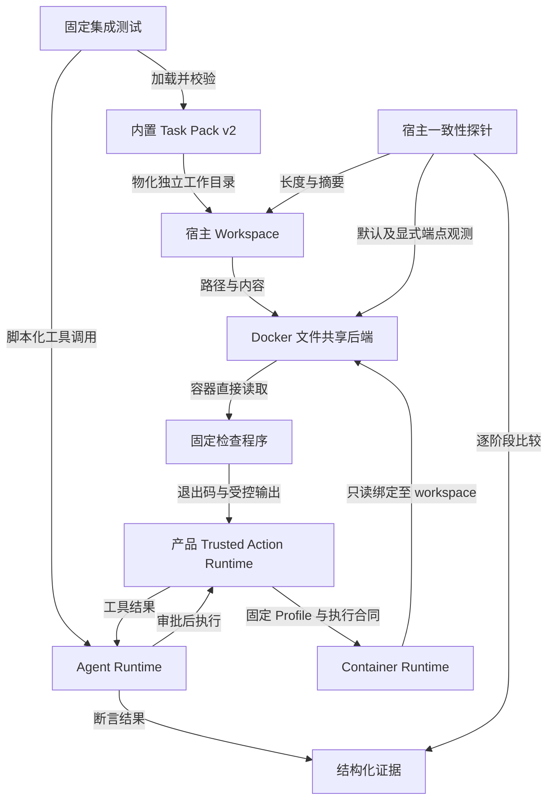
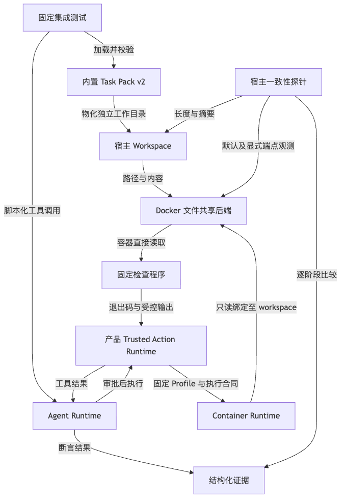
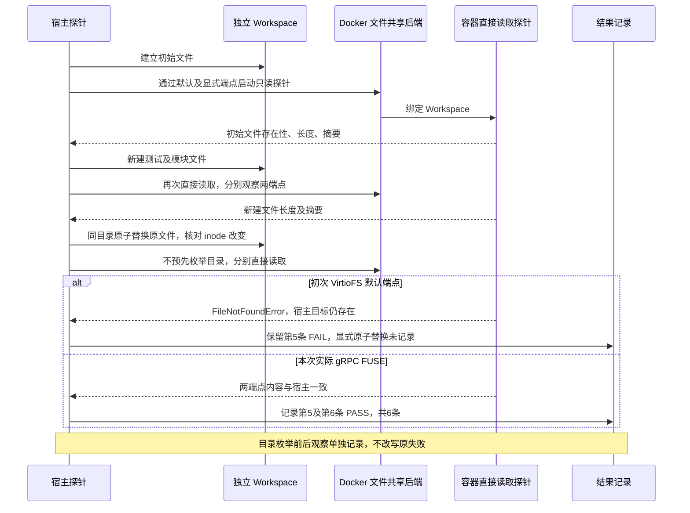
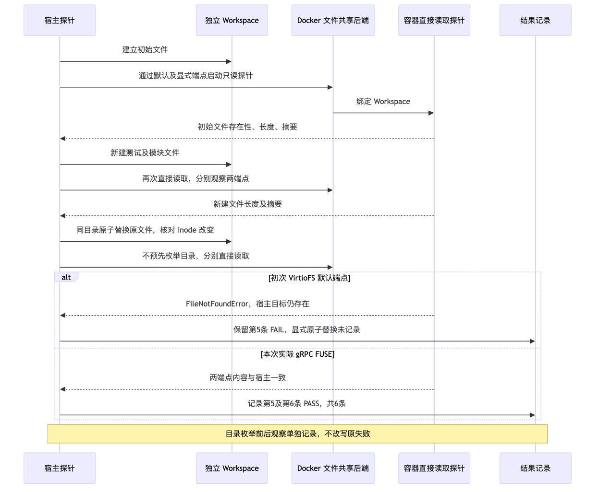

# Docker Workspace gRPC FUSE 一致性复验交付报告

## 1. 结论与证据边界

在固定源码`b182cf658dba40930bc8c8e0dc2123183da18dbd`和既有固定镜像下，实际 Workspace 文件系统为
`fuse.grpcfuse`的复验取得**6/6挂载一致性观察通过、10/10固定Profile集成用例通过**。
Profile测试进程耗时**19.064秒**，退出码0，错误0、失败0、跳过0；本阶段真实模型/API请求**0**。
这是本次环境与样本的工程执行证据，不是R3模型质量通过、业务验收或商业发布许可。

旧VirtioFS失败保持有效且独立保存：一致性探针实际产生5条观察，前4条通过，最后一条默认端点
`atomic_replace`失败；固定Profile测试5通过、5失败。后继通过不覆盖、不删除、不改记旧FAIL。
新旧计数、逐项比较和出处见[结构化事实](facts.json)，评审问题见[Review Packet](Review%20Packet.md)。

公开材料只摘取有限状态、数量、公开输入身份与错误类别；不复制原日志、XML正文、私有目录、
宿主身份、容器身份、账号或凭据。原件以受控证据集内的成员名定位，不提供本机绝对路径。
最终成员摘要见[Manifest](manifest.json)；资料静态核验、环境运行及模型停止仍按独立阶段解释。

## 2. 需求背景、设计目标与非目标

### 2.1 需求背景

Engine可用和镜像存在只能证明控制面与本地镜像前置条件。编码检查还依赖宿主Workspace写入后的内容，
能被只读绑定挂载的容器按原路径读取。原子替换会改变文件inode；若容器路径查找仍认为文件不存在，
即使宿主内容正确、容器退出码为0，实际内容一致性仍失败。

初次VirtioFS观察在原子替换后出现宿主目标存在、容器直接读取`FileNotFoundError`。
后续独立direct/readdir/direct观察提供了目录枚举前后可见性差异；它是定位线索，不是Docker供应商根因结论。
需要在不改源码、检查命令、评分门槛和Profile的条件下，复验gRPC FUSE环境的路径及内容一致性。

### 2.2 目标

1. 用实际挂载文件系统证明后端生效，而非把UI选项或Engine存活当生效证明。
2. 分别观察初始内容、新建文件、同目录原子替换，在默认和显式端点取得6条可比较结果。
3. 沿真实产品审批和Container执行主链，运行原有10项固定Profile的预期失败→固定补丁→预期成功合同。
4. 保留失败前测、有限因果观察与成功复验，区分内容一致性、集成执行、模型质量、费用和业务恢复。

### 2.3 非目标及约束

- 不开发新的文件系统适配、缓存刷新、重试、Sleep或Host降级路径；不修改代码、Profile、Task Pack或门槛。
- 不评估真实模型提案、修复能力、完整Trial质量、真实Beta接受或全产品兼容性。
- 不证明Docker内部缓存实现、供应商缺陷根因或跨版本永久修复。
- 不执行业务服务验收，不将手动网络恢复、容器`running`或健康状态提升为业务结果。
- 不重置、重新分配或重建60元共享账本；不把后继真实Suite停止记录合并为环境阶段成绩。
- 不读取原业务项目、密钥或未归属验证目录；不改变既有Git索引和其他工作内容。

## 3. 固定输入、环境与事实来源

| 项目 | 固定值或已观察状态 | 证据层级 |
|---|---|---|
| Harnessix源码 | `b182cf658dba40930bc8c8e0dc2123183da18dbd` | 新旧`DEFAULT_PROFILES_COMMAND.json`均记录该版本及`source_clean: true`；资料核对时主检出HEAD相同 |
| Docker Desktop | `4.94.0` | 最终正式界面重新观察；`UI_FINAL_REOBSERVATION.json`保留有限值，不由Engine版本反推 |
| Docker Engine | `29.8.2` | `grpc-fuse-revalidation-v1/ENGINE_AFTER_APPLY.json`的3次可用观察 |
| 初次实际文件系统 | `virtiofs` | `ACTUAL_MOUNT_FILESYSTEM.json` |
| 复验实际文件系统 | `fuse.grpcfuse` | `grpc-fuse-revalidation-v1/ACTUAL_FILE_SHARING_AFTER_APPLY.json` |
| 端点 | 默认与显式端点指向同一Engine | 新旧`ENGINE_IMAGE_READY.json`；不公开Engine身份或端点私有路径 |
| Task Pack | `harnessix-engineering`，版本2 | 当前源码内置Manifest及指定集成测试入口 |
| Python镜像 | `python@sha256:efcdfa6a6b2fd2afb9c7dfa9a5b288a6f68338b5cfdebe6b637d986067d85757` | 新旧`ENGINE_IMAGE_READY.json`的固定摘要存在性证明 |
| Node镜像 | `node@sha256:1b2479dd35a99687d6638f5976fd235e26c5b37e8122f786fcd5fe231d63de5b` | 同上；镜像拉取0 |

受控证据集逻辑标识为`r3-restored-engine-20261008-v1`，后继子集为`grpc-fuse-revalidation-v1`。
仅使用以下明确成员，不遍历证据集中的`source-checkout`：

| 证据成员 | 用途 |
|---|---|
| `ACTUAL_MOUNT_FILESYSTEM.json`、`CURRENT_FILE_SHARING_FLAGS.json` | 初次实际VirtioFS；设置文件读取遭`PermissionError`，不能以静态设置文件推定后端 |
| 新旧`ENGINE_IMAGE_READY.json` | 同一Engine、两个固定镜像就绪、模型请求0及镜像拉取0 |
| 新旧`MOUNT_COHERENCE_RESULT.json` | 5条失败前测与6条成功复验的逐阶段内容比较 |
| `LATE_ATOMIC_REPLACEMENT_OBSERVATION.json`、`DIRECT_READDIR_COUNTERFACTUAL.json` | 目录枚举及直接读取的有限关联观察 |
| 新旧`DEFAULT_PROFILES_COMMAND.json`、`DEFAULT_PROFILES_RESULT.json`、`default-profiles.xml`、`default-profiles.log` | 固定源码、测试入口、计时、总数、逐项通过/失败及完成输出 |
| 后继`UI_APPLY_RESULT.json`、`ENGINE_AFTER_APPLY.json`、`ACTUAL_FILE_SHARING_AFTER_APPLY.json` | 单次文件共享设置应用、Engine可用与实际后端的分层证明 |
| 后继`POST_RESTART_BUSINESS_RECOVERY.json`、`POST_RESTART_NETWORK_REOBSERVATION.json` | 有限业务容器操作及手动网络恢复边界；不发布原对象身份 |
| `BUDGET_FINAL.json` | 本阶段使用的共享60元账本快照，不表示后继实时余额 |
| 后继`BUSINESS_FINAL.json` | 原8个容器全部running、4个healthy、身份与持久配置摘要保持；业务验收仍未证明 |

第13节另引用受控证据集`r3-grpcfuse-real-suite-20261008-v1`中明确授权的
`PREREGISTRATION.json`、`PREFLIGHT.json`、`HOST_RESULT.json`、`HOST_COMPLETION.json`及
`AUTHENTICATED_DIAGNOSTIC.json`，并链接独立公开投影[real-suite-stop.json](real-suite-stop.json)。
该阶段不读取配置原文、该证据集内的源码或Workspace，不改变上述环境复验API0口径。

## 4. 当前架构、模块边界与数据流程



**图示说明**：测试同步加载已校验Pack并物化独立Workspace，使用`ScriptedProvider`产生固定工具调用，
不是外部模型请求。`AgentRuntime`异步等待审批，再经产品Trusted Action Runtime执行Profile。
Container Runtime生成固定CLI参数，Docker文件共享后端将宿主目录绑定到容器`/workspace`；
检查程序退出码经产品执行结果返回。独立一致性探针比较宿主与容器的文件存在性、长度及摘要，
不经过模型，也不把容器命令成功等同于字节一致。任何不一致保留为FAIL。

**源码映射**：Pack与Workspace对应`builtin_coding_eval_task_pack`、`materialize_task_pack_case`；
产品主链对应`open_default_product_action_runtime`、`ContainerCommandBuilder.prepare`、
`ContainerProcessRuntime.run`与`_process_lease_outcome`。详细文件与验证入口见第6节。
Docker文件共享后端是外部运行环境，Harnessix源码不拥有其缓存实现。



[架构图SVG](diagrams/workspace-architecture.svg)

## 5. 原子替换复验时序与失败分支



**图示说明**：图为同一观察合同的新旧结果对照，不表示把两个后端混入一次成功运行。
宿主创建及替换为本地同步IO，容器观察是一次一次的有界进程调用；每个阶段分别观察默认与显式端点。
新初始阶段两个尚未创建文件在宿主与容器均不存在，属于一致的预期状态。
初次原子替换在默认端点失败后，结果集只有5条；不能补记未记录的显式端点结果。
后继原子替换inode改变且两端点读取一致，形成完整6条观察；不靠预先`readdir`、等待或放宽比较获得通过。

**源码映射**：生产只读挂载参数来自`ContainerCommandBuilder.prepare`；一致性阶段与inode观察
以新旧`MOUNT_COHERENCE_RESULT.json`为事实源，不将受控环境探针声称为生产API。



[时序图SVG](diagrams/atomic-replacement-sequence.svg)

## 6. 实际源码、核心函数与接口字段

以下链接定位标注提交对应的本地源码；封存后跨版本阅读须同时核对40位提交，不以未来HEAD替代历史实现。

| 设计元素 | 实际源码与符号 | 验证入口或证据 | 职责与边界 |
|---|---|---|---|
| 固定Pack与Profile | [Task Pack](../../../src/harnessix/evals/task_pack.py)：`builtin_coding_eval_task_pack`、`build_task_pack_product_profile` | 指定Profile集成合同 | 校验内置版本、镜像、程序及资源；不接受临时改写检查参数 |
| 独立Workspace | [物化器](../../../src/harnessix/evals/task_pack_materializer.py)：`materialize_task_pack_case` | 同一集成测试中的实际物化 | 自有运行目录与基线Git输入；不依赖原业务工作树 |
| 产品执行组合 | [Action Runtime](../../../src/harnessix/product_config/action_runtime.py)：`open_default_product_action_runtime` | `_approved_profile_turn` | 组合产品治理、审批、执行与持久状态；不是绕过产品入口的裸检查 |
| Profile能力证明 | [Process Profile](../../../src/harnessix/product_config/process_profile.py)：`_attested_product_process_profile`、`probe_product_process_profile` | 新旧固定Profile运行 | 固定镜像、只读Workspace、无网络及资源能力；失败不提供Host降级 |
| 容器参数 | [Container Builder](../../../src/harnessix/sandbox/container.py)：`ContainerCommandBuilder.prepare` | 固定Profile运行及实际挂载证据 | 核对审批、Workspace快照、权限与能力后生成只读绑定参数 |
| 进程生命周期 | [Container Runtime](../../../src/harnessix/sandbox/process_runtime.py)：`ContainerProcessRuntime.run`、`SupervisedContainerProcess.wait` | 固定Profile运行 | 启动、等待、取消传递和回收；本次不新增取消或超时证明 |
| 返回与错误语义 | [Process Action](../../../src/harnessix/product_config/process_action.py)：`RunProfileInput`、`ProductProcessActionExecutor.execute`、`_process_lease_outcome` | 指定集成测试的工具结果断言 | 区分正常非零、启动失败、超时、取消与不确定状态 |
| 固定Profile输入 | [Pack Manifest](../../../src/harnessix/evals/taskpacks/engineering-v2/manifest.json) | `ENGINE_IMAGE_READY.json`及测试环境变量 | 10项Profile，7项Python、3项JavaScript；Pack摘要固定 |
| 实际合同测试 | [集成测试](../../../tests/integration/test_task_pack_profiles.py)：`test_engineering_task_pack_profiles_fail_then_pass_through_product_runtime`、`_approved_profile_turn` | 新旧JUnit与结果JSON | 预期失败→应用既有答案补丁→预期成功；不衡量模型生成质量 |

### 6.1 执行接口与原有约束

| 接口或字段 | 类型、来源与作用 | 本次值或约束 |
|---|---|---|
| 工具`run_profile.<profile_id>` | 产品受控动作；`RunProfileInput.profile: str`、`selectors: tuple[str, ...]` | 工具调用传入固定Profile及空selectors；审批fingerprint须匹配 |
| `ProductProcessProfile.image`、`program`、`arguments` | 内置Pack提供的字符串及参数序列 | 两个固定镜像摘要；固定Python模块或Node检查脚本 |
| `selector_policy`、`network_mode` | Profile Builder写入 | 均为`none`；不能按新结果筛选检查或开放网络 |
| `timeout_seconds`、`max_output_bytes` | Pack Profile正数限制 | 每项60秒、65536字节；不是本次整个测试进程19.064秒的含义 |
| `cpu_limit`、`memory_bytes`、`process_limit` | Pack Profile资源限制 | 0.5 CPU、134217728字节、32进程 |
| `ContainerSandboxProfile.workspace_mode` | [Sandbox合同](../../../src/harnessix/sandbox/contracts.py)的`read_only`/`read_write`枚举 | 产品Profile固定`read_only`，目标目录`/workspace` |
| `ContainerSandboxProfile.run_as`、`limits.tmpfs_bytes` | Sandbox合同及产品证明 | `65532:65532`；临时目录64 MiB；不提供特权容器 |
| `ContainerCommandSpec.argv`、`profile_digest`、`digest` | 冻结的命令及摘要绑定 | 与审批意图、执行合同和Profile一致，非任意Shell入口 |

容器原有参数保留`--pull never`、`--read-only`、`--cap-drop ALL`、`no-new-privileges`、
只读Workspace绑定和`--network none`。审批完成并不免除启动前的快照、资源或能力复核。
测试使用`_NoSecrets`，出现Secret解析即触发测试断言；不据此宣称所有生产Profile都无Secret。
受控运行的会话、动作及输出按原产品实现持久化，本资料没有新增Schema、状态迁移或公开日志导出。

### 6.2 观察字段与统计口径

`facts.json`是公开统计投影，字段采用本地`harnessix.workspace-coherence-validation/v1`标识，
不构成新增产品协议。`environment`保存固定版本和公开镜像；`virtiofs_baseline`与`grpc_fuse_revalidation`
各自保存独立结果；`profile_comparison`按Case比较；`budget_snapshot`只表示既有预算快照。

- 一致性`phase`仅为`initial`、`create`、`atomic_replace`，`endpoint`仅为`default`、`explicit`。
- `returncode: int`证明探针进程执行状态；`pass: bool`独立证明预期存在性及文件字节比较，二者不能互代。
- 原证据`host`/`guest`按Workspace相对文件保存`bytes`、`sha256`、容器`stat_bytes`或固定错误类别。
  宿主存在而容器不存在必须失败；初始阶段两侧预期不存在不算异常失败。
- 后继`atomic_replace_inode_changed: true`证明本次确有inode改变；不是普通覆盖写的替代证据。
- `process_seconds`是外层测试进程计时；`junit_suite_seconds`是JUnit套件计时，不相加、不混称。
- API请求计数为本阶段新增0；账本`request_count: 26`为旧累计快照，不能改记为本阶段26。
- JUnit时间戳原件带`+08:00`；公开`validation_date`为`2026-10-08`，不把日期当计时来源。

## 7. 失败语义、有限因果观察与恢复边界

| 状态或错误 | 正式解释 | 处理边界 |
|---|---|---|
| 初次原子替换`FileNotFoundError` | 宿主目标存在，容器直接读取不一致；即使探针退出0仍FAIL | 保留失败；不能通过重试、先枚举目录或改阈值覆盖原结果 |
| 初始预期文件不存在 | 两侧相同且属于预期初始集合 | 仅此场景允许记一致，不推广到已创建或已替换目标 |
| 基线`process_nonzero_exit` | 合同测试要求未整改输入的检查失败 | 属于测试预期；集成用例PASS还必须满足固定补丁后的成功 |
| 补丁后`final.outcome != succeeded` | 旧5项集成断言失败；JUnit不直接证明每项失败均由同一文件系统机制引起 | 保留完整失败集合；不以探针线索替代每项根因证明 |
| `process_timeout`、`process_cancelled` | 原执行器将超时或取消映射为失败类别 | 本次未独立注入验证；不扩大通过声明 |
| `process_state_unknown`、`process_output_unavailable` | 原执行器返回执行期`unknown`，恢复期可为`manual_intervention` | 不可改记成功，也不能当安全自动重试依据 |
| Profile证明失败 | 原产品拒绝不可执行能力 | 不切换Host、不去掉挂载、不更换镜像取得PASS |

`LATE_ATOMIC_REPLACEMENT_OBSERVATION.json`中较晚观察先枚举目录，再读取到33字节目标；
这并不推翻早先FAIL，也不能单独区分等待与枚举的影响。
`DIRECT_READDIR_COUNTERFACTUAL.json`的独立同一探针顺序为：原子替换后直接读取报不存在，
目录枚举看到目标，再次直接读取获得9字节且摘要与宿主一致。初始阶段前后直接读取均为8字节。
该观察增强了“路径可见性与目录枚举相关”的定位线索，但操作顺序、时间推进、重启和外部环境因素
尚未被充分排除；没有Docker供应商内部证据或多次独立受控重复，不宣称供应商根因已证实。

UI应用结果只记录一次成功提交文件共享变更；Engine恢复有3次可用观察。
这两个阶段各自标记“实际文件系统尚未证明”，必须以随后`fuse.grpcfuse`挂载观察补齐生效证据。
本次没有新的强制重启要求，也不将单次通过认定为跨重启、升级或压力下的一致性承诺。

## 8. 测试对比与结果解释

### 8.1 一致性观察

| 阶段与端点 | 初次VirtioFS | gRPC FUSE复验 |
|---|---|---|
| `initial/default` | PASS | PASS |
| `initial/explicit` | PASS | PASS |
| `create/default` | PASS | PASS |
| `create/explicit` | PASS | PASS |
| `atomic_replace/default` | **FAIL**：容器目标不存在 | PASS：33字节与宿主摘要一致 |
| `atomic_replace/explicit` | **未记录**，不补记通过或失败 | PASS：33字节与宿主摘要一致 |
| 汇总 | **5条：4 PASS、1 FAIL，整体FAIL** | **6条：6 PASS、0 FAIL，整体PASS** |

后继初始目标23字节，新增测试10字节、模块21字节，替换后目标33字节；各阶段两侧预期均一致。
这些是一次合成Fixture观察的数量，不是容量、延迟SLA或任意文件类型覆盖证明。

### 8.2 固定Profile逐项对比

| Case | 初次VirtioFS | gRPC FUSE复验 |
|---|---|---|
| `agents-dump-compatible-refactor` | PASS | PASS |
| `agents-normalize-tool-name` | PASS | PASS |
| `agents-payload-bytes-test` | **FAIL** | PASS |
| `agents-secret-redaction-review` | PASS | PASS |
| `langchain-batch-none-test` | **FAIL** | PASS |
| `langchain-storage-replacement` | PASS | PASS |
| `langchain-stringify-dict-keys` | PASS | PASS |
| `opencode-path-normalization` | **FAIL** | PASS |
| `opencode-retry-delay-refactor` | **FAIL** | PASS |
| `opencode-terminal-url-review` | **FAIL** | PASS |

| 计数或计时 | 初次VirtioFS | gRPC FUSE复验 |
|---|---:|---:|
| tests / PASS / failures / errors / skipped | 10 / 5 / 5 / 0 / 0 | 10 / 10 / 0 / 0 / 0 |
| 外层进程秒数 / exit | 18.593 / 1 | **19.064 / 0** |
| JUnit套件秒数 | 17.919 | 18.510 |
| 本阶段真实模型/API请求 | 0 | 0 |

10项是10个参数化集成用例，不是20次模型Trial，也不将每个Case内部的预期失败和成功分别累计为独立通过项。
测试经产品审批、Container检查、既有答案补丁及结果断言；答案补丁由固定测试输入提供，
因此10/10证明固定Profile执行合同满足，不能证明真实模型能生成这些补丁。
两次运行同一Case集合、源码和固定镜像，不将两个计数相加为20项不同用例，也不以计时差宣称性能提升。

## 9. 操作复现规程

以下是后续独立执行的规程与命令示例，不表示资料核验期间重新操作Docker。
所有写入必须落在新建验证根，不得使用共享主检出、已有业务Workspace或原失败目录作为输出位置。

### 9.1 前置准入及部署条件

1. 准备标注提交的干净独立源码副本、对应Python依赖、Git与Docker CLI；不在共享主检出生成测试状态。
2. 保持原Pack、Profile、镜像、检查参数和资源限制。已存在两个固定镜像才可执行，禁止自动拉取替代版本。
3. 将新验证根加入Docker允许的文件共享范围。使用独立无敏感内容的Fixture，不挂载业务数据或Secret目录。
4. 文件共享后端的应用由环境维护流程执行，并保存新证据。涉及Desktop重启须先记录既有容器状态；
   不执行容器/数据删除，不把业务网络恢复作为测试前提已自动满足。
5. 比较默认和显式端点的Engine身份，只保存相等关系；随后读取实际挂载文件系统，不以UI或设置文件替代。
6. 若版本、源码、镜像、实际后端或端点证明不符，停止本次复现并记录不适用，不以变更门槛继续运行。

### 9.2 六条一致性观察

在新Fixture中建立`src/current.txt`，初始保留`tests/added.py`与`src/module.mjs`不存在。
按以下顺序执行，不插入预先目录枚举、等待或重试：

| 操作 | 默认端点 | 显式端点 | 核验 |
|---|---|---|---|
| 初始直接读取 | 观察1 | 观察2 | 初始目标内容相等，其余两个文件两侧均预期不存在 |
| 宿主新建测试与模块后直接读取 | 观察3 | 观察4 | 三个文件存在性、字节长度、SHA-256相等 |
| 同目录原子替换后直接读取 | 观察5 | 观察6 | inode确实改变；三个文件内容与宿主相等 |

原子替换的语义示例为先在同目录写新文件，再执行`os.replace(new_file, target_file)`，
记录替换前后inode和宿主摘要。新复现可以使用独立合成内容；不声称与旧Fixture字节身份相同。
容器读取必须直接按文件路径打开，不先`listdir`或`readdir`。可用以下只读探针形式：

```bash
# DOCKER、COHERENCE_WORKSPACE和镜像变量须由受控验证环境提供。
probe='import hashlib,json,pathlib
out={}
for name in ("src/current.txt","tests/added.py","src/module.mjs"):
    p=pathlib.Path("/workspace")/name
    try:
        b=p.read_bytes(); out[name]={"bytes":len(b),"stat_bytes":p.stat().st_size,"sha256":hashlib.sha256(b).hexdigest()}
    except FileNotFoundError:
        out[name]={"error":"FileNotFoundError"}
print(json.dumps(out))'
"$DOCKER" run --rm --pull never --network none --read-only \
  --mount "type=bind,src=$COHERENCE_WORKSPACE,dst=/workspace,readonly" \
  --entrypoint /usr/local/bin/python "$HARNESSIX_TEST_PYTHON_IMAGE" -B -c "$probe"
# 显式端点使用同一命令，在run之前追加 --host "$DOCKER_ENDPOINT"。
```

上述为独立诊断探针，不冒充产品的完整资源/审批配置；正式Profile复现必须执行下一节的原产品测试。
进程调用应有预先固定的外层超时；出现异常、超时或内容差异保留原结果，不追加无界重试。
direct/readdir/direct实验如需重复，使用另一个新Fixture并独立记录，不混入六条无刷新的一致性结果。

### 9.3 原有10项Profile合同复现

在独立源码根配置`HARNESSIX_TEST_PYTHON_IMAGE`和`HARNESSIX_TEST_NODE_IMAGE`为第3节完整镜像字符串。
`PYTHON`指向该副本的已安装测试依赖环境，`PROFILE_TMP`与`PROFILE_XML`均指向新的受控输出位置。

```bash
"$PYTHON" -B -m pytest -q -p no:cacheprovider \
  tests/integration/test_task_pack_profiles.py::test_engineering_task_pack_profiles_fail_then_pass_through_product_runtime \
  --basetemp="$PROFILE_TMP" --junitxml="$PROFILE_XML"
```

必须收集完整10项、错误0、跳过0，并核对每项基线预期失败及固定补丁后成功。
缺镜像环境变量、Docker/Git或平台条件会使原测试跳过，跳过不算通过。
原测试在临时物化Workspace中应用既有答案补丁，不允许据结果更改检查脚本或筛除Case。
保存命令、固定源码身份、完整失败集合、外层计时与原JUnit；公开只发布脱敏事实。

## 10. 业务恢复、预算与安全边界

### 10.1 手动网络恢复不等于业务验收

列名恢复原件记录了若干既有容器停止/启动及两个对象的手动网络恢复。
最终`BUSINESS_FINAL.json`记录原8个容器恰好全部`running`、其中4个`healthy`，
原容器ID与Config/HostConfig/Mount摘要保持，重新接入2个原声明网络，未删除容器或数据。
这是有限身份、配置及运行状态恢复证据，不证明全部容器都未发生状态变化，
也不证明应用接口、持久数据语义、授权、交易或使用者验收通过；`business_acceptance_proven`仍为false。
一致性探针记录的`business_containers_modified: false`仅属该探针阶段，
不能提升为整个Desktop设置与恢复过程“没有业务操作”。公开资料不列出原对象身份。

### 10.2 共享60元账本

本阶段真实模型/API请求0，预算新增请求0；**60元共享账本没有重置**。
`BUDGET_FINAL.json`的既有快照为：分配60元，已知估算0.706096元，预留0，累计请求26，
`actual_invoice_confirmed: false`。这不是已结清账单，也不表示实际收费为0。
该快照不包含后继真实模型评测，不能当作并行工作期间的实时账本余额；后继费用仍须归入原共享账本。
本资料不读取或改写账本原件，不公开其私有位置或任何凭据获取信息。

### 10.3 资料核验权限

资料核验仅读取列名JSON/log/XML、正式文档政策和相关已跟踪源码；没有模型调用、联网、Docker操作、
Secret读取或原业务项目检查。公开材料不复制原失败正文或标识信息。
资料撰写阶段的静态检查只选择新增Markdown；最终整合另复用原文档门禁核对文档库关系和本次变更范围，见[最终核验](qa/final-verification.json)。两阶段均不运行未归属测试。

## 11. 风险、兼容性、回退与发布门禁

| 风险或限制 | 已有事实 | 保留边界 |
|---|---|---|
| 单次有限样本 | 6条一致性及10项固定集成用例通过 | 不证明长期压力、并发写入、任意目录、跨重启或跨版本一致性 |
| 外部后端归因 | VirtioFS失败与实际gRPC FUSE通过形成对照 | UI应用、时间及环境变化未完全隔离；供应商根因未证实 |
| 静态设置可读性 | 初次设置读取权限失败 | 实际文件系统观察优先，不能用配置意图推断生效 |
| 独立源码身份 | 命令原件记录干净固定源码 | 不遍历私有源码副本，不把记录提升为所有进程依赖来源均已证明 |
| Profile覆盖 | 7个Python、3个JavaScript固定Case | 不代表所有产品Profile、网络或Secret能力 |
| 环境兼容性 | Desktop固定声明4.94.0，Engine实际29.8.2 | 升级、更换文件共享实现或目标宿主后须另建证据版本，不复用本次PASS |
| 回退与恢复 | 旧VirtioFS前测保留FAIL | 回退后须重新验证；回退动作或业务恢复不自动继承工程PASS |
| 发布门禁 | 仅本次挂载一致性及固定Profile子项通过 | R3真实模型质量、业务/Beta接受与商业发布门禁保持独立且未在本资料关闭 |
| 资料封存 | 报告、事实、评审包、图示及最终Manifest可核验 | 公开投影不替代私有原件；资料封存不是模型质量或发布通过 |

本阶段不改变产品API、审批、Profile或评分标准，也不作新的全局文件共享默认选型决策。
后继真实模型运行的独立停止、协议失败与预算观察见第13节；本资料不形成其完成质量成绩。

## 12. 交付与验证入口

- [facts.json](facts.json)：脱敏、可重算的新旧计数、逐项结果、预算快照及范围限制。
- [Review Packet](Review%20Packet.md)：评审问题、接受范围、拒绝推广及封存前检查。
- 两幅Mermaid原文位于第4、5节；相应[架构图源](diagrams/workspace-architecture.mmd)和
  [时序图源](diagrams/atomic-replacement-sequence.mmd)与报告图块一致，SVG与PNG由本地渲染器生成。
- [资料核验结果](qa/documentation-validation.json)：仅本新增目录的静态政策、源码符号、
  列名事实对账及离线图示渲染结果；不是再次运行Docker或模型的结果。

最终封存的[Manifest](manifest.json)与[独立阶段最终核验](qa/final-verification.json)保留成员摘要及旧FAIL原件的受控定位；
不得以本公开投影替代私有原证据，不得在封存时把停止记录改记为已完成的真实模型成绩。

## 13. 后继真实R3 Suite停止观察：独立阶段补充

### 13.1 阶段划分与运行终态

环境阶段保持**API0、6/6一致性及10/10固定Profile通过**；后继真实模型阶段新增2个请求，
两阶段不得混算。完整后继公开事实由[real-suite-stop.json](real-suite-stop.json)单独维护。

后继Suite为`e03fcaa2-7d4d-4583-8f54-d4826b32c600`，运行观察时间为
**2026-10-08 01:36:14 UTC**。固定`b182cf6`来源、实际包来源与干净准入、固定镜像及钥匙串预检成功；
这只是前置成功，不保证Provider协议或质量结果成功。外层运行**5.617秒**后停止，exit1，
宿主结果`reason: cancelled`，认证Thread终态`cancelled`，完成Case **0**，标准Trial报告 **0**，
未发布标准Suite质量报告。预登记为10 Case、20 Trial，但没有新质量分母的实际完成报告，
**不得造出新0/20成绩**；公开新质量字段保持null，不覆盖历史记录。

### 13.2 请求、Usage与预算结算边界

| 后继请求 | 实际Attempt与Usage | 账本处理 |
|---|---|---|
| 第1个 | `completed`，input4741/output56，Usage完整 | 新增已知估算0.019860元 |
| 第2个 | 实际返回同一模型，input5388/output37，Usage完整；Attempt为`failed`，`provider_invalid_provider_output`及`chat_protocol/v1:tool_name_unknown` | Guard要求成功终态才能结算，保持1笔`unknown`及20.77824元预留 |

Usage完整不等于Attempt成功，也不自动满足当前Guard结算条件。
停止后无新增请求，认证诊断请求0；没有手动结算、退款、预算重置或门槛变更。
宿主停止报告的`known_cost_amount: 0`不代表外部请求没有费用，不能替代共享账本。

后继共享60元账本快照为**28请求，27 completed、1 unknown**；已知估算**0.725956元**、
预留**20.77824元**、剩余估算**38.495804元**。与第10节旧26请求快照分阶段保留，
不把后继两请求算入环境复验API0，也不把未知预留当已确认实际扣款。实际账单仍未确认。

### 13.3 认证只读诊断与根因限制

认证单Thread的原`HistoryReader`已读取成功，Session数据库SHA-256前后相同，
未导出正文、工具参数、认证Key或Provider凭据。初始诊断脚本误读`TextContent.type`产生`AttributeError`，
原脚本失败保留；v2按实际内容类名读取成功。这是诊断脚本用法错误，不是产品缺陷证据。

实际未知工具名原值未被持久化；现有记录只能定位到协议类别`tool_name_unknown`，
不能认定是原工具名、拼写或别名误用，不能宣称工具Decoder整改已经完成。
后继协议失败的修复、同条件复验及完整质量报告仍开放；不调整未知费用状态或原评分门槛换取通过。

### 13.4 离线协议与预算回归

固定来源的协议诊断、持久预算及独立周期边界三个测试文件共83项通过，错误、失败、跳过均为零。
该定向回归没有新模型请求、未修改生产实现或账本，不是模型质量结果；具体选择与计数见最终核验。
