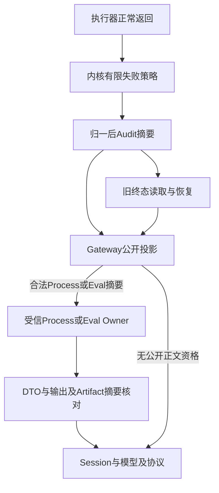

# 结构化失败结果公开边界验收报告

## 1. 摘要与结论

实现Revision：`4492a66bd41314d35dd20999f1cf0f7d9a2cf1ac`。
设计与源码映射见[详细设计](../../changes/m09-4a-returned-failure-boundary.md)，长期取舍见
[ADR 0093](../../adr/0093-kernel-owned-public-failure-contract.md)。

本地完整回归 **4220 passed / 32 skipped，356.65秒**；专项 **107 passed，2.56秒**，包含新增106项
与扩展后的既有Schema测试1项。完整回归包含专项，二者不能累加为独立测试总数。
完整回归明确排除未跟踪`tests/security`草稿；没有把草稿修改、提交或当作TM攻击验收。
证据清单参数在完整回归后追加，新增2项完整性测试须由冻结后专项验证，不能追认进4220。

该专项已经实现，**整体0.9与正式发布仍阻断**：许可证门禁发现12个Archive；成功业务输出与
返回预算、其他公开边界、攻击套件、远端MCP、实际安装/Beta和Provider发布验证均未关闭。
`make check`不标记通过。模型使用ScriptedProvider，本轮真实模型API请求为0，没有新增定时任务。

## 2. 缺陷复现与根因

执行器正常返回的失败Outcome只受JSON和码格式约束，不经过异常sanitizer。原码进入新Audit，
任意诊断正文进入Tool Result和模型/Session/Protocol事件。内核受信绑定不能为外部返回数据授权。

在整改前Revision `a0a136e8123bb2ed4db368917bcf61f218ab013f`的独立`git archive`上运行当前负例，
实际导入的Router模块来自该归档：**10 failed / 2 deselected，0.45秒，exit 1**。此处2项为后来增加
的历史链投影测试，按`-k`排除。负例只使用合成式样，不使用真实凭据或外部服务。
复现日志仅保存摘要与SHA，不把合成诊断正文复制到公开证据包。

## 3. 架构、合同与效果语义



- 码表按宿主冻结的来源与Execute/Reconcile选择；自定义执行器默认使用固定分类，不接受动态注册或码前缀。
- 失败正文默认不公开，Artifact摘要默认清空。合法Process/Eval失败摘要严格绑定Profile、Process ID与终态事实。
- Provider正常返回的失败投影再验证正式DTO、canonical_digest与ArtifactRef SHA；Shape不是Owner字节验证或所属域授权。
- 失败内容不合格不改外部效果kind或external_action_id；UNKNOWN/MANUAL不降级为已证明失败，不额外Execute。
- 旧私有Audit链原样保留，公开投影重新归一；不是历史存储清洗。没有改变v1计划或批准指纹。
- Eval非零正常退出仍SUCCEEDED且passed=false；正式诊断字节仍可由Owner发布受控Artifact。
- 恢复崩溃窗口的FAILED可能使Turn保持FAILED；直接确定失败可反馈模型继续处理；UNKNOWN/MANUAL保守中断。

## 4. 验证矩阵与环境

| 组 | 项数 | 验证内容 |
|---|---:|---|
| 正常返回与历史Audit投影 | 12 | 两阶段/三失败kind、未知与跨来源码、旧链不改、禁止重执行和非法Provider调用 |
| Process/Eval与Provider投影 | 56 | 正式元数据保留，错误身份/字段/类型/终态/摘要/Artifact拒绝，Provider映射异常归一 |
| 实际Runtime公开面 | 18 | 新Audit、Session与回放、非空OTel、Protocol Server/SDK事件、实际后续模型历史与恢复记账间隙 |
| 来源与阶段码表 | 20 | Patch/Git/MCP/Skill来源资格与跨阶段拒绝；已登记码不能授权任意JSON；外部ID不因公开内容归一而清空 |
| 既有Schema一致性 | 1 | 三个新公开DTO Schema加入生成器并与源码一致 |
| 合计 | 107 | 含新增106项，全部纳入完整回归 |

环境：macOS arm64、Python 3.13.8。正式Process专项使用真实类型化Lease与文档构造器、合成Executor；
不冒充额外真实容器或远程服务器验收。Runtime专项实际使用SQLite、Agent Runtime、Protocol与OTel，
模型为ScriptedProvider。已有Process/Delivery/MCP/Skill回归同属完整4220，平台条件跳过如实保留。

## 5. 静态门禁、文档与源码输入

Ruff与格式、Mypy 330源码文件、合同生成一致性、Task Pack、SBOM Schema及漂移、6规则Secret自检、
可读性/结构治理、文档链接与变化Mermaid真实渲染均通过。Ruff同样排除未跟踪的安全草稿。

只增加两条ADR有理由的DTO依赖边：trusted_actions→processes、trusted_actions→artifacts。
不批准新依赖环，不放宽长度/复杂度阈值，不导入Owner运行时或SQLite Artifact Store。
文档与Mermaid基线记录为292份/7776链接/709幅、26包；新增本文后最终门禁数量独立记录，不追认进旧数字。

[bundle-manifest.json](bundle-manifest.json)绑定5份证据原字节和25个`git show 4492a66:<path>`源码/合同/
测试输入。Manifest自身不纳入Hash，避免自引用。Windows签出保留原字节，不设置扫描器豁免。

## 6. 干净发行物与Secret验证

工作树首次sdist包含未跟踪安全草稿，不能作为干净发行验收。正式证据从**精确4492a66的git archive**
构建离线Wheel/sdist：两者均不含该草稿。记录产物SHA、字节数、成员数量及实际零命中扫描；没有声明
两次构建位级可复现，也没有因Secret扫描通过而称正式发布通过。

初次显式发行物扫描使用macOS`/tmp`别名，因其真实符号链接祖先而exit 2、scan_input_unsupported；
验证`/tmp → private/tmp`后使用同一受控产物的真实`/private/tmp`路径扫描，未放宽检查器。
正式干净发行物与当时2250个Tracked输入、产物目录3个文件合计**2253个输入完整覆盖，6规则零命中**。
2250的源码侧采样与发行物组合验证分开记录；新证据文件提交后的源码数量不能追认进2253。
产物元数据见[outcome-facts.json](outcome-facts.json)，实际Build不替代License准入。

## 7. CI、风险与Go/No-Go

前序Revision a0a136e的[CI 36293402289](https://github.com/carrie1988/Harnessix/actions/runs/36293402289)
已终态失败：Windows、macOS、Documentation、Container成功，Python 3.13的许可证门禁12件违规、
exit 1；Python 3.12取消。不将前序成功作业作为本次4492a66新合同的跨平台验收。

本包冻结时本次代码尚未推送，CI状态为not_started_at_freeze。随后推送批次的CI采用后台方式，不逐
提交重启或等待；正式发布仍要求对应Revision的终态证据。历史包保持不可变。

| 范围 | 判定 |
|---|---|
| 本地结构化失败边界 | 已实现并通过窄专项与完整回归 |
| 0.9.4a整体 | 未关闭：成功输出、返回预算与其他公开边界仍开放 |
| 供应链与正式发布 | No-Go：12件许可冲突与其他发布条件仍开放 |
| 0.9总体 | 进行中，不标记完成 |

## 8. 复验与资料清单

```bash
uv run pytest --ignore=tests/security -q -o addopts=''
uv run pytest tests/trusted_actions/test_returned_failure_boundaries.py tests/trusted_actions/test_returned_failure_runtime.py tests/trusted_actions/test_process_failure_projection.py tests/trusted_actions/test_failure_policy_sources.py tests/trusted_actions/test_schemas.py -q -o addopts=''
uv run pytest tests/governance/test_security_governance_evidence.py -q -o addopts=''
uv run python scripts/generate_specs.py --check
uv run python scripts/readability_report.py --check --check-final-report --quiet
uv run python scripts/documentation_check.py
uv run python scripts/license_scan.py --check  # 当前预期阻断12件
```

- [verification.json](verification.json)：环境、实际命令、日志摘要/Hash、门禁状态与冻结后复验。
- [outcome-facts.json](outcome-facts.json)：测试矩阵、状态不变量、干净产物及未关闭范围。
- [ci-observation.json](ci-observation.json)：精确前序CI、失败步骤与当前冻结状态。
- [review-packet.json](review-packet.json)：源码评审重点、发布阻断与非目标。
- [bundle-manifest.json](bundle-manifest.json)：原字节与固定源码输入的完整性。

冻结后治理与结果专项合计136 passed（4.29秒），含新增2项证据完整性，不追加到此前4220。
最终文档门禁为293份、7789链接、710幅Mermaid、26包；新增报告图单独真实渲染并完成视觉检查。
