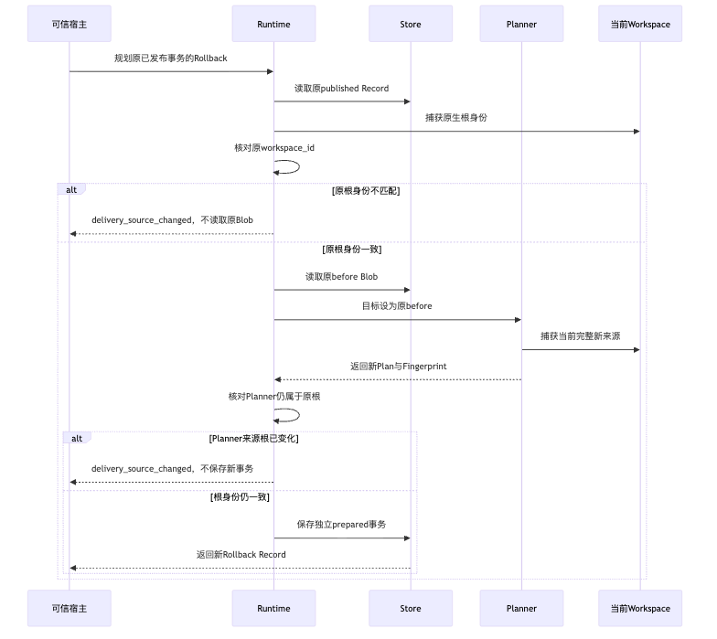

# Rollback原Workspace身份修复与产品交付边界验证

## 1. 需求背景、目标与有限结论

首发范围保留本地Commit、Checkpoint和Rollback，但当前默认产品工具目录只装配受管Patch与条件Process。
底层Delivery组件存在不等于正式产品可达；这三项产品交付接线仍是原R4的必需工作，不延期、不删除。
公开SDK与默认装配源码分别为[AgentClient](../../../src/harnessix/sdk/agent_client.py)和
[Action组合](../../../src/harnessix/product_config/action_composition.py)。

产品接线前核查发现，原`build_rollback`只检查原事务published，未要求传入根属于原事务。
真实Planner/Store/发布端口复现了异目录、重定位及原路径对象替换仍可生成新回滚计划。
修复在读取原Blob之前绑定根身份，并在原Planner独立捕获后再次比较，拒绝时无新事务和文件写入。
生产基线为上述Revision；修正后的实际源码和用例字节以[事实](facts.json)的SHA256为准。

**仅原Workspace身份修复及已执行本地关联回归GO；R1/R4完整产品闭环和商用1.0仍NO_GO。**
不把组件修复称为已上线Rollback，不以原生CI选择器存在代替Windows实际结果。
真实模型请求0；原费用保护与未知预留未改变，不增加真实质量Trial。

## 2. 总体方案、接口与源码阅读入口

完整需求、字段、调用链、时序、数据流、伪代码、持久化和失败语义见
[Delivery第16节](../../modules/delivery.md#16-rollback语义)。

| 设计职责 | 当前源码 | 验证作用 |
|---|---|---|
| 公共Facade与双身份比较 | [`filesystem.py`](../../../src/harnessix/delivery/filesystem.py)的`build_rollback/_build_rollback` | 先验证原根，再读取Blob；规划后身份变化不得入库 |
| 原生根ID | [`snapshot.py`](../../../src/harnessix/workspace/snapshot.py) | 平台、规范路径摘要与根对象身份；不是当前全部资源Revision |
| 新事务与来源资源 | [`planner.py`](../../../src/harnessix/delivery/planner.py) | 当前完整Snapshot、before/after版本和新Fingerprint；原参数不变 |
| 原Record与Blob | [`store.py`](../../../src/harnessix/delivery/store.py) | 拒绝前无`save`；原事务及正文保持，Schema不变 |
| 执行边界 | 原`_prepare_publication`及平台成员端口 | 仍须新批准、当前Lease、Snapshot与逐成员CAS |
| 正反例 | [`test_rollback_binding.py`](../../../tests/delivery/test_rollback_binding.py) | 六项实际文件/Store回归，不使用伪造published Record |

原类内直接扩展导致热点长度151超过原142门槛，原失败保留。
按同模块现有`_publish_next/_prepare_publication`模式提取唯一私有回滚规划函数，公共签名和调用者不变；
类长度降至125，没有复制状态机或引入新模块/服务。
仅刷新可读性事实报告，不改热点上限、文档规则、复杂度策略或原测试预期。

## 3. 正反例与执行证据

新增六项用例先取得**5失败、1通过**，原件SHA保留，随后修复并执行独立复验。
用例覆盖：

1. 另一个目录，即使相关文件恰好等于原after，也不得成为回滚来源；
2. 原目录被重定位，根路径作用域改变仍须拒绝；
3. 原路径下新建不同根对象，路径字符串相同不能代替原生身份；
4. 异根应在读取原事务Blob前拒绝；
5. 第一轮核验后、Planner捕获前置换根，第二次比较拒绝保存；
6. 同一根正常回滚，无关用户文件保持，新Fingerprint不等于原批准；原批准被实际发布端口拒绝。

最终六项焦点全部通过；最终关联241项：**217通过、24平台跳过、0失败/错误**，耗时50.236秒。
焦点包含于关联，不与原失败、其他候选或治理结果相加；原JUnit和日志摘要以[结构化事实](facts.json)为准。
完整治理另取300项通过，零跳过/失败/错误；资料组装首轮缺少Manifest链接的一项失败保留，
补齐材料后复验，不修改文档规则或产品预期。变化Delivery资料18幅Mermaid均实际渲染，
公开时序PNG单独生成并检查；全库867幅只是结构计数，不宣称全库图示已渲染。
实际内部`1.0.0rc1` Wheel已离线构建，变化生产成员与受测源码逐字节一致；SHA与字节数见事实文件。
仓库及实际Wheel共3576个输入完整Secret扫描、零命中；不据此宣称源码外安装或Windows运行通过。
Windows NTFS焦点保留全部原用例与三分钟保护，并增加同一跨平台文件；新候选必须独立取得原生结果。
本地Windows跳过不能转换成通过，原活动Job不因观察超限而重启。

## 4. 异常、安全、取消与恢复

根身份冲突使用既有`delivery_source_changed`与固定消息；不公开路径、Blob或用户正文。
拒绝不新建事务、不改原Record、不发布文件，原私有Blob和恢复事实保持。
合法回滚以当前资源捕获新Snapshot，而不是用发布前资源Revision检查已变化的after。

两轮观察不是OS级原子锁；捕获完成后仍可能发生外部变化，原发布前Snapshot及逐成员CAS继续拒绝漂移。
已有Lease、取消检查点、未知效果对账及恢复状态机不变；不引入重复执行或隐式批准。
当前同文件第三内容仍按原组件行为捕获为新before，产品冲突选择未在此专项改变。
不宣称该修复已覆盖全部Rollback产品安全、任意同UID攻击或完整DLP。

公开材料只保留源文件、数值、固定分类和哈希；临时Root、Host名、私有状态及测试失败的原路径不复制。
没有真实凭据、模型调用、容器启动、远程部署或用户仓库改写。

## 5. 评审、完整性与剩余发布工作

[Verification](verification.json)、[Review Packet](review-packet.json)和[Manifest](manifest.json)
绑定范围、原失败、当前源码、原件摘要及交付文件。校验只证明字节一致，不替代业务或平台验收。

下一正式产品工作沿原R4补交付控制、原始来源、审批、持久状态与恢复；
不能直接暴露需要干净来源仓库的Git底层API，也不能对已被Patch修改的原目录执行任意Git命令。
产品须保持用户已有修改、当前来源HEAD/Index及已有Branch，Commit不授权Push。
真实费用核对、完整20 Trial、消费者Windows11、独立Beta、必要发行权利及最终同候选R1～R6继续开放。
