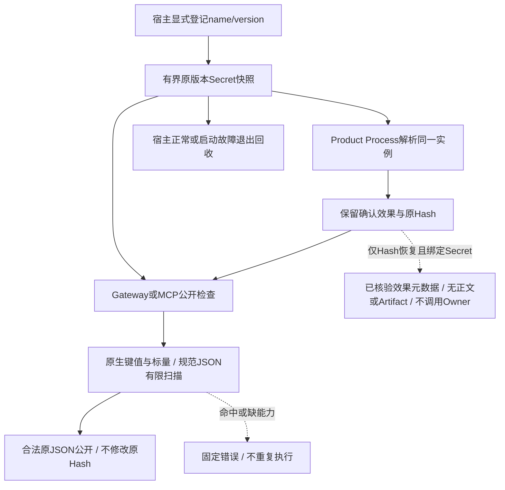

# 版本化Secret公开保护作用域验收报告

## 1. 范围、背景与结论

实现Revision：`648f5f1b7b422462979f25df036994802f0b553f`。
[完整详细设计](../../changes/m09-4a-versioned-secret-publication.md)和
[ADR-0095](../../adr/0095-versioned-secret-publication-scope.md)说明需求、上游源码研究、方案取舍、
架构、流程、时序、数据流、类与接口、字段、伪代码、错误、取消、期限、恢复、安全和部署。

[前序独立观察](../custom-success-2026-09-27-v1/README.md)证明字段合同与Hash正确时，已绑定Secret值
仍可进入Session、下一模型请求和SDK回放。本次引入宿主显式版本化内存快照：仅解析登记绑定，
Product Process执行与公开检查使用同一实例；检查原摘要和Owner重建结果，拒绝正文而保留已确认效果。

专项 **60 passed，1.51秒**（54新增、6项原MCP回归），相关回归 **802 passed，15.35秒**，
相关回归取自此前3dc72c0源码；两版生产差异仅Scope扫描注释更正，不影响逻辑。
两者与完整回归重叠，不相加。完整回归尚未运行，当前仅为限定作用域实现与专项验证，
不声明全量验收、全部Secret端到端安全、跨重启正文安全恢复或整体0.9完成。
真实模型请求0，无新增定时任务；未跟踪安全草稿不修改、不提交、不计作TM编号验收。

## 2. 独立旧版负例

在独立`58e51aa7d7ca42db8accb1b84b9911e589caf2d3`源码归档中复制当前测试，
只选不提供作用域的4项已有接口案例。未选新能力的导入被省略，实际Gateway模块路径核验为归档位置。
结果 **4 failed，7 deselected，0.26秒，exit=1**，全部为`DID NOT RAISE`，
并非构造或导入错误。当前同4项默认拒绝；其余显式作用域覆盖原值、Base64、URL和Hex。

旧冻结报告保持不变。本报告不把早期因新参数缺失导致的失败当作负例，不用当前目录冒充旧版本。

## 3. 执行、公开与恢复边界

[Scope](../../../src/harnessix/secrets/publication.py)保存独立可清零副本，不枚举环境或落盘明文；
[纯保护接口](../../../src/harnessix/trusted_actions/agent_gateway_output.py)不增加trusted_actions到secrets
的具体依赖。Product组合根保证同一实例，独立SDK/MCP宿主须遵守同一执行与公开快照合同。
环境旋转不替换运行中已捕获值。Scope关闭后，Process在无Lease时归类确定前置失败，Run/Reconcile=0。

原生树、规范JSON和有限模式使用共用工作量及取消检查点；Owner发布前与重建后均检查。
[Gateway检查点](../../../src/harnessix/trusted_actions/output_budget.py)识别Token、期限和父Task取消，
终止时不启动Owner；实际取消不等于任意同步Provider或不协作Owner可被硬抢占。

只有Hash且绑定Secret的恢复，不以同名同版本新环境值授权旧正文。原Binding和Audit核验后仅返回
确定效果元数据，不公开正文或Artifact，不调用Owner，不重复Execute/Reconcile。
这是保留效果可观察性的降级路径，**不是跨重启旧Secret正文安全恢复**。

## 4. 用例、源码与证据适用性

| 文件及用例数 | 证据、边界与负例 |
|---|---|
| [Scope 30项](../../../tests/secrets/test_publication.py) | 键/字符串/标量、已有有限编码、规范JSON凭据、版本缺失、宿主异常、材料类型/长度、环境旋转、清零和关闭；原生循环/钩子/深度/节点/字节/共享工作预算。 |
| [Gateway 14项](../../../tests/trusted_actions/test_secret_publication.py) | 原值及编码×默认拒绝/显式快照共8项；Owner安全/命中/仅Hash恢复3项；受控时钟、Token和父Task取消3项。Audit保持成功，Execute=1、Reconcile=0，恢复不再执行。 |
| [实际Runtime 3项](../../../tests/trusted_actions/test_secret_publication_runtime.py) | 缺能力/命中/合法值，实际SQLite、已审批Action、非空SDK回放及OTel、下一Scripted请求和全部数据库字节；拒绝Turn失败但已确认效果成功，无第二次模型请求，恢复无重复。合成Executor和Scripted模型不代表真实Provider发布。 |
| [Product 4项](../../../tests/product_config/test_secret_scope_composition.py) | POSIX实际Executor+Scope/Router/Plan，旋转后仍解析原值；关闭后无Lease不Run。正常及启动失败组合根退出2项使用真实Gateway/Scope/SQLite及Container构造替身，不代表实际容器安装或Windows安装。 |
| [MCP 9项](../../../tests/mcp/test_server.py) | 6项既有回归，3新增实际Client安全/命中/Scope关闭；独立MCP Server有界字段+值检查，不借用Gateway结果，也不覆盖远端HTTP/OAuth。 |

[Product装配](../../../src/harnessix/product_config/action_composition.py)控制能力注入及失败清理；
[组合根](../../../src/harnessix/product_config/action_runtime.py)以AsyncExitStack注册回收，
在尚未创建AgentRuntime时也释放Scope；[Process前置失败](../../../src/harnessix/product_config/process_action.py)
只有确认没有Lease时归类确定失败；[MCP导出](../../../src/harnessix/mcp/server.py)独立检查原生DTO。

## 5. 静态、发行物与门禁

Ruff规则/格式、Mypy **337源文件**、生成合同、可读性/依赖门禁、SBOM及Secret自检通过。
既有生成Schema无漂移，无新增包、依赖边或环，不放宽可读性政策，不迁移Plan Binding/Audit。

干净实现Revision的git archive离线构建Wheel **380成员**与sdist **2299成员**；
原字节Hash见[事实](contract-facts.json)，均不含未跟踪安全草稿。
实际Secret扫描 **2321输入**完整覆盖、固定6规则零命中，不等于全部语义泄漏或位级可复现。

许可证门禁仍 **exit=1、12件受限Archive**；未放宽既有拒绝政策，不声明make check通过。
详细设计4图及报告1图已实际渲染为非空PNG并逐图目视复核；
文档门禁实际渲染变化文档通过，覆盖305份文档、8061条链接、735幅Mermaid、26个源码包。完整回归和冻结后检查待登记；
所有未完成项在[验证](verification.json)明确记录，不用预测数量代替实际结果。

## 6. 开放风险、CI与复核材料

有限模式不解决任意变形、拆分推断或未登记Secret。全部模型Provider凭据、历史Session和Artifact
公开治理、Owner/Store内部字节与归属、跨重启安全正文恢复仍开放。Python不可变内存不承诺擦除；
超界宿主材料不复制，也不进行超界全量清零，保留宿主所有权。Provider任意同步阻塞不承诺硬抢占。

12件许可权利链、TM编号攻击证据、远端MCP身份/OAuth/出口、三平台实际安装/升级/卸载/Beta及
真实Provider发布/成本适用性仍阻断正式发布。32项历史跳过不能作为平台验收。

当前实现CI冻结时尚未启动；[CI观察](ci-observation.json)仅记录58e51aa运行的一次后台快照，
不是本次版本终态。统一推送后后台运行，不逐提交等待、不重复重启，也不以旧结果代替新验收。

复核材料集中本目录：[Manifest](bundle-manifest.json)、[事实](contract-facts.json)、
[验证](verification.json)、[Review Packet](review-packet.json)、[CI观察](ci-observation.json)。
Manifest记录5个交付文件及28项实现Revision输入Hash，自身排除；旧冻结材料不回写追认。
