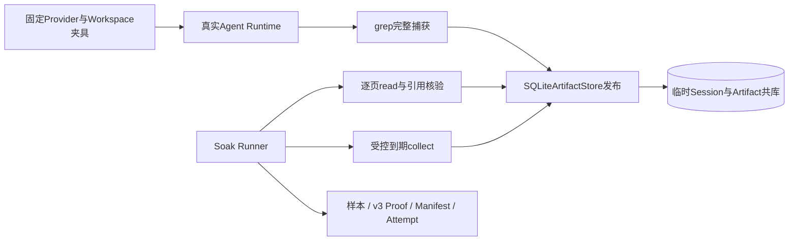

# 0.9.3d macOS Artifact增长Soak单次规模事实

## 1. 结论与当前门禁

在干净源码Revision `784cd54ec2383c6a3679d64db401ad4d3bf9b86a`上，
[`run_artifact_growth`](../../../scripts/soak_artifact_growth.py)通过真实`AgentRuntime → CodingToolRuntime.grep → SQLiteArtifactStore`
完成单Thread、2件预热和20件正式Artifact。正式件包含5件接近1 MiB上限的正文和15件小正文；全Run合计
22件、197页，正式样本包含20条发布时延、195条逐页读取时延及1条峰值RSS。所有Turn终态和Session事件
在生成期间经过Replay一致性检查，全部引用在真实`read`中分页至尾，受控到期清理后22份正文均置为Tombstone，
历史引用逐件返回`artifact_expired`。原始文件复制件经
[`read_published_run`](../../../scripts/soak_evidence.py)和
[`read_attempt`](../../../scripts/soak_attempt.py)双重重读；独立标准库程序另行重算分位数、大小件/页数和逻辑字节。

**这只是macOS单平台单次诊断规模事实，不是可冻结Profile的发行基线或性能发布PASS。** Manifest中的
`baseline`仅表示固定规模、运行前干净Revision和RSS单位核对已满足Runner合同；对应Revision的
[六实例CI 35821931723](https://github.com/carrie1988/Harnessix/actions/runs/35821931723)在首次运行中，
Windows Benchmark Job `107055444536`因临时SQLite只读查询句柄未显式关闭而失败，4项测试在清理临时目录时
出现`WinError 32`。`sqlite3.Connection`上下文管理器只处理事务，不负责`close()`；后续Revision须显式关闭
句柄，并在新的干净Revision重新运行完整规模，不能把修复后的CI结果回填到本Run。尚无经工程评审冻结的
数值Threshold Profile、第二次同平台Run、Linux/Windows正式负载，以及SDK容量、Action恢复和完整重启
三个场景的Soak。

## 2. 系统边界与固定负载



| 项目 | 原始事实或边界 |
|---|---|
| 源码Revision | `784cd54ec2383c6a3679d64db401ad4d3bf9b86a`，运行前`git status --porcelain`为空 |
| Run ID | `410214108d394cfeabc48ecf1b29f566` |
| UTC时间 | 2026-09-23 05:19:58.734006～05:20:04.521223，约5.79秒 |
| 场景/测量边界 | `artifact_growth → artifact_store`；Manifest/场景版本均为v3 |
| 环境 | macOS、Python 3.13.8、16逻辑CPU、`c16-m48`硬件档位；RSS来源`getrusage`原始单位bytes且已核对 |
| 负载 | 单Thread、2件预热、20件正式、Seed 0；每Turn一件、固定Provider 44次模型步骤请求，均不访问网络模型 |
| Artifact覆盖 | 22件，其中近上限5件、小件17件；逐页读197页，其中正式195页；到期前逻辑正文4374662字节 |
| 清理 | `expired=22`、`protected=0`、`tombstone=22`、保留Manifest 22、到期后活正文0字节 |
| 故障计数 | 六类均为0；本次没有注入复合故障，不等于故障矩阵验收 |

固定Provider只保存请求次数和当前夹具选择，不保存请求历史。`grep`输出完整捕获与模型可见预览分离，
每件的发布时延仅包围`SQLiteArtifactStore.publish`，读取时延仅包围一次`read`，不是完整Turn或产品启动时延。
临时业务库在证据发布前关闭并清理；发布目录只含白名单数值、枚举、摘要和匿名Run身份。

## 3. 数值结果与解释

`nearest_rank_v1`对正式样本使用`ceil(p × n / 100)`的1基位置；时延单位纳秒，RSS单位字节。

| 指标 | 样本数 | P50 | P95 | P99 |
|---|---:|---:|---:|---:|
| `artifact_publish` | 20 | 7437708 | 13875208 | 15718958 |
| `artifact_read` | 195 | 5980250 | 6540625 | 6819959 |
| `rss_peak` | 1 | 76513280 | 76513280 | 76513280 |

Session DB端点由98304增至5058560字节，WAL两个端点均为0；Artifact逻辑正文从0增至清理前
4374662字节，随后因到期清理归零。DB端点不等于运行期磁盘峰值，也不因Tombstone自动缩小；
`rss_peak`是整个Runner进程高水位，不是Artifact Store独占内存。当前只记录单机单次事实，不从P95
反推可接受阈值，也不把低故障计数解释为复杂恢复已经通过。

## 4. 原始文件与完整性

| 文件 | SHA-256 | 作用 |
|---|---|---|
| [`samples.jsonl`](410214108d394cfeabc48ecf1b29f566/samples.jsonl) | `ee744bd9ea380cfcf496a3ed80357050e4da9e4683a91f9b8b43625a3835725c` | 全部预热/正式发布及分页时延、正式RSS样本 |
| [`artifact-proof.json`](410214108d394cfeabc48ecf1b29f566/artifact-proof.json) | `191d9d18012b170add5bb501f69df02970c7e86ca5471ab16befa1b8bb08b1f1` | 每件匿名序号、大小/记录/页数、样本索引及清理计数 |
| [`manifest.json`](410214108d394cfeabc48ecf1b29f566/manifest.json) | `f7a03326b4d4d624d4c9fbb3e769ba6f8f93ca4ab0cea83944ebbad159225153` | 运行环境、负载、分位数、水位与Proof摘要 |
| [`COMMITTED.json`](410214108d394cfeabc48ecf1b29f566/COMMITTED.json) | `84bd0611922c7b43ce621c7dbde5d03c1ef0fe796424f82fb5c2cc5a7c440b18` | 最后提交标记，绑定Manifest原始字节 |
| [`STARTED.json`](attempts/410214108d394cfeabc48ecf1b29f566/STARTED.json) | `8b4945825748e068086e75d3f70f6afd5623a4ab7799f65f235b8d6789089c24` | 负载前Attempt身份与开始时刻 |
| [`FINAL.json`](attempts/410214108d394cfeabc48ecf1b29f566/FINAL.json) | `f7f165baed448420f766709fd16e5e73e48e30079e5e219144240118e9e98acc` | `committed/publishing`终态及Manifest摘要 |

六个复制文件与生成原件逐字节相同。Reader拒绝缺文件、附加文件、非规范JSON、摘要错、跨指标样本复用、
大小件和清理数量不一致；完整Attempt才允许后续阈值复验。独立标准库重算了20条发布、195条读取、
1条RSS的分位数，以及22件、197页、4374662字节、5件近上限和清理零活正文。隐私扫描未检出
宿主绝对路径、临时库名、固定搜索正文、凭据前缀或业务UUID。Proof是脱敏数值覆盖证明，**不能在临时
业务库清理后独立重建每份Artifact正文**，也不证明真实24小时TTL漂移或Windows文件回收能力。

## 5. 离线复核与后续验收

在仓库根目录执行以下命令不会调用模型或修改业务状态：

```bash
uv run python - <<'PY'
from pathlib import Path
from scripts.soak_attempt import read_attempt
from scripts.soak_evidence import read_published_run

run = Path('docs/validation/soak-macos-artifact-2026-09-23-v1/410214108d394cfeabc48ecf1b29f566')
manifest, digest = read_published_run(run)
_, final = read_attempt(run.parent / 'attempts' / run.name)
assert manifest.load.artifact_count == 22
assert manifest.sample_counts['artifact_publish'] == 20
assert manifest.sample_counts['artifact_read'] == 195
assert final is not None and final.outcome == 'committed'
assert final.manifest_sha256 == digest
PY
```

下一Revision须完成Windows句柄修复与全矩阵CI验收，并从该新Revision重跑正式规模；本Run只供缺陷复现和
数值诊断，不作为Profile来源。发布工程再结合稳定性和容量余量独立评审数值，冻结与硬件档位绑定的Profile；
随后以新Run、预绑定Profile和完整Attempt运行独立复验。Linux、Windows分别生成同规模证据，
并完成剩余场景与0.9.4～0.9.6门禁；本目录单独不得用于发布PASS。
