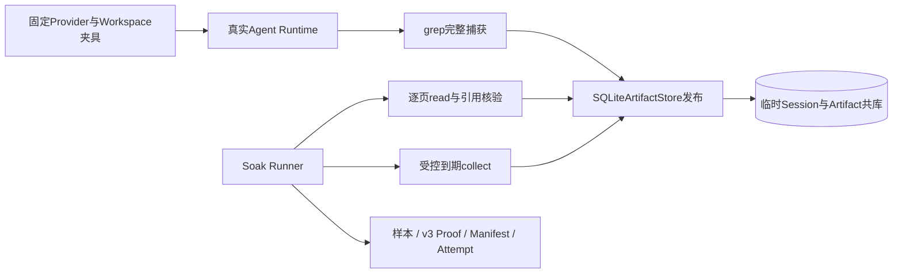

# 0.9.3d macOS Artifact增长Soak单平台规模基线

## 1. 验收结论与限制

在干净Revision `5d48b9735c11022743eb56df5da23125702b0140`上，`run_artifact_growth`
通过真实`AgentRuntime → CodingToolRuntime.grep → SQLiteArtifactStore`完成单Thread、2件预热及20件
正式Artifact。Run/Attempt原始文件已逐字节复制，Reader重读和独立标准库分位数/覆盖重算通过；对应
[CI 35824543623](https://github.com/carrie1988/Harnessix/actions/runs/35824543623)的Windows、macOS、
Linux Python 3.12/3.13、固定Container和Documentation六个作业全部成功。此前两次Windows
`WinError 32`分别暴露同步只读查询未显式关闭和异步连接取消收尾，当前Revision的原生门禁均已通过。

**本证据只达到macOS单平台、单次规模基线，不是性能发布PASS。** `manifest.status=baseline`只证明
负载、干净Revision、单位和证据合同满足最低门槛；还没有经工程评审冻结的数值Threshold Profile、
第二次同平台预绑定Profile的独立Run、Linux/Windows正式规模运行，也没有完成0.9.3d其余三个场景。
该Run可作为后续Profile候选来源，不得以本次P95反推阈值或直接关闭0.9.3d。

## 2. 系统边界与固定负载



| 项目 | 原始事实或边界 |
|---|---|
| Run ID | `435d230dfb9d49aca3622822f2de1a9c` |
| UTC时间 | 2026-09-23 05:57:17.745424～05:57:23.491957 |
| 环境 | macOS、Python 3.13.8、16逻辑CPU、`c16-m48`；RSS为`getrusage`原始bytes，已核对 |
| 负载 | 2预热+20正式Turn；每Turn一件，固定无历史Provider 44次模型步骤请求，零网络模型调用 |
| Artifact覆盖 | 22件，其中近上限5件、小件17件；共197页，正式读取样本195页 |
| 清理 | 清理前逻辑正文4374662字节；过期22、Tombstone 22、保留Manifest 22、清理后活正文0 |
| 故障计数 | 六类均为0；本Run未注入复合故障，不代替故障矩阵 |

每件从真实ToolResult取得引用并完整分页读取；Session事件与投影在运行中重放核对，到期后全部
引用逐件返回`artifact_expired`。`artifact_publish`时延只包围Store发布方法，`artifact_read`
只包围单页读取；不是完整Agent Turn或产品启动时延。临时业务库在证据发布前关闭和清理。

## 3. 原始数值与统计

`nearest_rank_v1`对正式样本升序排列，取`ceil(p × n / 100)`的1基位置；时延单位纳秒，RSS单位字节：

| 指标 | 样本数 | P50 | P95 | P99 |
|---|---:|---:|---:|---:|
| `artifact_publish` | 20 | 7126583 | 13654625 | 15571375 |
| `artifact_read` | 195 | 5919917 | 6604000 | 6911875 |
| `rss_peak` | 1 | 76578816 | 76578816 | 76578816 |

Session DB端点由98304增至5058560字节，WAL两个端点均为0；Artifact逻辑正文由0增至
4374662字节，受控清理后归零。DB端点不是运行期磁盘峰值，也不因Tombstone自动缩小；RSS是Runner
进程峰值，不是Artifact Store独占内存。单次样本不构成跨机器或跨版本性能结论。

## 4. 原始文件、摘要与复核

| 文件 | SHA-256 |
|---|---|
| [`samples.jsonl`](435d230dfb9d49aca3622822f2de1a9c/samples.jsonl) | `49b7bb68e51587b6c1ab78d72444f2603bbab162c0f931a1592155214b601612` |
| [`artifact-proof.json`](435d230dfb9d49aca3622822f2de1a9c/artifact-proof.json) | `f8cc14bde5305cc1a857f851c5609926b3d75c972755a78cf38ffb01bc3b5668` |
| [`manifest.json`](435d230dfb9d49aca3622822f2de1a9c/manifest.json) | `885521eb6519acfdd3069345bca4055da8d32c422a759fd0e9dfcac4046f592b` |
| [`COMMITTED.json`](435d230dfb9d49aca3622822f2de1a9c/COMMITTED.json) | `462771a2d6dc2162ceeb1152bcaaedd82f5a93bb2a8b51c62565e3f0e18191d3` |
| [`STARTED.json`](attempts/435d230dfb9d49aca3622822f2de1a9c/STARTED.json) | `45b3120cfddd8fbad23415ec748e417648f89f5a13899895413e0bab01c50ec5` |
| [`FINAL.json`](attempts/435d230dfb9d49aca3622822f2de1a9c/FINAL.json) | `cfcdaebf0aa3431a400d6665a5cd8e12e51b27f2cb1afd6a9c03e9b6dc0ba04f` |

复制件与生成原件逐字节相同。`read_published_run`和`read_attempt`确认完整文件集、规范字节、
Manifest摘要与`FINAL.outcome=committed`；独立标准库代码另外重算20条发布、195条正式读取和1条
RSS的P50/P95/P99，以及22件、197页、5件近上限、清理前后正文和逐件记录覆盖。低敏扫描未检出
宿主绝对路径、临时库名、固定搜索正文、HTTP认证Header或凭据前缀。Proof不包含业务ID或正文，
也不能在临时库清理后重建原Artifact内容；受控时钟不证明真实24小时TTL漂移。

仓库根目录可离线重读，不调用模型或更改业务状态：

```bash
uv run python - <<'PY'
from pathlib import Path
from scripts.soak_attempt import read_attempt
from scripts.soak_evidence import read_published_run

root = Path('docs/validation/soak-macos-artifact-2026-09-23-v3')
run_id = '435d230dfb9d49aca3622822f2de1a9c'
manifest, digest = read_published_run(root / run_id)
_, final = read_attempt(root / 'attempts' / run_id)
assert manifest.load.artifact_count == 22
assert manifest.sample_counts['artifact_publish'] == 20
assert manifest.sample_counts['artifact_read'] == 195
assert final is not None and final.outcome == 'committed'
assert final.manifest_sha256 == digest
PY
```

发行门禁的下一步是由工程评审独立定义允许增长的数值余量并冻结平台Profile，再在另一份新Run中
预绑定Profile并复验；另须完成Linux/Windows正式负载、SDK容量、Action恢复、完整重启及0.9.4～0.9.6
各自门禁。本目录单独不得用于发布PASS。
