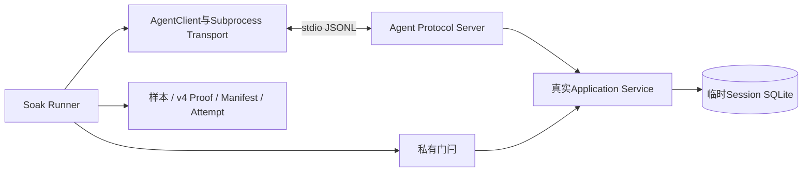

# 0.9.3d macOS SDK容量Soak单平台规模基线与评审包

## 1. 结论及适用边界

在干净Revision `c4c364c059a7b6ea61410fe03ba41ef140fcdd41`上，真实
`AgentClient → SubprocessAgentTransport → stdio → AgentProtocolServer → AgentApplicationService → SQLite`
完成协商容量64、1轮预热、3轮正式满容量/取消/迟到Response及20次正常往返。原始Run和Attempt按规范字节复制，
`read_published_run`、`read_attempt`及独立标准库摘要/分位数复核均通过；
[CI 35833762475](https://github.com/carrie1988/Harnessix/actions/runs/35833762475)的Linux Python 3.12/3.13、
macOS、Windows、固定Container与Documentation六个作业全部成功。

**这是macOS单平台、单次规模基线，不是0.9.3d或1.0发布PASS。** `manifest.status=baseline`仅表示冻结负载和
证据合同满足最低门槛；尚未经过独立工程阈值评审、预绑定Profile的第二次Run、Linux/Windows正式规模运行或
`action_recovery`、`restart`场景验收。20次正常往返与固定门闩不能外推真实用户吞吐或延迟SLO。

## 2. 系统边界与执行合同



门闩只在真实`list_threads`业务读取之前暂停，不修改协议解析、SDK Response归并或SQLite实现。每轮先观察64个
Pending，再取消1个得到63 Pending加1 Abandoned；仅放行已取消请求，迟到Response释放墓碑后第65个请求才进入
Server。随后排空64个成功Response，Pending和Abandoned均归零。四轮的`64 → (63,1) → (64,0) → (0,0)`
状态以及溢出进入顺序由[`sdk-proof.json`](382e74c7ee09442282dfdd0c8bec53c7/sdk-proof.json)保存。

| 字段 | 固定事实 |
|---|---|
| Run ID | `382e74c7ee09442282dfdd0c8bec53c7` |
| UTC时间 | 2026-09-23 07:50:07.250318～07:50:07.777862 |
| 环境 | macOS、Python 3.13.8、16逻辑CPU、`c16-m48`；两进程RSS均为`getrusage`原始bytes |
| 负载 | 容量64，1轮预热、3轮正式容量验证、20次正式正常往返；固定Provider实际请求0 |
| 失败事实 | 预期取消4；超时、EOF、未知效果、重复效果及孤儿均0；关闭后容量0 |
| 测量边界 | `sdk_roundtrip`为客户端请求至完整Response的本地往返；不是模型请求或完整Agent Turn |

## 3. 原始数值及独立复核

正式`sdk_roundtrip`样本20条，按`nearest_rank_v1`取`ceil(p × n / 100)`的1基位置；单位为纳秒：

| 指标 | 样本数 | P50 | P95 | P99 |
|---|---:|---:|---:|---:|
| `sdk_roundtrip` | 20 | 1259291 | 1407042 | 1675792 |

20次往返窗口为25717750 ns，可按`20 × 10⁹ / 窗口ns`复算本次完成速率；阈值内核尚未定义吞吐下界，
不得把此速率当发布门槛。客户端和服务端各自峰值RSS分别为50708480和68845568字节，Manifest的
`rss_peak=68845568`取两者较大者，**不是两进程同时驻留内存之和**。临时SQLite主文件端点由0增至98304字节，
WAL两个端点均为0；端点不证明运行中的磁盘峰值。模型Provider请求为0，不产生模型网络调用或费用。

独立复核未调用Soak Writer：以标准库重算六份文件SHA-256、Manifest/COMMITTED/FINAL摘要链、21条原始样本
（20条往返、1条RSS）的覆盖、P50/P95/P99、四轮Proof、四次取消及父子RSS最大值。复制件与原件逐字节相同；
隐私扫描未检出宿主绝对路径、临时库路径、凭据前缀、认证Header、Prompt或业务请求正文。

| 原始文件 | SHA-256 |
|---|---|
| [`samples.jsonl`](382e74c7ee09442282dfdd0c8bec53c7/samples.jsonl) | `c0c0792fa6beabebac9cdecb39b7a8d1ffe3784acd6aed5cbf6cfd43eaa6a715` |
| [`sdk-proof.json`](382e74c7ee09442282dfdd0c8bec53c7/sdk-proof.json) | `bf82ebb6ff5c31ee678eaac2463a69df78de5f33f58adefac32bd2723c124400` |
| [`manifest.json`](382e74c7ee09442282dfdd0c8bec53c7/manifest.json) | `13bce426dfafb36c10f31268217699f2d699b3a9990f0560d459e07e22790006` |
| [`COMMITTED.json`](382e74c7ee09442282dfdd0c8bec53c7/COMMITTED.json) | `6e16d1d366fa89515cdd5ddfa5dbcfc58c75dc687325ae57bfc62afae303c2c9` |
| [`STARTED.json`](attempts/382e74c7ee09442282dfdd0c8bec53c7/STARTED.json) | `07469652393308a32e953fc554451194111a19b0b26d1850290116946a3eb4dc` |
| [`FINAL.json`](attempts/382e74c7ee09442282dfdd0c8bec53c7/FINAL.json) | `c1a74de9837f1663b30cf558ecf896a4dff0c72e8c09d90b8e52ee25987ef52c` |

仓库根目录可离线复验，不调用模型或修改业务状态：

```bash
uv run python - <<'PY'
from pathlib import Path
from scripts.soak_attempt import read_attempt
from scripts.soak_evidence import read_published_run

root = Path('docs/validation/soak-macos-sdk-2026-09-23-v1')
run_id = '382e74c7ee09442282dfdd0c8bec53c7'
manifest, digest = read_published_run(root / run_id)
_, final = read_attempt(root / 'attempts' / run_id)
assert manifest.load.pending_limit == 64
assert manifest.sample_counts['sdk_roundtrip'] == 20
assert manifest.fault_counts.cancelled == 4
assert final is not None and final.outcome == 'committed'
assert final.manifest_sha256 == digest
PY
```

## 4. 评审清单、失败语义及后续门禁

| 检查 | 结论 | 证据或剩余边界 |
|---|---|---|
| 源码与负载身份 | 通过 | 干净Revision、固定`pending_limit=64`和`sdk-capacity-v1` |
| 取消、迟到与关闭 | 通过 | 四轮Proof、四次取消、迟到后才释放容量、关闭零残留 |
| 证据持久化与独立重算 | 通过 | Run/Attempt规范文件、摘要链及原始样本重算 |
| 三平台合同回归 | 通过 | 对应Revision六作业CI；Linux RSS改用`VmHWM`，Windows失败标记固定LF字节 |
| macOS单平台规模基线 | 通过 | 本目录原始文件；不等同于重复试验或阈值PASS |
| 工程阈值及第二独立Run | 未完成 | Profile须由工程评审先冻结，再在新Run开始前预绑定并复验 |
| Linux/Windows正式规模与其余场景 | 未完成 | CI缩小负载不等于正式负载；Action恢复和重启Runner仍待实现 |

Runner遇到握手、容量、子进程结果、RSS或证据错误时不发布有效Run；Attempt记录失败终态，硬退出保留未终结
`STARTED`。历史Linux `getrusage`证据允许只读验证，但新Linux运行使用`/proc/self/status`的`VmHWM`；
来源不同不能直接比较绝对阈值。故障分类和源码映射见[SDK容量详设](../../changes/m09-3d-sdk-capacity-soak.md)与
[Soak总设计](../../changes/m09-3d-soak-and-performance-evidence.md)。
