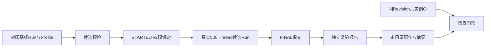

# 0.9.3d多Thread三平台候选诊断原件

## 1. 结论与边界

Revision `cadc4e5190dd94e9dbc7760b19b1659090f73cbb`的[三平台候选工作流35879251986](https://github.com/carrie1988/Harnessix/actions/runs/35879251986)均成功，各有一个不同于[冻结基线](../soak-many-threads-three-platform-2026-09-23-v2/README.md)的新Run、负载前`STARTED v2` Profile ID/SHA绑定和封印`PASS/within_limits`报告。下载后的24份Run、Attempt、Report原件与GitHub ZIP逐字节一致；Run/Attempt/Profile/Report Reader、四轮逐页Proof、最近秩分位数、文件阈值以及新报告的独立再复验均通过。

**本轮是诊断，不关闭场景门禁。** 同Revision的[常规CI 35879240327](https://github.com/carrie1988/Harnessix/actions/runs/35879240327)在非macOS测试环境出现失败：合成测试基线由宿主平台创建，但候选测试入口曾被固定为`macos`，在真实负载之前命中`soak_profile_baseline_invalid`。生产入口的严格平台匹配是预期行为，测试夹具与平台身份不一致才是故障原因。该缺陷在后续Revision `807e688988245fcbb269f0c04013ed9a9ca6ea9d`修复；旧Revision的三份报告不得借后续CI追认。固定场景仍需新Revision同源码CI及三平台候选完成后评审。

## 2. 工作负载、数据流和证据模型

每个平台使用本平台已封印Profile与基线，候选入口先完整重读基线数学阈值，再在隔离状态内执行500 Thread、每页50条、一次预热、三次正式Runtime/App Service重建。`STARTED v2`在真实负载前绑定Profile，候选Manifest保留相同引用；`FINAL`绑定Run Manifest SHA，报告绑定Profile、基线、候选Run和候选Manifest SHA。候选Run本身仍标记`unverified`，只能由独立报告给出`PASS`。每个平台四轮各10页、每轮500个匿名唯一标签及45条样本；Provider请求数0。身份标签只在单Run内可关联，不上传原始Thread ID、SQLite状态、Workspace或模型内容。



## 3. 平台数值与原件

| 平台/硬件档位 | 候选Run | 启动P50/P95/P99（ns） | 分页P50/P95/P99（ns） | RSS峰值（bytes） | 报告 |
|---|---|---:|---:|---:|---|
| Linux `c4-m16` | `86a2a6b98c3c433e92e6e1b2aebbd473` | 338,379,885 / 345,509,060 / 345,509,060 | 170,915,447 / 336,687,493 / 336,884,735 | 61,353,984 | `c5f5aeecc37c4bd08e3cd46b8114deeb` / PASS |
| macOS `c3-m7` | `14ee682172f142ef92a03161f7df0be4` | 1,526,392,042 / 1,634,313,791 / 1,634,313,791 | 722,543,667 / 1,508,278,125 / 1,518,190,875 | 66,142,208 | `9faa9b57e0b945c4a2642dd4152f9ec2` / PASS |
| Windows `c4-m16` | `4fec2f217ec24630ae63a7d4df44f121` | 1,306,916,200 / 1,350,244,900 / 1,350,244,900 | 705,976,600 / 1,371,969,200 / 1,500,063,200 | 63,266,816 | `ad6844c5872944f78ca87febb19be7f4` / PASS |

三平台DB主文件首端均为98,304 bytes；末端Linux为589,824 bytes，macOS和Windows为634,880 bytes；WAL和Artifact端点均为0。这是文件首尾水位，不是运行期磁盘峰值。不同托管平台只与本平台Profile对比，不互相比绝对延迟。三平台的Python分别为3.12.3、3.12.10、3.12.10。

| 平台 | Run / Attempt / Report原件 | Manifest SHA-256 | GitHub ZIP SHA-256 |
|---|---|---|---|
| Linux | [Run](raw/linux/candidate/86a2a6b98c3c433e92e6e1b2aebbd473/manifest.json) / [Attempt](raw/linux/candidate/attempts/86a2a6b98c3c433e92e6e1b2aebbd473/STARTED.json) / [Report](raw/linux/reports/c5f5aeecc37c4bd08e3cd46b8114deeb/report.json) | `2c2f1a911ddd6a72ec9b216ce269f3618e3b2a0fbe39bffb1a6afa32f09a1df2` | `d3019d0c3c08de9b4c634e41de720a89a0c6aa9318c180d4a0ea6f804e7ae998` |
| macOS | [Run](raw/macos/candidate/14ee682172f142ef92a03161f7df0be4/manifest.json) / [Attempt](raw/macos/candidate/attempts/14ee682172f142ef92a03161f7df0be4/STARTED.json) / [Report](raw/macos/reports/9faa9b57e0b945c4a2642dd4152f9ec2/report.json) | `2e02785294dfe7a215d7d7a8885993b1756858b41423f44112e1e580b4f00f34` | `f3701df14ed03657254795fa3b9269c6bb2e8c3088916328bbe5d1e6d398a4ce` |
| Windows | [Run](raw/windows/candidate/4fec2f217ec24630ae63a7d4df44f121/manifest.json) / [Attempt](raw/windows/candidate/attempts/4fec2f217ec24630ae63a7d4df44f121/STARTED.json) / [Report](raw/windows/reports/ad6844c5872944f78ca87febb19be7f4/report.json) | `484e138724d9c5b0b5d33e2a54dc7d57d910522434d6c022182d552bc169b802` | `cb5020842277ed74d746512e4ce2c043a0631c156f7d9a661e807ccde71e1a19` |

[证据清单](bundle-manifest.json)保存GitHub上传件身份、ZIP摘要及每份原件的字节数和SHA-256；[评审包](review-packet.json)保存复核结果和未关闭门禁。[`.gitattributes`](../../../.gitattributes)对`raw/**`禁用换行转换以保持跨平台规范字节。原件已按常见凭据、鉴权Header、宿主绝对路径和个人标识模式扫描无命中，但该扫描不构成任意内容的形式化保密证明。GitHub上传件保留期14日，本仓库归档维持长期只读复核。

## 4. 独立复核与失败语义

在仓库根执行以下只读检查，不调用模型，也不创建业务状态：

```bash
uv run python - <<'PY'
from pathlib import Path
from scripts.soak_attempt import SoakAttemptStartV2, read_attempt
from scripts.soak_evidence import read_published_run
from scripts.soak_manifest import SoakManifestV6
from scripts.soak_threshold import read_profile, read_report, verify_profile_baseline

root = Path('docs/validation/soak-many-threads-three-platform-candidate-2026-09-23-v1/raw')
baseline_root = Path('docs/validation/soak-many-threads-three-platform-2026-09-23-v2')
for platform in ('linux', 'macos', 'windows'):
    candidate_root = root / platform / 'candidate'
    runs = tuple(p for p in candidate_root.iterdir() if p.is_dir() and p.name != 'attempts')
    reports = tuple((root / platform / 'reports').iterdir())
    profiles = tuple((baseline_root / 'profiles' / platform).iterdir())
    assert len(runs) == len(reports) == len(profiles) == 1
    run, digest = read_published_run(runs[0])
    started, final = read_attempt(candidate_root / 'attempts' / run.run_id)
    profile, profile_sha = read_profile(profiles[0])
    base, _ = verify_profile_baseline(profile, baseline_root / 'raw' / platform / profile.baseline_run_id)
    report = read_report(reports[0])
    assert isinstance(run, SoakManifestV6) and isinstance(started, SoakAttemptStartV2)
    assert run.run_id != base.run_id and run.status == 'unverified'
    assert started.threshold_profile_ref == run.threshold_profile_ref
    assert run.threshold_profile_ref.profile_id == profile.profile_id
    assert run.threshold_profile_ref.sha256 == profile_sha
    assert final is not None and final.outcome == 'committed' and final.manifest_sha256 == digest
    assert report.status == 'PASS' and report.candidate_manifest_sha256 == digest
PY
```

上述Reader通过只能证明已归档原件自洽，不能消除同Revision测试失败。具体设计和测试故障闭环见[冻结Profile与候选详设](../../changes/m09-3d-many-threads-frozen-profile-candidate.md)；新Revision须保持同一份封印Profile、不回写本目录，并重新运行三平台候选及其常规CI。生产Agent的任意SQLite I/O取消、真实模型容量、大规模多租户SLA和0.9.3d整体均不由本轮验证。
