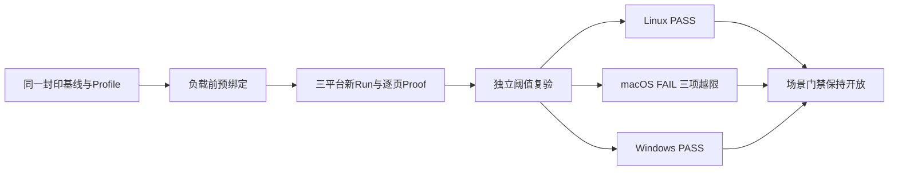

# 0.9.3d多Thread三平台第二候选性能越限原件

## 1. 结论

修复跨平台测试夹具后的Revision `807e688988245fcbb269f0c04013ed9a9ca6ea9d`执行[候选工作流35880201307](https://github.com/carrie1988/Harnessix/actions/runs/35880201307)。Linux和Windows分别取得`PASS/within_limits`，macOS取得**`FAIL/limit_exceeded`**；macOS的启动P95/P99和分页P99超过预冻结阈值，因此整体工作流失败，固定多Thread场景门禁保持开放。不能以[前一Revision诊断中的三份PASS](../soak-many-threads-three-platform-candidate-2026-09-23-v1/README.md)替代本Revision的FAIL，也不能事后提高[已封印Profile](../soak-many-threads-three-platform-2026-09-23-v2/README.md)上限。

三平台下载ZIP与归档原件逐字节一致；24份Run、Attempt、Report原件逐文件SHA校验、Reader、v6逐轮Proof、45条原始样本最近秩统计、阈值逐项重算和新报告独立再复验均与原结论一致。[证据清单](bundle-manifest.json)保存来源与原件SHA，[评审包](review-packet.json)保存量化结果及未关闭门禁。Provider请求数0，无真实模型费用。对应源码的[常规CI 35880201885](https://github.com/carrie1988/Harnessix/actions/runs/35880201885)六Job均成功，但常规CI成功不能把macOS的性能FAIL变成PASS。

## 2. 固定负载、数据链与失败语义

三平台沿用相同的三份预冻结Profile，没有更改余量、负载或Provider。候选入口在启动前核对本平台基线与Profile，`STARTED v2`先持久绑定Profile ID/SHA，再执行隔离State上的500 Thread、每页50条、一次预热和三次正式Runtime/App Service重建。每轮分页全集通过匿名标签及集合摘要验证；`FINAL`提交Run，独立报告核对负载、环境、故障与所有分位数/文件水位。macOS报告是**完整可比Run的性能越限FAIL**，不是证据不完整的`unverified`，也不是超时、取消或业务异常。



| 平台/硬件档位 | 候选Run ID | 启动P50/P95/P99（ns） | 分页P50/P95/P99（ns） | RSS峰值（bytes） | 报告 |
|---|---|---:|---:|---:|---|
| Linux `c4-m16` | `f896b15f440a465aadf7c98a96dcde51` | 688,496,465 / 690,921,155 / 690,921,155 | 340,656,634 / 673,451,162 / 683,478,162 | 61,378,560 | `e4195d5ab6b84522b2f94478bd1ac09e` / PASS |
| macOS `c3-m7` | `eb68e70ba30a440eb2c199c2c224d372` | 2,047,923,667 / **4,406,335,583** / **4,406,335,583** | 924,527,167 / 2,247,777,708 / **4,499,671,709** | 66,797,568 | `0c741d6fa8354403a43cf4c25afbd681` / FAIL |
| Windows `c4-m16` | `f9bee6af67a24d94b34ed2ff4f0622df` | 1,628,818,800 / 1,665,251,100 / 1,665,251,100 | 853,722,000 / 1,710,716,200 / 1,752,583,600 | 63,053,824 | `6dd67aa53f5f4f8892d511dd1476222e` / PASS |

macOS封印Profile的启动P95/P99上限均为3,795,073,332 ns，分页P99上限为2,762,411,832 ns。本Run分别越限611,262,251 ns、611,262,251 ns和1,737,259,877 ns；其他分位数及RSS/文件正增长在本平台上限内，故障计数全0。原始样本表明慢值集中在第二轮正式重启：该轮启动4,406,335,583 ns，第一页4,499,671,709 ns，后续页时延逐步下降；数据仅能定位**在哪一轮、哪一页**越限，不能单凭此判断是托管机调度、SQLite、Runtime启动还是应用服务路径造成。缺少同期主机CPU/I/O等归因证据，不把环境抖动或产品回归作为已证实根因。

三平台DB首端均98,304 bytes，末端Linux 589,824 bytes、macOS/Windows 634,880 bytes；WAL与Artifact首尾均0。这些仅为端点，不是磁盘峰值。不同托管机档位只与自身Profile对比，不横向比较绝对时延。每平台均有4轮、40页、500个逐轮唯一匿名标签、45条样本和完整提交Attempt；不上传明文Thread ID、SQLite状态、Workspace或模型请求内容。

## 3. 来源、完整性与复核

| 平台 | Run / 预绑定Attempt / Report原件 | Manifest SHA-256 | GitHub ZIP SHA-256 |
|---|---|---|---|
| Linux | [Run](raw/linux/candidate/f896b15f440a465aadf7c98a96dcde51/manifest.json) / [Attempt](raw/linux/candidate/attempts/f896b15f440a465aadf7c98a96dcde51/STARTED.json) / [Report](raw/linux/reports/e4195d5ab6b84522b2f94478bd1ac09e/report.json) | `0b4543a81b1c305e4d349cdf573a26300f2656f9f8e4ad9ddbb2a7f1e2d2a5d2` | `312f6416e881127edcdf635db2dd75be564542969f734e55f1cf76ebd7128015` |
| macOS | [Run](raw/macos/candidate/eb68e70ba30a440eb2c199c2c224d372/manifest.json) / [Attempt](raw/macos/candidate/attempts/eb68e70ba30a440eb2c199c2c224d372/STARTED.json) / [Report](raw/macos/reports/0c741d6fa8354403a43cf4c25afbd681/report.json) | `591d9d6fabb69291d7053c047808bb82a8ba812eaa1f08b198829a3c4474c5ec` | `64e88039b8525bc9f2e4306bbd53b8d4be005cf0ee3b407f7cff552821319378` |
| Windows | [Run](raw/windows/candidate/f9bee6af67a24d94b34ed2ff4f0622df/manifest.json) / [Attempt](raw/windows/candidate/attempts/f9bee6af67a24d94b34ed2ff4f0622df/STARTED.json) / [Report](raw/windows/reports/6dd67aa53f5f4f8892d511dd1476222e/report.json) | `076dad5dca0b623ebd6daae79e032d9b9f332da052e9172423ed9c957941dba7` | `c567167fc7ce7628f8a12b868eb56e50ab54fb2cbe0324c53040e0a31a9efcfe` |

每平台八份规范原件：Run四文件、Attempt两文件、Report两文件。原件位于`raw/<platform>/candidate`和`raw/<platform>/reports`；[`.gitattributes`](../../../.gitattributes)禁用原件换行转换以保持Windows字节SHA。下载件与归档件已按常见密钥、鉴权Header、宿主绝对路径及个人标识模式扫描无命中；此扫描不构成对任意文本的形式化无泄漏证明。GitHub上传件保留14日，本仓库保留规范原件和摘要。

只读复核可以从仓库根运行；不会调用模型或修改业务State：

```bash
uv run python - <<'PY'
from pathlib import Path
from scripts.soak_attempt import SoakAttemptStartV2, read_attempt
from scripts.soak_evidence import read_published_run
from scripts.soak_threshold import read_profile, read_report, verify_profile_baseline

root = Path('docs/validation/soak-many-threads-three-platform-candidate-2026-09-23-v2/raw')
baseline_root = Path('docs/validation/soak-many-threads-three-platform-2026-09-23-v2')
expected = {'linux': 'PASS', 'macos': 'FAIL', 'windows': 'PASS'}
for platform, status in expected.items():
    candidate_root = root / platform / 'candidate'
    runs = tuple(p for p in candidate_root.iterdir() if p.is_dir() and p.name != 'attempts')
    reports = tuple((root / platform / 'reports').iterdir())
    profiles = tuple((baseline_root / 'profiles' / platform).iterdir())
    assert len(runs) == len(reports) == len(profiles) == 1
    run, digest = read_published_run(runs[0])
    started, final = read_attempt(candidate_root / 'attempts' / run.run_id)
    profile, profile_sha = read_profile(profiles[0])
    base, _ = verify_profile_baseline(profile, baseline_root / 'raw' / platform / profile.baseline_run_id)
    report = read_report(reports[0])
    assert run.run_id != base.run_id and run.status == 'unverified'
    assert isinstance(started, SoakAttemptStartV2)
    assert started.threshold_profile_ref == run.threshold_profile_ref
    assert run.threshold_profile_ref.profile_id == profile.profile_id
    assert run.threshold_profile_ref.sha256 == profile_sha
    assert final is not None and final.outcome == 'committed' and final.manifest_sha256 == digest
    assert report.status == status and report.candidate_manifest_sha256 == digest
    assert report.violations == (() if status == 'PASS' else (
        'app_service_startup.p95', 'app_service_startup.p99', 'thread_list_page.p99'
    ))
PY
```

## 4. 后续判定边界

本轮FAIL应保留为不可覆盖的基线比较事实。下一次候选必须先调查并记录慢启动与首个分页的耗时构成及宿主资源证据；如能证实环境不可比，须发布明确的环境失配判定，而不是删除FAIL或只挑通过的Run。若证实产品路径回归，应先修复并在新Revision重新运行固定负载；若基线分位样本不足以形成稳定工程阈值，应重新设计采样与阈值冻结流程，并明确旧Profile退役理由，不得事后修改既有封印原件。其它0.9.3d场景和0.9.4～0.9.6门禁仍分别评审；本轮不证明真实C端多租户容量或生产SLA。设计、失效语义与源码入口见[多Thread候选详细设计](../../changes/m09-3d-many-threads-frozen-profile-candidate.md)。
