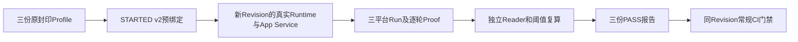

# 0.9.3d多Thread读路径收敛后的三平台冻结候选原件

## 1. 范围与判定

Revision `aa3372c0eb0c3b4ab674b19d26754a80dd035b46`在[候选工作流35884026632](https://github.com/carrie1988/Harnessix/actions/runs/35884026632)执行原封不动的三份[预冻结Profile](../soak-many-threads-three-platform-2026-09-23-v2/README.md)。Linux、macOS、Windows三个Job均成功，三份报告均为`PASS/within_limits`，无越限项；三平台下载件及独立重算均验证通过。同Revision的[常规CI 35883976180](https://github.com/carrie1988/Harnessix/actions/runs/35883976180)六Job均成功。三平台候选及常规跨平台门禁已合并验收，**固定多Thread场景的当前工程护栏通过**。

这次候选使用新的[`SessionStore.recovery_threads`](../../../src/harnessix/session/ports.py)与[`list_thread_page`](../../../src/harnessix/session/ports.py)读路径；设计、迁移及失败语义见[专项详设](../../changes/m09-3d-thread-list-and-recovery-read-path.md)。此前[macOS性能越限FAIL](../soak-many-threads-three-platform-candidate-2026-09-23-v2/README.md)是独立历史事实，不会被此次PASS覆盖或删除。此次结果仅证明GitHub托管机的固定500 Thread场景在预冻结工程阈值内，不证明真实C端多租户容量、持续稳定性或用户侧SLA。

## 2. 固定场景与结果

每个平台在隔离State执行500个Thread、每页50条、一次预热和三次正式Runtime/App Service重建；每轮10页的匿名全集证明覆盖500个唯一Thread标签。每平台有四轮、40页、45个原始样本、一个提交的Attempt和一个独立阈值报告。Provider请求数为0，无模型费用。Profile身份及SHA在负载前写入`STARTED v2`，与Run Manifest一致；候选Run ID与基线Run ID均不同。Linux/macOS/Windows各按自己的硬件档位和封印Profile比较，不横向比较绝对时延。

| 平台/硬件档位 | 候选Run ID | 启动P50/P95/P99（ns） | 分页P50/P95/P99（ns） | RSS峰值（bytes） | 报告 |
|---|---|---:|---:|---:|---|
| Linux `c4-m16` | `2fe626d34f5f4389b084f58494107cda` | 13,726,655 / 13,768,244 / 13,768,244 | 13,036,450 / 19,241,112 / 20,149,983 | 60,583,936 | `5428ca2c37994acd967bf51b866ef4d0` / PASS |
| macOS `c3-m7` | `b835a25c362b4250ba14b49da7d1e9a3` | 19,667,667 / 26,118,333 / 26,118,333 | 31,640,125 / 47,068,583 / 56,088,667 | 65,896,448 | `5bba7f7ef827411e940feb83af28538d` / PASS |
| Windows `c4-m16` | `4168216527c649d3bd801d77e87dcfac` | 40,195,600 / 41,096,300 / 41,096,300 | 23,462,800 / 30,811,600 / 32,086,700 | 62,996,480 | `e24a997aefa44e9f8805f5c4b1db912e` / PASS |

三份报告的启动、分页和RSS全部分位数、DB/WAL/Artifact文件正增长与故障分类均在原封印上限内。独立复算使用原始样本最近秩规则；不把单次显著降时归结为排他已证实的宿主或代码根因，也不把端点文件水位当作磁盘峰值。旧FAIL与新PASS可以并存，发布结论依赖明确的Revision和Run身份。



## 3. 来源、字节完整性与复核

| 平台 | Run / 预绑定Attempt / Report原件 | Manifest SHA-256 | GitHub ZIP SHA-256 |
|---|---|---|---|
| Linux | [Run](raw/linux/candidate/2fe626d34f5f4389b084f58494107cda/manifest.json) / [Attempt](raw/linux/candidate/attempts/2fe626d34f5f4389b084f58494107cda/STARTED.json) / [Report](raw/linux/reports/5428ca2c37994acd967bf51b866ef4d0/report.json) | `3a13508d0dd8e1ef5b92ace3c6357fc4fd189af129d04fa7d51d35a4e971bf82` | `620e5c57d22d07c953abd40c6ce351dd3a30b08395b5a2e00d72c930be5c065d` |
| macOS | [Run](raw/macos/candidate/b835a25c362b4250ba14b49da7d1e9a3/manifest.json) / [Attempt](raw/macos/candidate/attempts/b835a25c362b4250ba14b49da7d1e9a3/STARTED.json) / [Report](raw/macos/reports/5bba7f7ef827411e940feb83af28538d/report.json) | `1f3a2bc8fedfa67afc2145cec5da1bc0222e637f58eb34aaf9671d8d1263edc9` | `36be17ab84f8c0f43247c9fcaf46472aa2e65c183fb6e9015c7285792e7cf0f2` |
| Windows | [Run](raw/windows/candidate/4168216527c649d3bd801d77e87dcfac/manifest.json) / [Attempt](raw/windows/candidate/attempts/4168216527c649d3bd801d77e87dcfac/STARTED.json) / [Report](raw/windows/reports/e24a997aefa44e9f8805f5c4b1db912e/report.json) | `aec89d7a0b41b67665059a154c52e5d33e7354f34b0f44cf1a9bd50ff71aa381` | `2135c241818f325356b46488cce116ae440180a50377ef8d0164616639bfdae9` |

[Bundle Manifest](bundle-manifest.json)记录三个GitHub Artifact身份、ZIP字节摘要和24份仓库原件逐文件SHA；[Review Packet](review-packet.json)记录场景证明、分位数、报告及未关闭门禁。下载的三个ZIP各有八份规范原件，解压文件与仓库归档逐字节一致，Run/Attempt/Profile/Report Reader均通过；独立`verify_and_publish`在临时目录生成的结论与原报告一致。原件经常见密钥、鉴权Header、绝对路径及个人标识模式扫描无命中；这不是对任意内容无泄漏的形式化保证。[`.gitattributes`](../../../.gitattributes)保持原件字节，不允许Windows自动换行改写摘要。

从仓库根目录可只读复核，不调用模型、不写入产品State：

```bash
uv run python - <<'PY'
import hashlib, json
from pathlib import Path
from scripts.soak_attempt import read_attempt
from scripts.soak_evidence import read_published_run
from scripts.soak_threshold import read_profile, read_report, verify_profile_baseline

root = Path('docs/validation/soak-many-threads-three-platform-candidate-2026-09-23-v3')
baseline = Path('docs/validation/soak-many-threads-three-platform-2026-09-23-v2')
bundle = json.loads((root / 'bundle-manifest.json').read_text())
for platform, entry in bundle['platforms'].items():
    for item in entry['files']:
        body = (root / item['path']).read_bytes()
        assert len(body) == item['size_bytes']
        assert hashlib.sha256(body).hexdigest() == item['sha256']
    run_root = root / 'raw' / platform / 'candidate'
    run_path = run_root / entry['candidate_run_id']
    run, digest = read_published_run(run_path)
    started, final = read_attempt(run_root / 'attempts' / run.run_id)
    profiles = tuple((baseline / 'profiles' / platform).iterdir())
    assert len(profiles) == 1
    profile, profile_sha = read_profile(profiles[0])
    verify_profile_baseline(profile, baseline / 'raw' / platform / profile.baseline_run_id)
    report = read_report(root / 'raw' / platform / 'reports' / entry['report_id'])
    assert started.threshold_profile_ref == run.threshold_profile_ref
    assert run.threshold_profile_ref.sha256 == profile_sha
    assert final is not None and final.outcome == 'committed' and final.manifest_sha256 == digest
    assert report.status == 'PASS' and not report.violations
    assert report.candidate_manifest_sha256 == digest
print('三平台原件与报告一致')
PY
```

## 4. 判定边界

本轮三平台候选原件满足封印的固定负载阈值，且同Revision常规CI六Job成功，固定多Thread场景门禁关闭。该结论只覆盖本场景；Action恢复、长会话和Artifact跨平台场景、0.9.4～0.9.6、真实C端容量及商业可用性仍需各自证据。历史FAIL目录永久保留，后续对性能抖动和真实长时运行仍须继续观察。
