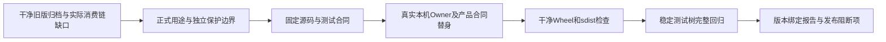

# 正式二进制公开与Owner持久前保护验收报告

## 1. 固定范围与总体结论

源码及正式功能测试绑定`5402621ab7700f55382d78fa95681dfe3485c960`，生产实现提交`85acdf0`；后者至固定源码仅增加治理证据测试。
[总体与详细设计](../../changes/m09-4a-typed-binary-output-publication.md)提供四幅图、完整流程、接口、字段、伪代码与源码链接。
按正式用途解码原Base64双流，检查前缀位移及同流跨Chunk；模型原材料只传私有Owner保护封套，
目标环境及批准计划不增加注入权限；Owner先脱敏再计量/Hash/持久；拒绝正文后保留已验真效果而不再执行。
本报告不关闭0.9.4a、0.9.4及0.9整体。许可证门禁12件仍失败，不称make check通过。



## 2. 源码研究与独立旧版负例

干净`d09f58d` Git归档复跑原正式产品Process测试探针，审批、Router、Agent、SQLite、Artifact分页链真实；
Owner为正式Lease合同替身。结果为Turn completed、两条Artifact记录，解码页包含登记合成值，
原页文字不含原值，Run=1/Reconcile=0、提交确认丢失按原身份恢复。
观察保存于[合同事实](contract-facts.json)，探针源码转换Hash保留；不是从新代码关闭检查或伪造旧版本。
旧报告及Manifest均不修改，既有4749项通过记录不冒充本实现验收。

## 3. 正式合同与实现验收

- `action_output`与旧只读`process_output`分别使用既有正式解析器；任意同名Base64字段不自动解码。
- 原JSON和正式解码共用工作计数、取消和10秒期限；解码最多双流、聚合1MiB，不强制UTF8。
- 每流跨12KiB Chunk检查；stdout和stderr不合并。偏移、Hash、Base64或用途篡改拒绝。
- Owner v2私有封套原材料最多32项/64KiB，编码池在解码前限制，完整帧1MiB，联合模式最多256。
- 父进程在Lease.create与Owner spawn之前校验；原Start v1 Schema及所有旧公开Schema不改，没有新数据库迁移。
- 模型原快照进入实际Supervisor保护端口，原Process Secret Provider和批准的环境目标独立。
- 已终态动作拒绝公开正文后恢复只返效果元数据；无output、无Artifact引用/Hash，不改Audit、不再Execute/Reconcile。

## 4. 测试设计与实际执行

专项 **108 passed、3.50秒**：91项新增功能用例及17项既有用例，另外新增两项治理证据用例。
相关回归 **1254 passed、5 skipped、51.22秒**。专项和相关回归均与完整回归重叠，不加总。
两份新增文档五幅Mermaid已实际渲染并逐幅视觉检查，不声明重新渲染全部既有图。
真实本机Owner三场景分别是退出、超时与取消，检查非UTF8前缀、同流逐字节输入、脱敏后持久文件/Hash/Lease/回执；
取消用真实子进程就绪标记同步，不用固定sleep推定已经输出。
产品Process四场景使用实际审批、Router、Agent、SQLite和安全正文分页，Owner为合同替身；
泄漏拒绝没有Artifact行和后续模型请求，确认效果及原Audit保持，终态再次resume不重执行。

完整回归当前为验证种子待运行状态，不计入本实现验收。稳定测试树及完整结果须另行冻结。
初期相关运行4 failed、1225 passed、5 skipped、51.71秒：恢复代码错误地从effect origin推定恢复策略，
以及测试引用不存在的probes字段。修复为显式内部策略和实际probe_cache后重新验证；原失败不追认通过。
恢复码白名单只适用于output，其他阶段继续固定归一；错误文本不透传合成值。

## 5. 构建、供应链与平台边界

Wheel/sdist从固定源码干净Git归档离线构建，文件Hash见合同事实。发行物不含未跟踪安全草稿。
这是源码版本绑定构建，不声明跨环境二进制可重现构建；代码规模/依赖关系/政策以固定输入验证。
实际本机测试不证明Windows Job/ConPTY、真实容器引擎、安装/升级/卸载或网络模型请求。
模型工厂和产品SDK测试使用ScriptedProvider及受控传输驱动，不是完整产品字节级stdio验收。
许可证门禁仍有12件Archive阻断，原拒绝政策不放宽。

## 6. Manifest、Review Packet与复核命令

本目录为单一交付入口：
[Manifest](bundle-manifest.json)、[合同事实](contract-facts.json)、[验证记录](verification.json)、
[评审包](review-packet.json)、[CI快照](ci-observation.json)及本报告；Manifest自身不自包含Hash。
Manifest精确绑定43个源码/测试/Schema/政策输入；每个输入从固定Git对象核对，不用工作目录当前版本替代。

```bash
uv run python scripts/generate_specs.py --check
uv run python scripts/readability_report.py --check --check-final-report --quiet
uv run pytest -q -o addopts='' --ignore=tests/security tests/governance/test_security_governance_evidence.py
uv run pytest -q -o addopts='' --ignore=tests/security
```

CI后台运行，不逐个本地提交等待、不主动重跑；冻结时本实现CI尚未启动，旧版本快照不是当前实现验收。

## 7. 开放风险与下一阶段

历史Session/其他公开出口、跨重启原材料证明与正文安全恢复、Owner/Store同步资源归属、
TM编号化攻击与三平台证据、远端MCP身份/OAuth/出口、真实安装/Beta、真实Provider发布/成本及许可证12件仍开放。
无保护独立宿主仅保持兼容，不能证明默认产品端到端安全；未知编码与跨流推断不在当前解码合同内。
未新增真实模型请求或定时任务；总目标及路线图完成条件保持不变。
