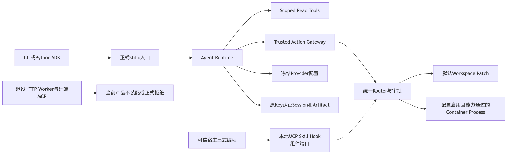
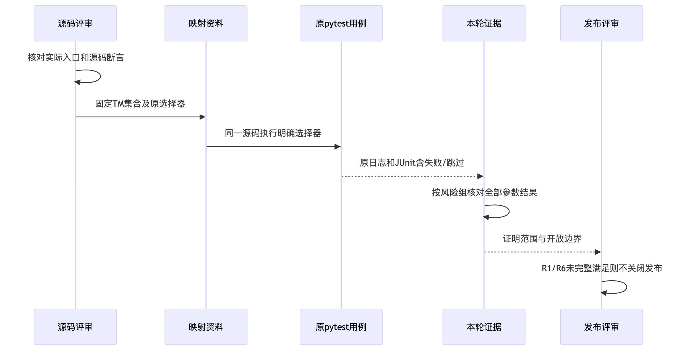
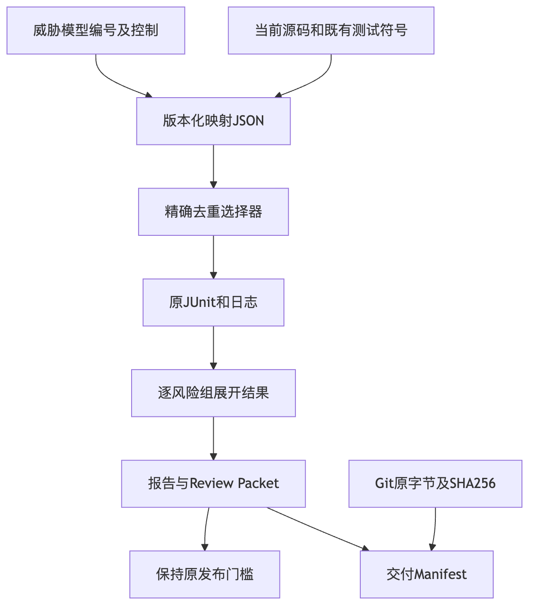

# R1既有安全控制追踪与双Python专项验证报告

## 1. 结论、身份与范围

**GO仅针对控制追踪资料和本地已执行锚点；R1完整安全及商用发布仍NO_GO。**
固定源码`ae590042f52de7e08eafb51a1fa080b935afc6df`，未改生产代码、既有用例、权限、预算或Schema。
威胁模型第6节13个主编号及五个A补充组共18组，已有54个函数选择器；
macOS上Python3.12.7与3.13.8各展开148项，分别**146通过、2原生Windows跳过**，无失败/错误。
两个环境不求和；组映射不等于18组完整安全验收。

[原映射快照](mapping.json)、[实际逐组核验](verification.json)、[选择器](selectors.txt)
和[Review Packet](review-packet.json)保留完整身份、角色和证据边界。

## 2. 需求、设计与当前实际入口

原0.9.4c宽泛套件计划收敛为原测试到TM控制的映射，避免重复安全平台。
本专项仅核对实际入口、原业务断言及明确的现有选择器；不根据测试名字推导完整能力。
正式契约、核心类、接口、重点字段、流程、时序、伪代码、失败/取消及维护规则见
[完整详设](../../changes/m09-r1-existing-safety-coverage.md)。

当前默认产品为stdio/SDK→Agent Runtime→Scoped Read或可信Action→Patch/已验证Process。
MCP、Skill、Hook组件端口必须由可信宿主显式编程装配；主产品配置不自动装配。
该区分不消除组件模块既有风险，不宣称首发已经自动集成扩展，也不恢复HTTP/Worker或远端MCP。

图中评审、映射与证据节点仅为交付流程，不是新产品服务。

## 3. 结果与原始证据

| 环境 | 函数选择器 | 参数展开 | 通过 | 跳过 | 失败 / 错误 | 日志 |
|---|---|---|---|---|---|---|
| macOS / Python3.12.7 | 54 | 148 | 146 | 2 | 0 / 0 | [原日志](logs/python312.log)、[JUnit](logs/python312.xml) |
| macOS / Python3.13.8 | 54 | 148 | 146 | 2 | 0 / 0 | [原日志](logs/python313.log)、[JUnit](logs/python313.xml) |

逐函数核对原JUnit全部参数记录，18组均有已有正反例锚点。
TM-02A为`PARTIAL_native_windows_unverified`，其中两项原生Junction/ADS/Hardlink负例未在本机执行。
其余17组只登记`LOCAL_PASS_selected_anchors`，保留Mock、后端和剩余风险限制。
原Adapter有界HTTP传输、真实文件、进程/Owner及受控Container夹具分别按用例自身边界理解；
本次不是实际引擎隔离、真实百炼质量、Windows 11、消费者体验或独立Beta证明。

[文档门禁](logs/documentation.json)零问题、[治理回归](logs/governance.log)276项通过。
首轮详设标题未满足正式章节关键字的五项问题保留在[原文档结果](logs/documentation-initial-fail.json)及
[原治理失败](logs/governance-initial-fail.log)，修正标题后复验，不修改产品用例预期。
[交付Manifest](manifest.json)记录资料和原字节完整性；
Manifest只排除顶层自身，完整覆盖归档并绑定当前设计、映射、原源码和用例。

## 4. 离线复验与评审入口

已安装开发依赖的管理检出中，从仓库根目录按[详设第11节](../../changes/m09-r1-existing-safety-coverage.md)
读取精确函数选择器并运行原pytest。参数展开由原标记决定，不使用宽泛`-k`。
当前资料变更无需为每次推送启动完整六作业CI；已执行相关锚点和文档门禁。
最终1.0仍要求同一候选的必要离线、原生及真实门禁，不能继承旧候选的全矩阵声明。

## 5. 隐私、安全、取消与恢复

没有读取业务状态、Key或凭据，没有付费模型请求，真实质量Trial计数0。
没有部署新中间件、改Docker设置或读取受保护用户自有测试目录。
符号缺失、断言失败、资料不完整、执行取消/超时均不得登记PASS；原生跳过保留，不伪装为通过。
历史FAIL、unverified及认证基线原档案保持零修改。

## 6. 后续发布门禁

优先核对首发可达控制的真实缺口，只在原模块补必要负例。
固定认证重启已单独三平台PASS；完整安全、真实20 Trial编码质量、消费者Windows 11和不同版本升级、
独立用户Beta、必要发行输入及最终同候选封板仍开放。
本专项不提前关闭0.9.4c、R1或1.0。

## 7. 固定后继候选的原控制锚点复验

`df8dc8f124a1d8f1a6fafac480785e06ab8cfa97`按原映射的54个精确函数选择器重新执行，
macOS ARM64/CPython3.12.7展开148项：**146通过、2原生Windows跳过、0失败/错误**，耗时3.971秒。
[后继事实与源码摘要](current-candidate-followup.json)绑定原映射、当前相关源码/测试字节、
原JUnit和日志，不修改上述历史双Python报告或原映射Revision。

本结果只证明当前候选的既有控制锚点，18组均有锚点不等于18组攻击面全部验收。
实际Windows、真实Container、线上Provider、消费者安装及独立用户证据仍须分别验证；
不能将本地跳过、Mock或历史候选结果转为当前发布PASS。不同运行与焦点/全量重叠数量不相加。
没有生产代码、权限、Schema或测试断言变化，没有模型请求；R1完整安全及1.0保持开放。
完整治理另取299项通过、0跳过/失败/错误，耗时26.051秒；与锚点及各候选完整回归不累加。
