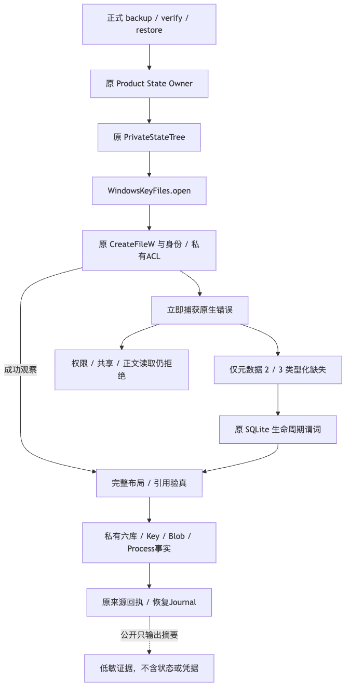
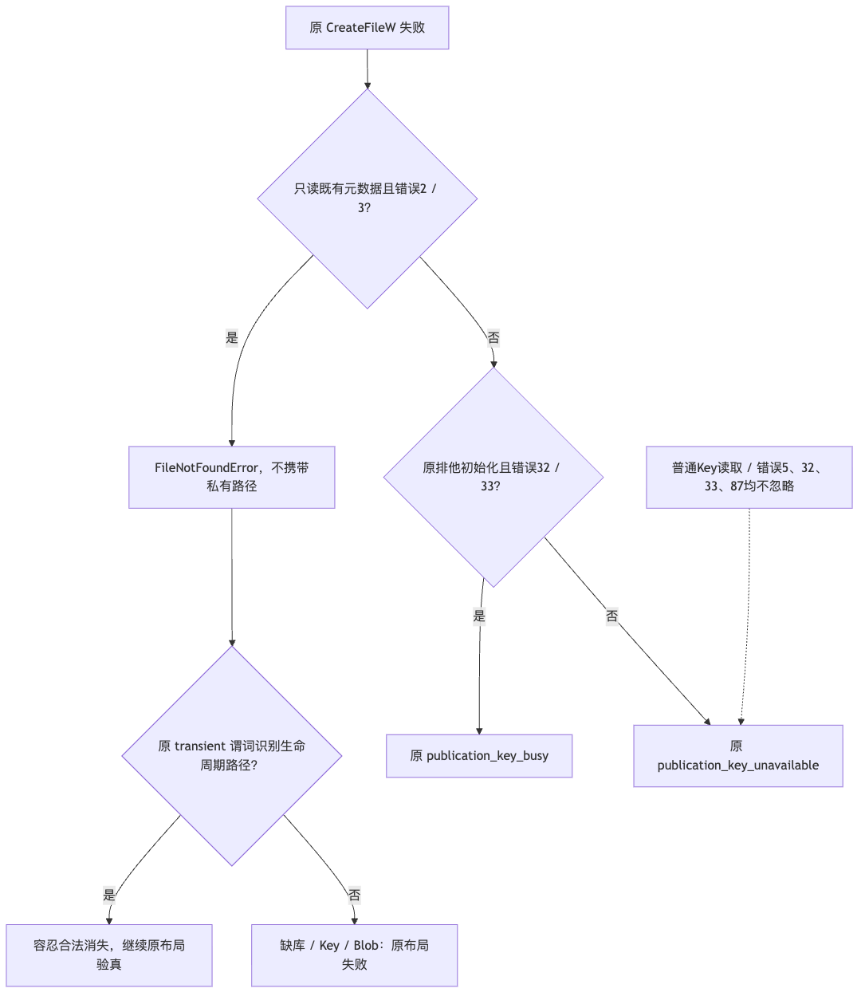
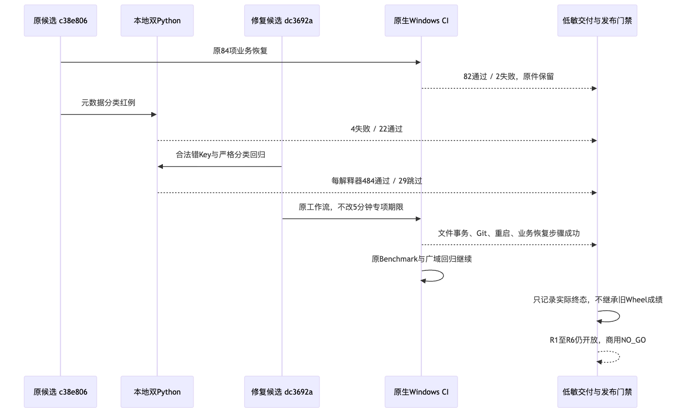

# Windows复杂业务状态备份恢复与严格原生错误分类验证报告

## 1. 摘要、需求背景与结论

固定修复源码为`dc3692abb08ebe9e2e9bf4d971af9eee395cf590`。既有规范Wheel安装专项只创建Thread、
恢复六库及原Key，没有证明复杂业务引用、真实Process事实和全部崩溃点在Windows运行。
本次把原84项完整业务备份/恢复测试接入原生Windows，不复制POSIX实现，不重新跳过原生失败。

原候选`c38e8062cc58bcaefc3c88d4e0088c36476e23c2`实际为**82通过、2失败**。
修复候选的原生业务状态步骤已为`completed/success`；同候选的文件事务、Git和产品重启步骤亦成功。
整个平台Job尚未终结时，只判定这些完成步骤，不宣称完整CI成功。
**原生业务恢复步骤专项GO；R1、R4及商用发布仍为NO_GO。**

正式设计见[完整备份](../../changes/m09-r1-product-state-backup.md)、
[完整恢复](../../changes/m09-r1-product-state-restore.md)及[产品模块](../../modules/product-config.md)。
[verification.json](verification.json)、[Review Packet](review-packet.json)和[manifest.json](manifest.json)
分别保存实际断言、评审边界与原字节身份。历史报告不被覆盖。

## 2. 原始失败、根因与影响边界

| 原生失败 | 根因与原断言 | 本次处置 |
|---|---|---|
| 合法错Key负对照 | 原夹具修改Key文件末32字节；POSIX可形成另一份材料，但破坏DPAPI密文会先得到`publication_key_unavailable`，不能证明原期望`product_backup_key_mismatch` | 用正式平台装配在另一私有Root创建合法Key；复制合法编码材料。期望错误及备份字节不变断言均不修改 |
| 只读连接退出时SHM盘点 | 原Windows元数据打开把真实文件缺失与权限/共享错误都折叠为Key不可用；上层已有严格生命周期缺失处理，却收不到类型化缺失 | 仅元数据观察的Win32错误2/3返回无私有路径的`FileNotFoundError`；普通Key读取及其他错误仍拒绝 |

原生数字错误的定义来自[Microsoft系统错误码](https://learn.microsoft.com/en-us/windows/win32/debug/system-error-codes--0-499-)。
错误5表示访问拒绝，32/33表示共享或锁冲突；这些不能按生命周期文件删除忽略。
新增26项负/正对照同时覆盖空Handle和无效Handle。不会捕获任意`KernelError`后继续，不扩大可忽略文件集合。

原失败日志：[Windows原件](logs/windows-original-job.log)；原错误分类红例：[4失败、22通过](logs/metadata-contract-red.log)。
原生测试专用诊断只输出固定位置、异常类别和数值码，不输出私有路径、正文、Key或API材料。

## 3. 总体架构、数据流与源码映射



**架构说明：** `backup/verify/restore`继续借用原Product State Owner、原PrivateStateTree及平台Key端口。
数据库、原Key、Artifact和专用Process事实沿原备份合同进入私有候选；原来源回执与耐久Journal决定发布及恢复。
平台差异只发生在底层原生文件端口和合法测试材料创建，没有新增服务、数据库或第二恢复状态机。

**数据流说明：** 正式路径仍校验布局、Schema、MAC、Blob、跨Store引用和原Root身份。
原Key既不轮换也不补签；未知旧来源不会因新错误分类成为可信数据。
公开交付目录仅包含低敏测试日志、API作业事实、JUnit及本地制品身份，不包含实际业务状态或凭据。

| 组件/契约 | 源码或测试位置 | 本次约束 |
|---|---|---|
| `WindowsKeyFiles.open` | [平台文件端口](../../../src/harnessix/product_config/session_key_windows_files.py) | `metadata_only`不能与创建、写入、目录、独占组合；原访问/共享掩码不变 |
| `_raise_open_failure` | [严格原生分类](../../../src/harnessix/product_config/session_key_windows_files.py) | 只在元数据2/3返回类型化缺失；其他错误保持原稳定拒绝 |
| `PrivateStateTree.files/open_file` | [受管盘点与身份复核](../../../src/harnessix/product_config/state_backup_files.py) | 只有原`transient(relative)`识别的生命周期文件允许缺失；库/Key/Blob缺失仍失败 |
| 完整业务备份 | [原备份测试](../../../tests/product_config/test_product_state_backup.py) | 合法错Key、只读连接退出、实际平台Process输出及原认证引用 |
| 完整恢复/恢复重开 | [原恢复测试](../../../tests/product_config/test_product_state_restore.py) | 原Root身份、Journal、硬退出、取消、Artifact SDK重开及回退 |
| 错误正反例 | [26项分类测试](../../../tests/product_config/test_windows_metadata_contracts.py) | 2/3、5、32/33、87及普通Key数据读取分别验证 |
| 低敏诊断 | [原生测试诊断](../../../tests/product_config/windows_backup_diagnostics.py)、[诊断负例](../../../tests/product_config/test_windows_backup_diagnostics.py) | 原异常对象和公开错误不变；仅诊断字段可见 |
| Windows实际选择 | [原CI工作流](../../../.github/workflows/ci.yml) | 同一候选执行三个模块；原5分钟步骤期限不提高 |

## 4. 接口与重点字段

| 字段/接口 | 含义 | 权威来源与失败语义 |
|---|---|---|
| `metadata_only: bool` | 只观察既有文件身份和私有权限，不读正文 | 原受管盘点请求；非法参数组合直接拒绝 |
| `error: int` | `CreateFileW`失败后立即捕获的原生错误 | 原线程Win32状态；不能用异常文案或`Path.exists()`猜测缺失 |
| `exclusive: bool` | 原Key初始化的排他打开 | 原32/33仍映射`publication_key_busy` |
| `transient(relative)` | 原布局识别的SQLite生命周期路径 | 原备份布局；不是任意后缀或异常白名单 |
| `source_revision` | 本报告固定实现身份 | Git及CI `head_sha`必须相同 |
| `status/conclusion` | 实际Job/Step状态和终态结论 | 原GitHub API，不从耗时或局部测试推断 |

## 5. 核心流程、时序与伪代码



**流程说明：** 元数据2/3先形成类型化缺失，盘点层再检查是否属于原生命周期集合。
权限、共享、非法参数、普通Key读取以及其他目标的缺失全部拒绝；没有错误5等同删除的分支。
此前上层已有的缺失处理保持不变，修复只是恢复底层错误类型。

```text
open_private_file(path, metadata_only, exclusive):
  reject_invalid_metadata_arguments()
  handle = original_CreateFileW(original_access_and_share)
  if invalid(handle):
    error = capture_last_error_immediately()
    if metadata_only and error in {2, 3}: raise typed_missing_without_path()
    if exclusive and error in {32, 33}: raise original_key_busy()
    raise original_key_unavailable()
  verify_original_identity_reparse_links_and_private_acl(handle)
  return original_handle()

inventory(relative):
  try: original_metadata_open_and_post_identity_check(relative)
  except FileNotFoundError:
    if original_transient_predicate(relative): continue_inventory()
    else: reject_original_layout_failure()
```



**时序说明：** 首轮实际Windows失败保留；本地先建立错误分类红例，再验证不放宽拒绝。
修复推送后，原生CI顺序完成文件事务、Git、产品重启及业务状态专项。
之后的Benchmark及广域回归沿原Job继续；未终结步骤不被提前宣称通过。

## 6. 实际环境、运行身份与验证结果

| 范围 | 实际结果 | 结论边界 |
|---|---|---|
| 原Windows业务状态 | 82通过、2失败，212.62秒 | 原固定源码与原失败保持不变 |
| 新错误分类红例 | 4失败、22通过 | 证明原分类无法给上层真实缺失类型，不等于原生运行 |
| 本地Python3.12受影响范围 | 484通过、29跳过，30.54秒 | 110项业务状态和分类用例无跳过；不是Windows模拟成功证明 |
| 本地Python3.13同范围 | 484通过、29跳过，30.67秒 | 相同用例跨解释器对照，不与前一组相加 |
| 固定Windows文件事务、Git、重启及业务恢复 | 四个实际步骤`completed/success` | 110项业务恢复选择范围来自原工作流；具体原生日志计数待Job原件，不伪造计数 |
| 同候选Linux Python3.13全功能 | 5744通过、112跳过，531.74秒 | 原功能步骤成功；整个Job因原许可门禁失败，不能称CI全绿 |
| 全平台CI | 按API快照登记实际状态 | 没有全绿声明；许可拒绝独立保留 |
| 本地修复制品 | 433个包成员与固定源码逐字一致 | 未重新证明该Wheel三平台安装，不继承旧Wheel验收 |

原失败：[Run 36477355105](https://github.com/carrie1988/Harnessix/actions/runs/36477355105)，Windows Job `109114287056`。
修复：[Run 36481128726](https://github.com/carrie1988/Harnessix/actions/runs/36481128726)，Windows Job `109126756462`。
工作流选择原生`windows-latest`；此前同通道原件记录Windows Server 2025。
当前完整Runner环境身份以终结Job日志为准，不将该通道声明为Windows 11消费者环境。

本地修复Wheel为1,076,002字节，SHA256：
`0d4f2e2467255a06217e8e69d437010459f643900f7483dc5a31d9765b72f0d3`。
包版本仍为`0.1.0`，不发布1.0 Tag，不以同版本重装冒充跨版本升级。

## 7. 取消、恢复、安全与部署边界

- 备份/恢复沿原停机Owner、取消结算、Root外来源回执和恢复Journal执行，未改变原期限与提交边界。
- 合法错Key材料来自自有临时Root，不修改真实用户Root、系统DPAPI配置或Keychain。
- 普通Key文件缺失、坏DPAPI、ACL错误、共享冲突、Reparse与多硬链接仍失败关闭。
- 仅测试诊断增加数字原生码，不向产品公开输出底层正文或路径。
- 验收采用规范Checkout；未改变Docker全局设置、现有容器、远程内核或原预算周期。
- 该验证未读取Provider Key，新模型请求为0。

## 8. 仍未证明的发布条件与后续验收

1. R1整体正式入口安全及认证存储500 Thread空间越限处置，不能由备份专项替代。
2. 修复后的完整20次真实编码及有限Provider认证；历史0/20保留，不用Scripted成绩替代。
3. Windows 11实际使用、三平台完整编码、真正的不同版本升级/回退及同最终候选制品。
4. 3～5名独立开发者和至少15个真实任务；CI账号或自动脚本不计作独立用户。
5. 12件许可复核和正式封板；功能研发继续，正式发行仍须完成必要处置。

只读官方Registry别名诊断仍为EOF，且原固定镜像不可用。
诊断没有替换Task Pack镜像、降低资源能力、修改Docker全局配置或重启现有容器。
可用评测环境仍需按正式环境安排落实；Provider预算账本已定位，不再以账本路径作为阻塞。
[原账本Owner预检](facts/budget-preflight.json)通过：原周期额度70元、已知估算0.000068元、预留0元、未决0项。
原账本字节未变，新增请求0次；该估算不是供应商账户余额或精确账单。

## 9. 证据完整性与复核方法

`manifest.json`逐件保存相对路径、字节数与SHA256，并明确排除自身。
JUnit独立重算两个解释器513项总数、0失败/错误及29跳过；其中110项业务和分类用例均无跳过。
原Windows API快照绑定固定源码、Run、Job和每个步骤的实际状态。
图示进行真实渲染与目视复核；文档静态/链接检查、Secret扫描及Git索引逐字复核分别记录，不相互替代。

复核失败时不得覆盖历史日志、降低断言、跳过Windows、改写质量阈值或把未终结Job当作成功。

## 10. 变更记录

| 版本 | 实现源码 | 日期 | 内容 |
|---|---|---|---|
| 1 | `dc3692abb08ebe9e2e9bf4d971af9eee395cf590` | 2026-09-29 | 保留原生82/2失败，补合法错Key与严格元数据分类、双解释器原件及实际原生步骤证据；整体发布仍未通过 |
