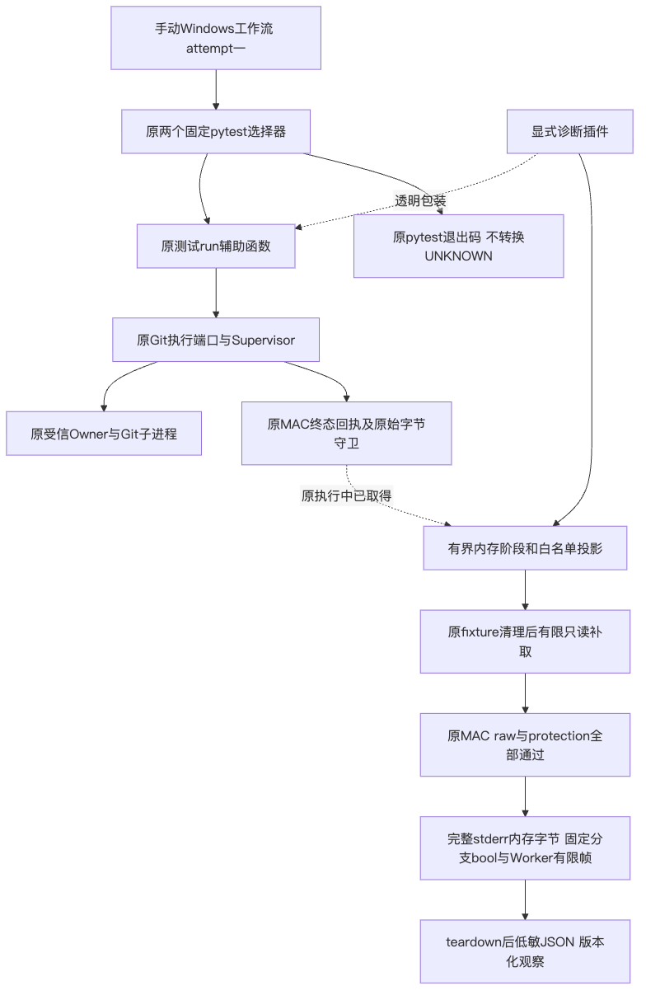
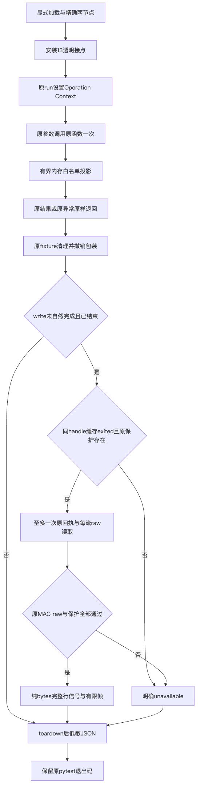
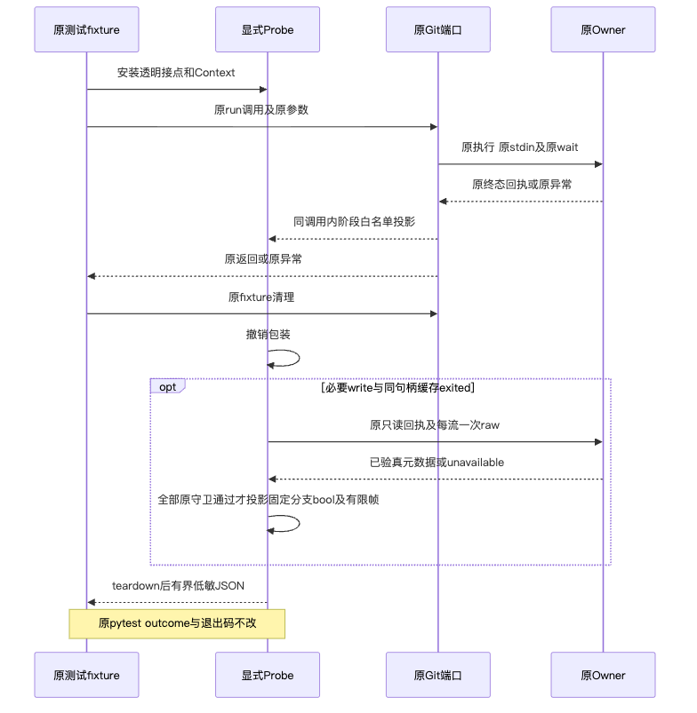
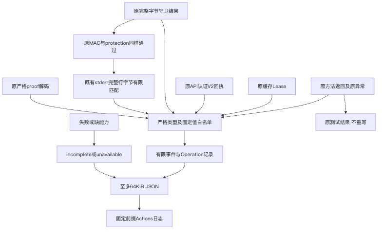

# Windows Git128固定错误分支低敏观察验证

## 1. 验证范围与结论边界

[总体与详细设计](../../changes/m09-r4-windows-minimum-commit-probe.md#12-git128固定分支低敏观察设计)
补齐固定源码入口、五个新增bool、原验真顺序、数据字段、伪代码及取消／失败边界。
本包对应显式测试侧车v4，不修改生产库、原两项业务用例、Owner权限、材料容量、期限或UNKNOWN。
原v1／v2／v3观察和实际FAIL保持原件。

新增固定字段为READ_ERROR、SHORT_READ、HASH_FD、LOOSE_WRITE、LOOSE_CLOSE；
原四个bool与Worker有限帧保留。只消费已通过原MAC回执、双完整raw／EOF及保护的内存bytes，
每流一次、无新增读取／Git执行／效果重放。九字段序列化的纯单元检查上限由200增至400字节；
原完整诊断记录64KiB上限和所有业务断言均不变。

原stderr守卫和纯匹配上限同为1MiB；操作后验超限时不得到达信号投影。
HASH_FD只识别源码中NULL vpath的固定`(null)`表示，不猜其他CRT表现。
信号阳性不是errno、唯一根因、消息作者、效果成功或执行权限；False不排除对应分支。

## 2. 固定原生失败与源码求证

固定4c855c4的[Run36853423485](https://github.com/carrie1988/Harnessix/actions/runs/36853423485)
原两例FAIL、Git原wait128、Worker退出二、成功proof缺失、UNKNOWN保持。
两例原正文均184字节；完整正文SHA及预期OID一致，stderr各607字节但SHA不同，不能据此猜正文。
完整原记录保留于[原验证包](../git-worker-failure-observation-2026-10-01-v1/README.md)。

固定Git for Windows2.55.0.windows.5源码证明存在多个128错误入口。最小正文未发现违反指定fsck格式规则；
预期小文件正规输入走read_in_full，而非mmap；现RO句柄有读数据／读属性及O_BINARY，没有求证必须加写权限。
这些静态事实只决定下一观察方案，不是原生唯一根因或修复通过。

官方来源及原字节身份由Facts登记：
[hash-object.c](https://raw.githubusercontent.com/git-for-windows/git/v2.55.0.windows.5/builtin/hash-object.c)、
[object-file.c](https://raw.githubusercontent.com/git-for-windows/git/v2.55.0.windows.5/object-file.c)、
[fsck.c](https://raw.githubusercontent.com/git-for-windows/git/v2.55.0.windows.5/fsck.c)、
[mingw.c](https://raw.githubusercontent.com/git-for-windows/git/v2.55.0.windows.5/compat/mingw.c)。
来源tag不是原生Git二进制构建验真。没有读取、保存或导出旧stderr正文。

## 3. 完整性与实际测试证据

最终结果以Facts、Verification及Review Packet登记的真实范围为准；没有实际结果不登记PASS。
新增95项纯分支与后验合同先取得78项FAIL；修正后与原95项侧车测试合并190项全部通过。
原95项保留，只有格式版本与新增字段所需的低敏序列化上限断言升级。
正反例包含完整LF／CRLF、非空后缀、隐藏／相似／截断／重复、敏感噪声、1MiB恰界与超限、
receipt／两流raw／保护拒绝、真实字节守卫顺序、投影异常和原取消／UNKNOWN身份。

候选目录采用完整原1258输入清单加显式三路径差量，严格逐件核对未变化成员后形成1259输入身份；
不是只验三个文件。原469生产包文件逐Git blob相同。并行尚未发布的对象目录合同和已有未跟踪观察原型不在本候选，
不据此宣称它们已验证或改变生产Wheel。原测试、工作流、Lock与所有生产字节保持。

独立发布快照的18个治理文件492项全部通过；文档453件、11043链接、953个Mermaid块检查零发现。
完整4050个扫描输入（含未变更的既有Wheel）零命中，三文件Ruff／format通过。
初次混合目录治理490PASS／2FAIL的日志与后继混合目录491PASS／1FAIL均保留，不将其替代正式候选结果。
初次JUnit只保留此前观测身份，原件未留存；具体原件保存范围由Facts明确登记。
源码／文档／静态、治理、原两项本机及新固定原生范围分别登记，不累加为全仓覆盖。
完整记录、原始失败日志、字节摘要及Facts标明的实际检查原件私有归档；公开包仅有有限字段，无个人目录或raw正文。

## 4. 四幅实际设计图

四个Mermaid原件从对应详设实际图块取得，已真实渲染并进行视觉检查。
图示中的投影没有业务授权或修复路径，不能将诊断解释为生产执行器。

## 5. 部署、原生执行与商用边界

v4仍只通过显式pytest插件加载。新固定named ref、attempt一、新fixture、原两个节点和原五分钟保护，
独立取得Windows结果；不重跑旧Run，不调整断言或期限。不上传raw或原业务JUnit。
新一次原生结果尚未取得前，状态保持待验证；若FAIL，原UNKNOWN继续保持。

即使分支信号命中，也须继续验证具体根因及最小修复，不能自动改变sharing、访问权或Commit正文。
Windows消费者、完整Git产品交付、R3真实质量、独立Beta和商用R1～R6均保持开放。
