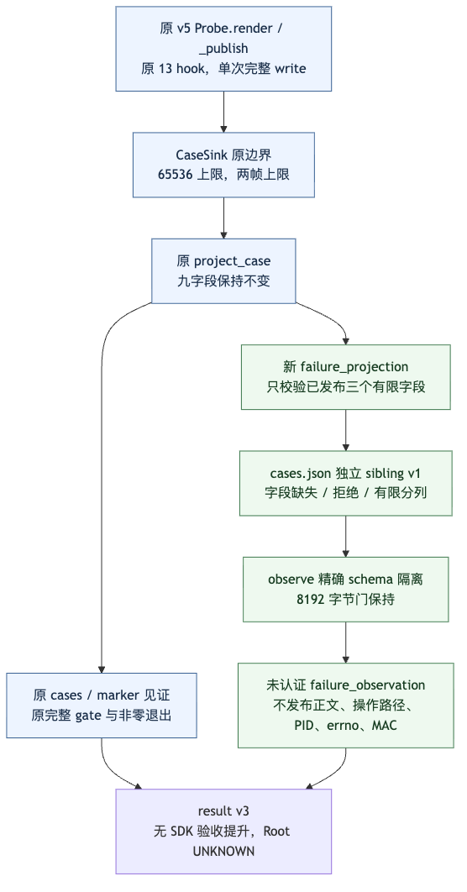
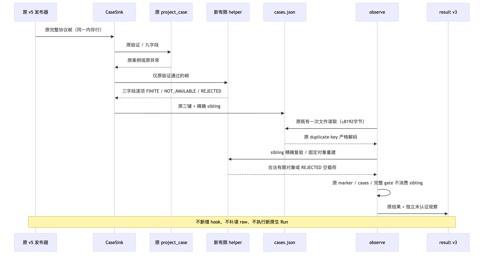

# Windows材料有限失败观察：源码验证记录

## 验证对象与身份

[详细设计](../../changes/m09-r4-windows-material-fault-projection.md)和
[模块说明](../../modules/windows-git-native-observation.md)说明独立三字段接缝。
code_revision为兼容基线；[逐文件摘要](source-sha256.json)绑定增量源码和文档。
原v5 probe发布既有的stderr九bool、Worker状态和Trace2七字段；新增脚本只处理
同一有界内存帧，不读新raw，不生成MAC或执行权。原九字段案例、完整gate和期限保持。

## 实际结果与范围

| 验证 | 实际结果与边界 |
|---|---|
| 原观察器、新专项及补充合同 | [790通过](offline-790.xml)：235原观察器、289新专项、266补充；不是全仓或Windows现场 |
| 独立复验 | [290通过](parent-290.xml)：289专项与1实际SHA256材料Completion；289与上组重叠，不相加 |
| 结果与完整gate差分 | [140组向量、280次比较](ast-differential.json)，旧字段和旧异常型保持；原projection.py字节不变 |
| 原16件固定输入 | [逐件通过](verification.json)，原13 hook、PE/PDB/PATH及全部期限不变 |
| 文档校验 | 父级复核发现原两份新文档元数据和规范章节缺失；只补齐文档，原失败记录保留 |

独立实际Completion使用明确登记的支持SHA256固定Git环境，不改生产代码或测试断言。
原Apple Git2.24.3初始化前置FAIL单独保留；它不是Windows Git128根因，也不被新宿主结果覆盖。
原始日志、初始FAIL、精确来源及权限清单保存在受限验证归档，不发布业务正文或凭据。

## 失败、安全、持久化及发布限制

新增数据进入`unverified_execution_observation.failure_observation`，标签恒为
`UNAUTHENTICATED_DIAGNOSTIC_ONLY`。字段缺席、坏字段、有限阴性分别表示，不回填旧结果。
固定cases/result文件仅为诊断，没有业务数据库事务或恢复执行权。
[历史现场差分](historical-result-differential.json)保留Git128、Worker2、SDK false和Root UNKNOWN。
未启动新Windows Run、未新增模型请求；源码离线验证不关闭消费者Windows、完整Git交付、
Backup v2、R3真实质量、独立Beta及同候选R1～R6商用条件。

## 源码与流程图

[run_cases](../../../scripts/windows_git_native_branch_observation/run_cases.py)先调用原九字段
project_case，再调用[有限投影](../../../scripts/windows_git_native_branch_observation/failure_projection.py)；
[observe](../../../scripts/windows_git_native_branch_observation/observe.py)严格隔离sibling后，
原gate继续只消费原报告。固定字段重建不保留字典/列表别名。

## 资料清单

[验证事实](verification.json)、[源码保持](source-preservation.json)、[评审范围](review-packet.json)、
[完整清单](manifest.json)共同记录当前可核验范围；历史报告保持各自原件与结论。
