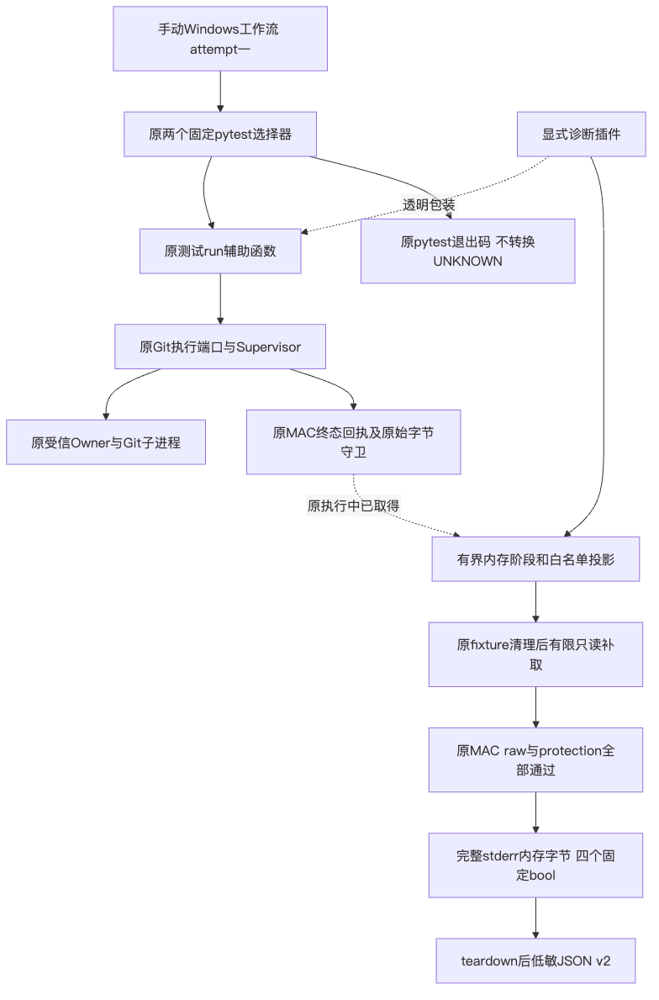
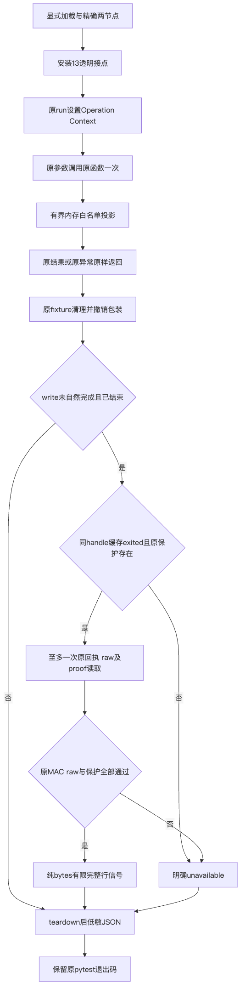
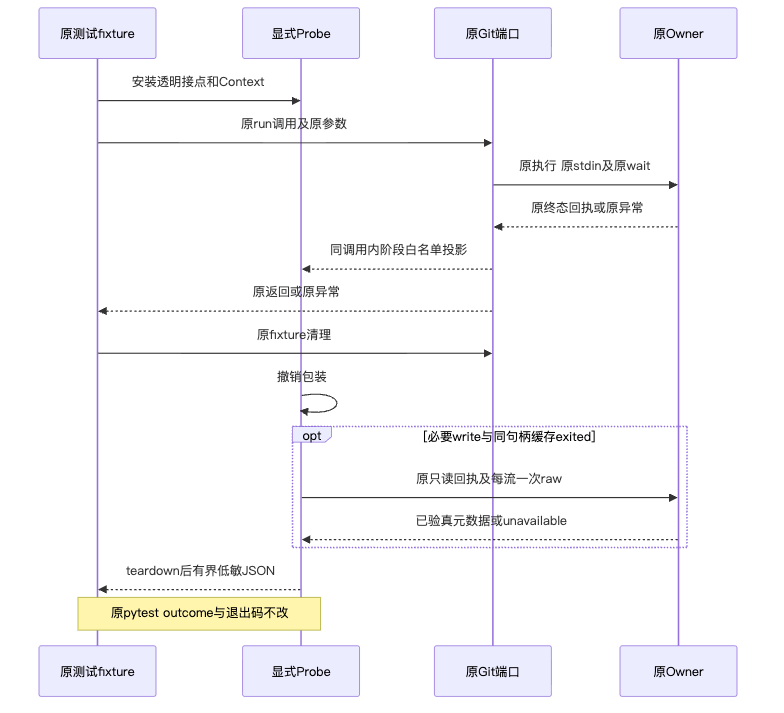
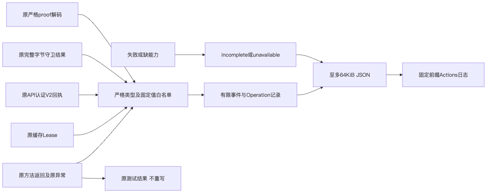

# Windows最低SHA256 Commit单次诊断统一验证包

## 1. 范围及结论

[总体与详细设计](../../changes/m09-r4-windows-minimum-commit-probe.md)明确真实调用链、13接点、接口／字段、
透明原调用与异常、原退出后至多一次只读补取、严格日志白名单、取消／清理及当前能见边界。
本增量只有显式pytest插件、治理测试和manual-only工作流，不修改生产、原两个测试或正式CI。
原20秒命令／45秒操作／五分钟步骤、Owner／MAC／PID／EOF及原pytest结果保持。
UNKNOWN不得转换为成功，缓存Lease不能代替已认证终态回执或完整raw／proof。

基线70c0a57是来源参考，不是新诊断提交身份；最终代码由完整输入目录及SHA绑定。
[Facts](facts.json)、[Verification](verification.json)、[Review Packet](review-packet.json)、[Manifest](manifest.json)
分别记录实际输入、验证范围、独立审查及公开材料。私有原日志／记录只公开摘要，不复制运行路径、正文或凭据。

## 2. 本机验证与Windows边界

原实现交付固定三文件SHA：治理59通过；原两个真实用例2通过（macOS、Python3.12.7、Git2.53.0）。
原Plan、独立批准、Owner、MAC回执、完整raw／proof及readback真实执行，未以stub替代业务链。
wrapper负对照中的桩只验证调用次数、异常／返回原对象、关闭能力和采集故障，不是原生Owner验收。

每个本机记录13接点、write／read归属、完整性标志及实际源码SHA已独立复核；原成功未触发额外post补取。
最终1255件冻结代码输入下，完整治理361通过；另在同一冻结源码执行原两个节点，2通过。
原13输入前后不变，两个记录的13接点、write／read、原MAC／raw／proof和完整性均复核。
精确节点和原件SHA见Facts；运行组重叠，不能相加为全仓覆盖。
原468个生产包成员与认证批次实际Wheel逐件相同，未新增产品构建；4014项仓库／制品Secret输入完整覆盖且零命中。
独立静态审查原13输入、三候选及四参考原件前后字节不变，无具体可达P0／P1／P2；
审查没有运行测试或CI，与运行结果分别记录。450份文档、10982条链接、949幅Mermaid、19变化路径在原策略下零问题。
已有产品Wheel及生产包字节未变，不重复构建新产品发行物来声称诊断改变产品。

[固定554618c CI 36824593278](https://github.com/carrie1988/Harnessix/actions/runs/36824593278)材料组
2失败／1289通过／6跳过，并达到原五分钟期限。两个最低SHA256 Commit失败保留；
本机通过不能解决Windows根因；后继单次原生事实如下，原失败不改写。

## 3. 实际图示

四图与实际SDD图块对应，经Mermaid真实渲染和视觉检查；没有把诊断流程画成生产修复。

## 4. 诊断消费与剩余任务

同时核对原setup／call／teardown、完整性标志、精确Revision及两选择器；
无记录、skipped、缺capability、采集失败或超过上限不能认定完成观察。
业务pytest非零保持非零；若既有未知仍在，不自动retry／重新执行／放宽期限或Owner。
日志只有固定字段投影，不提供worker内部errno／Git内部阶段的完整能见，也不是防篡改业务账本。

实际native Run需单独更新验证记录，不把该诊断完成当作Windows修复、消费者Windows11验收、完整Git交付或商用完成。
R3真实20 Trial、独立Beta和同候选R1～R6继续开放；本专项不读模型凭据、不调用模型、不修改预算或Docker。

## 5. 实际单次Windows Run与定位范围

[固定d0ca482 Run 36836260240](https://github.com/carrie1988/Harnessix/actions/runs/36836260240)已终结FAIL，
Job 110284287913、attempt一；两个原用例均失败，零通过／跳过，没有重复执行或新的断言。
A／B两条诊断均完整，13接点，原setup／teardown通过，call失败，记录未截断。
start、stage、send、close、wait均原样返回；约1.188秒／1.125秒在exit gate以git_command_failed拒绝，
原材料执行进程退出码均二，不是命令等待超时。outer exit与staged cleanup已返回，原强UNKNOWN仍原样抛出。

原退出后只读补取取得同PID的V2 MAC终态回执；stdout零字节、stderr289字节，两个流完整长度／SHA／EOF
均经原守卫验证。stdout为空，成功proof不存在，readback没有执行。进程已启动／退出不证明Git已写入或未写入；
这只是将失败定位到原退出验真阶段，worker／Git内部具体错误、权限／sharing或其他根因仍开放。
原stderr正文没有输出、上传或写入本验证包，不能从长度和SHA猜测错误内容。

七个实际Windows模块SHA与canonical Git源文件显式LF→CRLF字节转换完全一致；
实际磁盘SHA分别记录，不把CRLF源码冒称与原LF制品相同字节，也不声称整个1255目录已经逐件原生观察。
首次直接SHA作为workflow ref被HTTP422明确拒绝，未产生Run；确认零Run后注册固定codex分支再发一次有效请求。
因此HTTP命令两次、执行前拒绝一次、实际原生Run恰一，未重跑旧Run或重放未知fixture。
旧本机验证和初始未dispatch事实保留于d0ca482；新增实际FAIL与低敏记录分别登记。
