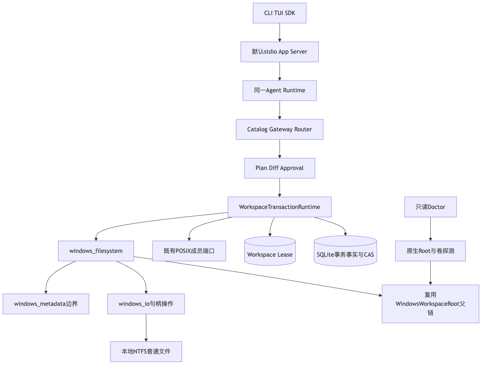
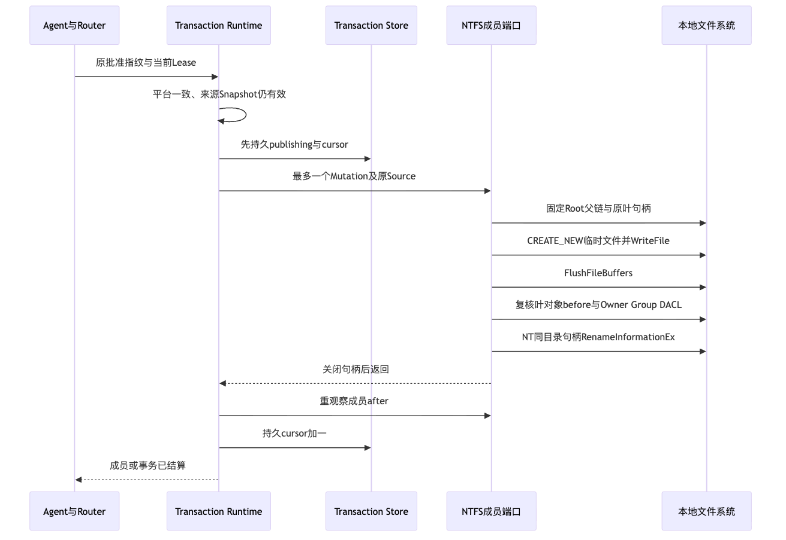
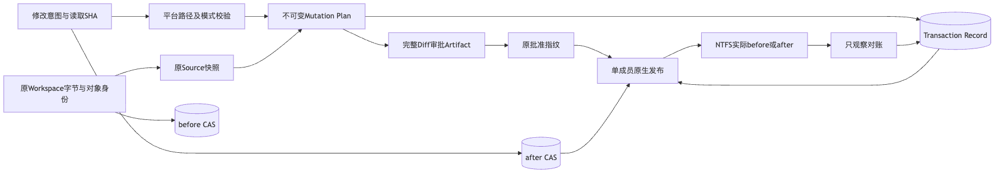
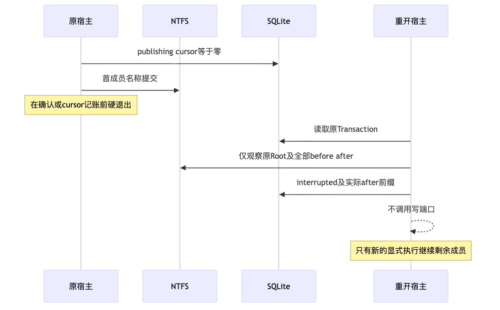

# Windows原生NTFS文件事务与默认审批写链验证报告

## 1. 固定实现、需求与验收边界

固定源码为`87f93533713a7b640b0d41f4c1b781693c6616ee`。
该实现补齐原生Windows普通文件创建、替换、删除和事务恢复，并接入默认Coding Agent的Catalog、
Review、Approval、Router、Artifact及只读Doctor；不是独立Action服务或另一套Agent。
完整需求、接口、重点字段、伪代码及源码/测试映射见[详细设计](../../changes/m09-r4-windows-native-file-transactions.md)。

范围限定为Windows 11构建边界及之后、本地固定NTFS、普通单链接默认数据流及权限一致文件。
Windows模式仅逻辑0644，不模拟0755。不支持共享卷、ReFS/FAT、ADS、特殊属性或自定义权限无损迁移。
真实CI证明原生端口及离线审批链；不能替代消费者Windows安装、真实模型编码质量、独立用户Beta或R4整体。

## 2. 源码研究与方案选择

复用既有WindowsWorkspaceRoot、Workspace Snapshot、Lease、CAS及六态事务状态机。
共享层只负责批准与事实；平台层只负责一个文件成员，不复制持久化或恢复协议。

关键实现入口：

| 位置 | 阅读重点 |
|---|---|
| [`filesystem.py`](../../../src/harnessix/delivery/filesystem.py) | publishing先于效果；实际after先于cursor；reconcile不写入 |
| [`windows_filesystem.py`](../../../src/harnessix/delivery/windows_filesystem.py) | 原Root绑定、父链固定、当前叶复核、同目录临时文件和提交后禁止清理 |
| [`windows_io.py`](../../../src/harnessix/delivery/windows_io.py) | 部分WriteFile、Flush、NT同目录Rename、双完成状态、受限共享模式 |
| [`windows_metadata.py`](../../../src/harnessix/delivery/windows_metadata.py) | 普通流/属性限制、Owner/Group/DACL一致、系统分配内存释放 |
| [`trusted_action.py`](../../../src/harnessix/delivery/trusted_action.py) | windows-ntfs-v2执行证明、审批、成员级取消及只观察恢复 |
| [`action_composition.py`](../../../src/harnessix/product_config/action_composition.py) | 与Doctor同源的真实Root/卷能力探测，不支持卷省略Patch |

同目录NT Rename由源句柄确定父对象，RootDirectory为NULL、名称仅包含叶名；
不使用进程当前目录、不关闭固定父链、不降级到字符串replace/unlink。
替换源必须共享Delete以允许内核移除旧名称，但不共享Write；观察、删除与临时文件仍仅共享Read。
最后名称检查与Rename不是针对不合作同UID写者的原子Compare-and-Swap，此边界与Host Guarded信任模型一致。

## 3. 正常流程、时序与数据流

默认stdio App Server与Agent不变。Plan/Diff经同一审批链进入WorkspaceTransactionRuntime，
平台分支只在最底层成员端口；SQLite/CAS与Lease保持唯一权威。
Doctor只读探测Root、卷和原生API，不创建能力探针文件。

先固定Root和所有父段，核验原before；CREATE_NEW排他写同目录临时文件，处理部分写入并Flush。
再按名称检查当前File ID、字节与权限，发出唯一NT Rename；任何请求后都不再删除该句柄，
避免确认丢失时误删实际目标。随后重观察实际after并持久化cursor。

模型只提供修改意图与读取摘要，不提供系统句柄、Lease或恢复结论。
原字节和身份来自Workspace，正文进入私有CAS，审批绑定不可变Plan；
恢复用原意图、started事实和实际before/after，不用临时文件扫描或API成功返回代替持久事实。

## 4. 初始失败、根因与闭环

所有固定历史失败保留于[失败索引](retained-failures.json)，相关断言摘要在logs目录。

| 原候选 | 原生专项结果 | 根因与处置 |
|---|---|---|
| `238b022` | 14失败、25通过、2错误 | 正向名称提交失败；另两个大二进制参数ID令Windows环境变量超长。后者用稳定ID修复，不删除二进制用例 |
| `cbf20d4` | 15失败、25通过 | 仅记录固定代码和数值错误，定位Win32 87；生产公开错误仍不泄漏原异常 |
| `a5d42ab` | 16失败、25通过 | 相对Win32调用87；补尾部空间仍87；绝对名称32。拒绝用关闭父链或路径写入掩盖问题 |
| `a0d51e5` | 11失败、41通过 | NT同目录创建成功，替换源不共享Delete导致32；修正仅替换源共享模式，继续禁止Write |
| `b0e4102` | 1失败、57通过 | 新增名称漂移夹具的路径Rename受父链约束。改用原生同目录句柄形成真实漂移，保留拒绝覆盖与原字节断言 |

修正后的执行证明升级至windows-ntfs-v2，绑定原生Rename、共享模式和请求后禁止清理，
不沿用初始候选摘要；POSIX原执行证明和公共Action/Transaction Schema不变。
CI文档Job首次失败为PyPI hatchling索引503，未到达文档检查；与代码功能或许可判定分开记录。

## 5. 取消、失败与恢复

四个实际子进程硬退出切点覆盖临时Flush、名称提交、效果已发生但尚未记账、成员已记账。
重开后只观察实际前缀，测试把写端口替换为失败断言以证明无自动写入；只有显式执行才继续剩余成员。
Rename确认丢失场景证明效果只发生一次且发布目标不被清理删除。

成员间取消沿用原Runtime检查点，租约过期不开始下一成员；未决与未知效果保持既有结算语义。
Root被替换后，即使复制了相同正文和前缀也不能追认原事务。
Rollback是新规划和重新批准的事务，原账本不被修改。
这些测试证明进程故障窗口，不声称硬件掉电、多文件内核原子性或同步IO可被Python强制中止。

## 6. 固定源码验证结果

| 实际环境/范围 | 结果 |
|---|---|
| macOS ARM64 Python3.13.8，受影响六组 | 1119通过、50跳过，65.67秒 |
| macOS ARM64 Python3.12.7，干净独立检出，同六组 | 1119通过、50跳过，65.37秒 |
| GitHub原生Windows，NTFS文件事务与默认审批专项 | 必要步骤成功；精确计数和日志来源见verification.json |
| 五份治理回归 | 128通过，4.37秒 |
| 既有退役边界回归 | 3通过，0.30秒 |
| GitHub Linux Python3.12.3，全仓受管回归 | 5522通过、80跳过，784.65秒；后续许可检查仍失败 |
| GitHub macOS Python3.12.10，工具与产品模块选集 | 3623通过、56跳过，689.43秒；对应Job成功 |

六组为delivery、product_config、trusted_actions、workspace、Windows native runtime精确文件、execution。
macOS跳过不是Windows通过；上述组存在重叠，不相加为全仓计数。
测试发现范围限定为受管目录；未跟踪文件不属于验证或发行输入。

Ruff、382文件Mypy、公共Schema一致性和实际可读性报告通过；未放宽长度、复杂度、依赖或公共API策略。
变化图使用既有Chrome真实渲染；本目录五幅图从实际详设提取，主架构/时序/数据流经过视觉核对。
独立检出仅构建Wheel，10个变化生产文件逐字节与源码匹配；没有构建sdist。
包版本仍是0.1.0验证件，不是1.0商业发行物；实际源码与Wheel扫描2651个输入、零命中。
模型API调用为0，不读取模型Key，也未创建或重置预算账本。

## 7. 交付资料、复验与完整性

- [verification.json](verification.json)：固定版本、精确命令/计数、原生CI事实与未验收范围。
- [contract-facts.json](contract-facts.json)：来源、效果、共享、清理、取消和恢复不变量。
- [wheel-observation.json](wheel-observation.json)：实际Wheel SHA、文件字节一致性及版本边界。
- [retained-failures.json](retained-failures.json)：历史失败、API矩阵及原始CI来源，不改旧判定。
- [review-packet.md](review-packet.md)：源码阅读顺序、审查重点与复验清单。
- [bundle-manifest.json](bundle-manifest.json)：排除自身后的精确文件、字节数和SHA-256。

复验必须在固定检出运行受管目录和原生专项；不跳过反例，不更改阈值，不以Fake/Scripted Provider替代真实质量。
开发不逐提交等待全部CI；只有本新增原生端口的必要专项用于证明真实内核行为，完整CI状态独立登记。
固定候选Linux功能回归已完成，后续12件许可失败曾触发Python矩阵的fail-fast并取消3.13 Job；
后继CI关闭矩阵fail-fast，继续保留末尾的许可门禁，避免低优先级发行治理中断独立功能反馈。

## 8. 发布边界与后继功能

该切片不关闭R1～R6，不广告完整Windows或商用1.0已完成。
下一功能主线是Windows默认Git读取/交付、实际编码任务质量、三平台脱离源码安装和升级恢复。
消费者目标OS、实际模型调用和独立Beta均需独立证据；容器离线Suite成功也不等于真实模型任务成功。
许可/权利/SBOM处于低优先级并行队列，不阻挡功能研发和内部验证；正式发行必要处置仍保留。
