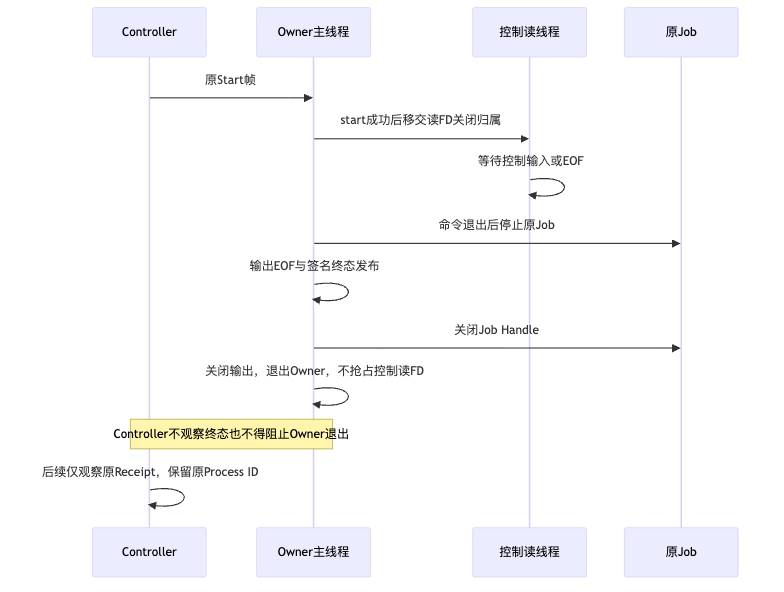
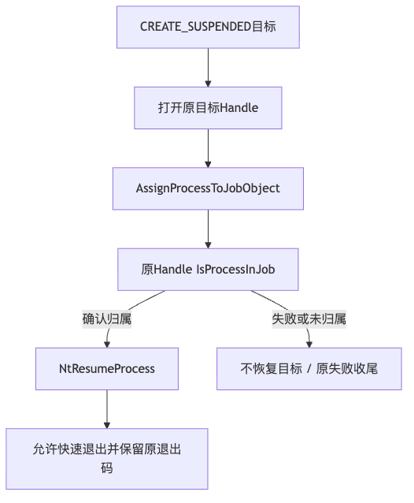

# Windows原生Git读取与Owner生命周期验证报告

## 1. 实现范围与结论

固定实现为`4b643f13fc54ae70050a9507ec29bf884ac9eda4`。
完整需求、总体架构、数据字段、接口、流程、时序、伪代码及源码映射见
[详细设计](../../changes/m09-r4-windows-native-git-read.md)。

本报告结论为**功能切片部分验证通过，完整Windows产品恢复仍失败，R4不关闭**。
Windows Status/Diff、Unicode、父仓库拒绝、危险Filter/Include拒绝、完整输出观察、四类取消/超时、
未观察终态的冷Receipt恢复、真实快速命令及只读Doctor均通过焦点验证。
默认SDK测试已完成编码与保护断言，但在完整备份的源Root权限验真阶段失败，因此该用例整体仍为FAIL。
不将局部通过、跳过、完整CI待结束或历史版本取消替代发布验收。

## 2. 模块边界与实现选择

1. `tools/git.py`保持严格Status/Diff输入及共享解析，查询配置时只捕获键名，不捕获凭据值。
2. `workspace/git_windows_binding.py`借用原Windows根/叶Handle链，固定Root/EXE身份；不复制Win32路径实现。
3. `processes/git_read_windows.py`先持久原完整Plan，再调用原Windows Owner/Job；使用原状态拓扑与输出保护。
4. `product_config/server.py`将显式Git接入默认SDK/stdio装配；Root Owner下仅观察旧查询，不重新执行。
5. 本切片不新增Action服务、Worker、Git写工具、Shell权限、远端Git协议或模型适配器。

配置检查与执行不是恶意同UID宿主下的原子配置CAS。固定Git选项和协议限制不等于OS强Sandbox或网络断网。

## 3. 三轮原生证据与根因收敛

| 固定源码 / Windows Job | NTFS焦点 | Git/Owner焦点 | 结论 |
|---|---:|---:|---|
| `1ed97e1` / `108936671266` | 59通过 | 1失败、6通过、中断，179.12秒 | 错误Include夹具；Controller等待Owner退出无界，未完成全部用例 |
| `b5a4b8a` / `108943062627` | 59通过 | 3失败、23通过、5跳过，51.47秒 | 有界诊断取得Owner控制读/关闭阻塞栈；暴露快速命令归属和Bundle夹具问题 |
| `4b643f1` / `108947255043` | 59通过 | 1失败、34通过、5跳过，26.83秒 | Owner退出及归属回归通过；唯一失败是完整备份来源Root权限验真 |

对应运行：[首轮](https://github.com/carrie1988/Harnessix/actions/runs/36425003451/job/108936671266)、
[有界诊断](https://github.com/carrie1988/Harnessix/actions/runs/36426925995/job/108943062627)、
[修复候选](https://github.com/carrie1988/Harnessix/actions/runs/36428177892/job/108947255043)。
各轮日志独立保存于`logs/`，不覆盖失败，不求和不同Revision的通过数。

### 3.1 Owner独立退出

诊断栈显示控制读线程在`windows_owner.py:186`执行`os.read`，主线程在`:422`执行`os.close(control_fd)`。
当Controller未刷新终态且仍持有写端时，原Owner不能独立退出。修复将成功启动后的控制FD关闭归属移交读线程；
主线程只关闭未移交的FD，不要求Controller额外发送消息。原Daemon控制读Handle在Owner退出时由OS回收。



本修复保持原Job、Receipt、Lease状态与POSIX路径。冷Receipt原生测试继续保留未关闭控制写端的条件，
并在8秒内断言Owner自行退出，不通过先关闭写端掩盖缺陷。

### 3.2 快速命令归属

原`assign_suspended`恢复目标后，Owner再次按PID打开目标核验Job归属；短命令可能已退出。
归属核验前移到原目标Handle尚挂起的窗口，失败不得恢复目标。



跨平台API顺序合同验证“Assign → Query原Handle → Resume”及失败不得Resume；
原生测试以0、17、128三个退出码各运行四次真实命令，要求保留原退出码与双流EOF。
这12次实际命令属于三个参数化测试，不能宣称为12个pytest用例或证明所有并发条件。

## 4. 固定源码的本机验证

| 环境与范围 | 结果 | 证明边界 |
|---|---|---|
| macOS Python 3.13.8，主检出 | 1084通过、50跳过，85.20秒 | 受影响模块回归；Windows原生用例跳过 |
| macOS Python 3.12.7，独立干净检出 | 1084通过、50跳过，86.58秒 | 同Revision、独立环境；不是Linux或Windows安装验收 |
| 文档/Schema/可读性/Secret治理测试 | 120通过，5.86秒 | 既有规则未放宽 |
| Mypy、定向Ruff、Schema与结构门禁 | 通过 | 385个生产文件；不替代实际业务质量 |
| 变化文档真实Mermaid渲染 | 通过 | Chrome及Mermaid CLI真实渲染，两个关键图已目视检查 |
| 固定源码Secret扫描 | 2689个输入、零命中 | 同Revision独立干净检出的已提交输入；不是未知Secret的完备证明 |
| Wheel与发行物Secret扫描 | 见`wheel-observation.json`和日志 | 仅Wheel；未发布包、未执行消费者全新安装 |

两套环境均执行：

```bash
pytest tests/tools tests/processes tests/context tests/workspace tests/execution tests/product_config
```

这些独立运行验证的是相同测试集合，不相加为2168个独立用例。
本切片没有模型请求，不产生新的真实模型质量或成本证据；R3仍未验收。

## 5. 默认SDK、持久化与恢复边界

正式Windows产品测试通过默认Catalog调用`git_diff`，验证模型历史和Replay不存在测试保护值，
并确认原`process-owner/runs/`下三份stdout捕获不包含该值。
所有Git查询先保存原`execution-plans.db`中的完整Plan，Lease与Receipt仍使用原Process目录。
旧只读Git`UNKNOWN`在重复启动中继续拒绝；超过16件待恢复查询时在观察前拒绝，不重放和不按历史PID控制。

完整备份在源Root的`PrivateKeySecurity.verify`失败：Owner或DACL未满足当前私有合同。
未采集原Owner SID或完整ACL，不能断言具体SID、文件损坏或所有子对象权限已经合格。
源码创建路径与读取验权路径尚未统一：Windows Root创建使用`server._private_root`，
备份使用`PrivateStateTree/WindowsKeyFiles`的严格验权。

后续R1切片必须在原全状态Owner下统一Root与各Store、Artifact、Blob和Process输出的创建及读取合同；
不能修改验证器为宽权限兼容、静默改变存量ACL、跳过备份测试或只修Root而忽略子对象。
Windows完整备份、恢复及脱离源码安装仍是高优先级功能工作。

## 6. 验收处置及后续顺序

- 通过：已定位Owner关闭窗口及快速命令归属的原生回归、Git固定只读功能、重复UNKNOWN拒绝与恢复上限合同。
- 未通过：默认SDK测试整体、Windows完整备份及恢复、R4整体、R3真实任务质量、R5真实Beta。
- 待观察：`ci-snapshot.json`中仍进行中的Job，不逐提交等待全部矩阵完成，不提前记作PASS。
- 取消：旧Revision `87f9353/2425c8b`的过期Windows运行已保留取消前后快照，仅作诊断，不作成功证据。
- 开发顺序：Windows状态权限与恢复 → 真实任务质量验证 → 三平台固定发行物安装/升级 → 受控Beta。
- 许可证等发行材料保持低优先级并行；不占用上述功能研发主线，也不虚构其已完成。

## 7. 交付目录与复核入口

`contract-facts.json`记录合同边界和开放项；`verification.json`记录固定源码的实际验证；
`ci-snapshot.json`是有时间边界的观察，不代表后续Job最终结果；`retained-failures.json`与`logs/`保留三轮原件；
`wheel-observation.json`固定Wheel版本、大小和摘要；`diagrams/`含图源及真实渲染；
[Review Packet](review-packet.md)列出逐项复核及Go/No-Go；`bundle-manifest.json`记录全部交付件SHA-256和大小。
本目录不包含API Key、真实配置正文、进程控制帧、Auth Key或用户工作区数据。
Git属性对本目录关闭文本换行转换，外部原生Job日志保持CRLF及尾随空格原件并禁止文本合并。
复核同时检查工作目录和Git Blob摘要，避免提交或Windows检出时转换行结束符破坏Manifest。
