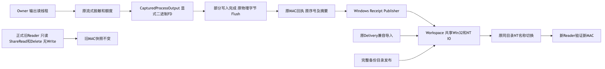
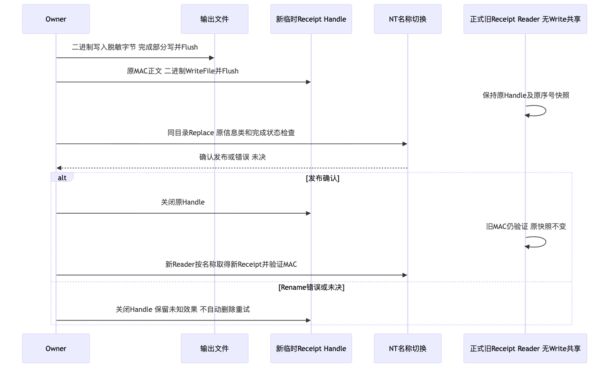

# Windows私有状态、完整备份恢复及原始字节验证报告

## 1. 摘要、需求背景与结论

固定产品实现为`9186cb2a6c9135adf44be82759e0be21baada0d6`，包版本仍为`0.1.0`。
本记录覆盖Windows私有目录/文件、叶修订、受管目录发布、SQLite同步、锁枚举、Process物理字节、
Receipt并发发布、默认SDK完整备份恢复，以及macOS ARM64脱离源码的锁定Wheel安装准备。
完整总体架构、类/接口/字段、流程、时序、伪代码、安全和部署设计见
[详细设计](../../changes/m09-r1-windows-private-state.md)。

**结论：原生功能焦点通过，完整Windows门禁仍失败，R1/R4及1.0不关闭。**
同一Windows Job中，事务/审批60项通过，Git/Owner/完整备份焦点119通过、5跳过，
Session认证88项通过；后继基准223通过、2失败，完整产品重启在启动阶段失败，后续完整回归未执行。
专项通过不是正式商用发布；不同源码或环境的通过数不得求和。

验证未请求真实模型、未读取Provider凭据或修改费用账本。安装使用明确的合成环境引用与离线Doctor，
不把Doctor或源码回归视为真实编码任务成功。

## 2. 固定源码、需求与模块边界

| 源码 | 正式职责与不变量 |
|---|---|
| [`windows_private_security.py`](../../../src/harnessix/workspace/windows_private_security.py) | Root用户Owner、protected用户/SYSTEM双继承ACE；普通文件有限默认Owner；Key保持原精确规则 |
| [`state_backup_files.py`](../../../src/harnessix/product_config/state_backup_files.py) | 固定父链/叶身份、普通单链接、原生修订、元数据枚举与FD回收 |
| [`state_backup_windows.py`](../../../src/harnessix/product_config/state_backup_windows.py) | 原同目录受管对象发布，不覆盖、路径fallback或未知重放 |
| [`owner_output.py`](../../../src/harnessix/processes/owner_output.py)及[`supervisor.py`](../../../src/harnessix/processes/supervisor.py) | 脱敏后原始二进制字节、部分写入、限额、物理长度及原SHA校验 |
| [`owner_receipt.py`](../../../src/harnessix/processes/owner_receipt.py)及[`windows_receipt.py`](../../../src/harnessix/processes/windows_receipt.py) | 原MAC/序号；只读ShareRead/Delete、无Write共享；原子名称切换、未决不自动删除/重试 |
| [`windows_file_io.py`](../../../src/harnessix/workspace/windows_file_io.py) | 单一低层Win32/NT实现；原Delivery路径保留同一对象导入，不扩大依赖环 |

[合同事实](facts/contract-facts.json)确认原IO函数/类AST与迁移前一致，可读性策略逐字未修改。
没有公共Schema、持久数据规格、模型权限或独立服务扩展；历史不符的字节与MAC继续拒绝，不补签。

## 3. 原生证据及失败收敛

| 固定源码 | 原生焦点 | 主要事实 |
|---|---:|---|
| `2c285c0` | 82通过、5跳过、4失败 | 父链访问修复；叶修订仍失败 |
| `8b5944d` | 87通过、5跳过、2失败 | 同一原生Handle叶修订通过；发布/数据库同步未通过 |
| `c4f062a` | 87通过、5跳过、2失败 | 数值诊断确认共享冲突与只读FD同步失败 |
| `a13cec8` | 88通过、5跳过、1失败 | 原NT对象发布与可写数据库同步通过；锁正文自冲突仍失败 |
| `d615a7b` | 88通过、5跳过、2失败 | 元数据枚举通过；物理输出摘要分叉及偶发快速退出UNKNOWN |
| `f3363f7` | 110通过、5跳过、1失败 | 实际二进制输出、快速退出及SDK完整备份恢复通过；无Delete共享旧Reader仍阻断 |
| `9186cb2` | **119通过、5跳过、0失败** | 正式旧Reader快照与新发布同时通过；外部不兼容Reader仍按合同拒绝 |

原始日志完整独立保存在`logs/`，CRLF不转写；失败没有删除、合并或覆盖。
最终[Windows Job](https://github.com/carrie1988/Harnessix/actions/runs/36446720079/job/109010809438)
整体为FAIL：基准2个重启用例启动失败。详见[完整原件](logs/9186cb2-native-job.log)和
[状态快照](facts/9186cb2-native-job-snapshot.json)。
原快速退出仍包含0/17/128每组四次真实命令，未减少重复或提高期限。

## 4. 字节、并发及资源关闭验证



输出先流式脱敏和限额，再显式二进制写入/Flush；原Lease与MAC按真实前缀计量。
原生`O_TEXT`负对照确实改变物理换行；正式捕获的LF/CRLF、Ctrl-Z、NUL、无效UTF-8及双流
与磁盘、公开读取、Lease长度/摘要一致。备份仍比较物理全文件，不转换后接受旧摘要。



正式Reader只读，允许名称替换共享而禁止Write共享；它固定父链、最终路径和普通单链接文件，
转为CRT FD后保持旧MAC快照。Publisher使用原同目录NT端口，写全/Flush后单次切换名称。
外部无Delete共享Reader导致正式拒绝，旧Receipt与未决临时证据保留；不通过删除或路径fallback绕过。
转换前失败关闭原Handle，转换后仅CRT关闭；正常、消费正文异常、缺失、Reparse、目录、Hardlink
及转换失败均有对应资源回收断言。Key、锁和备份源共享合同未改变。

## 5. 本地回归、静态检查与测试映射

| 固定实现/环境 | 测试范围 | 实际结果 |
|---|---|---:|
| `f3363f7` / Python 3.12.7 | 12个受影响目录 | 3381通过、85跳过，232.00秒 |
| `f3363f7` / Python 3.13.8 | 相同受影响目录 | 3381通过、85跳过，222.89秒 |
| `9186cb2` / Python 3.12.7 | Process及完整备份恢复专项 | 280通过、26跳过，31.95秒 |
| `9186cb2` / Python 3.13.8 | 相同专项 | 280通过、26跳过，31.85秒 |

两套Python均加载同一绝对源码树；Python 3.12使用独立环境并显式确认源码位置，不借用旧工作树实现。
Mypy391文件通过；冻结Schema检查通过；原可读性策略及公共API不变。
各日志与结构化范围见[verification.json](verification.json)，不将跳过算作通过。

重点测试：[字节合同](../../../tests/processes/test_output_binary_contracts.py)、
[Receipt与关闭](../../../tests/processes/test_windows_receipt_contracts.py)、
[原生私有状态](../../../tests/product_config/test_product_backup_files_windows.py)、
[默认SDK完整链](../../../tests/product_config/test_server_and_cli.py)、
[原NT IO](../../../tests/delivery/test_windows_io_contracts.py)。

## 6. Wheel与脱离源码安装准备

[实际Wheel](artifacts/harnessix-0.1.0-py3-none-any.whl)为1,073,485字节、437成员，SHA256：
`5a6e144487dd79679f609b709743db176ee28bdca077084ac8901efdc9f2fe30`。
七件关键源码与固定实现逐字一致，Wheel不含测试目录；
[源与发行物扫描](logs/9186cb2-wheel-secret-scan.log)2738个输入完整覆盖、固定规则零命中。
这是未发布的内部候选，不是1.0或官方PyPI发行物。

macOS ARM64/Python3.12.7在源码之外的全新环境，以`uv.lock`导出的生产依赖、所有Extras、
`--require-hashes --no-deps --offline`安装59个运行发行包，未安装开发依赖。
`python -I`确认导入来自新环境site-packages，源码目录不在sys.path；CLI/Code帮助、Configure
及离线Doctor成功，Doctor `ready=true`。全部输入和输出保存在`installation/`。
没有真实模型请求、完整编码任务、升级/卸载或其他平台安装证明。

## 7. 复验步骤与原件校验

固定检出上述源码后，先确认工作区独立及依赖锁定，再运行：

```bash
uv sync --locked --all-extras --dev
uv run pytest tests/processes tests/product_config/test_product_state_backup.py \
  tests/product_config/test_product_state_restore.py \
  tests/product_config/test_product_backup_files_windows.py \
  tests/product_config/test_state_windows_publication_contracts.py
uv run python scripts/generate_specs.py --check
uv run python scripts/readability_report.py --check --check-final-report --quiet
uv build --wheel --offline
```

原生正式命令以固定CI Job为准；POSIX跳过不能代替Windows运行。
脱离源码安装需按本机绝对Wheel位置重新生成`harnessix @ file:///... --hash=sha256:...`输入，
不得直接复用原件中观察时的临时路径。锁定输入文件、摘要、环境、导入及Doctor原件均保留供核对。

[manifest.json](manifest.json)列出本目录所有其他文件的SHA256和大小；
[Review Packet](review-packet.json)给出逐项判定和阻断，不凭Manifest或健康检查推导业务完成。
不得把不同版本的Wheel、源码和日志混作同一候选，也不修改已冻结的先前Git/Owner验证目录。

## 8. 未完成项、风险与Go/No-Go

1. **Windows完整重启门禁仍失败**：需核对Runner预创建State Root与正式私有创建合同；尚未完成归因。
   修复后必须通过原重启/硬退出及后继完整回归，不提高期限或接受错误终态。
2. **R3质量仍开放**：历史0/20真实任务保留，整改后的20 Trial与有限真实Provider认证仍须执行。
   两个固定镜像预检拉取失败且未缓存；EOF不是已经证明的网络根因。费用账本未确认，本验证未发送模型请求。
3. **R4/R5仍开放**：三平台完整安装、升级、恢复、卸载及独立真实开发者Beta尚未完成；macOS离线Doctor不代替这些条件。
4. **R2低优先并行**：先前完整Linux/Python3.12 Job在功能测试后被12件Archive许可门禁拒绝，原拒绝策略保留；
   不阻挡功能修复，但正式发行前必须处置。[原件](logs/f3363f7-python312-job.log)
5. **R6不封板**：所有R1～R6仍开放，当前商业发布判定为**NO-GO**。

后续优先处理真实可达的启动/恢复失败和编码质量，不增加平台、功能矩阵、许可治理平台或独立Action服务。
