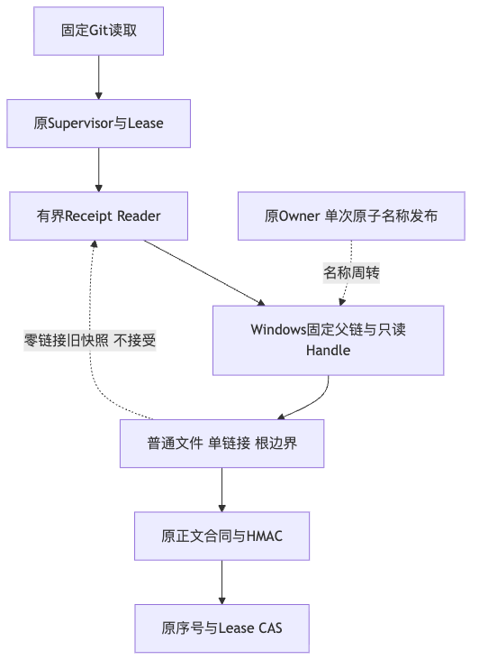
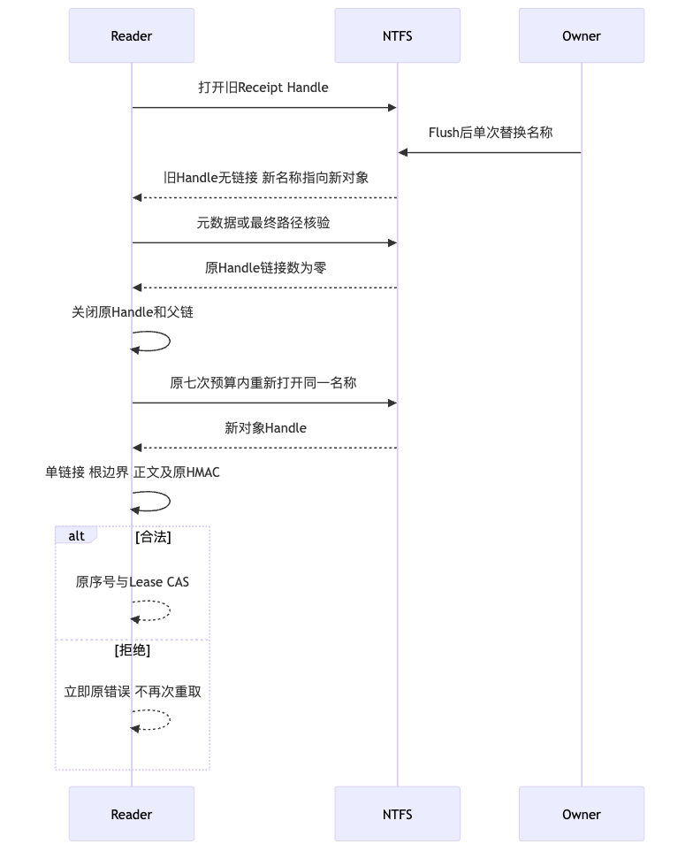
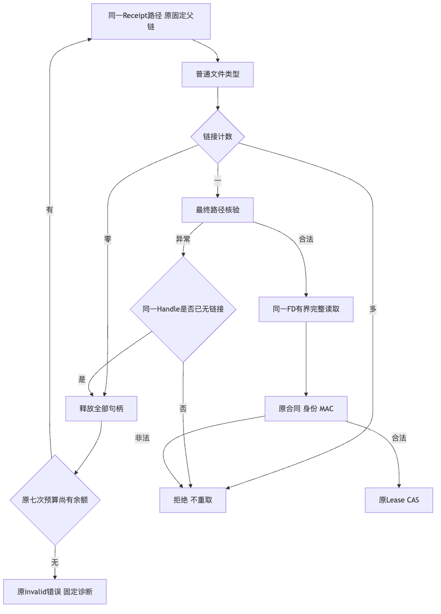

# Windows Receipt名称周转候选验证报告

## 1. 背景、目标与结论

固定`a80ea984`的原生Windows正式SDK Git链失败，固定错误为`process_owner_receipt_invalid`。
原焦点137通过、5跳过、1失败；原日志没有足够分类证明是哪一种读取/绑定失败。
后继`6d77b2c`原NTFS与Git焦点步骤成功，只说明这两步后继结果，不关闭整个Job或商用门禁。
原失败与后继成功并存；不得删除原失败，或把波动预先归因于单一系统问题。

本专项处理源码可定位的打开旧Handle至最终绑定之间的名称周转窗口。
零链接快照不被接受；全部资源关闭后，原七次预算内重新打开同一个私有名称，完整核验新的单链接/Root/MAC。
MAC、JSON、根边界或身份非法不重试，原Owner发布不新增重试。

**本地有限读取合同GO；原生候选、原失败排他性归因、R1/R4完整验收和商用发布均未确认。**
新增离线RED证明新周转分类没有被原读循环处理，不是原生旧Handle窗口已复现的证据。
三个原生案例和原SDK链必须取得新候选结果；Windows11消费者验收仍独立开放。

## 2. 总体与详细设计、源码追踪

[完整设计](../../changes/m09-r1-windows-receipt-snapshot.md)覆盖需求、目标、架构、时序、数据流、
接口、字段、伪代码、持久化、错误、取消、超时、安全、部署、回退及验收。

| 模块 | 源码与变化 |
|---|---|
| Windows文件端口 | [`windows_receipt.py`](../../../src/harnessix/processes/windows_receipt.py)：普通文件、零链接分类、同Handle二次元数据；不接受或交付无链接FD |
| 有界读循环 | [`owner_receipt.py`](../../../src/harnessix/processes/owner_receipt.py)：只消费内部周转分类，共用原预算；损坏仍拒绝 |
| 正式SDK诊断 | [`test_server_and_cli.py`](../../../tests/product_config/test_server_and_cli.py)：只打印固定分类及数值码白名单，不打印错误正文 |
| 原生与离线负对照 | [`test_receipt_snapshot_transition.py`](../../../tests/processes/test_receipt_snapshot_transition.py)：原规则、精确Barrier及非法新快照拒绝 |
| 原焦点保护 | [CI](../../../.github/workflows/ci.yml)：保留原选择器、三分钟期限和60秒堆栈观察，增加新文件 |

## 3. 测试验证与原件边界

原读循环运行新契约焦点：10项，8失败、2原生跳过。
初修关联焦点33通过、5跳过；扩展分类后41通过、5跳过。
最终进程/Git/正式SDK关联273项，244通过、29平台跳过，零失败/错误；
原生旧规则负对照和两个Barrier位于这29项跳过中，不能标记通过。
焦点包含于关联，不将不同候选、原失败、治理用例或重叠回归相加。
完整治理301项通过、零跳过/失败/错误；首轮资料图链接未就绪及Apple Git 2.24不支持测试临时覆盖造成两项失败，
原件保留。补齐图并复用既有Git 2.53后复验，不修改原断言或策略。
原件、实际数量、源码字节见[事实](facts.json)；若数字与JUnit不一致，须以核验后的原件修正文档，不能改测试预期。

八项分类测试覆盖：零链接、硬链接、Reparse、目录、越界、合法仍具名称的IO错误及名称消失后路径失败。
原七次耗尽仍为原invalid错误；周转后JSON、MAC、Process ID、Owner和Root非法立即拒绝。
原写端读者共存、外部不兼容CRT拒绝及部分写入测试完整保留。
三个新图实际Mermaid渲染并检查，不宣称全库其他图已渲染。
实际`1.0.0rc1` Wheel已离线构建、两个变化生产成员与受测源码逐字节相同，
仓库与实际Wheel共3589个输入完整Secret扫描、零命中；哈希与字节数见事实文件，未宣称安装验收。

## 4. 持久化、安全、失败与恢复

本专项不新建或重放Process，不更改Lease/DB/Plan/MAC/Schema，不修改原取消、停止、输出摘要或EOF。
候选只是读端重新取快照；原序号和CAS仅在完整合法Receipt后推进。
内部周转分类不能作为Owner正常退出证据，持续周转耗尽保持失败关闭。
原Key、父Root、单链接、最终路径、无Write共享和原签名不放宽。
源外安装、完整备份恢复和Win11消费者支持必须另验；无从模拟端口推导OS保证。

诊断不保留路径、正文、MAC、凭据或OwnerToken，公开文件只存固定分类、计数、源码及原件SHA。
真实模型调用0；百炼未知预留、费用保护和原真实质量记录均不改变；Docker与远程服务器未操作。

## 5. Review Packet、Manifest与后续验收

[Review Packet](review-packet.json)、[Verification](verification.json)、[Manifest](manifest.json)
分别记录不变输入、有限Go/No-Go及全部交付文件完整性；哈希一致不代表业务成功。
可读性仅更新实际观察报告，不改变策略、函数/类阈值或原安全预期。

候选下一验收必须先看原生旧规则零链接负对照是否成立，再看两个Barrier及原SDK完整链。
若原生负对照不成立，需修正假设，不删除失败或将断言放宽为任意结果。
即使这一窗口得到原生证明，也不证明它是原`a80`失败的唯一原因。
产品Commit/Checkpoint/Rollback接线、真实编码质量、费用核对、独立Beta及最终R1～R6仍开放。
