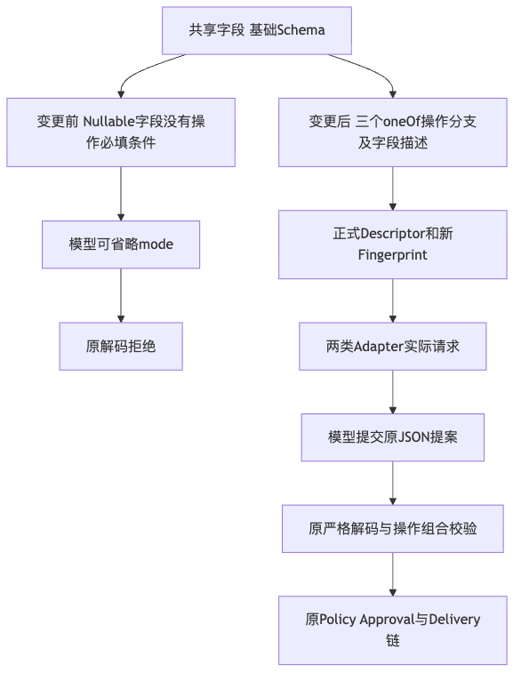
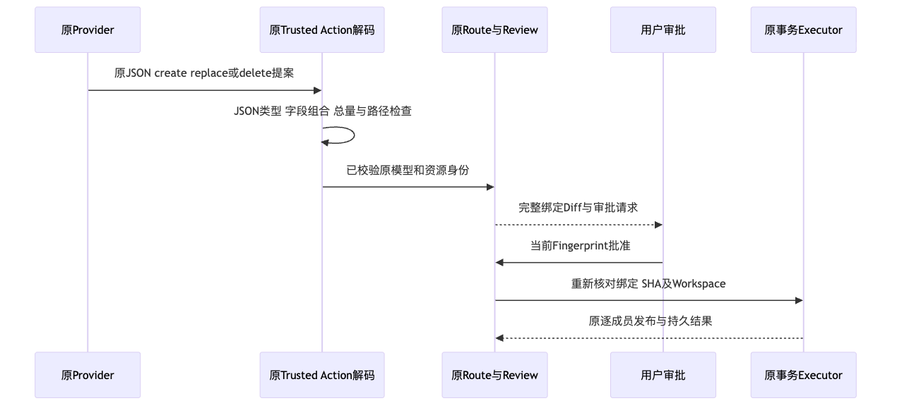
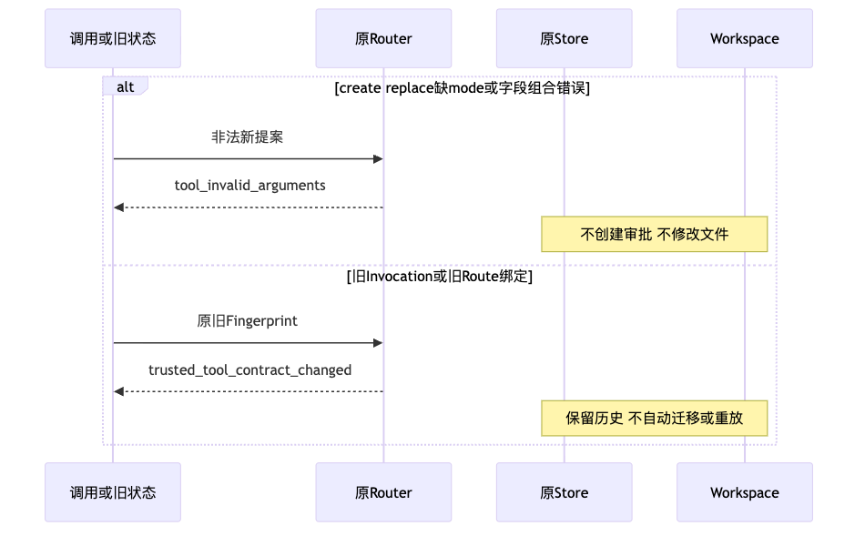

# Workspace Patch操作Schema与旧批准边界验证

## 1. 摘要与结论

固定源码为`6a686fdd00162babd0dbaa8b0785186dd15c3cbc`。
模型可见Schema及工具说明现已公开create/replace/delete的原字段组合；
不再仅广告nullable mode而隐藏创建/替换操作的必填条件。

**操作合同离线专项GO；线上Provider认证、真实质量及商用发布NO_GO。**
焦点17项通过，包含336个操作字段组合；Python3.12/3.13相同受影响范围各2890项通过、70项跳过。
原Validator、严格准入、Router和文件发布边界未放宽；旧批准不能重绑定或执行。
本专项模型请求0、费用0、真实质量Trial计数0，原0/20和缺mode线上失败均保持。

[完整设计](../../changes/m09-r3-workspace-patch-operation-schema.md)及
[现行Delivery模块](../../modules/delivery.md)给出领域接口、重点字段、持久化、伪代码和源码映射。
[verification.json](verification.json)、[Review Packet](review-packet.json)及[manifest.json](manifest.json)
分别记录可重算结果、判定边界和原字节集合。

## 2. 原失败及实际修复

[原真实stdio失败](../public-budget-product-provider-2026-09-29-v1/README.md)中三次替换提案缺mode，
未进入审批、工作区未改变。本次没有改写原响应或让宿主补420。

- `WorkspacePatchFile`增加互斥操作Schema及具体字段描述，原默认值、字段类型和`operation_shape`保持。
- `workspace_patch_descriptor`说明完整正文不是Diff、十进制420/493及Windows420限制。
- 两类Adapter实际请求保留同一正式Schema，没有验证专用工具或宽松Decoder。
- 生成合同只有`workspace-patch-input-v1.schema.json`改变；Tool和输入Spec版本仍为v1。

三个原Validator的AST以及严格入口、Router、文件发布源码的逐字对照见
[边界审计](facts/runtime-boundary-audit.json)。该审计不是全部安全测试的替代。

## 3. 总体架构、正常与失败流程



图示说明：变更位于Schema/Descriptor发布侧；提案进入原解码、Policy、Approval和Delivery链。
字段声明不是权限授予，平台模式限制仍在执行前核对。



图示说明：完整提案校验后形成原Route与Diff，当前批准及Workspace前置条件复核后才执行。
事务、租约和Artifact身份由宿主持有，模型不能提交这些内部字段。



图示说明：非法组合返回原`tool_invalid_arguments`；旧Invocation和旧持久绑定返回
`trusted_tool_contract_changed`，保持原历史、批准及事务，不自动补签或重放。
图均由实际Mermaid渲染器生成并逐幅视觉检查，与完整设计图内容一致。

## 4. 测试与原失败保留

| 范围 | 实际结果 | 边界 |
|---|---:|---|
| 新合同红例 | 8 FAIL | 原Schema未公开操作必填条件，原件不改写 |
| 最终焦点 | 17 PASS | 336个字段组合、两Adapter、旧批准及原事务主链 |
| Python3.12受影响回归 | 2890 PASS / 70 SKIP | Delivery、Trusted Action、产品配置、Eval、Models、Agent、App Server、Protocol及Tools |
| Python3.13原同范围 | 2888 PASS / 2 FAIL / 70 SKIP | Task Pack子进程导入受到启动PYTHONPATH污染 |
| 原2项导入范围对照 | 2 PASS | 仅删除启动环境中的项目根路径，保留源码路径 |
| Python3.13完整同范围复验 | 2890 PASS / 70 SKIP | 没有删除失败Case、改Task Pack或改Grader |
| mypy | 392源码文件 PASS | 不是线上认证或三平台验收 |
| 生成合同、Lint、格式及可读性 | PASS | 只刷新实际源码行统计，不修改门禁限额 |
| 文档与实际Mermaid | PASS | 初次章节标题检查失败另行保留，不放宽文档标准 |

各组覆盖有重叠，不求和为独立测试总数。70项跳过反映平台/执行条件限制，不计为通过。
原Scope矩阵枚举SHA、content和mode的省略、null、合法/非法值，共3×4×4×7=336组合；
不声称穷尽UTF-8、总字节、重复路径或OS权限的全部输入空间。

旧批准夹具初次因Schema摘要不匹配被原注册门禁拒绝；后继使用既有成对Schema/Decoder端口
登记冻结旧Schema，保持同一原操作校验。一次错误的`tests/sdk`路径导致0项收集；
SDK覆盖位于实际App Server套件，收集失败不计为成功。
这些原失败和后继JUnit/日志全部分开保留。

## 5. 持久状态、兼容与安全

旧Descriptor指纹为`e8b12d190a387e5e35d891d4ea47f8a51fe858e0e6331e0740062ee94b76aeca`，
新指纹为`18481fab01037cf0ca27286dedc71c1d35c36a85993d33128d03ee45287c2ae9`。
[候选身份](facts/candidate-identity.json)分别记录源基线、旧夹具和新Binding，不把新合同冒充旧授权。

原Router真实持久旧Route、批准、Audit事件和Prepared事务在拒绝后逐字段不变；
原文件字节保持、新文件不存在。保持原Invocation ID但换新指纹也被冲突拒绝。
不修改SQLite Schema、认证Key、取消期限、幂等键或Reconcile语义。

验证仅操作受管Checkout、已跟踪发布输入和独立临时目录；其他非发布资料不进入扫描或交付件。
不导出用户状态、凭据或Provider正文，本次不获取API Key、不发送模型请求。

## 6. 制品与发行边界

[实际Wheel](facts/candidate-wheel.json)的433件包成员逐字对应固定源码，版本仍为`0.1.0`。
Wheel SHA256为`eeaf62cdbb2bf042d93d1c21196491353616f8b04a32a1b54efda2dfbf4033e5`。
原源码和实际Wheel扫描完整，固定规则零命中，扫描限额不改变。
这不继承旧Wheel的安装成绩，不证明Win11、不同版本升级、独立Beta或全部商业权利。

## 7. 可复核命令与环境控制

执行前核对受管Checkout内不存在用户保护目录。Python3.12使用受管venv；
另一解释器验证需只将受管`src`加入PYTHONPATH，避免把Harnessix测试包暴露给Task Pack子进程。
主项目目录不作为测试、扫描或构建目录。

```bash
python -m pytest tests/delivery/test_patch_input_schema.py tests/delivery/test_trusted_action_patch.py
python -m pytest tests/delivery tests/trusted_actions tests/product_config tests/evals tests/models tests/agent tests/app_server tests/protocol tests/tools
python scripts/generate_specs.py --check
python scripts/readability_report.py --check --check-final-report --quiet
python scripts/documentation_check.py --render-mermaid
```

Schema及固定源码/制品身份由Manifest和逐件字节比较独立复核，不能仅凭绿色JUnit外推商用完成。

## 8. 未完成条件

下一验证使用新的固定源码和预注册计划，先离线核对实际stdio审批/取消，再进行预算内有限真实调用。
旧计划、旧FAIL和原费用不得覆盖，首失败停止，不在宿主修改模型参数。
完整20 Trial、R1空间增长与安全映射、Windows11、真正版本升级、独立Beta、许可处置及最终同候选门禁仍开放。
